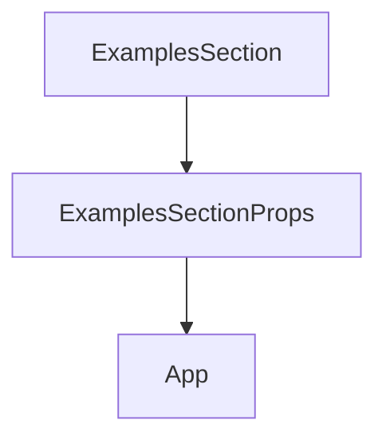

# Chapter 7: Governance, Versioning, and Drift Control

Welcome to **Chapter 7: Governance, Versioning, and Drift Control**. In this part of **AGENTS.md Tutorial: Open Standard for Coding-Agent Guidance in Repositories**, you will build an intuitive mental model first, then move into concrete implementation details and practical production tradeoffs.


This chapter ensures AGENTS.md stays trustworthy as repositories evolve.

## Learning Goals

- establish ownership and review cadence
- detect stale instructions and command drift
- version instruction changes deliberately
- tie guidance updates to codebase changes

## Governance Practices

- require AGENTS.md updates when build/test workflows change
- include instruction drift checks in periodic repo audits
- assign clear document owners per repository

## Source References

- [AGENTS.md Repository Governance Discussions](https://github.com/agentsmd/agents.md/issues)
- [AGENTS.md Sample File](https://github.com/agentsmd/agents.md/blob/main/AGENTS.md)

## Summary

You now have governance patterns to keep agent guidance accurate over time.

Next: [Chapter 8: Ecosystem Contribution and Standard Evolution](08-ecosystem-contribution-and-standard-evolution.md)

## Depth Expansion Playbook

## Source Code Walkthrough

### `components/ExamplesSection.tsx`

The `ExamplesSection` function in [`components/ExamplesSection.tsx`](https://github.com/agentsmd/agents.md/blob/HEAD/components/ExamplesSection.tsx) handles a key part of this chapter's functionality:

```tsx
import ExampleListSection from "@/components/ExampleListSection";

interface ExamplesSectionProps {
  contributorsByRepo: Record<string, { avatars: string[]; total: number }>;
}

export default function ExamplesSection({ contributorsByRepo }: ExamplesSectionProps) {
  return (
    <Section id="examples" title="Examples" className="py-12" center>
      {/* Wide code example */}
      <div className="mb-4">
        <CodeExample compact />
      </div>

      {/* Repo cards */}
      <ExampleListSection contributorsByRepo={contributorsByRepo} standalone />
    </Section>
  );
}

```

This function is important because it defines how AGENTS.md Tutorial: Open Standard for Coding-Agent Guidance in Repositories implements the patterns covered in this chapter.

### `components/ExamplesSection.tsx`

The `ExamplesSectionProps` interface in [`components/ExamplesSection.tsx`](https://github.com/agentsmd/agents.md/blob/HEAD/components/ExamplesSection.tsx) handles a key part of this chapter's functionality:

```tsx
import ExampleListSection from "@/components/ExampleListSection";

interface ExamplesSectionProps {
  contributorsByRepo: Record<string, { avatars: string[]; total: number }>;
}

export default function ExamplesSection({ contributorsByRepo }: ExamplesSectionProps) {
  return (
    <Section id="examples" title="Examples" className="py-12" center>
      {/* Wide code example */}
      <div className="mb-4">
        <CodeExample compact />
      </div>

      {/* Repo cards */}
      <ExampleListSection contributorsByRepo={contributorsByRepo} standalone />
    </Section>
  );
}

```

This interface is important because it defines how AGENTS.md Tutorial: Open Standard for Coding-Agent Guidance in Repositories implements the patterns covered in this chapter.

### `pages/_app.tsx`

The `App` function in [`pages/_app.tsx`](https://github.com/agentsmd/agents.md/blob/HEAD/pages/_app.tsx) handles a key part of this chapter's functionality:

```tsx
import "@/styles/globals.css";
import type { AppProps } from "next/app";
import Head from "next/head";
import { Analytics } from "@vercel/analytics/next";
export default function App({ Component, pageProps }: AppProps) {
  return <>
    <Head>
      <title>AGENTS.md</title>
      <meta name="description" content="AGENTS.md is a simple, open format for guiding coding agents, used by over 60k open-source projects. Think of it as a README for agents." />
      <meta name="twitter:card" content="summary_large_image" />
      <meta name="twitter:title" content="AGENTS.md" />
      <meta name="twitter:description" content="AGENTS.md is a simple, open format for guiding coding agents. Think of it as a README for agents." />
      <meta name="twitter:image" content="https://agents.md/og.png" />
      <meta name="twitter:domain" content="agents.md" />
      <meta name="twitter:url" content="https://agents.md" />
      <meta property="og:type" content="website" />
      <meta property="og:title" content="AGENTS.md" />
      <meta property="og:description" content="AGENTS.md is a simple, open format for guiding coding agents. Think of it as a README for agents." />
      <meta property="og:image" content="https://agents.md/og.png" />
    </Head>
    <Component {...pageProps} />
    <Analytics />
  </>;
}

```

This function is important because it defines how AGENTS.md Tutorial: Open Standard for Coding-Agent Guidance in Repositories implements the patterns covered in this chapter.


## How These Components Connect


