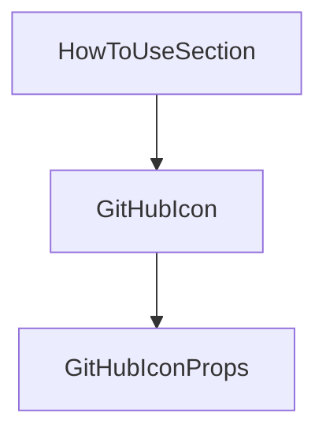

# Chapter 8: Ecosystem Contribution and Standard Evolution

Welcome to **Chapter 8: Ecosystem Contribution and Standard Evolution**. In this part of **AGENTS.md Tutorial: Open Standard for Coding-Agent Guidance in Repositories**, you will build an intuitive mental model first, then move into concrete implementation details and practical production tradeoffs.


This chapter covers how to contribute back to AGENTS.md and improve ecosystem interoperability.

## Learning Goals

- propose improvements grounded in real usage
- contribute examples and spec clarifications
- strengthen cross-tool compatibility expectations
- help mature the standard responsibly

## Contribution Priorities

- add concrete examples from production repos
- document edge cases and scope patterns
- keep guidance simple, explicit, and tool-neutral

## Source References

- [AGENTS.md Repository](https://github.com/agentsmd/agents.md)
- [AGENTS.md Issues](https://github.com/agentsmd/agents.md/issues)
- [AGENTS.md Website](https://agents.md)

## Summary

You now have a full AGENTS.md playbook from local adoption to ecosystem contribution.

Next tutorial: [OpenCode AI Legacy Tutorial](../opencode-ai-legacy-tutorial/)

## Depth Expansion Playbook

## Source Code Walkthrough

### `components/HowToUseSection.tsx`

The `HowToUseSection` function in [`components/HowToUseSection.tsx`](https://github.com/agentsmd/agents.md/blob/HEAD/components/HowToUseSection.tsx) handles a key part of this chapter's functionality:

```tsx
import React from "react";

export default function HowToUseSection() {
  const steps = [
    {
      title: "Add AGENTS.md",
      body: (
        <>
          Create an AGENTS.md file at the root of the repository. Most
          coding agents can even scaffold one for you if you ask nicely.
        </>
      ),
    },
    {
      title: "Cover what matters",
      body: (
        <>
          <p className="mb-2">Add sections that help an agent work effectively with your project. Popular choices:</p>
          <ul className="list-disc list-inside ml-4 space-y-1">
            <li>Project overview</li>
            <li>Build and test commands</li>
            <li>Code style guidelines</li>
            <li>Testing instructions</li>
            <li>Security considerations</li>
          </ul>
        </>
      ),
    },
    {
      title: "Add extra instructions",
      body: "Commit messages or pull request guidelines, security gotchas, large datasets, deployment steps: anything you’d tell a new teammate belongs here too.",
    },
```

This function is important because it defines how AGENTS.md Tutorial: Open Standard for Coding-Agent Guidance in Repositories implements the patterns covered in this chapter.

### `components/icons/GitHubIcon.tsx`

The `GitHubIcon` function in [`components/icons/GitHubIcon.tsx`](https://github.com/agentsmd/agents.md/blob/HEAD/components/icons/GitHubIcon.tsx) handles a key part of this chapter's functionality:

```tsx
import React from "react";

interface GitHubIconProps {
  className?: string;
}

// The path data is the official GitHub mark (see https://github.com/logos).
export default function GitHubIcon({ className = "w-4 h-4" }: GitHubIconProps) {
  return (
    <svg
      xmlns="http://www.w3.org/2000/svg"
      viewBox="0 0 98 96"
      className={className}
      aria-hidden="true"
    >
      <path
        fillRule="evenodd"
        clipRule="evenodd"
        d="M48.854 0C21.839 0 0 22 0 49.217c0 21.756 13.993 40.172 33.405 46.69 2.427.49 3.316-1.059 3.316-2.362 0-1.141-.08-5.052-.08-9.127-13.59 2.934-16.42-5.867-16.42-5.867-2.184-5.704-5.42-7.17-5.42-7.17-4.448-3.015.324-3.015.324-3.015 4.934.326 7.523 5.052 7.523 5.052 4.367 7.496 11.404 5.378 14.235 4.074.404-3.178 1.699-5.378 3.074-6.6-10.839-1.141-22.243-5.378-22.243-24.283 0-5.378 1.94-9.778 5.014-13.2-.485-1.222-2.184-6.275.486-13.038 0 0 4.125-1.304 13.426 5.052a46.97 46.97 0 0 1 12.214-1.63c4.125 0 8.33.571 12.213 1.63 9.302-6.356 13.427-5.052 13.427-5.052 2.67 6.763.97 11.816.485 13.038 3.155 3.422 5.015 7.822 5.015 13.2 0 18.905-11.404 23.06-22.324 24.283 1.78 1.548 3.316 4.481 3.316 9.126 0 6.6-.08 11.897-.08 13.526 0 1.304.89 2.853 3.316 2.364 19.412-6.52 33.405-24.935 33.405-46.691C97.707 22 75.788 0 48.854 0z"
        fill="currentColor"
      />
    </svg>
  );
}

```

This function is important because it defines how AGENTS.md Tutorial: Open Standard for Coding-Agent Guidance in Repositories implements the patterns covered in this chapter.

### `components/icons/GitHubIcon.tsx`

The `GitHubIconProps` interface in [`components/icons/GitHubIcon.tsx`](https://github.com/agentsmd/agents.md/blob/HEAD/components/icons/GitHubIcon.tsx) handles a key part of this chapter's functionality:

```tsx
import React from "react";

interface GitHubIconProps {
  className?: string;
}

// The path data is the official GitHub mark (see https://github.com/logos).
export default function GitHubIcon({ className = "w-4 h-4" }: GitHubIconProps) {
  return (
    <svg
      xmlns="http://www.w3.org/2000/svg"
      viewBox="0 0 98 96"
      className={className}
      aria-hidden="true"
    >
      <path
        fillRule="evenodd"
        clipRule="evenodd"
        d="M48.854 0C21.839 0 0 22 0 49.217c0 21.756 13.993 40.172 33.405 46.69 2.427.49 3.316-1.059 3.316-2.362 0-1.141-.08-5.052-.08-9.127-13.59 2.934-16.42-5.867-16.42-5.867-2.184-5.704-5.42-7.17-5.42-7.17-4.448-3.015.324-3.015.324-3.015 4.934.326 7.523 5.052 7.523 5.052 4.367 7.496 11.404 5.378 14.235 4.074.404-3.178 1.699-5.378 3.074-6.6-10.839-1.141-22.243-5.378-22.243-24.283 0-5.378 1.94-9.778 5.014-13.2-.485-1.222-2.184-6.275.486-13.038 0 0 4.125-1.304 13.426 5.052a46.97 46.97 0 0 1 12.214-1.63c4.125 0 8.33.571 12.213 1.63 9.302-6.356 13.427-5.052 13.427-5.052 2.67 6.763.97 11.816.485 13.038 3.155 3.422 5.015 7.822 5.015 13.2 0 18.905-11.404 23.06-22.324 24.283 1.78 1.548 3.316 4.481 3.316 9.126 0 6.6-.08 11.897-.08 13.526 0 1.304.89 2.853 3.316 2.364 19.412-6.52 33.405-24.935 33.405-46.691C97.707 22 75.788 0 48.854 0z"
        fill="currentColor"
      />
    </svg>
  );
}

```

This interface is important because it defines how AGENTS.md Tutorial: Open Standard for Coding-Agent Guidance in Repositories implements the patterns covered in this chapter.


## How These Components Connect


