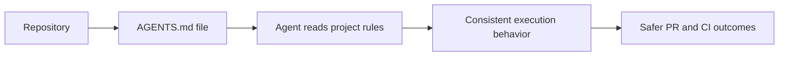

# AGENTS.md Tutorial: Open Standard for Coding-Agent Guidance in Repositories

> Learn how to use `agentsmd/agents.md` to define a clear, portable instruction contract for coding agents across projects and tools.

## Why This Track Matters

`AGENTS.md` is a simple standard for expressing coding-agent instructions directly in repositories, reducing ambiguity and improving cross-tool consistency.

This track focuses on:

- creating practical AGENTS.md files quickly
- designing stable instruction sections and conventions
- rolling out repository-wide standards for agent operations
- maintaining guidance quality over time

## Current Snapshot (auto-updated)

- repository: [`agentsmd/agents.md`](https://github.com/agentsmd/agents.md)
- stars: about **17.3k**
- latest release: **none tagged** (rolling `main`)
- recent activity: updates on **December 19, 2025**
- project positioning: open format specification and examples for coding-agent guidance

## Mental Model

## Chapter Guide

| Chapter | Key Question | Outcome |
|:--------|:-------------|:--------|
| [01 - Getting Started](01-getting-started.md) | How do I add a first AGENTS.md file that actually helps? | Working baseline |
| [02 - Section Design and Instruction Quality](02-section-design-and-instruction-quality.md) | Which sections create the most value for coding agents? | Better instruction structure |
| [03 - Tool-Agnostic Portability Patterns](03-tool-agnostic-portability-patterns.md) | How do I keep instructions portable across agent tools? | Cross-tool consistency |
| [04 - Repository Structure and Scope Strategy](04-repository-structure-and-scope-strategy.md) | How do I scope guidance for monorepos and subprojects? | Better hierarchy control |
| [05 - Testing, Linting, and CI Alignment](05-testing-linting-and-ci-alignment.md) | How do I make AGENTS.md enforce real quality gates? | Stronger execution discipline |
| [06 - Team Rollout and Adoption Playbook](06-team-rollout-and-adoption-playbook.md) | How do teams adopt this without slowing delivery? | Rollout plan |
| [07 - Governance, Versioning, and Drift Control](07-governance-versioning-and-drift-control.md) | How do I keep instructions current as code evolves? | Lower guidance drift |
| [08 - Ecosystem Contribution and Standard Evolution](08-ecosystem-contribution-and-standard-evolution.md) | How do I contribute back to the standard effectively? | Contributor readiness |

## What You Will Learn

- how to author high-signal AGENTS.md guidance files
- how to make agent instructions portable across tool ecosystems
- how to align AGENTS.md with CI/test and PR policies
- how to maintain instruction quality as repositories evolve

## Source References

- [AGENTS.md Repository](https://github.com/agentsmd/agents.md)
- [AGENTS.md README](https://github.com/agentsmd/agents.md/blob/main/README.md)
- [Sample AGENTS.md](https://github.com/agentsmd/agents.md/blob/main/AGENTS.md)
- [AGENTS.md Website](https://agents.md)

## Related Tutorials

- [Anthropic Skills Tutorial](../anthropic-skills-tutorial/)
- [Claude Code Tutorial](../claude-code-tutorial/)
- [Codex CLI Tutorial](../codex-cli-tutorial/)
- [MCP Servers Tutorial](../mcp-servers-tutorial/)

---

Start with [Chapter 1: Getting Started](01-getting-started.md).

## Navigation & Backlinks

- [Start Here: Chapter 1: Getting Started](01-getting-started.md)
- [Back to Main Catalog](../../README.md#-tutorial-catalog)
- [Browse A-Z Tutorial Directory](../../discoverability/tutorial-directory.md)
- [Search by Intent](../../discoverability/query-hub.md)
- [Explore Category Hubs](../../README.md#category-hubs)

## Full Chapter Map

1. [Chapter 1: Getting Started](01-getting-started.md)
2. [Chapter 2: Section Design and Instruction Quality](02-section-design-and-instruction-quality.md)
3. [Chapter 3: Tool-Agnostic Portability Patterns](03-tool-agnostic-portability-patterns.md)
4. [Chapter 4: Repository Structure and Scope Strategy](04-repository-structure-and-scope-strategy.md)
5. [Chapter 5: Testing, Linting, and CI Alignment](05-testing-linting-and-ci-alignment.md)
6. [Chapter 6: Team Rollout and Adoption Playbook](06-team-rollout-and-adoption-playbook.md)
7. [Chapter 7: Governance, Versioning, and Drift Control](07-governance-versioning-and-drift-control.md)
8. [Chapter 8: Ecosystem Contribution and Standard Evolution](08-ecosystem-contribution-and-standard-evolution.md)

*Generated by [AI Codebase Knowledge Builder](https://github.com/The-Pocket/Tutorial-Codebase-Knowledge)*
