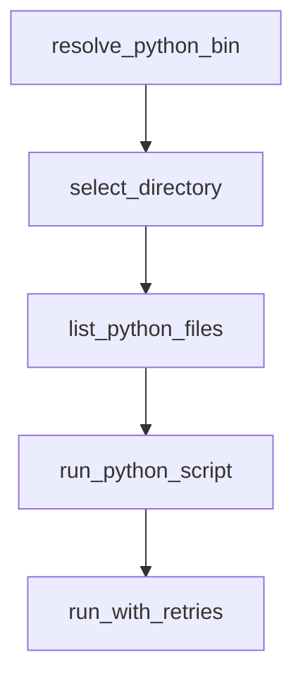

# Chapter 1: Getting Started

Welcome to **Chapter 1: Getting Started**. In this part of **Agno Tutorial: Multi-Agent Systems That Learn Over Time**, you will build an intuitive mental model first, then move into concrete implementation details and practical production tradeoffs.


This chapter gets your first Agno agent running with persistent storage and learning enabled.

## Learning Goals

- create and run a first Agno agent
- enable storage-backed memory behavior
- validate learning mode and session continuity
- confirm model connectivity

## Minimal Example

```python
from agno.agent import Agent
from agno.db.sqlite import SqliteDb
from agno.models.openai import OpenAIResponses

agent = Agent(
    model=OpenAIResponses(id="gpt-5.2"),
    db=SqliteDb(db_file="tmp/agents.db"),
    learning=True,
)
```

## First Validation Checklist

1. initial response succeeds
2. follow-up recalls prior context
3. persisted state survives process restart
4. logs show expected execution path

## Source References

- [Agno First Agent](https://docs.agno.com/first-agent)
- [Agno Repository](https://github.com/agno-agi/agno)

## Summary

You now have an Agno baseline with persistent memory and learning enabled.

Next: [Chapter 2: Framework Architecture](02-framework-architecture.md)

## Depth Expansion Playbook

## Source Code Walkthrough

### `cookbook/scripts/cookbook_runner.py`

The `resolve_python_bin` function in [`cookbook/scripts/cookbook_runner.py`](https://github.com/agno-agi/agno/blob/HEAD/cookbook/scripts/cookbook_runner.py) handles a key part of this chapter's functionality:

```py


def resolve_python_bin(python_bin: str | None) -> str:
    if python_bin:
        return python_bin
    demo_python = Path(".venvs/demo/bin/python")
    if demo_python.exists():
        return demo_python.as_posix()
    return sys.executable


def select_directory(base_directory: Path) -> Path | None:
    if inquirer is None:
        raise click.ClickException(
            "Interactive mode requires `inquirer`. Install it or use `--batch`."
        )

    current_dir = base_directory
    while True:
        items = [
            item.name
            for item in current_dir.iterdir()
            if item.is_dir() and item.name not in SKIP_DIR_NAMES
        ]
        items.sort()
        items.insert(0, "[Select this directory]")
        if current_dir != current_dir.parent:
            items.insert(1, "[Go back]")

        questions = [
            inquirer.List(
                "selected_item",
```

This function is important because it defines how Agno Tutorial: Multi-Agent Systems That Learn Over Time implements the patterns covered in this chapter.

### `cookbook/scripts/cookbook_runner.py`

The `select_directory` function in [`cookbook/scripts/cookbook_runner.py`](https://github.com/agno-agi/agno/blob/HEAD/cookbook/scripts/cookbook_runner.py) handles a key part of this chapter's functionality:

```py


def select_directory(base_directory: Path) -> Path | None:
    if inquirer is None:
        raise click.ClickException(
            "Interactive mode requires `inquirer`. Install it or use `--batch`."
        )

    current_dir = base_directory
    while True:
        items = [
            item.name
            for item in current_dir.iterdir()
            if item.is_dir() and item.name not in SKIP_DIR_NAMES
        ]
        items.sort()
        items.insert(0, "[Select this directory]")
        if current_dir != current_dir.parent:
            items.insert(1, "[Go back]")

        questions = [
            inquirer.List(
                "selected_item",
                message=f"Current directory: {current_dir.as_posix()}",
                choices=items,
            )
        ]
        answers = inquirer.prompt(questions)
        if not answers or "selected_item" not in answers:
            click.echo("No selection made. Exiting.")
            return None

```

This function is important because it defines how Agno Tutorial: Multi-Agent Systems That Learn Over Time implements the patterns covered in this chapter.

### `cookbook/scripts/cookbook_runner.py`

The `list_python_files` function in [`cookbook/scripts/cookbook_runner.py`](https://github.com/agno-agi/agno/blob/HEAD/cookbook/scripts/cookbook_runner.py) handles a key part of this chapter's functionality:

```py


def list_python_files(base_directory: Path, recursive: bool) -> list[Path]:
    pattern = "**/*.py" if recursive else "*.py"
    files = []
    for path in sorted(base_directory.glob(pattern)):
        if not path.is_file():
            continue
        if path.name in SKIP_FILE_NAMES:
            continue
        if any(part in SKIP_DIR_NAMES for part in path.parts):
            continue
        files.append(path)
    return files


def run_python_script(
    script_path: Path, python_bin: str, timeout_seconds: int
) -> dict[str, object]:
    click.echo(f"Running {script_path.as_posix()} with {python_bin}")
    start = time.perf_counter()
    timed_out = False
    return_code = 1
    error_message = None
    try:
        completed = subprocess.run(
            [python_bin, script_path.as_posix()],
            check=False,
            timeout=timeout_seconds if timeout_seconds > 0 else None,
            text=True,
        )
        return_code = completed.returncode
```

This function is important because it defines how Agno Tutorial: Multi-Agent Systems That Learn Over Time implements the patterns covered in this chapter.

### `cookbook/scripts/cookbook_runner.py`

The `run_python_script` function in [`cookbook/scripts/cookbook_runner.py`](https://github.com/agno-agi/agno/blob/HEAD/cookbook/scripts/cookbook_runner.py) handles a key part of this chapter's functionality:

```py


def run_python_script(
    script_path: Path, python_bin: str, timeout_seconds: int
) -> dict[str, object]:
    click.echo(f"Running {script_path.as_posix()} with {python_bin}")
    start = time.perf_counter()
    timed_out = False
    return_code = 1
    error_message = None
    try:
        completed = subprocess.run(
            [python_bin, script_path.as_posix()],
            check=False,
            timeout=timeout_seconds if timeout_seconds > 0 else None,
            text=True,
        )
        return_code = completed.returncode
    except subprocess.TimeoutExpired:
        timed_out = True
        error_message = f"Timed out after {timeout_seconds}s"
        return_code = 124
        click.echo(f"Timeout: {script_path.as_posix()} exceeded {timeout_seconds}s")
    except OSError as exc:
        error_message = str(exc)
        click.echo(f"Error running {script_path.as_posix()}: {exc}")

    duration = time.perf_counter() - start
    passed = return_code == 0 and not timed_out
    return {
        "script": script_path.as_posix(),
        "status": "PASS" if passed else "FAIL",
```

This function is important because it defines how Agno Tutorial: Multi-Agent Systems That Learn Over Time implements the patterns covered in this chapter.


## How These Components Connect


