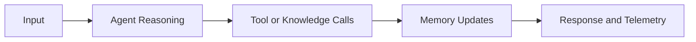

# Chapter 2: Framework Architecture

Agno combines framework, runtime, and control-plane layers for multi-agent systems.

## Architecture Layers

| Layer | Responsibility |
|:------|:---------------|
| framework | agent logic, tools, knowledge, guardrails |
| runtime | execution lifecycle and state handling |
| control plane | monitoring and operational management |

## Flow Model

## Source References

- [Agno Docs](https://docs.agno.com)
- [AgentOS Introduction](https://docs.agno.com/agent-os/introduction)

## Summary

You now understand how Agno separates application logic from runtime and operations.

Next: [Chapter 3: Learning, Memory, and State](03-learning-memory-and-state.md)
