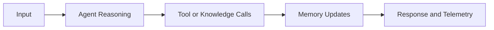

# Chapter 2: Framework Architecture

Welcome to **Chapter 2: Framework Architecture**. In this part of **Agno Tutorial: Multi-Agent Systems That Learn Over Time**, you will build an intuitive mental model first, then move into concrete implementation details and practical production tradeoffs.

Agno combines framework, runtime, and control-plane layers for multi-agent systems.

## Architecture Layers

| Layer | Responsibility |
|:------|:---------------|
| framework | agent logic, tools, knowledge, guardrails |
| runtime | execution lifecycle and state handling |
| control plane | monitoring and operational management |

## Flow Model

```mermaid
flowchart LR
    A[Input] --> B[Agent Reasoning]
    B --> C[Tool or Knowledge Calls]
    C --> D[Memory Updates]
    D --> E[Response and Telemetry]
```

## Source References

- [Agno Docs](https://docs.agno.com)
- [AgentOS Introduction](https://docs.agno.com/agent-os/introduction)

## Summary

You now understand how Agno separates application logic from runtime and operations.

Next: [Chapter 3: Learning, Memory, and State](03-learning-memory-and-state.md)

## Source Code Walkthrough

### `libs/agno/agno/agent/agent.py` and `libs/agno/agno/models/`

The framework architecture is best understood by examining the `Agent` class alongside the model abstraction layer in [`libs/agno/agno/models/`](https://github.com/agno-agi/agno/tree/HEAD/libs/agno/agno/models). The separation between the `Agent` orchestration logic and the interchangeable model backends demonstrates the provider-agnostic design described in this chapter. The `run` and `arun` methods show the core request/response lifecycle.