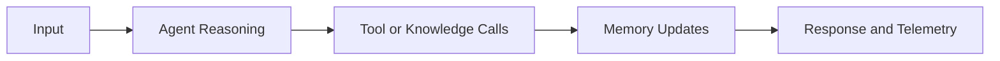
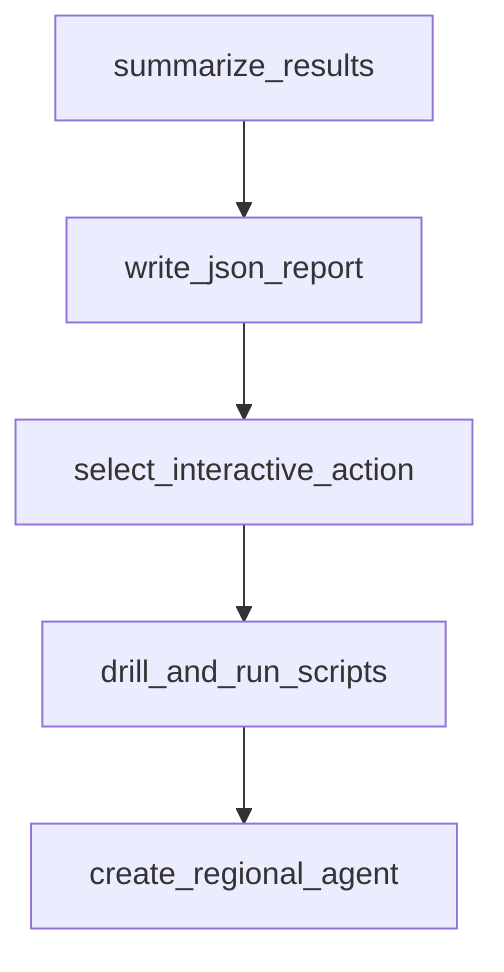

# Chapter 2: Framework Architecture

Welcome to **Chapter 2: Framework Architecture**. In this part of **Agno Tutorial: Multi-Agent Systems That Learn Over Time**, you will build an intuitive mental model first, then move into concrete implementation details and practical production tradeoffs.


Agno combines framework, runtime, and control-plane layers for multi-agent systems.

## Architecture Layers

| Layer | Responsibility |
|:------|:---------------|
| framework | agent logic, tools, knowledge, guardrails |
| runtime | execution lifecycle and state handling |
| control plane | monitoring and operational management |

## Flow Model


```mermaid
flowchart LR
    A[Input] --> B[Agent Reasoning]
    B --> C[Tool or Knowledge Calls]
    C --> D[Memory Updates]
    D --> E[Response and Telemetry]
```

## Source References

- [Agno Docs](https://docs.agno.com)
- [AgentOS Introduction](https://docs.agno.com/agent-os/introduction)

## Summary

You now understand how Agno separates application logic from runtime and operations.

Next: [Chapter 3: Learning, Memory, and State](03-learning-memory-and-state.md)

## Depth Expansion Playbook

## Source Code Walkthrough

### `cookbook/scripts/cookbook_runner.py`

The `summarize_results` function in [`cookbook/scripts/cookbook_runner.py`](https://github.com/agno-agi/agno/blob/HEAD/cookbook/scripts/cookbook_runner.py) handles a key part of this chapter's functionality:

```py


def summarize_results(results: list[dict[str, object]]) -> dict[str, int]:
    passed = sum(1 for r in results if r["status"] == "PASS")
    failed = len(results) - passed
    timed_out = sum(1 for r in results if r["timed_out"])
    return {
        "total_scripts": len(results),
        "passed": passed,
        "failed": failed,
        "timed_out": timed_out,
    }


def write_json_report(
    output_path: str,
    base_directory: Path,
    selected_directory: Path,
    mode: str,
    recursive: bool,
    python_bin: str,
    timeout_seconds: int,
    retries: int,
    results: list[dict[str, object]],
) -> None:
    payload = {
        "generated_at": datetime.now(timezone.utc).isoformat(),
        "base_directory": base_directory.resolve().as_posix(),
        "selected_directory": selected_directory.resolve().as_posix(),
        "mode": mode,
        "recursive": recursive,
        "python_bin": python_bin,
```

This function is important because it defines how Agno Tutorial: Multi-Agent Systems That Learn Over Time implements the patterns covered in this chapter.

### `cookbook/scripts/cookbook_runner.py`

The `write_json_report` function in [`cookbook/scripts/cookbook_runner.py`](https://github.com/agno-agi/agno/blob/HEAD/cookbook/scripts/cookbook_runner.py) handles a key part of this chapter's functionality:

```py


def write_json_report(
    output_path: str,
    base_directory: Path,
    selected_directory: Path,
    mode: str,
    recursive: bool,
    python_bin: str,
    timeout_seconds: int,
    retries: int,
    results: list[dict[str, object]],
) -> None:
    payload = {
        "generated_at": datetime.now(timezone.utc).isoformat(),
        "base_directory": base_directory.resolve().as_posix(),
        "selected_directory": selected_directory.resolve().as_posix(),
        "mode": mode,
        "recursive": recursive,
        "python_bin": python_bin,
        "timeout_seconds": timeout_seconds,
        "retries": retries,
        "summary": summarize_results(results),
        "results": results,
    }
    path = Path(output_path)
    path.parent.mkdir(parents=True, exist_ok=True)
    path.write_text(json.dumps(payload, indent=2) + "\n", encoding="utf-8")
    click.echo(f"Wrote JSON report to {path.as_posix()}")


def select_interactive_action() -> str | None:
```

This function is important because it defines how Agno Tutorial: Multi-Agent Systems That Learn Over Time implements the patterns covered in this chapter.

### `cookbook/scripts/cookbook_runner.py`

The `select_interactive_action` function in [`cookbook/scripts/cookbook_runner.py`](https://github.com/agno-agi/agno/blob/HEAD/cookbook/scripts/cookbook_runner.py) handles a key part of this chapter's functionality:

```py


def select_interactive_action() -> str | None:
    if inquirer is None:
        return None
    questions = [
        inquirer.List(
            "action",
            message="Some cookbooks failed. What would you like to do?",
            choices=["Retry failed scripts", "Exit with error log"],
        )
    ]
    answers = inquirer.prompt(questions)
    return answers.get("action") if answers else None


@click.command()
@click.argument(
    "base_directory",
    type=click.Path(exists=True, file_okay=False, dir_okay=True),
    default="cookbook",
)
@click.option(
    "--batch",
    is_flag=True,
    default=False,
    help="Non-interactive mode: run all scripts in the selected directory.",
)
@click.option(
    "--recursive/--no-recursive",
    default=False,
    help="Include Python scripts recursively under selected directory.",
```

This function is important because it defines how Agno Tutorial: Multi-Agent Systems That Learn Over Time implements the patterns covered in this chapter.

### `cookbook/scripts/cookbook_runner.py`

The `drill_and_run_scripts` function in [`cookbook/scripts/cookbook_runner.py`](https://github.com/agno-agi/agno/blob/HEAD/cookbook/scripts/cookbook_runner.py) handles a key part of this chapter's functionality:

```py
    help="Optional path to write machine-readable JSON results.",
)
def drill_and_run_scripts(
    base_directory: str,
    batch: bool,
    recursive: bool,
    python_bin: str | None,
    timeout_seconds: int,
    retries: int,
    fail_fast: bool,
    json_report: str | None,
) -> None:
    """Run cookbook scripts in interactive or batch mode."""
    if timeout_seconds < 0:
        raise click.ClickException("--timeout-seconds must be >= 0")
    if retries < 0:
        raise click.ClickException("--retries must be >= 0")

    base_dir_path = Path(base_directory)
    selected_directory = (
        base_dir_path if batch else select_directory(base_directory=base_dir_path)
    )
    if selected_directory is None:
        raise SystemExit(1)

    resolved_python_bin = resolve_python_bin(python_bin=python_bin)
    click.echo(f"Selected directory: {selected_directory.as_posix()}")
    click.echo(f"Python executable: {resolved_python_bin}")
    click.echo(f"Recursive: {recursive}")
    click.echo(f"Timeout (seconds): {timeout_seconds}")
    click.echo(f"Retries: {retries}")

```

This function is important because it defines how Agno Tutorial: Multi-Agent Systems That Learn Over Time implements the patterns covered in this chapter.


## How These Components Connect


```mermaid
flowchart TD
    A[summarize_results]
    B[write_json_report]
    C[select_interactive_action]
    D[drill_and_run_scripts]
    E[create_regional_agent]
    A --> B
    B --> C
    C --> D
    D --> E
```
