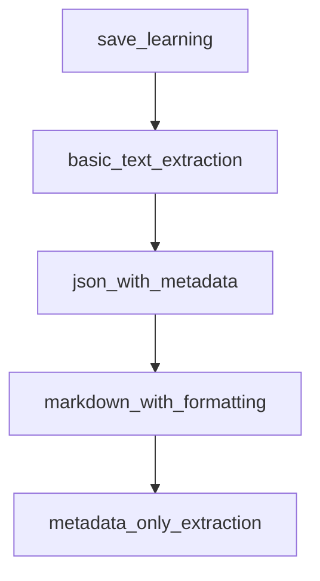

# Chapter 3: Learning, Memory, and State

Welcome to **Chapter 3: Learning, Memory, and State**. In this part of **Agno Tutorial: Multi-Agent Systems That Learn Over Time**, you will build an intuitive mental model first, then move into concrete implementation details and practical production tradeoffs.


Agno's differentiator is persistent learning behavior across sessions and users.

## Memory Model

| Type | Purpose |
|:-----|:--------|
| user profile memory | cross-session personalization |
| conversation memory | current dialogue continuity |
| learned shared knowledge | transferable improvements across users |

## Design Rules

- separate volatile session state from durable memory
- validate memory quality before promotion to shared knowledge
- define retention and deletion policies early

## Source References

- [Agno Docs](https://docs.agno.com)
- [Agno README](https://github.com/agno-agi/agno)

## Summary

You now know how to structure Agno memory for sustainable long-term improvement.

Next: [Chapter 4: Multi-Agent Orchestration](04-multi-agent-orchestration.md)

## Depth Expansion Playbook

## Source Code Walkthrough

### `cookbook/00_quickstart/human_in_the_loop.py`

The `save_learning` function in [`cookbook/00_quickstart/human_in_the_loop.py`](https://github.com/agno-agi/agno/blob/HEAD/cookbook/00_quickstart/human_in_the_loop.py) handles a key part of this chapter's functionality:

```py
# ---------------------------------------------------------------------------
@tool(requires_confirmation=True)
def save_learning(title: str, learning: str) -> str:
    """
    Save a reusable insight to the knowledge base for future reference.
    This action requires user confirmation before executing.

    Args:
        title: Short descriptive title (e.g., "Tech stock P/E benchmarks")
        learning: The insight to save — be specific and actionable

    Returns:
        Confirmation message
    """
    if not title or not title.strip():
        return "Cannot save: title is required"
    if not learning or not learning.strip():
        return "Cannot save: learning content is required"

    payload = {
        "title": title.strip(),
        "learning": learning.strip(),
        "saved_at": datetime.now(timezone.utc).isoformat(),
    }

    learnings_kb.insert(
        name=payload["title"],
        text_content=json.dumps(payload, ensure_ascii=False),
        reader=TextReader(),
        skip_if_exists=True,
    )

```

This function is important because it defines how Agno Tutorial: Multi-Agent Systems That Learn Over Time implements the patterns covered in this chapter.

### `cookbook/91_tools/trafilatura_tools.py`

The `basic_text_extraction` function in [`cookbook/91_tools/trafilatura_tools.py`](https://github.com/agno-agi/agno/blob/HEAD/cookbook/91_tools/trafilatura_tools.py) handles a key part of this chapter's functionality:

```py


def basic_text_extraction():
    """
    Basic text extraction from a single URL.
    Perfect for simple content extraction tasks.
    """
    print("=== Example 1: Basic Text Extraction ===")

    agent = Agent(
        tools=[TrafilaturaTools()],  # Default configuration
        markdown=True,
    )

    agent.print_response(
        "Please extract and summarize the main content from https://github.com/agno-agi/agno"
    )


# =============================================================================
# Example 2: JSON Output with Metadata
# =============================================================================


def json_with_metadata():
    """
    Extract content in JSON format with metadata.
    Useful when you need structured data including titles, authors, dates, etc.
    """
    print("\n=== Example 2: JSON Output with Metadata ===")

    # Configure tool for JSON output with metadata
```

This function is important because it defines how Agno Tutorial: Multi-Agent Systems That Learn Over Time implements the patterns covered in this chapter.

### `cookbook/91_tools/trafilatura_tools.py`

The `json_with_metadata` function in [`cookbook/91_tools/trafilatura_tools.py`](https://github.com/agno-agi/agno/blob/HEAD/cookbook/91_tools/trafilatura_tools.py) handles a key part of this chapter's functionality:

```py


def json_with_metadata():
    """
    Extract content in JSON format with metadata.
    Useful when you need structured data including titles, authors, dates, etc.
    """
    print("\n=== Example 2: JSON Output with Metadata ===")

    # Configure tool for JSON output with metadata
    agent = Agent(
        tools=[
            TrafilaturaTools(
                output_format="json",
                with_metadata=True,
                include_comments=True,
                include_tables=True,
            )
        ],
        markdown=True,
    )

    agent.print_response(
        "Extract the article content from https://en.wikipedia.org/wiki/Web_scraping in JSON format with metadata"
    )


# =============================================================================
# Example 3: Markdown Output with Formatting
# =============================================================================


```

This function is important because it defines how Agno Tutorial: Multi-Agent Systems That Learn Over Time implements the patterns covered in this chapter.

### `cookbook/91_tools/trafilatura_tools.py`

The `markdown_with_formatting` function in [`cookbook/91_tools/trafilatura_tools.py`](https://github.com/agno-agi/agno/blob/HEAD/cookbook/91_tools/trafilatura_tools.py) handles a key part of this chapter's functionality:

```py


def markdown_with_formatting():
    """
    Extract content in Markdown format preserving structure.
    Great for maintaining document structure and readability.
    """
    print("\n=== Example 3: Markdown with Formatting ===")

    agent = Agent(
        tools=[
            TrafilaturaTools(
                output_format="markdown",
                include_formatting=True,
                include_links=True,
                with_metadata=True,
            )
        ],
        markdown=True,
    )

    agent.print_response(
        "Convert https://docs.python.org/3/tutorial/introduction.html to markdown format while preserving the structure and links"
    )


# =============================================================================
# Example 4: Metadata-Only Extraction
# =============================================================================


def metadata_only_extraction():
```

This function is important because it defines how Agno Tutorial: Multi-Agent Systems That Learn Over Time implements the patterns covered in this chapter.


## How These Components Connect


