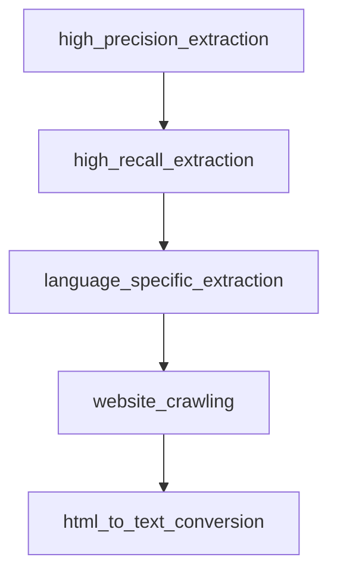

# Chapter 4: Multi-Agent Orchestration

Welcome to **Chapter 4: Multi-Agent Orchestration**. In this part of **Agno Tutorial: Multi-Agent Systems That Learn Over Time**, you will build an intuitive mental model first, then move into concrete implementation details and practical production tradeoffs.


Multi-agent systems need explicit role and handoff boundaries to remain reliable.

## Orchestration Pattern

| Role | Responsibility |
|:-----|:---------------|
| coordinator | route tasks and manage execution state |
| specialist agents | domain-specific reasoning and tool usage |
| reviewer/guard | quality and policy enforcement |

## Handoff Guidance

- pass only required context to each specialist
- log handoff reason and result
- enforce max handoff depth per request

## Source References

- [Agno First Multi-Agent System](https://docs.agno.com/first-multi-agent-system)
- [Agno Docs](https://docs.agno.com)

## Summary

You now have a practical pattern for building coherent Agno multi-agent teams.

Next: [Chapter 5: Knowledge, RAG, and Tools](05-knowledge-rag-and-tools.md)

## Depth Expansion Playbook

## Source Code Walkthrough

### `cookbook/91_tools/trafilatura_tools.py`

The `high_precision_extraction` function in [`cookbook/91_tools/trafilatura_tools.py`](https://github.com/agno-agi/agno/blob/HEAD/cookbook/91_tools/trafilatura_tools.py) handles a key part of this chapter's functionality:

```py


def high_precision_extraction():
    """
    Extract with high precision settings.
    Use when you need clean, accurate content and don't mind missing some text.
    """
    print("\n=== Example 5: High Precision Extraction ===")

    agent = Agent(
        tools=[
            TrafilaturaTools(
                favor_precision=True,
                include_comments=False,  # Skip comments for cleaner output
                include_tables=True,
                output_format="txt",
            )
        ],
        markdown=True,
    )

    agent.print_response(
        "Extract the main article content from https://www.bbc.com/news with high precision, excluding comments and ads"
    )


# =============================================================================
# Example 6: High Recall Extraction
# =============================================================================


def high_recall_extraction():
```

This function is important because it defines how Agno Tutorial: Multi-Agent Systems That Learn Over Time implements the patterns covered in this chapter.

### `cookbook/91_tools/trafilatura_tools.py`

The `high_recall_extraction` function in [`cookbook/91_tools/trafilatura_tools.py`](https://github.com/agno-agi/agno/blob/HEAD/cookbook/91_tools/trafilatura_tools.py) handles a key part of this chapter's functionality:

```py


def high_recall_extraction():
    """
    Extract with high recall settings.
    Use when you want to capture as much content as possible.
    """
    print("\n=== Example 6: High Recall Extraction ===")

    agent = Agent(
        tools=[
            TrafilaturaTools(
                favor_recall=True,
                include_comments=True,
                include_tables=True,
                include_formatting=True,
                output_format="markdown",
            )
        ],
        markdown=True,
    )

    agent.print_response(
        "Extract comprehensive content from https://stackoverflow.com/questions/1732348/regex-match-open-tags-except-xhtml-self-contained-tags including all comments and discussions"
    )


# =============================================================================
# Example 7: Language-Specific Extraction
# =============================================================================


```

This function is important because it defines how Agno Tutorial: Multi-Agent Systems That Learn Over Time implements the patterns covered in this chapter.

### `cookbook/91_tools/trafilatura_tools.py`

The `language_specific_extraction` function in [`cookbook/91_tools/trafilatura_tools.py`](https://github.com/agno-agi/agno/blob/HEAD/cookbook/91_tools/trafilatura_tools.py) handles a key part of this chapter's functionality:

```py


def language_specific_extraction():
    """
    Extract content with language filtering.
    Useful for multilingual websites or language-specific content.
    """
    print("\n=== Example 7: Language-Specific Extraction ===")

    agent = Agent(
        tools=[
            TrafilaturaTools(
                target_language="en",  # Filter for English content
                output_format="json",
                with_metadata=True,
                deduplicate=True,
            )
        ],
        markdown=True,
    )

    agent.print_response(
        "Extract English content from https://www.reddit.com/r/MachineLearning/ and provide a summary"
    )


# =============================================================================
# Example 8: Website Crawling (if spider available)
# =============================================================================


def website_crawling():
```

This function is important because it defines how Agno Tutorial: Multi-Agent Systems That Learn Over Time implements the patterns covered in this chapter.

### `cookbook/91_tools/trafilatura_tools.py`

The `website_crawling` function in [`cookbook/91_tools/trafilatura_tools.py`](https://github.com/agno-agi/agno/blob/HEAD/cookbook/91_tools/trafilatura_tools.py) handles a key part of this chapter's functionality:

```py


def website_crawling():
    """
    Crawl a website to discover and extract content from multiple pages.
    Note: Requires trafilatura spider module to be available.
    """
    print("\n=== Example 8: Website Crawling ===")

    agent = Agent(
        tools=[
            TrafilaturaTools(
                enable_crawl_website=True,
                max_crawl_urls=5,  # Limit for demo
                output_format="json",
                with_metadata=True,
            )
        ],
        markdown=True,
    )

    agent.print_response(
        "Crawl https://example.com and extract content from up to 5 internal pages"
    )


# =============================================================================
# Example 9: HTML to Text Conversion
# =============================================================================


def html_to_text_conversion():
```

This function is important because it defines how Agno Tutorial: Multi-Agent Systems That Learn Over Time implements the patterns covered in this chapter.


## How These Components Connect


