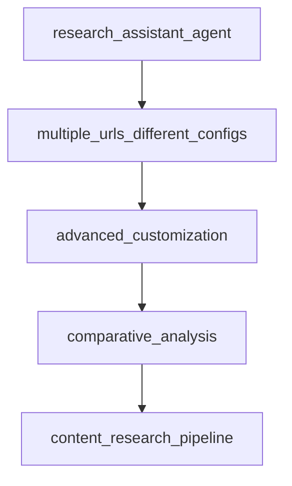

# Chapter 5: Knowledge, RAG, and Tools

Welcome to **Chapter 5: Knowledge, RAG, and Tools**. In this part of **Agno Tutorial: Multi-Agent Systems That Learn Over Time**, you will build an intuitive mental model first, then move into concrete implementation details and practical production tradeoffs.


Agno agents combine tool execution and knowledge retrieval to produce grounded, high-utility outputs.

## Augmentation Surfaces

| Surface | Value |
|:--------|:------|
| vector/RAG retrieval | domain grounding |
| toolkits | external action and system interaction |
| guardrails | safe execution boundaries |

## Operational Rules

- treat tool calls as policy-governed actions
- track retrieval quality and stale context rates
- ensure typed contracts for tool inputs/outputs

## Source References

- [Agno Features](https://github.com/agno-agi/agno)
- [Agno Docs](https://docs.agno.com)

## Summary

You now understand how to combine knowledge and tool layers in Agno without sacrificing reliability.

Next: [Chapter 6: AgentOS Runtime and Control Plane](06-agentos-runtime-and-control-plane.md)

## Depth Expansion Playbook

## Source Code Walkthrough

### `cookbook/91_tools/trafilatura_tools.py`

The `research_assistant_agent` function in [`cookbook/91_tools/trafilatura_tools.py`](https://github.com/agno-agi/agno/blob/HEAD/cookbook/91_tools/trafilatura_tools.py) handles a key part of this chapter's functionality:

```py


def research_assistant_agent():
    """
    Create a specialized research assistant using TrafilaturaTools.
    This agent is optimized for extracting and analyzing research content.
    """
    research_agent = Agent(
        name="Research Assistant",
        model=OpenAIChat(id="gpt-4"),
        tools=[
            TrafilaturaTools(
                output_format="json",
                with_metadata=True,
                include_tables=True,
                include_links=True,
                favor_recall=True,
                target_language="en",
            )
        ],
        instructions="""
        You are a research assistant specialized in gathering and analyzing information from web sources.
        
        When extracting content:
        1. Always include source metadata (title, author, date, URL)
        2. Preserve important structural elements like tables and lists
        3. Maintain links for citation purposes
        4. Focus on comprehensive content extraction
        5. Provide structured analysis of the extracted content
        
        Format your responses with:
        - Executive Summary
```

This function is important because it defines how Agno Tutorial: Multi-Agent Systems That Learn Over Time implements the patterns covered in this chapter.

### `cookbook/91_tools/trafilatura_tools.py`

The `multiple_urls_different_configs` function in [`cookbook/91_tools/trafilatura_tools.py`](https://github.com/agno-agi/agno/blob/HEAD/cookbook/91_tools/trafilatura_tools.py) handles a key part of this chapter's functionality:

```py


def multiple_urls_different_configs():
    """
    Process multiple URLs with different extraction strategies.
    Demonstrates flexibility in handling various content types.
    """
    print("\n=== Example 10: Multiple URLs with Different Configurations ===")

    # Different agents for different content types
    news_agent = Agent(
        tools=[
            TrafilaturaTools(
                output_format="json",
                with_metadata=True,
                include_comments=False,
                favor_precision=True,
            )
        ],
        markdown=True,
    )

    documentation_agent = Agent(
        tools=[
            TrafilaturaTools(
                output_format="markdown",
                include_formatting=True,
                include_links=True,
                include_tables=True,
                favor_recall=True,
            )
        ],
```

This function is important because it defines how Agno Tutorial: Multi-Agent Systems That Learn Over Time implements the patterns covered in this chapter.

### `cookbook/91_tools/trafilatura_tools.py`

The `advanced_customization` function in [`cookbook/91_tools/trafilatura_tools.py`](https://github.com/agno-agi/agno/blob/HEAD/cookbook/91_tools/trafilatura_tools.py) handles a key part of this chapter's functionality:

```py


def advanced_customization():
    """
    Advanced configuration with all customization options.
    Shows how to fine-tune extraction for specific needs.
    """
    print("\n=== Example 11: Advanced Customization ===")

    agent = Agent(
        tools=[
            TrafilaturaTools(
                output_format="xml",
                include_comments=False,
                include_tables=True,
                include_images=True,
                include_formatting=True,
                include_links=True,
                with_metadata=True,
                favor_precision=True,
                target_language="en",
                deduplicate=True,
                max_tree_size=10000,
            )
        ],
        markdown=True,
    )

    agent.print_response(
        "Extract comprehensive structured content from https://en.wikipedia.org/wiki/Artificial_intelligence in XML format with all metadata and structural elements"
    )

```

This function is important because it defines how Agno Tutorial: Multi-Agent Systems That Learn Over Time implements the patterns covered in this chapter.

### `cookbook/91_tools/trafilatura_tools.py`

The `comparative_analysis` function in [`cookbook/91_tools/trafilatura_tools.py`](https://github.com/agno-agi/agno/blob/HEAD/cookbook/91_tools/trafilatura_tools.py) handles a key part of this chapter's functionality:

```py


def comparative_analysis():
    """
    Compare content from multiple sources using different extraction strategies.
    Useful for research and content analysis tasks.
    """
    print("\n=== Example 12: Comparative Analysis ===")

    agent = Agent(
        model=OpenAIChat(id="gpt-4"),
        tools=[
            TrafilaturaTools(
                output_format="json",
                with_metadata=True,
                include_tables=True,
                favor_precision=True,
            )
        ],
        markdown=True,
    )

    agent.print_response("""
        Compare and analyze the content about artificial intelligence from these sources:
        1. https://en.wikipedia.org/wiki/Artificial_intelligence
        2. https://www.ibm.com/cloud/learn/what-is-artificial-intelligence
        
        Provide a comparative analysis highlighting the key differences in how they present AI concepts.
    """)


# =============================================================================
```

This function is important because it defines how Agno Tutorial: Multi-Agent Systems That Learn Over Time implements the patterns covered in this chapter.


## How These Components Connect


