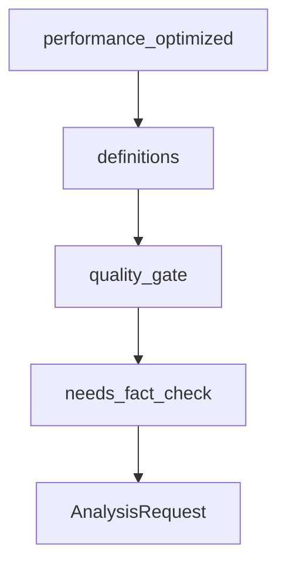

# Chapter 6: AgentOS Runtime and Control Plane

Welcome to **Chapter 6: AgentOS Runtime and Control Plane**. In this part of **Agno Tutorial: Multi-Agent Systems That Learn Over Time**, you will build an intuitive mental model first, then move into concrete implementation details and practical production tradeoffs.


AgentOS provides runtime and control-plane support for operating Agno systems in production.

## Runtime Concerns

| Concern | Practice |
|:--------|:---------|
| deployment topology | isolate workloads by environment and risk |
| execution state | durable storage and recovery strategy |
| control-plane access | strict auth and role boundaries |

## Control Plane Playbook

1. define service ownership and SLOs
2. expose key runtime metrics and traces
3. establish rollback and emergency stop procedures

## Source References

- [AgentOS Introduction](https://docs.agno.com/agent-os/introduction)
- [Agno Production Overview](https://docs.agno.com/production/overview)

## Summary

You now have an operational model for running Agno via AgentOS infrastructure.

Next: [Chapter 7: Guardrails, Evals, and Observability](07-guardrails-evals-and-observability.md)

## Depth Expansion Playbook

## Source Code Walkthrough

### `cookbook/91_tools/trafilatura_tools.py`

The `performance_optimized` function in [`cookbook/91_tools/trafilatura_tools.py`](https://github.com/agno-agi/agno/blob/HEAD/cookbook/91_tools/trafilatura_tools.py) handles a key part of this chapter's functionality:

```py


def performance_optimized():
    """
    Optimized configuration for fast, efficient extraction.
    Best for high-volume processing or when speed is critical.
    """
    print("\n=== Example 14: Performance Optimized Extraction ===")

    agent = Agent(
        tools=[
            TrafilaturaTools(
                output_format="txt",
                include_comments=False,
                include_tables=False,
                include_images=False,
                include_formatting=False,
                include_links=False,
                with_metadata=False,
                favor_precision=True,  # Faster processing
                deduplicate=False,  # Skip deduplication for speed
            )
        ],
        markdown=True,
    )

    agent.print_response(
        "Quickly extract just the main text content from https://news.ycombinator.com optimized for speed"
    )


# =============================================================================
```

This function is important because it defines how Agno Tutorial: Multi-Agent Systems That Learn Over Time implements the patterns covered in this chapter.

### `cookbook/91_tools/github_tools.py`

The `definitions` class in [`cookbook/91_tools/github_tools.py`](https://github.com/agno-agi/agno/blob/HEAD/cookbook/91_tools/github_tools.py) handles a key part of this chapter's functionality:

```py
    # Example: Search code in repository
    # agent.print_response(
    #     "Search for 'Agent' class definitions in the agno-agi/agno repository",
    #     markdown=True,
    # )

    # Example: Search issues and pull requests
    # agent.print_response(
    #     "Find all issues and PRs mentioning 'bug' in the agno-agi/agno repository",
    #     markdown=True,
    # )

    # Example: Creating a pull request (commented out by default)
    # agent.print_response("Create a pull request from 'feature-branch' to 'main' in agno-agi/agno titled 'New Feature' with description 'Implements the new feature'", markdown=True)

    # Example: Creating a branch (commented out by default)
    # agent.print_response("Create a new branch called 'feature-branch' from the main branch in the agno-agi/agno repository", markdown=True)

    # Example: Setting default branch (commented out by default)
    # agent.print_response("Set the default branch to 'develop' in the agno-agi/agno repository", markdown=True)

    # Example: File creation (commented out by default)
    # agent.print_response("Create a file called 'test.md' with content 'This is a test' in the agno-agi/agno repository", markdown=True)

    # Example: Update file (commented out by default)
    # agent.print_response("Update the README.md file in the agno-agi/agno repository to add a new section about installation", markdown=True)

    # Example: Delete file (commented out by default)
    # agent.print_response("Delete the file test.md from the agno-agi/agno repository", markdown=True)

    # Example: Requesting a review for a pull request (commented out by default)
    # agent.print_response("Request a review from user 'username' for pull request #100 in the agno-agi/agno repository", markdown=True)
```

This class is important because it defines how Agno Tutorial: Multi-Agent Systems That Learn Over Time implements the patterns covered in this chapter.

### `cookbook/gemini_3/20_workflow.py`

The `quality_gate` function in [`cookbook/gemini_3/20_workflow.py`](https://github.com/agno-agi/agno/blob/HEAD/cookbook/gemini_3/20_workflow.py) handles a key part of this chapter's functionality:

```py
# Custom step functions
# ---------------------------------------------------------------------------
def quality_gate(step_input: StepInput) -> StepOutput:
    """Check that the analysis has enough substance to proceed."""
    content = str(step_input.previous_step_content or "")
    if len(content) < 200:
        return StepOutput(
            content="Quality gate failed: analysis too short. Stopping pipeline.",
            stop=True,
            success=False,
        )
    return StepOutput(
        content=content,
        success=True,
    )


def needs_fact_check(step_input: StepInput) -> bool:
    """Decide whether the report needs fact-checking."""
    content = str(step_input.previous_step_content or "").lower()
    indicators = [
        "study",
        "research",
        "percent",
        "%",
        "million",
        "billion",
        "according",
    ]
    return any(indicator in content for indicator in indicators)


```

This function is important because it defines how Agno Tutorial: Multi-Agent Systems That Learn Over Time implements the patterns covered in this chapter.

### `cookbook/gemini_3/20_workflow.py`

The `needs_fact_check` function in [`cookbook/gemini_3/20_workflow.py`](https://github.com/agno-agi/agno/blob/HEAD/cookbook/gemini_3/20_workflow.py) handles a key part of this chapter's functionality:

```py


def needs_fact_check(step_input: StepInput) -> bool:
    """Decide whether the report needs fact-checking."""
    content = str(step_input.previous_step_content or "").lower()
    indicators = [
        "study",
        "research",
        "percent",
        "%",
        "million",
        "billion",
        "according",
    ]
    return any(indicator in content for indicator in indicators)


# ---------------------------------------------------------------------------
# Build Workflow
# ---------------------------------------------------------------------------
research_pipeline = Workflow(
    id="gemini-research-pipeline",
    name="Research Pipeline",
    description="Research-to-publication pipeline: parallel research, analysis, quality gate, writing, and conditional fact-checking.",
    db=gemini_agents_db,
    steps=[
        # Step 1: Research in parallel (two agents search simultaneously)
        Parallel(
            "Research",
            Step(name="web_research", agent=web_researcher),
            Step(name="deep_research", agent=deep_researcher),
        ),
```

This function is important because it defines how Agno Tutorial: Multi-Agent Systems That Learn Over Time implements the patterns covered in this chapter.


## How These Components Connect


