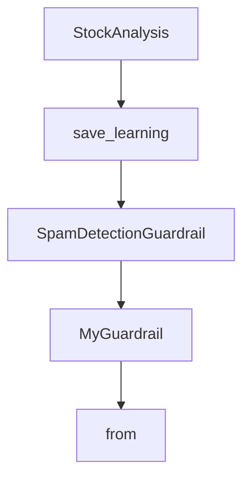

# Chapter 7: Guardrails, Evals, and Observability

Welcome to **Chapter 7: Guardrails, Evals, and Observability**. In this part of **Agno Tutorial: Multi-Agent Systems That Learn Over Time**, you will build an intuitive mental model first, then move into concrete implementation details and practical production tradeoffs.


Safety and quality require explicit guardrails plus continuous evaluation.

## Governance Stack

| Layer | Function |
|:------|:---------|
| guardrails | validate requests and tool actions |
| evals | measure quality, latency, and regression |
| observability | trace end-to-end behavior for diagnosis |

## Improvement Loop

- define benchmark tasks
- run evals on every major change
- inspect failed traces and update policies
- re-evaluate before promotion

## Source References

- [Agno Features](https://github.com/agno-agi/agno)
- [Agno Production Docs](https://docs.agno.com/production/overview)

## Summary

You now have a repeatable quality and safety loop for Agno systems.

Next: [Chapter 8: Production Deployment](08-production-deployment.md)

## Depth Expansion Playbook

## Source Code Walkthrough

### `cookbook/00_quickstart/agent_with_typed_input_output.py`

The `StockAnalysis` class in [`cookbook/00_quickstart/agent_with_typed_input_output.py`](https://github.com/agno-agi/agno/blob/HEAD/cookbook/00_quickstart/agent_with_typed_input_output.py) handles a key part of this chapter's functionality:

```py
# Output Schema — what the agent returns
# ---------------------------------------------------------------------------
class StockAnalysis(BaseModel):
    """Structured output for stock analysis."""

    ticker: str = Field(..., description="Stock ticker symbol")
    company_name: str = Field(..., description="Full company name")
    current_price: float = Field(..., description="Current stock price in USD")
    summary: str = Field(..., description="One-line summary of the stock")
    key_drivers: Optional[List[str]] = Field(
        None, description="Key growth drivers (if deep analysis)"
    )
    key_risks: Optional[List[str]] = Field(
        None, description="Key risks (if include_risks=True)"
    )
    recommendation: str = Field(
        ..., description="One of: Strong Buy, Buy, Hold, Sell, Strong Sell"
    )


# ---------------------------------------------------------------------------
# Agent Instructions
# ---------------------------------------------------------------------------
instructions = """\
You are a Finance Agent that produces structured stock analyses.

## Input Parameters

You receive structured requests with:
- ticker: The stock to analyze
- analysis_type: "quick" (summary only) or "deep" (full analysis)
- include_risks: Whether to include risk analysis
```

This class is important because it defines how Agno Tutorial: Multi-Agent Systems That Learn Over Time implements the patterns covered in this chapter.

### `cookbook/00_quickstart/custom_tool_for_self_learning.py`

The `save_learning` function in [`cookbook/00_quickstart/custom_tool_for_self_learning.py`](https://github.com/agno-agi/agno/blob/HEAD/cookbook/00_quickstart/custom_tool_for_self_learning.py) handles a key part of this chapter's functionality:

```py
# Custom Tool: Save Learning
# ---------------------------------------------------------------------------
def save_learning(title: str, learning: str) -> str:
    """
    Save a reusable insight to the knowledge base for future reference.

    Args:
        title: Short descriptive title (e.g., "Tech stock P/E benchmarks")
        learning: The insight to save — be specific and actionable

    Returns:
        Confirmation message
    """
    # Validate inputs
    if not title or not title.strip():
        return "Cannot save: title is required"
    if not learning or not learning.strip():
        return "Cannot save: learning content is required"

    # Build the payload
    payload = {
        "title": title.strip(),
        "learning": learning.strip(),
        "saved_at": datetime.now(timezone.utc).isoformat(),
    }

    # Save to knowledge base
    learnings_kb.insert(
        name=payload["title"],
        text_content=json.dumps(payload, ensure_ascii=False),
        reader=TextReader(),
        skip_if_exists=True,
```

This function is important because it defines how Agno Tutorial: Multi-Agent Systems That Learn Over Time implements the patterns covered in this chapter.

### `cookbook/00_quickstart/agent_with_guardrails.py`

The `SpamDetectionGuardrail` class in [`cookbook/00_quickstart/agent_with_guardrails.py`](https://github.com/agno-agi/agno/blob/HEAD/cookbook/00_quickstart/agent_with_guardrails.py) handles a key part of this chapter's functionality:

```py
# Custom Guardrail: Spam Detection
# ---------------------------------------------------------------------------
class SpamDetectionGuardrail(BaseGuardrail):
    """
    A custom guardrail that detects spammy or low-quality input.

    This demonstrates how to write your own guardrail:
    1. Inherit from BaseGuardrail
    2. Implement check() method
    3. Raise InputCheckError to block the request
    """

    def __init__(self, max_caps_ratio: float = 0.7, max_exclamations: int = 3):
        self.max_caps_ratio = max_caps_ratio
        self.max_exclamations = max_exclamations

    def check(self, run_input: Union[RunInput, TeamRunInput]) -> None:
        """Check for spam patterns in the input."""
        content = run_input.input_content_string()

        # Check for excessive caps
        if len(content) > 10:
            caps_ratio = sum(1 for c in content if c.isupper()) / len(content)
            if caps_ratio > self.max_caps_ratio:
                raise InputCheckError(
                    "Input appears to be spam (excessive capitals)",
                )

        # Check for excessive exclamation marks
        if content.count("!") > self.max_exclamations:
            raise InputCheckError(
                "Input appears to be spam (excessive exclamation marks)",
```

This class is important because it defines how Agno Tutorial: Multi-Agent Systems That Learn Over Time implements the patterns covered in this chapter.

### `cookbook/00_quickstart/agent_with_guardrails.py`

The `MyGuardrail` class in [`cookbook/00_quickstart/agent_with_guardrails.py`](https://github.com/agno-agi/agno/blob/HEAD/cookbook/00_quickstart/agent_with_guardrails.py) handles a key part of this chapter's functionality:

```py
Writing custom guardrails:

class MyGuardrail(BaseGuardrail):
    def check(self, run_input: Union[RunInput, TeamRunInput]) -> None:
        content = run_input.input_content_string()
        if some_condition(content):
            raise InputCheckError(
                "Reason for blocking",
                check_trigger=CheckTrigger.CUSTOM,
            )

    async def async_check(self, run_input):
        self.check(run_input)

Guardrail patterns:
- Profanity filtering
- Topic restrictions
- Rate limiting
- Input length limits
- Language detection
- Sentiment analysis
"""

```

This class is important because it defines how Agno Tutorial: Multi-Agent Systems That Learn Over Time implements the patterns covered in this chapter.


## How These Components Connect


