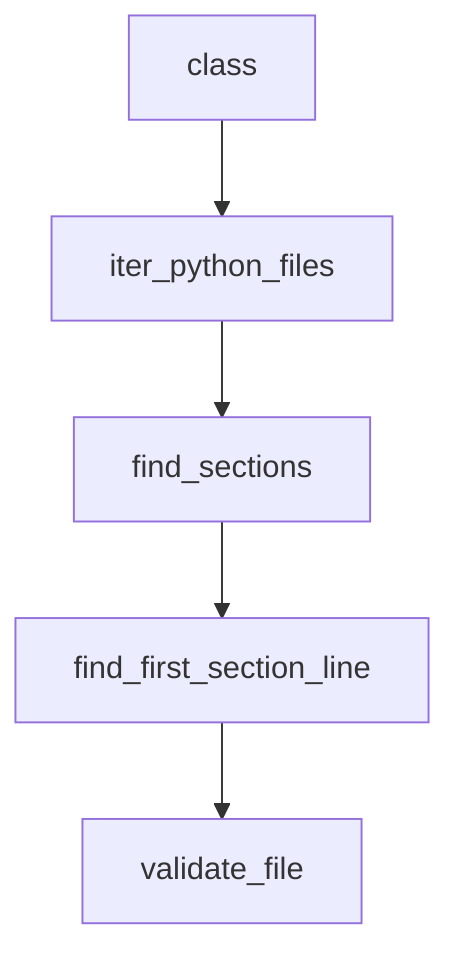

# Chapter 8: Production Deployment

Welcome to **Chapter 8: Production Deployment**. In this part of **Agno Tutorial: Multi-Agent Systems That Learn Over Time**, you will build an intuitive mental model first, then move into concrete implementation details and practical production tradeoffs.


This chapter establishes the baseline for scaling Agno systems safely in production.

## Deployment Checklist

- environment-separated credentials and policy configs
- model/provider fallback and outage plans
- runtime scaling and queue/backpressure controls
- eval and guardrail gates in release pipeline

## Metrics to Track

| Area | Metrics |
|:-----|:--------|
| quality | task success rate, correction loop rate |
| reliability | timeout and failure rate |
| safety | blocked actions, policy violations |
| cost | spend per successful completion |

## Source References

- [Agno Production Overview](https://docs.agno.com/production/overview)
- [Agno Releases](https://github.com/agno-agi/agno/releases)

## Summary

You now have a production runbook baseline for operating Agno multi-agent systems.

## Depth Expansion Playbook

## Source Code Walkthrough

### `cookbook/scripts/check_cookbook_pattern.py`

The `class` class in [`cookbook/scripts/check_cookbook_pattern.py`](https://github.com/agno-agi/agno/blob/HEAD/cookbook/scripts/check_cookbook_pattern.py) handles a key part of this chapter's functionality:

```py
import json
import re
from dataclasses import asdict, dataclass
from pathlib import Path

EMOJI_RE = re.compile(r"[\U0001F300-\U0001FAFF]")
MAIN_GATE_RE = re.compile(r'if __name__ == ["\']__main__["\']:')
SECTION_RE = re.compile(r"^# [-=]+\n# (?P<title>.+?)\n# [-=]+$", re.MULTILINE)
SKIP_FILE_NAMES = {"__init__.py"}
SKIP_DIR_NAMES = {"__pycache__", ".git", ".context"}


@dataclass
class Violation:
    path: str
    line: int
    code: str
    message: str


def iter_python_files(base_dir: Path, recursive: bool) -> list[Path]:
    pattern = "**/*.py" if recursive else "*.py"
    files: list[Path] = []
    for path in sorted(base_dir.glob(pattern)):
        if not path.is_file():
            continue
        if path.name in SKIP_FILE_NAMES:
            continue
        if any(part in SKIP_DIR_NAMES for part in path.parts):
            continue
        files.append(path)
    return files
```

This class is important because it defines how Agno Tutorial: Multi-Agent Systems That Learn Over Time implements the patterns covered in this chapter.

### `cookbook/scripts/check_cookbook_pattern.py`

The `iter_python_files` function in [`cookbook/scripts/check_cookbook_pattern.py`](https://github.com/agno-agi/agno/blob/HEAD/cookbook/scripts/check_cookbook_pattern.py) handles a key part of this chapter's functionality:

```py


def iter_python_files(base_dir: Path, recursive: bool) -> list[Path]:
    pattern = "**/*.py" if recursive else "*.py"
    files: list[Path] = []
    for path in sorted(base_dir.glob(pattern)):
        if not path.is_file():
            continue
        if path.name in SKIP_FILE_NAMES:
            continue
        if any(part in SKIP_DIR_NAMES for part in path.parts):
            continue
        files.append(path)
    return files


def find_sections(text: str) -> list[tuple[str, int]]:
    sections: list[tuple[str, int]] = []
    for match in SECTION_RE.finditer(text):
        title = match.group("title").strip()
        # 1-based line number of the section title line
        line = text[: match.start()].count("\n") + 2
        sections.append((title, line))
    return sections


def find_first_section_line(
    sections: list[tuple[str, int]], keyword: str
) -> int | None:
    needle = re.compile(rf"\b{re.escape(keyword)}\b", re.IGNORECASE)
    for title, line in sections:
        if needle.search(title):
```

This function is important because it defines how Agno Tutorial: Multi-Agent Systems That Learn Over Time implements the patterns covered in this chapter.

### `cookbook/scripts/check_cookbook_pattern.py`

The `find_sections` function in [`cookbook/scripts/check_cookbook_pattern.py`](https://github.com/agno-agi/agno/blob/HEAD/cookbook/scripts/check_cookbook_pattern.py) handles a key part of this chapter's functionality:

```py


def find_sections(text: str) -> list[tuple[str, int]]:
    sections: list[tuple[str, int]] = []
    for match in SECTION_RE.finditer(text):
        title = match.group("title").strip()
        # 1-based line number of the section title line
        line = text[: match.start()].count("\n") + 2
        sections.append((title, line))
    return sections


def find_first_section_line(
    sections: list[tuple[str, int]], keyword: str
) -> int | None:
    needle = re.compile(rf"\b{re.escape(keyword)}\b", re.IGNORECASE)
    for title, line in sections:
        if needle.search(title):
            return line
    return None


def validate_file(path: Path) -> list[Violation]:
    violations: list[Violation] = []
    text = path.read_text(encoding="utf-8")

    try:
        tree = ast.parse(text)
    except SyntaxError as exc:
        violations.append(
            Violation(
                path=path.as_posix(),
```

This function is important because it defines how Agno Tutorial: Multi-Agent Systems That Learn Over Time implements the patterns covered in this chapter.

### `cookbook/scripts/check_cookbook_pattern.py`

The `find_first_section_line` function in [`cookbook/scripts/check_cookbook_pattern.py`](https://github.com/agno-agi/agno/blob/HEAD/cookbook/scripts/check_cookbook_pattern.py) handles a key part of this chapter's functionality:

```py


def find_first_section_line(
    sections: list[tuple[str, int]], keyword: str
) -> int | None:
    needle = re.compile(rf"\b{re.escape(keyword)}\b", re.IGNORECASE)
    for title, line in sections:
        if needle.search(title):
            return line
    return None


def validate_file(path: Path) -> list[Violation]:
    violations: list[Violation] = []
    text = path.read_text(encoding="utf-8")

    try:
        tree = ast.parse(text)
    except SyntaxError as exc:
        violations.append(
            Violation(
                path=path.as_posix(),
                line=exc.lineno or 1,
                code="syntax_error",
                message=exc.msg,
            )
        )
        return violations

    if not ast.get_docstring(tree, clean=False):
        violations.append(
            Violation(
```

This function is important because it defines how Agno Tutorial: Multi-Agent Systems That Learn Over Time implements the patterns covered in this chapter.


## How These Components Connect


