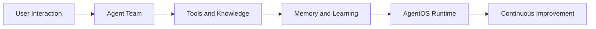

# Agno Tutorial: Multi-Agent Systems That Learn Over Time

> Learn how to build and operate learning multi-agent systems with `agno-agi/agno`, including memory, orchestration, AgentOS runtime, and production guardrails.

## Why This Track Matters

Agno is one of the most prominent frameworks focused on multi-agent systems that improve over time through persistent memory and feedback loops.

This track focuses on:

- learning-enabled agent architecture
- multi-agent orchestration and runtime controls
- knowledge, tools, and guardrail design
- production operations through AgentOS and eval-driven iteration

## Current Snapshot (auto-updated)

- repository: [`agno-agi/agno`](https://github.com/agno-agi/agno)
- stars: about **37.8k**
- latest release: [`v2.4.8`](https://github.com/agno-agi/agno/releases/tag/v2.4.8)
- development activity: active with frequent updates
- project positioning: multi-agent framework with learning, memory, and production runtime support

## Mental Model

## Chapter Guide

| Chapter | Key Question | Outcome |
|:--------|:-------------|:--------|
| [01 - Getting Started](01-getting-started.md) | How do I run first Agno agents quickly? | Working baseline |
| [02 - Framework Architecture](02-framework-architecture.md) | How are agents, runtime, and storage layers structured? | Strong architecture model |
| [03 - Learning, Memory, and State](03-learning-memory-and-state.md) | How does Agno persist and improve agent behavior? | Durable memory strategy |
| [04 - Multi-Agent Orchestration](04-multi-agent-orchestration.md) | How do specialized agents collaborate safely? | Team orchestration patterns |
| [05 - Knowledge, RAG, and Tools](05-knowledge-rag-and-tools.md) | How do agents use knowledge and external systems? | Reliable augmentation model |
| [06 - AgentOS Runtime and Control Plane](06-agentos-runtime-and-control-plane.md) | How do I run and manage Agno in production? | Runtime operations baseline |
| [07 - Guardrails, Evals, and Observability](07-guardrails-evals-and-observability.md) | How do I enforce safety and measure quality? | Governance and quality loop |
| [08 - Production Deployment](08-production-deployment.md) | How do I scale Agno systems reliably? | Deployment runbook baseline |

## What You Will Learn

- how to design multi-agent systems that improve with persistent learning
- how to orchestrate specialists with shared memory and tool boundaries
- how to deploy and operate Agno with AgentOS patterns
- how to apply guardrails and eval loops for production reliability

## Source References

- [Agno Repository](https://github.com/agno-agi/agno)
- [Agno Releases](https://github.com/agno-agi/agno/releases)
- [Agno Docs](https://docs.agno.com)
- [AgentOS Introduction](https://docs.agno.com/agent-os/introduction)

## Related Tutorials

- [LangGraph Tutorial](../langgraph-tutorial/)
- [CrewAI Tutorial](../crewai-tutorial/)
- [Letta Tutorial](../letta-tutorial/)
- [OpenHands Tutorial](../openhands-tutorial/)

---

Start with [Chapter 1: Getting Started](01-getting-started.md).

## Navigation & Backlinks

- [Start Here: Chapter 1: Getting Started](01-getting-started.md)
- [Back to Main Catalog](../../README.md#-tutorial-catalog)
- [Browse A-Z Tutorial Directory](../../discoverability/tutorial-directory.md)
- [Search by Intent](../../discoverability/query-hub.md)
- [Explore Category Hubs](../../README.md#category-hubs)

## Full Chapter Map

1. [Chapter 1: Getting Started](01-getting-started.md)
2. [Chapter 2: Framework Architecture](02-framework-architecture.md)
3. [Chapter 3: Learning, Memory, and State](03-learning-memory-and-state.md)
4. [Chapter 4: Multi-Agent Orchestration](04-multi-agent-orchestration.md)
5. [Chapter 5: Knowledge, RAG, and Tools](05-knowledge-rag-and-tools.md)
6. [Chapter 6: AgentOS Runtime and Control Plane](06-agentos-runtime-and-control-plane.md)
7. [Chapter 7: Guardrails, Evals, and Observability](07-guardrails-evals-and-observability.md)
8. [Chapter 8: Production Deployment](08-production-deployment.md)

*Generated by [AI Codebase Knowledge Builder](https://github.com/The-Pocket/Tutorial-Codebase-Knowledge)*
