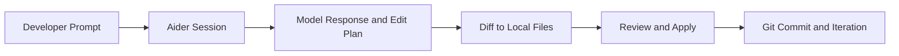

# Aider Tutorial: AI Pair Programming in Your Terminal

> Learn to use `Aider-AI/aider` for real file edits, git-native workflows, model routing, and reliable day-to-day coding loops.

## Why This Track Matters

Aider is one of the most widely used terminal-first coding agents. It is powerful because it edits real files in real repositories, but that means workflow discipline matters.

This track focuses on:

- precise prompting for deterministic edits
- safe multi-file and git-aware workflows
- model configuration for quality/cost tradeoffs
- practical habits that reduce rework and regressions

## Current Snapshot (auto-updated)

- repository: [`Aider-AI/aider`](https://github.com/Aider-AI/aider)
- stars: about **40.5k**
- latest release: [`v0.86.0`](https://github.com/Aider-AI/aider/releases/tag/v0.86.0)
- package name in source: `aider-chat`
- Python requirement in source: `>=3.10,<3.13`

## Mental Model

## Chapter Guide

| Chapter | Key Question | Outcome |
|:--------|:-------------|:--------|
| [01 - Getting Started](01-getting-started.md) | How do I install and start safely? | Working baseline session |
| [02 - Basic Editing](02-basic-editing.md) | How do I perform reliable file edits? | Core edit loop mastery |
| [03 - Multi-File Projects](03-multi-file.md) | How do I coordinate larger changes? | Multi-file context discipline |
| [04 - Git Integration](04-git.md) | How should Aider fit into version control? | Git-native review and rollback patterns |
| [05 - Advanced Prompting](05-prompting.md) | How do I improve AI output quality? | High-signal prompt strategies |
| [06 - Model Configuration](06-models.md) | How do I tune model selection? | Better quality/cost control |
| [07 - Voice and Workflows](07-workflows.md) | How do I automate repetitive interactions? | Productivity-focused workflows |
| [08 - Best Practices](08-best-practices.md) | How do I sustain quality at scale? | Team-ready operating patterns |

## What You Will Learn

- how to use Aider as a practical coding copilot in real repositories
- how to manage file scope, diffs, and git commits safely
- how to choose and configure models for different engineering tasks
- how to build repeatable workflows for solo and team usage

## Source References

- [Aider Repository](https://github.com/Aider-AI/aider)
- [Aider Releases](https://github.com/Aider-AI/aider/releases)
- [Aider Docs](https://aider.chat/)

## Related Tutorials

- [Cline Tutorial](../cline-tutorial/)
- [Roo Code Tutorial](../roo-code-tutorial/)
- [Continue Tutorial](../continue-tutorial/)
- [Codex Analysis Platform](../codex-analysis-platform/)

---

Start with [Chapter 1: Getting Started](01-getting-started.md).

## Navigation & Backlinks

- [Start Here: Chapter 1: Getting Started with Aider](01-getting-started.md)
- [Back to Main Catalog](../../README.md#-tutorial-catalog)
- [Browse A-Z Tutorial Directory](../../discoverability/tutorial-directory.md)
- [Search by Intent](../../discoverability/query-hub.md)
- [Explore Category Hubs](../../README.md#category-hubs)

## Full Chapter Map

1. [Chapter 1: Getting Started with Aider](01-getting-started.md)
2. [Chapter 2: Basic Editing Operations](02-basic-editing.md)
3. [Chapter 3: Multi-File Projects](03-multi-file.md)
4. [Chapter 4: Git Integration](04-git.md)
5. [Chapter 5: Advanced Prompting](05-prompting.md)
6. [Chapter 6: Model Configuration](06-models.md)
7. [Chapter 7: Voice & Workflows](07-workflows.md)
8. [Chapter 8: Best Practices](08-best-practices.md)

*Generated by [AI Codebase Knowledge Builder](https://github.com/The-Pocket/Tutorial-Codebase-Knowledge)*
