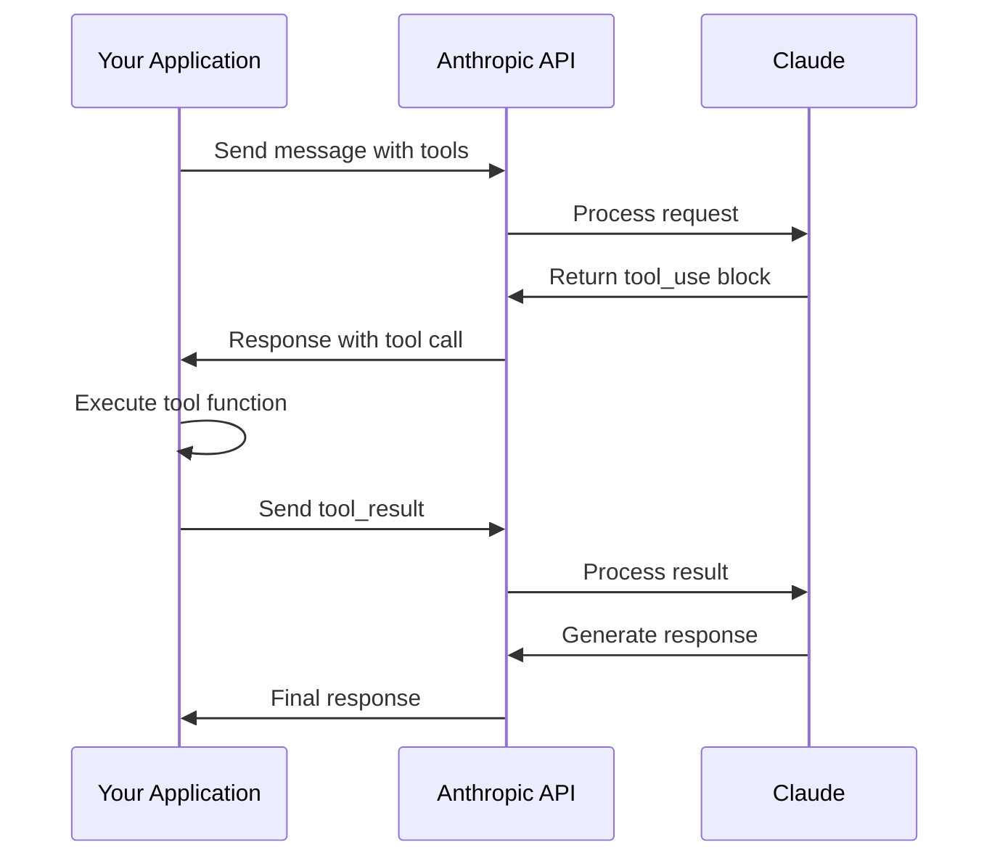

# Chapter 3: Tool Use

> Enable Claude to call functions, interact with external systems, and perform actions in the real world through the Tool Use API.

## Overview

Tool Use (also called function calling) allows Claude to request execution of functions you define. This enables Claude to access real-time data, perform calculations, interact with databases, call APIs, and more. You define tools, Claude decides when and how to use them, and you execute the actual function calls.

## How Tool Use Works



## Defining Tools

### Basic Tool Definition

```python
import anthropic

client = anthropic.Anthropic()

# Define a simple tool
tools = [
    {
        "name": "get_weather",
        "description": "Get the current weather for a location",
        "input_schema": {
            "type": "object",
            "properties": {
                "location": {
                    "type": "string",
                    "description": "The city and country, e.g., 'London, UK'"
                },
                "unit": {
                    "type": "string",
                    "enum": ["celsius", "fahrenheit"],
                    "description": "Temperature unit"
                }
            },
            "required": ["location"]
        }
    }
]

message = client.messages.create(
    model="claude-sonnet-4-20250514",
    max_tokens=1024,
    tools=tools,
    messages=[
        {"role": "user", "content": "What's the weather in Paris?"}
    ]
)
```

### Tool Input Schema

```python
# Comprehensive schema example
calculator_tool = {
    "name": "calculator",
    "description": "Perform mathematical calculations. Supports basic arithmetic, percentages, and common functions.",
    "input_schema": {
        "type": "object",
        "properties": {
            "operation": {
                "type": "string",
                "enum": ["add", "subtract", "multiply", "divide", "power", "sqrt", "percentage"],
                "description": "The mathematical operation to perform"
            },
            "operands": {
                "type": "array",
                "items": {"type": "number"},
                "minItems": 1,
                "maxItems": 2,
                "description": "Numbers to operate on (1-2 numbers depending on operation)"
            },
            "precision": {
                "type": "integer",
                "minimum": 0,
                "maximum": 10,
                "default": 2,
                "description": "Decimal places in the result"
            }
        },
        "required": ["operation", "operands"]
    }
}

# Complex nested schema
database_query_tool = {
    "name": "query_database",
    "description": "Execute a database query to retrieve information",
    "input_schema": {
        "type": "object",
        "properties": {
            "table": {
                "type": "string",
                "enum": ["users", "orders", "products"],
                "description": "The database table to query"
            },
            "filters": {
                "type": "array",
                "items": {
                    "type": "object",
                    "properties": {
                        "field": {"type": "string"},
                        "operator": {
                            "type": "string",
                            "enum": ["=", "!=", ">", "<", ">=", "<=", "LIKE"]
                        },
                        "value": {
                            "oneOf": [
                                {"type": "string"},
                                {"type": "number"},
                                {"type": "boolean"}
                            ]
                        }
                    },
                    "required": ["field", "operator", "value"]
                },
                "description": "Filter conditions for the query"
            },
            "limit": {
                "type": "integer",
                "minimum": 1,
                "maximum": 100,
                "default": 10
            },
            "order_by": {
                "type": "object",
                "properties": {
                    "field": {"type": "string"},
                    "direction": {
                        "type": "string",
                        "enum": ["ASC", "DESC"]
                    }
                }
            }
        },
        "required": ["table"]
    }
}
```

## Handling Tool Calls

### Basic Tool Call Handling

```python
import anthropic
import json

client = anthropic.Anthropic()

# Define tools
tools = [
    {
        "name": "get_stock_price",
        "description": "Get the current stock price for a ticker symbol",
        "input_schema": {
            "type": "object",
            "properties": {
                "ticker": {
                    "type": "string",
                    "description": "Stock ticker symbol (e.g., AAPL, GOOGL)"
                }
            },
            "required": ["ticker"]
        }
    }
]

# Implement the actual tool function
def get_stock_price(ticker: str) -> dict:
    """Fetch stock price (mock implementation)."""
    # In production, call a real stock API
    mock_prices = {"AAPL": 178.50, "GOOGL": 142.30, "MSFT": 378.90}
    price = mock_prices.get(ticker.upper(), None)
    if price:
        return {"ticker": ticker.upper(), "price": price, "currency": "USD"}
    return {"error": f"Unknown ticker: {ticker}"}

# Make the request
message = client.messages.create(
    model="claude-sonnet-4-20250514",
    max_tokens=1024,
    tools=tools,
    messages=[
        {"role": "user", "content": "What's Apple's stock price?"}
    ]
)

# Check if Claude wants to use a tool
if message.stop_reason == "tool_use":
    for block in message.content:
        if block.type == "tool_use":
            # Execute the tool
            if block.name == "get_stock_price":
                result = get_stock_price(block.input["ticker"])

            # Continue conversation with tool result
            final_message = client.messages.create(
                model="claude-sonnet-4-20250514",
                max_tokens=1024,
                tools=tools,
                messages=[
                    {"role": "user", "content": "What's Apple's stock price?"},
                    {"role": "assistant", "content": message.content},
                    {
                        "role": "user",
                        "content": [
                            {
                                "type": "tool_result",
                                "tool_use_id": block.id,
                                "content": json.dumps(result)
                            }
                        ]
                    }
                ]
            )

            print(final_message.content[0].text)
```

### Tool Execution Loop

```python
def run_tool_loop(client, tools, messages, tool_functions, max_iterations=10):
    """Run a complete tool use loop until Claude stops using tools."""

    for _ in range(max_iterations):
        response = client.messages.create(
            model="claude-sonnet-4-20250514",
            max_tokens=4096,
            tools=tools,
            messages=messages
        )

        # Check if Claude wants to use tools
        if response.stop_reason != "tool_use":
            # No more tool calls, return final response
            return response

        # Process tool calls
        tool_results = []
        for block in response.content:
            if block.type == "tool_use":
                # Get the function to execute
                func = tool_functions.get(block.name)
                if func:
                    try:
                        result = func(**block.input)
                        tool_results.append({
                            "type": "tool_result",
                            "tool_use_id": block.id,
                            "content": json.dumps(result)
                        })
                    except Exception as e:
                        tool_results.append({
                            "type": "tool_result",
                            "tool_use_id": block.id,
                            "content": json.dumps({"error": str(e)}),
                            "is_error": True
                        })
                else:
                    tool_results.append({
                        "type": "tool_result",
                        "tool_use_id": block.id,
                        "content": json.dumps({"error": f"Unknown tool: {block.name}"}),
                        "is_error": True
                    })

        # Add assistant response and tool results to messages
        messages.append({"role": "assistant", "content": response.content})
        messages.append({"role": "user", "content": tool_results})

    raise Exception("Max iterations reached")

# Usage
tools = [
    {"name": "add", "description": "Add two numbers", "input_schema": {...}},
    {"name": "multiply", "description": "Multiply two numbers", "input_schema": {...}}
]

tool_functions = {
    "add": lambda a, b: {"result": a + b},
    "multiply": lambda a, b: {"result": a * b}
}

response = run_tool_loop(
    client,
    tools,
    [{"role": "user", "content": "What's (5 + 3) * 2?"}],
    tool_functions
)
```

## Multiple Tools

### Defining Multiple Tools

```python
tools = [
    {
        "name": "search_web",
        "description": "Search the web for information",
        "input_schema": {
            "type": "object",
            "properties": {
                "query": {"type": "string", "description": "Search query"}
            },
            "required": ["query"]
        }
    },
    {
        "name": "get_weather",
        "description": "Get current weather for a location",
        "input_schema": {
            "type": "object",
            "properties": {
                "location": {"type": "string"},
                "unit": {"type": "string", "enum": ["celsius", "fahrenheit"]}
            },
            "required": ["location"]
        }
    },
    {
        "name": "send_email",
        "description": "Send an email message",
        "input_schema": {
            "type": "object",
            "properties": {
                "to": {"type": "string", "format": "email"},
                "subject": {"type": "string"},
                "body": {"type": "string"}
            },
            "required": ["to", "subject", "body"]
        }
    },
    {
        "name": "create_calendar_event",
        "description": "Create a calendar event",
        "input_schema": {
            "type": "object",
            "properties": {
                "title": {"type": "string"},
                "start_time": {"type": "string", "format": "date-time"},
                "end_time": {"type": "string", "format": "date-time"},
                "attendees": {
                    "type": "array",
                    "items": {"type": "string", "format": "email"}
                }
            },
            "required": ["title", "start_time", "end_time"]
        }
    }
]
```

### Parallel Tool Calls

```python
# Claude may call multiple tools in parallel
message = client.messages.create(
    model="claude-sonnet-4-20250514",
    max_tokens=1024,
    tools=tools,
    messages=[
        {
            "role": "user",
            "content": "What's the weather in London and Paris right now?"
        }
    ]
)

# Handle multiple tool calls
if message.stop_reason == "tool_use":
    tool_calls = [b for b in message.content if b.type == "tool_use"]
    print(f"Claude wants to call {len(tool_calls)} tools")

    # Execute all tools (can be done in parallel)
    import asyncio

    async def execute_tools_parallel(tool_calls):
        tasks = []
        for call in tool_calls:
            task = execute_tool_async(call.name, call.input)
            tasks.append((call.id, task))

        results = []
        for tool_id, task in tasks:
            result = await task
            results.append({
                "type": "tool_result",
                "tool_use_id": tool_id,
                "content": json.dumps(result)
            })
        return results

    # Or execute sequentially
    results = []
    for call in tool_calls:
        result = execute_tool(call.name, call.input)
        results.append({
            "type": "tool_result",
            "tool_use_id": call.id,
            "content": json.dumps(result)
        })
```

## Tool Choice

### Controlling Tool Selection

```python
# Let Claude decide (default)
message = client.messages.create(
    model="claude-sonnet-4-20250514",
    max_tokens=1024,
    tools=tools,
    tool_choice={"type": "auto"},  # Default behavior
    messages=[{"role": "user", "content": "Hello!"}]
)

# Force Claude to use a tool
message = client.messages.create(
    model="claude-sonnet-4-20250514",
    max_tokens=1024,
    tools=tools,
    tool_choice={"type": "any"},  # Must use at least one tool
    messages=[{"role": "user", "content": "What's 2+2?"}]
)

# Force a specific tool
message = client.messages.create(
    model="claude-sonnet-4-20250514",
    max_tokens=1024,
    tools=tools,
    tool_choice={"type": "tool", "name": "calculator"},  # Must use calculator
    messages=[{"role": "user", "content": "What's 2+2?"}]
)

# Prevent tool use
message = client.messages.create(
    model="claude-sonnet-4-20250514",
    max_tokens=1024,
    tools=tools,
    tool_choice={"type": "none"},  # Don't use any tools
    messages=[{"role": "user", "content": "What's 2+2?"}]
)
```

## Real-World Examples

### Web Search Tool

```python
import requests

def create_search_tool():
    """Create a web search tool."""

    tool_def = {
        "name": "web_search",
        "description": "Search the web for current information. Use for recent events, facts, or topics that may have changed since training.",
        "input_schema": {
            "type": "object",
            "properties": {
                "query": {
                    "type": "string",
                    "description": "The search query"
                },
                "num_results": {
                    "type": "integer",
                    "minimum": 1,
                    "maximum": 10,
                    "default": 5
                }
            },
            "required": ["query"]
        }
    }

    def execute(query: str, num_results: int = 5) -> dict:
        # Using a search API (e.g., SerpAPI, Brave, etc.)
        # This is a mock implementation
        return {
            "query": query,
            "results": [
                {
                    "title": "Example Result 1",
                    "url": "https://example.com/1",
                    "snippet": "This is a search result..."
                }
            ]
        }

    return tool_def, execute
```

### Database Query Tool

```python
import sqlite3

def create_database_tool(db_path: str):
    """Create a safe database query tool."""

    tool_def = {
        "name": "query_database",
        "description": "Query the database for information. Only SELECT queries are allowed.",
        "input_schema": {
            "type": "object",
            "properties": {
                "query": {
                    "type": "string",
                    "description": "SQL SELECT query"
                }
            },
            "required": ["query"]
        }
    }

    def execute(query: str) -> dict:
        # Security: Only allow SELECT statements
        normalized = query.strip().upper()
        if not normalized.startswith("SELECT"):
            return {"error": "Only SELECT queries are allowed"}

        # Additional security checks
        dangerous = ["DROP", "DELETE", "UPDATE", "INSERT", "ALTER", "CREATE", ";"]
        if any(kw in normalized for kw in dangerous):
            return {"error": "Query contains disallowed keywords"}

        try:
            conn = sqlite3.connect(db_path)
            cursor = conn.cursor()
            cursor.execute(query)
            columns = [desc[0] for desc in cursor.description]
            rows = cursor.fetchall()
            conn.close()

            return {
                "columns": columns,
                "rows": rows[:100],  # Limit results
                "total_rows": len(rows)
            }
        except Exception as e:
            return {"error": str(e)}

    return tool_def, execute
```

### Code Execution Tool

```python
import subprocess
import tempfile
import os

def create_python_executor():
    """Create a sandboxed Python code execution tool."""

    tool_def = {
        "name": "execute_python",
        "description": "Execute Python code and return the output. Use for calculations, data processing, or generating results.",
        "input_schema": {
            "type": "object",
            "properties": {
                "code": {
                    "type": "string",
                    "description": "Python code to execute"
                },
                "timeout": {
                    "type": "integer",
                    "minimum": 1,
                    "maximum": 30,
                    "default": 10,
                    "description": "Execution timeout in seconds"
                }
            },
            "required": ["code"]
        }
    }

    def execute(code: str, timeout: int = 10) -> dict:
        # Security checks
        dangerous = ["import os", "import subprocess", "open(", "exec(", "eval("]
        if any(d in code for d in dangerous):
            return {"error": "Code contains disallowed operations"}

        # Write code to temp file
        with tempfile.NamedTemporaryFile(mode='w', suffix='.py', delete=False) as f:
            f.write(code)
            temp_path = f.name

        try:
            # Execute in subprocess with timeout
            result = subprocess.run(
                ['python', temp_path],
                capture_output=True,
                text=True,
                timeout=timeout
            )

            return {
                "stdout": result.stdout,
                "stderr": result.stderr,
                "return_code": result.returncode
            }
        except subprocess.TimeoutExpired:
            return {"error": f"Execution timed out after {timeout}s"}
        except Exception as e:
            return {"error": str(e)}
        finally:
            os.unlink(temp_path)

    return tool_def, execute
```

### API Integration Tool

```python
import requests

def create_api_tool(base_url: str, api_key: str):
    """Create a tool for calling external APIs."""

    tool_def = {
        "name": "call_api",
        "description": f"Make API calls to {base_url}",
        "input_schema": {
            "type": "object",
            "properties": {
                "endpoint": {
                    "type": "string",
                    "description": "API endpoint path"
                },
                "method": {
                    "type": "string",
                    "enum": ["GET", "POST"],
                    "default": "GET"
                },
                "params": {
                    "type": "object",
                    "description": "Query parameters"
                },
                "body": {
                    "type": "object",
                    "description": "Request body for POST"
                }
            },
            "required": ["endpoint"]
        }
    }

    def execute(endpoint: str, method: str = "GET",
                params: dict = None, body: dict = None) -> dict:
        url = f"{base_url.rstrip('/')}/{endpoint.lstrip('/')}"
        headers = {"Authorization": f"Bearer {api_key}"}

        try:
            if method == "GET":
                response = requests.get(url, params=params, headers=headers, timeout=30)
            else:
                response = requests.post(url, params=params, json=body, headers=headers, timeout=30)

            return {
                "status_code": response.status_code,
                "data": response.json() if response.headers.get('content-type', '').startswith('application/json') else response.text
            }
        except requests.Timeout:
            return {"error": "Request timed out"}
        except Exception as e:
            return {"error": str(e)}

    return tool_def, execute
```

## Error Handling

### Tool Result Errors

```python
# Return error results to Claude
tool_result = {
    "type": "tool_result",
    "tool_use_id": tool_call.id,
    "content": json.dumps({"error": "Database connection failed"}),
    "is_error": True  # Indicates this is an error
}

# Claude will acknowledge the error and may try a different approach
```

### Validation Errors

```python
from jsonschema import validate, ValidationError

def validate_tool_input(tool_def: dict, input_data: dict) -> tuple[bool, str]:
    """Validate tool input against schema."""

    try:
        validate(instance=input_data, schema=tool_def["input_schema"])
        return True, ""
    except ValidationError as e:
        return False, str(e.message)

# In tool execution
def execute_with_validation(tool_def, tool_func, input_data):
    valid, error = validate_tool_input(tool_def, input_data)
    if not valid:
        return {"error": f"Invalid input: {error}"}
    return tool_func(**input_data)
```

## Best Practices

### Tool Design Principles

```python
# 1. Clear, descriptive names
# Good: "search_product_catalog"
# Bad: "search" or "do_thing"

# 2. Detailed descriptions
tool = {
    "name": "send_notification",
    "description": """Send a push notification to a user.
    Use this when the user explicitly asks to be notified or
    when an important event occurs that requires their attention.
    Do not use for routine updates.""",
    ...
}

# 3. Comprehensive input schemas with descriptions
"input_schema": {
    "type": "object",
    "properties": {
        "user_id": {
            "type": "string",
            "description": "The unique identifier of the user (UUID format)"
        },
        "message": {
            "type": "string",
            "maxLength": 280,
            "description": "Notification message (max 280 characters)"
        },
        "priority": {
            "type": "string",
            "enum": ["low", "normal", "high", "urgent"],
            "default": "normal",
            "description": "Notification priority level"
        }
    },
    "required": ["user_id", "message"]
}

# 4. Return structured, useful data
def good_tool_response():
    return {
        "success": True,
        "data": {...},
        "metadata": {
            "execution_time_ms": 150,
            "cache_hit": False
        }
    }
```

### Security Considerations

```python
# 1. Validate all inputs
# 2. Sanitize data before use
# 3. Use allowlists, not blocklists
# 4. Limit tool capabilities
# 5. Log all tool executions
# 6. Implement rate limiting
# 7. Use timeouts

class SecureToolExecutor:
    def __init__(self):
        self.execution_log = []
        self.rate_limiter = RateLimiter(max_calls=100, period=60)

    def execute(self, tool_name: str, input_data: dict) -> dict:
        # Rate limiting
        if not self.rate_limiter.allow():
            return {"error": "Rate limit exceeded"}

        # Input validation
        if not self.validate_input(tool_name, input_data):
            return {"error": "Invalid input"}

        # Logging
        self.log_execution(tool_name, input_data)

        # Execute with timeout
        try:
            result = self.execute_with_timeout(tool_name, input_data, timeout=30)
            return result
        except TimeoutError:
            return {"error": "Execution timed out"}
```

## Summary

In this chapter, you've learned:

- **Tool Definition**: Creating tools with JSON Schema input validation
- **Tool Execution**: Handling tool calls and returning results
- **Multiple Tools**: Working with several tools and parallel calls
- **Tool Choice**: Controlling when and which tools Claude uses
- **Real-World Examples**: Building practical tools for common use cases
- **Error Handling**: Managing tool failures gracefully
- **Best Practices**: Designing secure, effective tools

## Key Takeaways

1. **Define Clear Schemas**: Good input schemas help Claude use tools correctly
2. **Handle All Cases**: Implement error handling for tool failures
3. **Loop Until Done**: Use a tool execution loop for multi-step tasks
4. **Secure by Default**: Validate inputs and limit tool capabilities
5. **Return Useful Data**: Structured results help Claude provide better responses

## Next Steps

Now that you can extend Claude's capabilities with tools, let's explore Vision in Chapter 4, where Claude can analyze and understand images.

---

**Ready for Chapter 4?** [Vision](04-vision.md)

*Generated for [Awesome Code Docs](https://github.com/johnxie/awesome-code-docs)*
