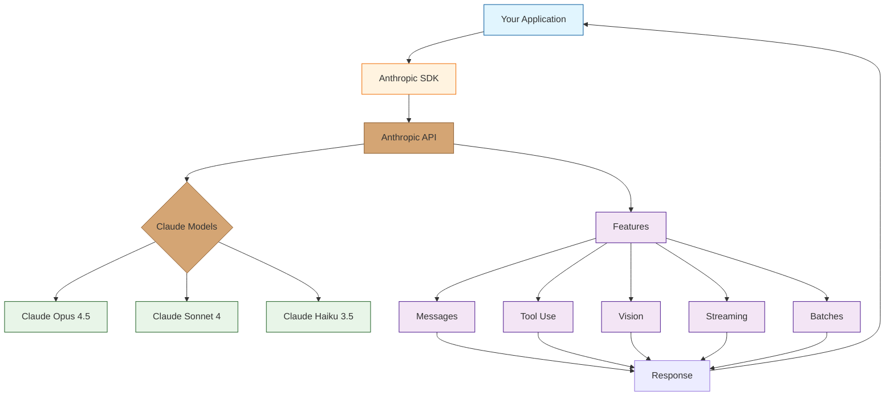

# Anthropic API Tutorial: Building with Claude's API

> Master the Anthropic API and SDKs to build powerful AI applications with Claude.

<div align="center">

**Build Production AI Applications with Claude**

</div>

---

## What is the Anthropic API?

The **Anthropic API** provides programmatic access to Claude, Anthropic's family of AI assistants. It enables developers to integrate Claude's capabilities into applications, build conversational interfaces, create AI agents, and leverage advanced features like tool use, vision, and streaming.

### Key Features

| Feature | Description |
|:--------|:------------|
| **Messages API** | Core API for conversations with Claude |
| **Tool Use** | Let Claude call functions and interact with external systems |
| **Vision** | Process and analyze images with Claude |
| **Streaming** | Real-time token-by-token responses |
| **Embeddings** | Generate text embeddings for semantic search |
| **Batches** | Process large volumes efficiently |
| **Prompt Caching** | Reduce costs with cached system prompts |



## Tutorial Chapters

1. **[Chapter 1: Getting Started](01-getting-started.md)** - API setup, authentication, and first API call
2. **[Chapter 2: Messages API](02-messages-api.md)** - Core conversation API and message handling
3. **[Chapter 3: Tool Use](03-tool-use.md)** - Function calling and external integrations
4. **[Chapter 4: Vision](04-vision.md)** - Image processing and multimodal inputs
5. **[Chapter 5: Streaming](05-streaming.md)** - Real-time responses and server-sent events
6. **[Chapter 6: Advanced Patterns](06-advanced-patterns.md)** - Prompt engineering and optimization
7. **[Chapter 7: Production Best Practices](07-production.md)** - Rate limiting, error handling, and scaling
8. **[Chapter 8: Enterprise Integration](08-enterprise.md)** - Security, compliance, and enterprise features

## What You'll Learn

- **Connect to Claude** via the Anthropic API and SDKs
- **Build Conversations** with the Messages API
- **Enable Tool Use** for function calling and integrations
- **Process Images** with Claude's vision capabilities
- **Stream Responses** for real-time user experiences
- **Optimize Costs** with prompt caching and batching
- **Deploy Safely** with proper error handling and rate limiting
- **Scale Applications** for production workloads

## Prerequisites

- Programming experience (Python, TypeScript, or other languages)
- Anthropic API key from [console.anthropic.com](https://console.anthropic.com/)
- Basic understanding of REST APIs
- Familiarity with async programming (helpful)

## Quick Start

```python
# Install the SDK
pip install anthropic

# Basic usage
import anthropic

client = anthropic.Anthropic()

message = client.messages.create(
    model="claude-sonnet-4-20250514",
    max_tokens=1024,
    messages=[
        {"role": "user", "content": "Hello, Claude!"}
    ]
)

print(message.content[0].text)
```

```typescript
// TypeScript/Node.js
import Anthropic from '@anthropic-ai/sdk';

const client = new Anthropic();

const message = await client.messages.create({
    model: "claude-sonnet-4-20250514",
    max_tokens: 1024,
    messages: [
        { role: "user", content: "Hello, Claude!" }
    ]
});

console.log(message.content[0].text);
```

## Available Models

| Model | Best For | Context | Speed |
|:------|:---------|:--------|:------|
| **Claude Opus 4.5** | Complex reasoning, analysis | 200K | Slower |
| **Claude Sonnet 4** | Balanced performance | 200K | Medium |
| **Claude Haiku 3.5** | Fast, cost-effective tasks | 200K | Fast |

## Key Capabilities

### Conversations
```python
# Multi-turn conversation
messages = [
    {"role": "user", "content": "What's the capital of France?"},
    {"role": "assistant", "content": "Paris is the capital of France."},
    {"role": "user", "content": "What's its population?"}
]
```

### Tool Use
```python
# Define tools for Claude to use
tools = [{
    "name": "get_weather",
    "description": "Get current weather for a location",
    "input_schema": {
        "type": "object",
        "properties": {
            "location": {"type": "string"}
        }
    }
}]
```

### Vision
```python
# Process images
message = client.messages.create(
    model="claude-sonnet-4-20250514",
    messages=[{
        "role": "user",
        "content": [
            {"type": "image", "source": {"type": "url", "url": "https://..."}},
            {"type": "text", "text": "What's in this image?"}
        ]
    }]
)
```

## Learning Path

### Beginner Track
1. Chapters 1-2: Setup and basic Messages API
2. Build simple conversational applications

### Intermediate Track
1. Chapters 3-5: Tool use, vision, and streaming
2. Create interactive AI-powered features

### Advanced Track
1. Chapters 6-8: Optimization, production, and enterprise
2. Deploy scalable AI applications

---

**Ready to build with Claude? Let's begin with [Chapter 1: Getting Started](01-getting-started.md)!**

*Generated for [Awesome Code Docs](https://github.com/johnxie/awesome-code-docs)*
