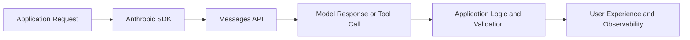

# Anthropic API Tutorial: Build Production Apps with Claude

> A practical guide to building with Anthropic's API and official SDKs, including messages, tools, vision, streaming, and production operations.

## Why This Track Matters

Anthropic's API is now a core building block for many production AI products. Teams need more than basic examples to ship safely.

This track focuses on:

- reliable messages API usage across SDKs
- tool-use patterns for real integrations
- multimodal and streaming UX workflows
- production controls for latency, cost, and reliability

## Current Snapshot (auto-updated)

- Python SDK repo: [`anthropics/anthropic-sdk-python`](https://github.com/anthropics/anthropic-sdk-python)
- Python SDK version in source: `0.79.0` (released as `v0.79.0`)
- TypeScript SDK version in source: `0.74.0` (release tag `sdk-v0.74.0`)
- docs and platform entrypoint: [`docs.anthropic.com`](https://docs.anthropic.com/)
- API capabilities covered here: messages, tools, vision, streaming, batching, and production best practices

## Mental Model

## Chapter Guide

| Chapter | Key Question | Outcome |
|:--------|:-------------|:--------|
| [01 - Getting Started](01-getting-started.md) | How do I authenticate and run first requests? | Working API baseline |
| [02 - Messages API](02-messages-api.md) | How do I structure robust conversations? | Stable message flow patterns |
| [03 - Tool Use](03-tool-use.md) | How do I connect Claude to external systems? | Safe function/tool integrations |
| [04 - Vision](04-vision.md) | How do I handle multimodal inputs? | Image-aware workflows |
| [05 - Streaming](05-streaming.md) | How do I deliver real-time responses? | Streaming UX architecture |
| [06 - Advanced Patterns](06-advanced-patterns.md) | How do I optimize prompts and control behavior? | Higher-quality response strategies |
| [07 - Production Best Practices](07-production.md) | How do I run reliably under load? | Reliability and ops baseline |
| [08 - Enterprise Integration](08-enterprise.md) | How do I align with enterprise constraints? | Security/compliance integration model |

## What You Will Learn

- how to build Claude-powered features using official SDKs
- how to design tool-use and streaming flows for production products
- how to control quality, cost, and reliability in live systems
- how to deploy Anthropic-based workloads with operational discipline

## Source References

- [Anthropic Python SDK](https://github.com/anthropics/anthropic-sdk-python)
- [Anthropic TypeScript SDK](https://github.com/anthropics/anthropic-sdk-typescript)
- [Anthropic Docs](https://docs.anthropic.com/)

## Related Tutorials

- [Claude Code Tutorial](../claude-code-tutorial/)
- [OpenAI Python SDK Tutorial](../openai-python-sdk-tutorial/)
- [LiteLLM Tutorial](../litellm-tutorial/)
- [Langfuse Tutorial](../langfuse-tutorial/)

---

Start with [Chapter 1: Getting Started](01-getting-started.md).

## Navigation & Backlinks

- [Start Here: Chapter 1: Getting Started with the Anthropic API](01-getting-started.md)
- [Back to Main Catalog](../../README.md#-tutorial-catalog)
- [Browse A-Z Tutorial Directory](../../discoverability/tutorial-directory.md)
- [Search by Intent](../../discoverability/query-hub.md)
- [Explore Category Hubs](../../README.md#category-hubs)

## Full Chapter Map

1. [Chapter 1: Getting Started with the Anthropic API](01-getting-started.md)
2. [Chapter 2: Messages API](02-messages-api.md)
3. [Chapter 3: Tool Use](03-tool-use.md)
4. [Chapter 4: Vision](04-vision.md)
5. [Chapter 5: Streaming](05-streaming.md)
6. [Chapter 6: Advanced Patterns](06-advanced-patterns.md)
7. [Chapter 7: Production Best Practices](07-production.md)
8. [Chapter 8: Enterprise Integration](08-enterprise.md)

*Generated by [AI Codebase Knowledge Builder](https://github.com/The-Pocket/Tutorial-Codebase-Knowledge)*
