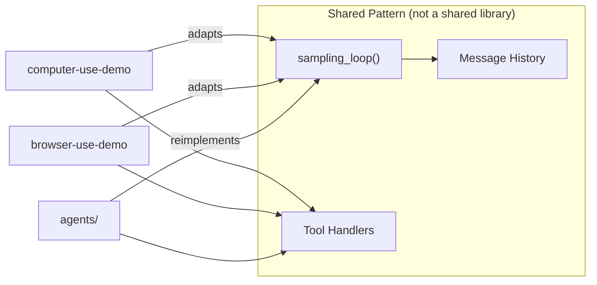

# Chapter 1: Getting Started

## What Problem Does This Solve?

Learning from the Claude API documentation alone leaves a large gap between "I can call `messages.create`" and "I have a working agent that uses tools, manages conversation history, and handles errors gracefully." The `anthropic-quickstarts` repository closes that gap with five runnable reference implementations covering the most important use cases: desktop computer control, autonomous multi-session coding, customer support with knowledge retrieval, conversational financial analysis, and DOM-aware browser automation.

This chapter gives you a mental model for the entire repository and gets you running at least one quickstart in under 15 minutes.

## Repository Structure

```text
anthropic-quickstarts/
├── CLAUDE.md                        # Development standards for contributors
├── pyproject.toml                   # Python tooling config (ruff, pyright, pytest)
├── agents/                          # Reference agent loop — <300 lines, educational
│   ├── agent.py
│   ├── tools/
│   └── utils/
├── autonomous-coding/               # Two-agent pattern: initializer + coding agent
│   ├── autonomous_agent_demo.py
│   ├── prompts/
│   └── requirements.txt
├── browser-use-demo/                # Playwright browser automation + Streamlit UI
│   ├── browser.py
│   ├── loop.py
│   └── streamlit.py
├── computer-use-demo/               # Full desktop control via screenshot + xdotool
│   ├── Dockerfile
│   ├── computer_use_demo/
│   │   ├── loop.py                  # Sampling loop (the core agentic logic)
│   │   ├── streamlit.py             # Web UI
│   │   └── tools/
│   │       ├── base.py              # ToolResult, BaseAnthropicTool
│   │       ├── bash.py              # BashTool with sentinel pattern
│   │       ├── computer.py          # ComputerTool with coordinate scaling
│   │       └── edit.py              # EditTool (str_replace, insert, view)
│   └── setup.sh
├── customer-support-agent/          # Next.js + Amazon Bedrock RAG
│   ├── app/
│   └── package.json
└── financial-data-analyst/          # Next.js + file upload + Recharts
    ├── app/
    └── package.json
```

## Which Quickstart to Run First

| Goal | Start Here |
|:-----|:-----------|
| See Claude control a real computer | `computer-use-demo` |
| Understand the core agentic loop pattern | `agents` |
| Build a chat app with document retrieval | `customer-support-agent` |
| Build a data analysis chat app | `financial-data-analyst` |
| Automate web tasks without pixel coordinates | `browser-use-demo` |
| See how a complex multi-session agent works | `autonomous-coding` |

## Running the Computer Use Demo (Fastest Path)

The computer use demo is the flagship quickstart. It runs entirely in Docker so you do not need to install display server dependencies.

```bash
# 1. Clone the repository
git clone https://github.com/anthropics/anthropic-quickstarts.git
cd anthropic-quickstarts

# 2. Set your API key
export ANTHROPIC_API_KEY=sk-ant-...

# 3. Pull and run the prebuilt image
docker run \
    -e ANTHROPIC_API_KEY=$ANTHROPIC_API_KEY \
    -v $HOME/.anthropic:/home/user/.anthropic \
    -p 8080:8080 \
    -p 8501:8501 \
    -p 6080:6080 \
    -p 5900:5900 \
    ghcr.io/anthropics/anthropic-quickstarts:computer-use-demo-latest
```

Open `http://localhost:8080` in your browser. You will see a Streamlit chat interface on the left and a live VNC view of the Docker desktop on the right.

For local development with live code changes:

```bash
cd computer-use-demo
./setup.sh                          # installs display dependencies
docker build . -t computer-use-demo:local
docker run -e ANTHROPIC_API_KEY=$ANTHROPIC_API_KEY \
    -v $(pwd)/computer_use_demo:/home/user/computer_use_demo \
    -p 8080:8080 -p 8501:8501 -p 6080:6080 -p 5900:5900 \
    computer-use-demo:local
```

## Running the Agents Reference Implementation

The `agents/` quickstart requires no Docker. It demonstrates the fundamental tool-use loop in under 300 lines of Python.

```bash
cd agents
pip install anthropic mcp
export ANTHROPIC_API_KEY=sk-ant-...
python agent.py
```

The agent accepts a query, calls Claude, executes any tool use blocks it receives, feeds results back, and repeats until Claude returns a response with no tool calls.

## Running the Customer Support Agent

```bash
cd customer-support-agent
npm install
cp .env.example .env.local
# Edit .env.local: add ANTHROPIC_API_KEY and optionally AWS credentials
npm run dev
```

Open `http://localhost:3000`. For AWS Bedrock RAG, create a knowledge base in the AWS console, upload documents to S3, and add the knowledge base ID to `ChatArea.tsx`.

## Running the Financial Data Analyst

```bash
cd financial-data-analyst
npm install
echo "ANTHROPIC_API_KEY=sk-ant-..." > .env.local
npm run dev
```

Open `http://localhost:3000`. Upload a CSV, PDF, or image file and ask analytical questions. The app uses Claude to interpret the data and generates Recharts visualizations automatically.

## Development Standards

All Python code in the repository follows these standards (enforced by `pyproject.toml`):

```bash
ruff check .        # lint
ruff format .       # format
pyright             # type-check
pytest              # test
```

Python conventions: `snake_case` for functions and variables, `PascalCase` for classes, `isort` for import ordering, full type annotations, `dataclass` with abstract base classes for tool implementations.

TypeScript conventions: strict mode, functional React components, `shadcn/ui` components, `ESLint` Next.js rules.

## Architecture Decision: Why Five Separate Projects?

The quickstarts are deliberately isolated rather than a monorepo of shared libraries. This is an intentional design choice: each project is self-contained so you can copy just the piece you need without pulling in unrelated dependencies. The tradeoff is some code duplication — the `loop.py` pattern appears in both `computer-use-demo` and `browser-use-demo` with slight variations — but the benefit is that each quickstart is a complete, immediately understandable reference.



## Common First-Run Issues

| Issue | Cause | Fix |
|:------|:------|:----|
| `docker: Cannot connect to Docker daemon` | Docker Desktop not running | Start Docker Desktop |
| `anthropic.AuthenticationError` | Missing or invalid API key | Check `ANTHROPIC_API_KEY` is set in current shell |
| Port 8080 already in use | Another service on that port | Change `-p 8080:8080` to `-p 9080:8080` and open `:9080` |
| Computer use agent acts slowly | Default model is large | Switch to `claude-haiku-4-20250514` in the Streamlit sidebar |
| `npm: command not found` | Node.js not installed | Install Node.js 18+ via `nvm` or `https://nodejs.org` |

## Summary

You now have the repository structure, a clear map of which quickstart serves which purpose, and the commands to run the three most important ones. The next chapter examines the shared architectural patterns that all five quickstarts rely on.

Next: [Chapter 2: Quickstart Architecture](02-skill-categories.md)

---

- [Tutorial Index](README.md)
- [Next Chapter: Chapter 2: Quickstart Architecture](02-skill-categories.md)
- [Main Catalog](../../README.md#-tutorial-catalog)
