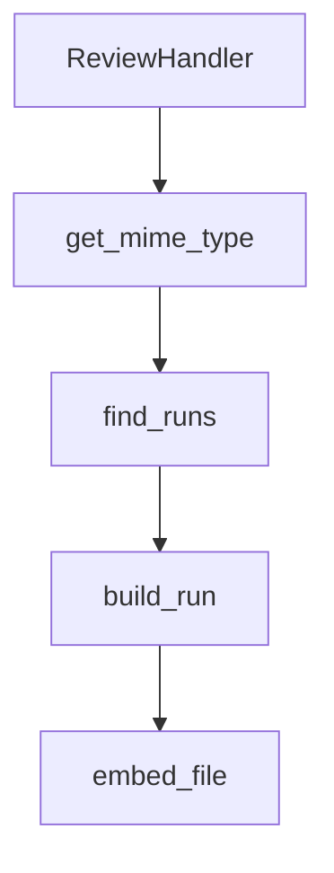

# Chapter 1: Getting Started

Welcome to **Chapter 1: Getting Started**. In this part of **Anthropic Skills Tutorial: Reusable AI Agent Capabilities**, you will build an intuitive mental model first, then move into concrete implementation details and practical production tradeoffs.


This chapter gets you from zero to a functioning skill you can iterate on.

## Skill Anatomy

A minimal skill is one folder plus one file:

```text
my-first-skill/
  SKILL.md
```

`SKILL.md` has two important parts:

1. **Frontmatter** for identity and routing metadata
2. **Instruction body** that defines behavior, constraints, and output expectations

## Minimal Valid `SKILL.md`

```markdown
---
name: incident-summary
description: Summarize incident notes into a concise operations report
---

When given incident notes:
1. Produce a timeline of events.
2. List likely contributing factors.
3. Propose prioritized action items with owners.
```

## First Upgrade: Add Determinism

Most teams should move immediately from free-form instructions to explicit output contracts.

```markdown
## Output Contract
- Return markdown only.
- Include sections: `Timeline`, `Contributing Factors`, `Actions`.
- Each action must include `owner`, `due_date`, and `risk_if_missed`.
```

This single addition usually reduces variance more than model-level tuning.

## Add Supporting Files

As tasks become operational, move from one-file skills to structured packages:

```text
incident-skill/
  SKILL.md
  templates/
    postmortem.md
  scripts/
    normalize_incident_json.py
  references/
    severity-matrix.md
```

Use this rule:

- Put **policy and behavior** in `SKILL.md`
- Put **deterministic transforms** in `scripts/`
- Put **stable source context** in `references/`

## Local Iteration Loop

1. Run the skill against 5 to 10 representative prompts.
2. Save outputs as golden snapshots.
3. Tighten instructions where variance or ambiguity appears.
4. Re-run snapshots after every instruction change.

This gives you fast regression detection without heavyweight tooling.

## Common Early Mistakes

| Mistake | Symptom | Fix |
|:--------|:--------|:----|
| Broad description | Skill triggers for unrelated requests | Narrow the `description` to explicit use cases |
| No output schema | Inconsistent format between runs | Add required sections and field-level constraints |
| Hidden dependencies | Skill fails on missing files/scripts | Document all dependencies in `SKILL.md` |
| Conflicting instructions | Internal contradiction in outputs | Remove overlap and define precedence |

## Summary

You now have a valid, testable skill package and a repeatable iteration loop.

Next: [Chapter 2: Skill Categories](02-skill-categories.md)

## What Problem Does This Solve?

Most teams struggle here because the hard part is not writing more code, but deciding clear boundaries for `incident`, `skill`, `SKILL` so behavior stays predictable as complexity grows.

In practical terms, this chapter helps you avoid three common failures:

- coupling core logic too tightly to one implementation path
- missing the handoff boundaries between setup, execution, and validation
- shipping changes without clear rollback or observability strategy

After working through this chapter, you should be able to reason about `Chapter 1: Getting Started` as an operating subsystem inside **Anthropic Skills Tutorial: Reusable AI Agent Capabilities**, with explicit contracts for inputs, state transitions, and outputs.

Use the implementation notes around `notes`, `action`, `first` as your checklist when adapting these patterns to your own repository.

## How it Works Under the Hood

Under the hood, `Chapter 1: Getting Started` usually follows a repeatable control path:

1. **Context bootstrap**: initialize runtime config and prerequisites for `incident`.
2. **Input normalization**: shape incoming data so `skill` receives stable contracts.
3. **Core execution**: run the main logic branch and propagate intermediate state through `SKILL`.
4. **Policy and safety checks**: enforce limits, auth scopes, and failure boundaries.
5. **Output composition**: return canonical result payloads for downstream consumers.
6. **Operational telemetry**: emit logs/metrics needed for debugging and performance tuning.

When debugging, walk this sequence in order and confirm each stage has explicit success/failure conditions.

## Source Walkthrough

Use the following upstream sources to verify implementation details while reading this chapter:

- [anthropics/skills repository](https://github.com/anthropics/skills)
  Why it matters: authoritative reference on `anthropics/skills repository` (github.com).

Suggested trace strategy:
- search upstream code for `incident` and `skill` to map concrete implementation paths
- compare docs claims against actual runtime/config code before reusing patterns in production

## Chapter Connections

- [Tutorial Index](README.md)
- [Next Chapter: Chapter 2: Skill Categories](02-skill-categories.md)
- [Main Catalog](../../README.md#-tutorial-catalog)
- [A-Z Tutorial Directory](../../discoverability/tutorial-directory.md)

## Depth Expansion Playbook

## Source Code Walkthrough

### `skills/skill-creator/eval-viewer/generate_review.py`

The `ReviewHandler` class in [`skills/skill-creator/eval-viewer/generate_review.py`](https://github.com/anthropics/skills/blob/HEAD/skills/skill-creator/eval-viewer/generate_review.py) handles a key part of this chapter's functionality:

```py
        print("Note: lsof not found, cannot check if port is in use", file=sys.stderr)

class ReviewHandler(BaseHTTPRequestHandler):
    """Serves the review HTML and handles feedback saves.

    Regenerates the HTML on each page load so that refreshing the browser
    picks up new eval outputs without restarting the server.
    """

    def __init__(
        self,
        workspace: Path,
        skill_name: str,
        feedback_path: Path,
        previous: dict[str, dict],
        benchmark_path: Path | None,
        *args,
        **kwargs,
    ):
        self.workspace = workspace
        self.skill_name = skill_name
        self.feedback_path = feedback_path
        self.previous = previous
        self.benchmark_path = benchmark_path
        super().__init__(*args, **kwargs)

    def do_GET(self) -> None:
        if self.path == "/" or self.path == "/index.html":
            # Regenerate HTML on each request (re-scans workspace for new outputs)
            runs = find_runs(self.workspace)
            benchmark = None
            if self.benchmark_path and self.benchmark_path.exists():
```

This class is important because it defines how Anthropic Skills Tutorial: Reusable AI Agent Capabilities implements the patterns covered in this chapter.

### `skills/skill-creator/eval-viewer/generate_review.py`

The `get_mime_type` function in [`skills/skill-creator/eval-viewer/generate_review.py`](https://github.com/anthropics/skills/blob/HEAD/skills/skill-creator/eval-viewer/generate_review.py) handles a key part of this chapter's functionality:

```py


def get_mime_type(path: Path) -> str:
    ext = path.suffix.lower()
    if ext in MIME_OVERRIDES:
        return MIME_OVERRIDES[ext]
    mime, _ = mimetypes.guess_type(str(path))
    return mime or "application/octet-stream"


def find_runs(workspace: Path) -> list[dict]:
    """Recursively find directories that contain an outputs/ subdirectory."""
    runs: list[dict] = []
    _find_runs_recursive(workspace, workspace, runs)
    runs.sort(key=lambda r: (r.get("eval_id", float("inf")), r["id"]))
    return runs


def _find_runs_recursive(root: Path, current: Path, runs: list[dict]) -> None:
    if not current.is_dir():
        return

    outputs_dir = current / "outputs"
    if outputs_dir.is_dir():
        run = build_run(root, current)
        if run:
            runs.append(run)
        return

    skip = {"node_modules", ".git", "__pycache__", "skill", "inputs"}
    for child in sorted(current.iterdir()):
        if child.is_dir() and child.name not in skip:
```

This function is important because it defines how Anthropic Skills Tutorial: Reusable AI Agent Capabilities implements the patterns covered in this chapter.

### `skills/skill-creator/eval-viewer/generate_review.py`

The `find_runs` function in [`skills/skill-creator/eval-viewer/generate_review.py`](https://github.com/anthropics/skills/blob/HEAD/skills/skill-creator/eval-viewer/generate_review.py) handles a key part of this chapter's functionality:

```py


def find_runs(workspace: Path) -> list[dict]:
    """Recursively find directories that contain an outputs/ subdirectory."""
    runs: list[dict] = []
    _find_runs_recursive(workspace, workspace, runs)
    runs.sort(key=lambda r: (r.get("eval_id", float("inf")), r["id"]))
    return runs


def _find_runs_recursive(root: Path, current: Path, runs: list[dict]) -> None:
    if not current.is_dir():
        return

    outputs_dir = current / "outputs"
    if outputs_dir.is_dir():
        run = build_run(root, current)
        if run:
            runs.append(run)
        return

    skip = {"node_modules", ".git", "__pycache__", "skill", "inputs"}
    for child in sorted(current.iterdir()):
        if child.is_dir() and child.name not in skip:
            _find_runs_recursive(root, child, runs)


def build_run(root: Path, run_dir: Path) -> dict | None:
    """Build a run dict with prompt, outputs, and grading data."""
    prompt = ""
    eval_id = None

```

This function is important because it defines how Anthropic Skills Tutorial: Reusable AI Agent Capabilities implements the patterns covered in this chapter.

### `skills/skill-creator/eval-viewer/generate_review.py`

The `build_run` function in [`skills/skill-creator/eval-viewer/generate_review.py`](https://github.com/anthropics/skills/blob/HEAD/skills/skill-creator/eval-viewer/generate_review.py) handles a key part of this chapter's functionality:

```py
    outputs_dir = current / "outputs"
    if outputs_dir.is_dir():
        run = build_run(root, current)
        if run:
            runs.append(run)
        return

    skip = {"node_modules", ".git", "__pycache__", "skill", "inputs"}
    for child in sorted(current.iterdir()):
        if child.is_dir() and child.name not in skip:
            _find_runs_recursive(root, child, runs)


def build_run(root: Path, run_dir: Path) -> dict | None:
    """Build a run dict with prompt, outputs, and grading data."""
    prompt = ""
    eval_id = None

    # Try eval_metadata.json
    for candidate in [run_dir / "eval_metadata.json", run_dir.parent / "eval_metadata.json"]:
        if candidate.exists():
            try:
                metadata = json.loads(candidate.read_text())
                prompt = metadata.get("prompt", "")
                eval_id = metadata.get("eval_id")
            except (json.JSONDecodeError, OSError):
                pass
            if prompt:
                break

    # Fall back to transcript.md
    if not prompt:
```

This function is important because it defines how Anthropic Skills Tutorial: Reusable AI Agent Capabilities implements the patterns covered in this chapter.


## How These Components Connect


