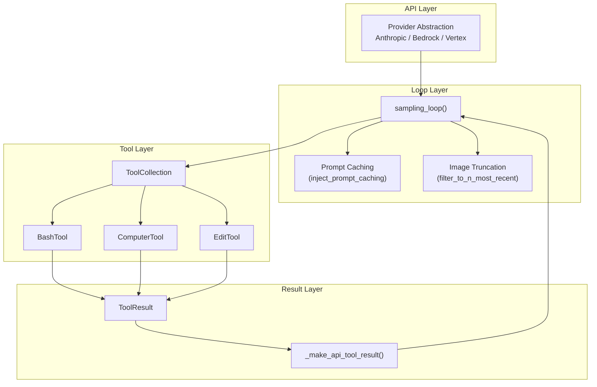

# Chapter 2: Quickstart Architecture

## What Problem Does This Solve?

Before you can extend or adapt any of these quickstarts, you need to understand the patterns they all share. Five projects look different on the surface — Python vs TypeScript, Docker vs bare Node.js, Streamlit vs Next.js — but they share a common architectural skeleton. Recognizing that skeleton lets you find the right file to edit when something breaks, and lets you transfer patterns from one project to another.

## The Universal Agent Loop

Every project that calls Claude in a loop follows the same core pattern: send a message, check the response for tool use blocks, execute the tools, append the results to the conversation, and repeat until Claude sends a response with no tool use blocks.

```mermaid
sequenceDiagram
    participant User
    participant Loop as sampling_loop / _agent_loop
    participant Claude as Claude API
    participant Tools as Tool Handlers

    User->>Loop: initial message
    loop Until no tool_use in response
        Loop->>Claude: messages + tools + system prompt
        Claude-->>Loop: response (may contain tool_use blocks)
        alt response contains tool_use
            Loop->>Tools: execute each tool_use block
            Tools-->>Loop: ToolResult (output | base64_image | error)
            Loop->>Loop: append tool_result to messages
        end
    end
    Loop-->>User: final text response
```

The computer-use-demo implements this in `computer_use_demo/loop.py` as `sampling_loop()`. The agents quickstart implements it in `agents/agent.py` as `Agent._agent_loop()`. The browser-use-demo has its own `loop.py` following the same structure.

## Project Anatomy Comparison

### computer-use-demo

The most architecturally complete quickstart. Key files:

```text
computer_use_demo/
├── loop.py          # Core: async sampling_loop(), prompt caching, image truncation
├── streamlit.py     # UI: sidebar config, chat display, callback wiring
└── tools/
    ├── base.py      # ToolResult dataclass, BaseAnthropicTool ABC, ToolCollection
    ├── bash.py      # BashTool20250124: persistent subprocess with sentinel pattern
    ├── computer.py  # ComputerTool: screenshot, keyboard, mouse with coord scaling
    └── edit.py      # EditTool20250728: view/create/str_replace/insert
```

The `ToolCollection` in `base.py` is the glue: it holds all three tools, provides `to_params()` for the API call, and dispatches `run(tool_name, tool_input)` to the correct tool instance.

### agents/

A deliberately minimal reference. The goal is clarity, not features: < 300 lines total.

```text
agents/
├── agent.py         # Agent class: _agent_loop, execute_tools, run/run_async
├── tools/           # ThinkTool and MCP tool wrappers
└── utils/           # Message history management, MCP connection setup
```

Key principle stated in the README: this is "NOT an SDK, but a reference implementation of key concepts." Do not try to use it as a production library — read it to understand the pattern, then implement your own.

### autonomous-coding/

Unique two-agent architecture. Uses Claude Code CLI (`@anthropic-ai/claude-code`) for the actual coding work, with a Python orchestrator that manages state across sessions.

```text
autonomous-coding/
├── autonomous_agent_demo.py  # Orchestrator: launches initializer, then iterates coding agents
├── prompts/                  # System prompts for initializer and coding agents
└── feature_list.json         # State file: source of truth for completed features
```

The initializer agent reads a specification and writes a comprehensive test suite plus `feature_list.json`. Subsequent coding-agent sessions each implement a batch of features, commit to git, and update `feature_list.json`. Sessions can be interrupted and resumed without data loss because all state is in files.

### customer-support-agent/

A Next.js 14 app demonstrating real-time streaming, extended thinking display, and Bedrock knowledge base integration.

```text
customer-support-agent/
├── app/
│   ├── api/chat/route.ts    # Edge Runtime: streams Claude responses to the frontend
│   └── components/
│       └── ChatArea.tsx     # Main chat component: knowledge base config, mood detection
└── package.json
```

### financial-data-analyst/

Next.js 14 app demonstrating file upload, multi-format parsing, and dynamic chart generation.

```text
financial-data-analyst/
├── app/
│   ├── api/analyze/route.ts  # Parses uploaded files, sends to Claude, streams JSON
│   └── components/           # Chat, FileUpload, ChartRenderer (Recharts)
└── package.json
```

## Shared Patterns

### Pattern 1: Provider Abstraction

Both `computer-use-demo` and `browser-use-demo` support three API providers through environment-variable-driven client selection:

```python
# From computer_use_demo/loop.py (simplified)
if provider == APIProvider.ANTHROPIC:
    client = Anthropic(api_key=api_key)
elif provider == APIProvider.BEDROCK:
    client = AnthropicBedrock()
elif provider == APIProvider.VERTEX:
    client = AnthropicVertex()
```

This pattern lets you switch from Anthropic's direct API to enterprise-managed AWS Bedrock or Google Vertex deployments without changing any other code.

### Pattern 2: Tool Result → API Message Translation

Tool execution results must be translated into the exact message format the API expects before being appended to the conversation. In `computer_use_demo/loop.py`:

```python
def _make_api_tool_result(
    result: ToolResult, tool_use_id: str
) -> BetaToolResultBlockParam:
    tool_result_content: list[BetaTextBlockParam | BetaImageBlockParam] | str = []

    if result.error:
        tool_result_content = _maybe_prepend_system_tool_result(result, result.error)
    else:
        if result.output:
            tool_result_content.append({
                "type": "text",
                "text": _maybe_prepend_system_tool_result(result, result.output),
            })
        if result.base64_image:
            tool_result_content.append({
                "type": "image",
                "source": {
                    "type": "base64",
                    "media_type": "image/png",
                    "data": result.base64_image,
                },
            })

    return {
        "type": "tool_result",
        "content": tool_result_content,
        "tool_use_id": tool_use_id,
        "is_error": bool(result.error),
    }
```

### Pattern 3: Model and Tool Version Pairing

The computer use tools have versioned API types that must match a compatible model version. The pairing is explicit in the code:

| Tool Class | `api_type` | Compatible Models |
|:-----------|:-----------|:------------------|
| `ComputerTool20241022` | `computer_20241022` | claude-3-5-sonnet-20241022 |
| `ComputerTool20250124` | `computer_20250124` | claude-3-5-sonnet-20250124+ |
| `ComputerTool20251124` | `computer_20251124` | claude-opus-4-20250514+ |
| `EditTool20250728` | `text_editor_20250728` | claude-3-5-sonnet-20250514+ |

Mixing an old tool version with a new model (or vice versa) will produce API validation errors. The Streamlit sidebar in `computer-use-demo` exposes a "Tool version" selector precisely to manage this.

## How These Patterns Connect



## Summary

All five quickstarts share an agentic loop, a tool-result-to-message translation pattern, and a tool collection dispatch mechanism. The Python projects add provider abstraction and tool version management. Understanding these shared patterns means you only need to learn the details once — the rest is project-specific configuration.

Next: [Chapter 3: Computer Use Deep-Dive](03-advanced-skill-design.md)

---

- [Tutorial Index](README.md)
- [Previous Chapter: Chapter 1: Getting Started](01-getting-started.md)
- [Next Chapter: Chapter 3: Computer Use Deep-Dive](03-advanced-skill-design.md)
- [Main Catalog](../../README.md#-tutorial-catalog)
