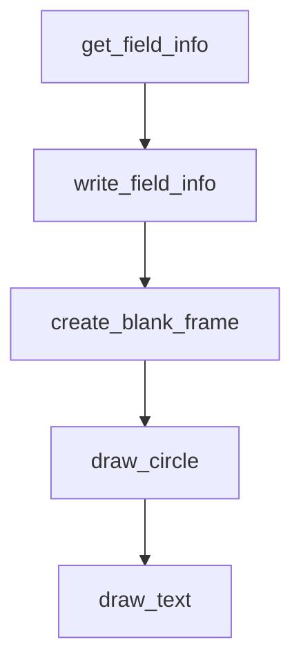

# Chapter 3: Advanced Skill Design

Welcome to **Chapter 3: Advanced Skill Design**. In this part of **Anthropic Skills Tutorial: Reusable AI Agent Capabilities**, you will build an intuitive mental model first, then move into concrete implementation details and practical production tradeoffs.


Advanced skills are small systems. Treat them like mini-products with explicit interfaces.

## Multi-File Skill Layout

```text
customer-support-skill/
  SKILL.md
  scripts/
    classify_ticket.py
    enrich_account_context.ts
  references/
    escalation-policy.md
    sla-tiers.md
  assets/
    issue-taxonomy.csv
  templates/
    escalation-email.md
```

## Progressive Disclosure Pattern

Good skills avoid dumping all context at once. Instead:

1. Start with task intent and output contract.
2. Pull references only when relevant.
3. Call scripts only when deterministic transformation is required.

This pattern reduces token waste and improves instruction adherence.

## Frontmatter and Metadata Strategy

At minimum, keep `name` and `description` precise.

For larger catalogs, add optional metadata fields (when your runtime supports them) to improve discoverability and policy checks, such as:

- compatibility constraints
- license information
- ownership metadata
- tool allowlists

## Script Design Rules

Scripts should be boring and reliable.

- Use strict argument parsing.
- Return stable JSON structures.
- Fail loudly with actionable error messages.
- Avoid hidden network side effects unless clearly documented.

Example output contract:

```json
{
  "status": "ok",
  "severity": "high",
  "routing_queue": "support-l2",
  "confidence": 0.91
}
```

## References and Assets

- Put durable, high-signal guidance in `references/`.
- Keep `assets/` for files that are required but not convenient to inline.
- Version both in Git so skill behavior is auditable over time.

## Maintainability Checklist

- Single responsibility per script
- Explicit file paths in instructions
- Backward-compatible schema evolution
- Changelog entries for instruction changes

## Summary

You can now design skills that remain understandable as they grow beyond a single markdown file.

Next: [Chapter 4: Integration Platforms](04-integration-platforms.md)

## What Problem Does This Solve?

Most teams struggle here because the hard part is not writing more code, but deciding clear boundaries for `support`, `escalation`, `customer` so behavior stays predictable as complexity grows.

In practical terms, this chapter helps you avoid three common failures:

- coupling core logic too tightly to one implementation path
- missing the handoff boundaries between setup, execution, and validation
- shipping changes without clear rollback or observability strategy

After working through this chapter, you should be able to reason about `Chapter 3: Advanced Skill Design` as an operating subsystem inside **Anthropic Skills Tutorial: Reusable AI Agent Capabilities**, with explicit contracts for inputs, state transitions, and outputs.

Use the implementation notes around `skill`, `SKILL`, `scripts` as your checklist when adapting these patterns to your own repository.

## How it Works Under the Hood

Under the hood, `Chapter 3: Advanced Skill Design` usually follows a repeatable control path:

1. **Context bootstrap**: initialize runtime config and prerequisites for `support`.
2. **Input normalization**: shape incoming data so `escalation` receives stable contracts.
3. **Core execution**: run the main logic branch and propagate intermediate state through `customer`.
4. **Policy and safety checks**: enforce limits, auth scopes, and failure boundaries.
5. **Output composition**: return canonical result payloads for downstream consumers.
6. **Operational telemetry**: emit logs/metrics needed for debugging and performance tuning.

When debugging, walk this sequence in order and confirm each stage has explicit success/failure conditions.

## Source Walkthrough

Use the following upstream sources to verify implementation details while reading this chapter:

- [anthropics/skills repository](https://github.com/anthropics/skills)
  Why it matters: authoritative reference on `anthropics/skills repository` (github.com).

Suggested trace strategy:
- search upstream code for `support` and `escalation` to map concrete implementation paths
- compare docs claims against actual runtime/config code before reusing patterns in production

## Chapter Connections

- [Tutorial Index](README.md)
- [Previous Chapter: Chapter 2: Skill Categories](02-skill-categories.md)
- [Next Chapter: Chapter 4: Integration Platforms](04-integration-platforms.md)
- [Main Catalog](../../README.md#-tutorial-catalog)
- [A-Z Tutorial Directory](../../discoverability/tutorial-directory.md)

## Depth Expansion Playbook

## Source Code Walkthrough

### `skills/pdf/scripts/extract_form_field_info.py`

The `get_field_info` function in [`skills/pdf/scripts/extract_form_field_info.py`](https://github.com/anthropics/skills/blob/HEAD/skills/pdf/scripts/extract_form_field_info.py) handles a key part of this chapter's functionality:

```py


def get_field_info(reader: PdfReader):
    fields = reader.get_fields()

    field_info_by_id = {}
    possible_radio_names = set()

    for field_id, field in fields.items():
        if field.get("/Kids"):
            if field.get("/FT") == "/Btn":
                possible_radio_names.add(field_id)
            continue
        field_info_by_id[field_id] = make_field_dict(field, field_id)


    radio_fields_by_id = {}

    for page_index, page in enumerate(reader.pages):
        annotations = page.get('/Annots', [])
        for ann in annotations:
            field_id = get_full_annotation_field_id(ann)
            if field_id in field_info_by_id:
                field_info_by_id[field_id]["page"] = page_index + 1
                field_info_by_id[field_id]["rect"] = ann.get('/Rect')
            elif field_id in possible_radio_names:
                try:
                    on_values = [v for v in ann["/AP"]["/N"] if v != "/Off"]
                except KeyError:
                    continue
                if len(on_values) == 1:
                    rect = ann.get("/Rect")
```

This function is important because it defines how Anthropic Skills Tutorial: Reusable AI Agent Capabilities implements the patterns covered in this chapter.

### `skills/pdf/scripts/extract_form_field_info.py`

The `write_field_info` function in [`skills/pdf/scripts/extract_form_field_info.py`](https://github.com/anthropics/skills/blob/HEAD/skills/pdf/scripts/extract_form_field_info.py) handles a key part of this chapter's functionality:

```py


def write_field_info(pdf_path: str, json_output_path: str):
    reader = PdfReader(pdf_path)
    field_info = get_field_info(reader)
    with open(json_output_path, "w") as f:
        json.dump(field_info, f, indent=2)
    print(f"Wrote {len(field_info)} fields to {json_output_path}")


if __name__ == "__main__":
    if len(sys.argv) != 3:
        print("Usage: extract_form_field_info.py [input pdf] [output json]")
        sys.exit(1)
    write_field_info(sys.argv[1], sys.argv[2])

```

This function is important because it defines how Anthropic Skills Tutorial: Reusable AI Agent Capabilities implements the patterns covered in this chapter.

### `skills/slack-gif-creator/core/frame_composer.py`

The `create_blank_frame` function in [`skills/slack-gif-creator/core/frame_composer.py`](https://github.com/anthropics/skills/blob/HEAD/skills/slack-gif-creator/core/frame_composer.py) handles a key part of this chapter's functionality:

```py


def create_blank_frame(
    width: int, height: int, color: tuple[int, int, int] = (255, 255, 255)
) -> Image.Image:
    """
    Create a blank frame with solid color background.

    Args:
        width: Frame width
        height: Frame height
        color: RGB color tuple (default: white)

    Returns:
        PIL Image
    """
    return Image.new("RGB", (width, height), color)


def draw_circle(
    frame: Image.Image,
    center: tuple[int, int],
    radius: int,
    fill_color: Optional[tuple[int, int, int]] = None,
    outline_color: Optional[tuple[int, int, int]] = None,
    outline_width: int = 1,
) -> Image.Image:
    """
    Draw a circle on a frame.

    Args:
        frame: PIL Image to draw on
```

This function is important because it defines how Anthropic Skills Tutorial: Reusable AI Agent Capabilities implements the patterns covered in this chapter.

### `skills/slack-gif-creator/core/frame_composer.py`

The `draw_circle` function in [`skills/slack-gif-creator/core/frame_composer.py`](https://github.com/anthropics/skills/blob/HEAD/skills/slack-gif-creator/core/frame_composer.py) handles a key part of this chapter's functionality:

```py


def draw_circle(
    frame: Image.Image,
    center: tuple[int, int],
    radius: int,
    fill_color: Optional[tuple[int, int, int]] = None,
    outline_color: Optional[tuple[int, int, int]] = None,
    outline_width: int = 1,
) -> Image.Image:
    """
    Draw a circle on a frame.

    Args:
        frame: PIL Image to draw on
        center: (x, y) center position
        radius: Circle radius
        fill_color: RGB fill color (None for no fill)
        outline_color: RGB outline color (None for no outline)
        outline_width: Outline width in pixels

    Returns:
        Modified frame
    """
    draw = ImageDraw.Draw(frame)
    x, y = center
    bbox = [x - radius, y - radius, x + radius, y + radius]
    draw.ellipse(bbox, fill=fill_color, outline=outline_color, width=outline_width)
    return frame


def draw_text(
```

This function is important because it defines how Anthropic Skills Tutorial: Reusable AI Agent Capabilities implements the patterns covered in this chapter.


## How These Components Connect


