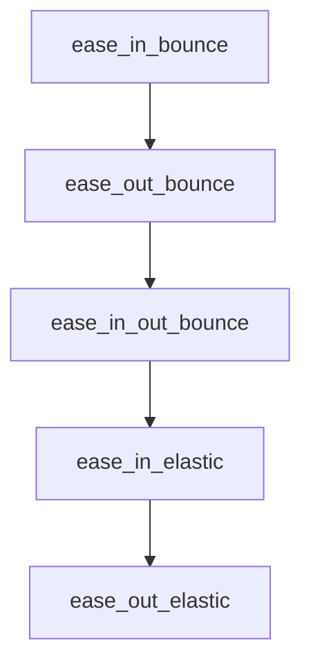

# Chapter 4: Integration Platforms

Welcome to **Chapter 4: Integration Platforms**. In this part of **Anthropic Skills Tutorial: Reusable AI Agent Capabilities**, you will build an intuitive mental model first, then move into concrete implementation details and practical production tradeoffs.


The same skill package can be used across multiple surfaces, but deployment and governance expectations differ.

## Claude Code

Claude Code is strong for engineering and file-centric workflows.

From the official skills repository, a common setup is:

```bash
/plugin marketplace add anthropics/skills
/plugin install example-skills@anthropic-agent-skills
```

Operational guidance:

- Keep skill repos versioned and pinned.
- Prefer local scripts for deterministic steps.
- Enforce repository-level review on `SKILL.md` changes.

## Claude.ai

Claude.ai is ideal for interactive drafting and team collaboration.

Use it when:

- humans need to iterate on outputs quickly
- file upload context is part of the workflow
- you want lower-friction skill adoption for non-engineers

Guardrail recommendation: keep a canonical output template in the skill so generated artifacts remain comparable.

## Claude API

API integration gives maximal control for enterprise systems.

Typical pattern:

1. Load skill instructions as controlled context.
2. Inject request-specific payload.
3. Validate output against schema.
4. Store run metadata for auditing.

Pseudo-flow:

```text
request -> select skill -> build prompt context -> generate -> validate -> persist
```

## Cross-Platform Compatibility Strategy

| Concern | Claude Code | Claude.ai | Claude API |
|:--------|:------------|:----------|:-----------|
| Local file/scripts | Strong | Limited | App-controlled |
| Governance controls | Git + review | Workspace policies | Full policy engine |
| Structured validation | Medium | Medium | Strong |
| Automation depth | High | Medium | Highest |

## Integration Pitfalls

- Reusing one skill unchanged across radically different environments
- Assuming runtime-specific tools exist everywhere
- Failing to log skill version with each generated artifact

## Summary

You can now choose the right runtime surface and adjust operating controls per platform.

Next: [Chapter 5: Production Skills](05-production-skills.md)

## What Problem Does This Solve?

Most teams struggle here because the hard part is not writing more code, but deciding clear boundaries for `skills`, `plugin`, `marketplace` so behavior stays predictable as complexity grows.

In practical terms, this chapter helps you avoid three common failures:

- coupling core logic too tightly to one implementation path
- missing the handoff boundaries between setup, execution, and validation
- shipping changes without clear rollback or observability strategy

After working through this chapter, you should be able to reason about `Chapter 4: Integration Platforms` as an operating subsystem inside **Anthropic Skills Tutorial: Reusable AI Agent Capabilities**, with explicit contracts for inputs, state transitions, and outputs.

Use the implementation notes around `anthropics`, `install`, `example` as your checklist when adapting these patterns to your own repository.

## How it Works Under the Hood

Under the hood, `Chapter 4: Integration Platforms` usually follows a repeatable control path:

1. **Context bootstrap**: initialize runtime config and prerequisites for `skills`.
2. **Input normalization**: shape incoming data so `plugin` receives stable contracts.
3. **Core execution**: run the main logic branch and propagate intermediate state through `marketplace`.
4. **Policy and safety checks**: enforce limits, auth scopes, and failure boundaries.
5. **Output composition**: return canonical result payloads for downstream consumers.
6. **Operational telemetry**: emit logs/metrics needed for debugging and performance tuning.

When debugging, walk this sequence in order and confirm each stage has explicit success/failure conditions.

## Source Walkthrough

Use the following upstream sources to verify implementation details while reading this chapter:

- [anthropics/skills repository](https://github.com/anthropics/skills)
  Why it matters: authoritative reference on `anthropics/skills repository` (github.com).

Suggested trace strategy:
- search upstream code for `skills` and `plugin` to map concrete implementation paths
- compare docs claims against actual runtime/config code before reusing patterns in production

## Chapter Connections

- [Tutorial Index](README.md)
- [Previous Chapter: Chapter 3: Advanced Skill Design](03-advanced-skill-design.md)
- [Next Chapter: Chapter 5: Production Skills](05-production-skills.md)
- [Main Catalog](../../README.md#-tutorial-catalog)
- [A-Z Tutorial Directory](../../discoverability/tutorial-directory.md)

## Depth Expansion Playbook

## Source Code Walkthrough

### `skills/slack-gif-creator/core/easing.py`

The `ease_in_bounce` function in [`skills/slack-gif-creator/core/easing.py`](https://github.com/anthropics/skills/blob/HEAD/skills/slack-gif-creator/core/easing.py) handles a key part of this chapter's functionality:

```py


def ease_in_bounce(t: float) -> float:
    """Bounce ease-in (bouncy start)."""
    return 1 - ease_out_bounce(1 - t)


def ease_out_bounce(t: float) -> float:
    """Bounce ease-out (bouncy end)."""
    if t < 1 / 2.75:
        return 7.5625 * t * t
    elif t < 2 / 2.75:
        t -= 1.5 / 2.75
        return 7.5625 * t * t + 0.75
    elif t < 2.5 / 2.75:
        t -= 2.25 / 2.75
        return 7.5625 * t * t + 0.9375
    else:
        t -= 2.625 / 2.75
        return 7.5625 * t * t + 0.984375


def ease_in_out_bounce(t: float) -> float:
    """Bounce ease-in-out."""
    if t < 0.5:
        return ease_in_bounce(t * 2) * 0.5
    return ease_out_bounce(t * 2 - 1) * 0.5 + 0.5


def ease_in_elastic(t: float) -> float:
    """Elastic ease-in (spring effect)."""
    if t == 0 or t == 1:
```

This function is important because it defines how Anthropic Skills Tutorial: Reusable AI Agent Capabilities implements the patterns covered in this chapter.

### `skills/slack-gif-creator/core/easing.py`

The `ease_out_bounce` function in [`skills/slack-gif-creator/core/easing.py`](https://github.com/anthropics/skills/blob/HEAD/skills/slack-gif-creator/core/easing.py) handles a key part of this chapter's functionality:

```py
def ease_in_bounce(t: float) -> float:
    """Bounce ease-in (bouncy start)."""
    return 1 - ease_out_bounce(1 - t)


def ease_out_bounce(t: float) -> float:
    """Bounce ease-out (bouncy end)."""
    if t < 1 / 2.75:
        return 7.5625 * t * t
    elif t < 2 / 2.75:
        t -= 1.5 / 2.75
        return 7.5625 * t * t + 0.75
    elif t < 2.5 / 2.75:
        t -= 2.25 / 2.75
        return 7.5625 * t * t + 0.9375
    else:
        t -= 2.625 / 2.75
        return 7.5625 * t * t + 0.984375


def ease_in_out_bounce(t: float) -> float:
    """Bounce ease-in-out."""
    if t < 0.5:
        return ease_in_bounce(t * 2) * 0.5
    return ease_out_bounce(t * 2 - 1) * 0.5 + 0.5


def ease_in_elastic(t: float) -> float:
    """Elastic ease-in (spring effect)."""
    if t == 0 or t == 1:
        return t
    return -math.pow(2, 10 * (t - 1)) * math.sin((t - 1.1) * 5 * math.pi)
```

This function is important because it defines how Anthropic Skills Tutorial: Reusable AI Agent Capabilities implements the patterns covered in this chapter.

### `skills/slack-gif-creator/core/easing.py`

The `ease_in_out_bounce` function in [`skills/slack-gif-creator/core/easing.py`](https://github.com/anthropics/skills/blob/HEAD/skills/slack-gif-creator/core/easing.py) handles a key part of this chapter's functionality:

```py


def ease_in_out_bounce(t: float) -> float:
    """Bounce ease-in-out."""
    if t < 0.5:
        return ease_in_bounce(t * 2) * 0.5
    return ease_out_bounce(t * 2 - 1) * 0.5 + 0.5


def ease_in_elastic(t: float) -> float:
    """Elastic ease-in (spring effect)."""
    if t == 0 or t == 1:
        return t
    return -math.pow(2, 10 * (t - 1)) * math.sin((t - 1.1) * 5 * math.pi)


def ease_out_elastic(t: float) -> float:
    """Elastic ease-out (spring effect)."""
    if t == 0 or t == 1:
        return t
    return math.pow(2, -10 * t) * math.sin((t - 0.1) * 5 * math.pi) + 1


def ease_in_out_elastic(t: float) -> float:
    """Elastic ease-in-out."""
    if t == 0 or t == 1:
        return t
    t = t * 2 - 1
    if t < 0:
        return -0.5 * math.pow(2, 10 * t) * math.sin((t - 0.1) * 5 * math.pi)
    return math.pow(2, -10 * t) * math.sin((t - 0.1) * 5 * math.pi) * 0.5 + 1

```

This function is important because it defines how Anthropic Skills Tutorial: Reusable AI Agent Capabilities implements the patterns covered in this chapter.

### `skills/slack-gif-creator/core/easing.py`

The `ease_in_elastic` function in [`skills/slack-gif-creator/core/easing.py`](https://github.com/anthropics/skills/blob/HEAD/skills/slack-gif-creator/core/easing.py) handles a key part of this chapter's functionality:

```py


def ease_in_elastic(t: float) -> float:
    """Elastic ease-in (spring effect)."""
    if t == 0 or t == 1:
        return t
    return -math.pow(2, 10 * (t - 1)) * math.sin((t - 1.1) * 5 * math.pi)


def ease_out_elastic(t: float) -> float:
    """Elastic ease-out (spring effect)."""
    if t == 0 or t == 1:
        return t
    return math.pow(2, -10 * t) * math.sin((t - 0.1) * 5 * math.pi) + 1


def ease_in_out_elastic(t: float) -> float:
    """Elastic ease-in-out."""
    if t == 0 or t == 1:
        return t
    t = t * 2 - 1
    if t < 0:
        return -0.5 * math.pow(2, 10 * t) * math.sin((t - 0.1) * 5 * math.pi)
    return math.pow(2, -10 * t) * math.sin((t - 0.1) * 5 * math.pi) * 0.5 + 1


# Convenience mapping
EASING_FUNCTIONS = {
    "linear": linear,
    "ease_in": ease_in_quad,
    "ease_out": ease_out_quad,
    "ease_in_out": ease_in_out_quad,
```

This function is important because it defines how Anthropic Skills Tutorial: Reusable AI Agent Capabilities implements the patterns covered in this chapter.


## How These Components Connect


