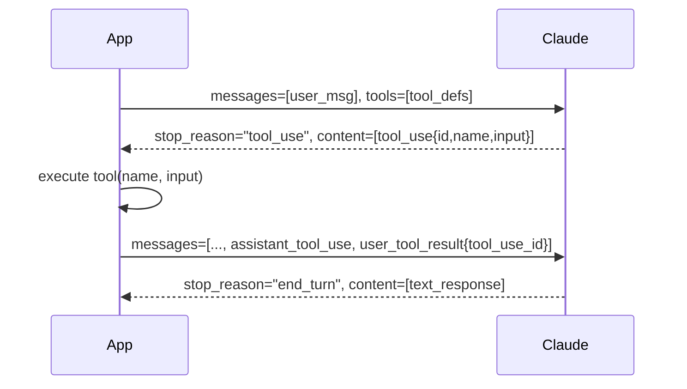

# Chapter 4: Tool Use Patterns

## What Problem Does This Solve?

The Claude API's tool use mechanism is powerful but has several non-obvious design requirements: tools must have stable JSON schemas, results must be formatted as specific message block types, tool definitions must be versioned alongside model versions, and multi-tool responses require careful iteration. This chapter explains exactly how the quickstarts define, register, execute, and compose tools — patterns you can copy directly into your own projects.

## How Tool Use Works Under the Hood

When you include a `tools` array in a `messages.create` call, Claude may return a response with `stop_reason: "tool_use"` and one or more `tool_use` content blocks. Each block contains:

- `id` — a unique identifier for this specific tool invocation
- `name` — the tool name (must match a name in your `tools` array)
- `input` — a JSON object matching the tool's `input_schema`

You must then execute the tool and return a `tool_result` message that references the same `id`. Only after that can Claude continue reasoning.



## BaseAnthropicTool: The Tool Contract

All tools in `computer-use-demo` inherit from `BaseAnthropicTool` in `base.py`:

```python
class BaseAnthropicTool(ABC):
    """Abstract base class for Anthropic tool implementations."""

    @abstractmethod
    def __call__(self, **kwargs) -> Awaitable[ToolResult]:
        """Execute the tool. Must return a ToolResult."""
        ...

    @abstractmethod
    def to_params(self) -> BetaToolUnionParam:
        """Return the tool definition for the API call."""
        ...
```

The `to_params()` method must return the exact dict structure the API expects. For the computer tool:

```python
# From computer_use_demo/tools/computer.py (simplified)
def to_params(self) -> BetaToolUnionParam:
    return {
        "type": self.api_type,   # e.g. "computer_20250124"
        "name": "computer",
        "display_width_px": self.width,
        "display_height_px": self.height,
        "display_number": self._display_num,
    }
```

For a generic custom tool using the standard `function` type, the schema looks like:

```python
{
    "name": "get_weather",
    "description": "Retrieve current weather for a city",
    "input_schema": {
        "type": "object",
        "properties": {
            "city": {"type": "string", "description": "City name"},
            "units": {"type": "string", "enum": ["celsius", "fahrenheit"]}
        },
        "required": ["city"]
    }
}
```

## ToolResult: The Result Contract

`ToolResult` in `base.py` is a frozen dataclass that represents any possible tool outcome:

```python
@dataclass(frozen=True)
class ToolResult:
    output: str | None = None        # Text output from the tool
    error: str | None = None         # Error message (sets is_error=True in API)
    base64_image: str | None = None  # PNG screenshot as base64 string
    system: str | None = None        # System-level context prepended to output

    def __bool__(self):
        return any([self.output, self.error, self.base64_image, self.system])

    def __add__(self, other: "ToolResult") -> "ToolResult":
        """Combine two results by concatenating string fields."""
        ...

    def replace(self, **kwargs) -> "ToolResult":
        """Return a copy with specified fields replaced."""
        return dataclasses.replace(self, **kwargs)
```

Subclasses:
- `CLIResult` — for command-line tools that only return text
- `ToolFailure` — explicitly marks a failed execution (produces `is_error=True`)
- `ToolError` — exception raised inside `__call__`, caught by `ToolCollection.run()`

## ToolCollection: Dispatch and Registration

`ToolCollection` holds a tuple of tool instances and handles:

1. **Registration**: maps tool names to instances
2. **API parameters**: calls `to_params()` on each tool and returns the list
3. **Dispatch**: routes incoming tool names to the right `__call__`
4. **Error wrapping**: catches `ToolError` exceptions and returns `ToolFailure`

```python
class ToolCollection:
    def __init__(self, *tools: BaseAnthropicTool):
        self.tools = tools
        self.tool_map = {tool.to_params()["name"]: tool for tool in tools}

    def to_params(self) -> list[BetaToolUnionParam]:
        return [tool.to_params() for tool in self.tools]

    async def run(self, *, name: str, tool_input: dict) -> ToolResult:
        tool = self.tool_map.get(name)
        if not tool:
            return ToolFailure(error=f"Tool {name!r} is invalid")
        try:
            return await tool(**tool_input)
        except ToolError as e:
            return ToolFailure(error=e.message)
```

## BashTool: Persistent Session with Sentinel Detection

A naive bash tool implementation spawns a new subprocess per command. This loses environment variables, current directory, and shell state between calls. `BashTool20250124` uses a persistent subprocess instead, maintained across the lifetime of the sampling loop session.

The challenge: detecting when a command is complete without waiting for EOF. The sentinel pattern appends `; echo '<<exit>>'` to every command and reads until that marker appears:

```python
class _BashSession:
    """Persistent bash subprocess."""

    _SENTINEL = "<<exit>>"

    async def run(self, command: str) -> tuple[str, str]:
        if not self._started:
            await self.start()

        # Clear any leftover output in the buffer
        await self._clear_output()

        # Send command + sentinel
        assert self._process.stdin
        self._process.stdin.write(
            command.encode() + f"; echo '{self._SENTINEL}'\n".encode()
        )
        await self._process.stdin.drain()

        # Collect output until sentinel
        output_parts = []
        async with asyncio.timeout(self._timeout):
            async for line in self._process.stdout:
                decoded = line.decode("utf-8", errors="replace")
                if self._SENTINEL in decoded:
                    break
                output_parts.append(decoded)

        return "".join(output_parts), ""
```

If a command times out (default 120 seconds), the session raises `TimeoutError`. The `BashTool20250124.__call__` method catches this and returns a `ToolFailure` with instructions for Claude to restart the session.

## ComputerTool: Action Dispatch and Coordinate Scaling

The `__call__` method in `ComputerTool` is a large dispatch pattern. After validating the action type and required parameters, it routes to the appropriate handler:

```python
async def __call__(self, *, action: Action, **kwargs) -> ToolResult:
    if action == "screenshot":
        return await self.screenshot()
    elif action == "key":
        return await self.key(kwargs["text"])
    elif action == "type":
        return await self.type(kwargs["text"])
    elif action in ("left_click", "right_click", "middle_click",
                    "double_click", "triple_click", "mouse_move"):
        x, y = self.scale_coordinates(
            ScalingSource.API, *kwargs["coordinate"]
        )
        # execute xdotool command for the action
        ...
    elif action == "scroll":
        x, y = self.scale_coordinates(
            ScalingSource.API, *kwargs["coordinate"]
        )
        # execute xdotool scroll command
        ...
    elif action == "zoom":
        # zoom around a coordinate
        ...
```

The `screenshot()` method captures the display with `gnome-screenshot` (preferred) or falls back to `scrot`, reads the PNG file, base64-encodes it, and returns it in a `ToolResult`:

```python
async def screenshot(self) -> ToolResult:
    output_dir = Path(OUTPUT_DIR)
    output_dir.mkdir(parents=True, exist_ok=True)
    path = output_dir / "screenshot.png"

    # Try gnome-screenshot first, fall back to scrot
    screenshot_cmd = f"gnome-screenshot -f {path} -d 0"
    result = await self.shell(screenshot_cmd, take_screenshot=False)
    if result.error or not path.exists():
        result = await self.shell(f"scrot -p {path}", take_screenshot=False)

    if path.exists():
        return ToolResult(
            base64_image=base64.standard_b64encode(path.read_bytes()).decode()
        )
    return ToolResult(error=f"Failed to take screenshot: {result.error}")
```

## EditTool: Safe File Manipulation

`EditTool20250728` enforces important constraints:

- **Absolute paths only**: relative paths return an error immediately
- **Unique string replacement**: `str_replace` fails if the target string appears 0 or 2+ times
- **Context snippets**: every edit shows 4 lines before/after the changed region
- **File history**: tracks changes for potential undo (stored in `_file_history`)

```python
async def __call__(self, *, command: Command, path: str, **kwargs) -> ToolResult:
    _path = Path(path)
    self.validate_path(command, _path)

    if command == "view":
        return self.view(_path, kwargs.get("view_range"))
    elif command == "create":
        return self.write_file(_path, kwargs["file_text"])
    elif command == "str_replace":
        return self.str_replace(_path, kwargs["old_str"], kwargs["new_str"])
    elif command == "insert":
        return self.insert(_path, kwargs["insert_line"], kwargs["new_str"])
```

## Building a Custom Tool

To add a custom tool to the agents quickstart pattern:

```python
from dataclasses import dataclass
from computer_use_demo.tools.base import BaseAnthropicTool, ToolResult

@dataclass
class DatabaseQueryTool(BaseAnthropicTool):
    """Tool for querying a read-only database."""

    connection_string: str

    def to_params(self):
        return {
            "name": "database_query",
            "description": "Execute a read-only SQL query",
            "input_schema": {
                "type": "object",
                "properties": {
                    "query": {
                        "type": "string",
                        "description": "SQL SELECT statement"
                    }
                },
                "required": ["query"]
            }
        }

    async def __call__(self, *, query: str, **kwargs) -> ToolResult:
        if not query.strip().upper().startswith("SELECT"):
            return ToolResult(error="Only SELECT queries are permitted")
        try:
            # execute query against self.connection_string
            results = await execute_query(self.connection_string, query)
            return ToolResult(output=json.dumps(results, indent=2))
        except Exception as e:
            return ToolResult(error=str(e))
```

Register it alongside the built-in tools:

```python
tool_collection = ToolCollection(
    ComputerTool(width, height, display_num),
    BashTool(),
    EditTool(),
    DatabaseQueryTool(connection_string=os.environ["DB_URL"]),
)
```

## Tool Design Checklist

| Rule | Reason |
|:-----|:-------|
| Return `ToolResult(error=...)` rather than raising exceptions | `ToolCollection.run()` only catches `ToolError`; uncaught exceptions kill the loop |
| Keep `to_params()` schemas as narrow as possible | Overly broad schemas cause Claude to pass invalid inputs |
| Make tools idempotent where feasible | The loop may retry on timeout; side effects should not compound |
| Never block the event loop in `__call__` | All tools are called with `await`; use `asyncio.to_thread` for sync I/O |
| Validate all inputs before executing | Return a clear error message so Claude can correct itself |

## Summary

Tools in the quickstarts follow a strict three-part contract: a `to_params()` schema for the API, a `__call__` implementation returning `ToolResult`, and registration in a `ToolCollection`. The BashTool's sentinel pattern solves persistent-session output detection. The ComputerTool's coordinate scaling bridges API coordinates to real display coordinates. The EditTool's uniqueness enforcement prevents accidental multi-site edits.

Next: [Chapter 5: Multi-Turn Conversation Patterns](05-production-skills.md)

---

- [Tutorial Index](README.md)
- [Previous Chapter: Chapter 3: Computer Use Deep-Dive](03-advanced-skill-design.md)
- [Next Chapter: Chapter 5: Multi-Turn Conversation Patterns](05-production-skills.md)
- [Main Catalog](../../README.md#-tutorial-catalog)
