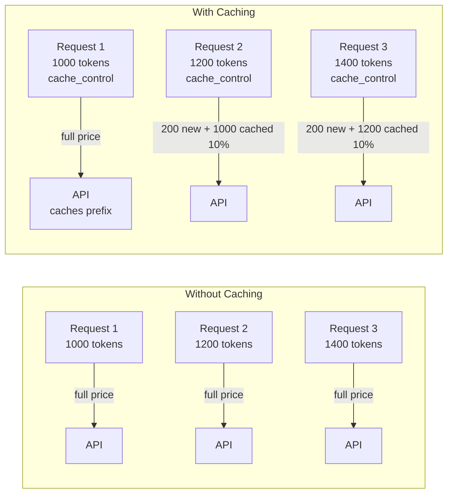
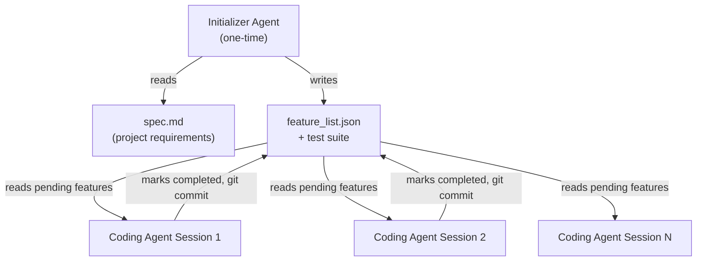

# Chapter 5: Multi-Turn Conversation Patterns

## What Problem Does This Solve?

Stateless single-turn calls to Claude are simple. Multi-turn conversations that include tool use, screenshots, and long reasoning traces are not. The problems compound quickly: context windows fill up with screenshots, costs rise with every token, and conversation history must be maintained in the right format or Claude loses coherence. This chapter covers how the quickstarts manage multi-turn state, how prompt caching slashes costs, how image truncation prevents context overflow, and how the `autonomous-coding` quickstart maintains state across completely separate sessions.

## How Multi-Turn State Works

The Claude API is stateless. Every request must include the full conversation history in the `messages` array. In the sampling loop, this array grows with every turn:

```text
messages = [
    {"role": "user",      "content": "Open Firefox"},            # turn 1
    {"role": "assistant", "content": [tool_use{screenshot}]},    # turn 1 response
    {"role": "user",      "content": [tool_result{image}]},      # turn 2
    {"role": "assistant", "content": [tool_use{left_click}]},    # turn 2 response
    {"role": "user",      "content": [tool_result{}]},           # turn 3
    ...
]
```

Without management, a computer-use session that takes 50 screenshots will accumulate ~50 large base64 image blocks in memory and in every subsequent API request. The cost and latency grow linearly with session length.

## Image Truncation: `_maybe_filter_to_n_most_recent_images`

The function `_maybe_filter_to_n_most_recent_images` in `computer_use_demo/loop.py` addresses this by removing older screenshots from the messages list while preserving all text content:

```python
def _maybe_filter_to_n_most_recent_images(
    messages: list[BetaMessageParam],
    images_to_keep: int,
    min_removal_threshold: int = 10,
) -> None:
    """
    Modify messages in place to keep only the N most recent screenshots.
    Preserves all text blocks and tool results that have no image content.
    """
    if images_to_keep is None:
        return

    tool_result_blocks = cast(
        list[ToolResultBlockParam],
        [
            item
            for message in messages
            for item in (
                message["content"] if isinstance(message["content"], list) else []
            )
            if isinstance(item, dict) and item.get("type") == "tool_result"
        ],
    )

    total_images = sum(
        1
        for tool_result in tool_result_blocks
        for content in (
            tool_result.get("content") or []
        )
        if isinstance(content, dict) and content.get("type") == "image"
    )

    images_to_remove = total_images - images_to_keep
    if images_to_remove < min_removal_threshold:
        return  # Not enough images to bother removing

    # Walk through tool_result_blocks oldest-first, removing image blocks
    for tool_result in tool_result_blocks:
        if images_to_remove <= 0:
            break
        new_content = []
        for content in tool_result.get("content") or []:
            if (
                isinstance(content, dict)
                and content.get("type") == "image"
                and images_to_remove > 0
            ):
                images_to_remove -= 1
            else:
                new_content.append(content)
        tool_result["content"] = new_content
```

The Streamlit sidebar exposes "Only send N most recent screenshots" as a user-configurable option. Setting it to 3–5 is a good default for most sessions: Claude retains enough visual context for the current task but does not accumulate megabytes of older screenshots.

## Prompt Caching: `_inject_prompt_caching`

Prompt caching allows the API to cache the computation for stable message prefixes and charge only 10% of the normal input token rate for cache hits. The quickstart's `_inject_prompt_caching` function adds `cache_control: {"type": "ephemeral"}` markers to the three most recent conversation turns:

```python
def _inject_prompt_caching(
    messages: list[BetaMessageParam],
) -> None:
    """
    Set cache breakpoints on the 3 most recent conversation turns.
    Older turns are left without cache_control, so they are not candidates
    for fresh caching but may still benefit from existing cache entries.
    """
    breakpoints_remaining = 3
    for message in reversed(messages):
        if message["role"] == "user" and isinstance(
            message["content"], list
        ):
            if breakpoints_remaining == 0:
                # Remove cache_control from older messages so they
                # don't generate unnecessary new cache entries
                message["content"][-1].pop("cache_control", None)
            else:
                message["content"][-1]["cache_control"] = {"type": "ephemeral"}
                breakpoints_remaining -= 1
```

**Why 3 breakpoints?** The Claude API supports up to 4 cache breakpoints per request. Using 3 for conversation turns leaves room for the system prompt to be cached separately.

**When caching helps most**: in long computer-use sessions where the first 10+ turns remain stable in the context while the agent works on a specific task. In practice, a 50-turn session with caching enabled can reduce input costs by 60–80%.



## Extended Thinking Budget

The Streamlit sidebar includes a "Thinking budget" setting. When set above 0, the API request includes:

```python
thinking: {"type": "enabled", "budget_tokens": thinking_budget}
```

Extended thinking allows Claude to reason through complex multi-step tasks before committing to actions. For computer use, this is particularly useful for tasks that require navigating unfamiliar UIs or reasoning about dependencies between steps. The tradeoff is additional latency and token cost for the thinking blocks.

## Message History Truncation in the Agents Quickstart

The `agents/` quickstart implements a simpler form of context management. From `agent.py`:

```python
class Agent:
    def _prepare_messages(
        self,
        messages: list[dict],
        max_context: int | None = None,
    ) -> list[dict]:
        """Truncate message history if it exceeds the context window."""
        if max_context is None:
            max_context = self.config.context_window  # default: 180,000 tokens

        # Rough token estimate: 4 chars ≈ 1 token
        total_chars = sum(
            len(str(m.get("content", ""))) for m in messages
        )
        estimated_tokens = total_chars // 4

        if estimated_tokens <= max_context:
            return messages

        # Keep the system message and the most recent messages
        # Never remove the first message (usually the task description)
        truncated = [messages[0]]  # always keep first
        for msg in reversed(messages[1:]):
            truncated_chars = sum(len(str(m.get("content", ""))) for m in truncated)
            if truncated_chars // 4 + len(str(msg.get("content", ""))) // 4 < max_context:
                truncated.insert(1, msg)
            else:
                break
        return truncated
```

## Cross-Session State: autonomous-coding

The `autonomous-coding` quickstart solves a harder problem: how do you maintain agent state across completely separate process invocations, potentially days apart?

The answer is file-based state in `feature_list.json`:

```json
{
  "features": [
    {
      "id": "feat-001",
      "description": "User authentication with JWT",
      "status": "completed",
      "completed_at": "2025-03-15T14:23:00Z",
      "git_commit": "abc1234"
    },
    {
      "id": "feat-002",
      "description": "Product listing page with pagination",
      "status": "in_progress"
    },
    {
      "id": "feat-003",
      "description": "Shopping cart with local storage",
      "status": "pending"
    }
  ]
}
```

Each coding-agent session reads this file, picks up where the previous session left off, implements the next batch of `pending` features, commits to git, and updates the file. The git history provides an additional audit trail.



Security model: each Claude Code session runs with OS-level sandboxing that restricts bash commands to an allowlist (npm, git, specific file operations). Network access is controlled. The orchestrator Python script can set `--max-iterations` to cap how many features a single session implements, providing a natural checkpoint for human review.

## Streaming vs. Non-Streaming

The quickstarts take different approaches to streaming:

| Project | Approach | Reason |
|:--------|:---------|:-------|
| `computer-use-demo` | Non-streaming (full response) | Tool results require complete responses before execution |
| `customer-support-agent` | Streaming via `stream()` | Real-time character-by-character display improves perceived UX |
| `financial-data-analyst` | Streaming | Same as above |
| `agents/` | Non-streaming | Simplicity; educational reference implementation |

The customer support and financial analyst quickstarts use Next.js Edge Runtime with the Anthropic SDK's streaming support:

```typescript
// From customer-support-agent/app/api/chat/route.ts (simplified)
import Anthropic from "@anthropic-ai/sdk";

const client = new Anthropic();

export async function POST(req: Request) {
  const { messages } = await req.json();

  const stream = await client.messages.stream({
    model: "claude-opus-4-20250514",
    max_tokens: 8096,
    system: SYSTEM_PROMPT,
    messages,
  });

  // Return as Server-Sent Events
  return new Response(
    new ReadableStream({
      async start(controller) {
        for await (const chunk of stream) {
          controller.enqueue(
            new TextEncoder().encode(`data: ${JSON.stringify(chunk)}\n\n`)
          );
        }
        controller.close();
      },
    }),
    {
      headers: {
        "Content-Type": "text/event-stream",
        "Cache-Control": "no-cache",
        Connection: "keep-alive",
      },
    }
  );
}
```

## Summary

Multi-turn conversation management in the quickstarts involves three distinct concerns: image truncation to prevent context overflow, prompt caching to reduce costs on stable prefixes, and message history management to stay within the context window. The autonomous-coding quickstart adds a fourth concern — cross-session persistence — which it solves with file-based state and git commits rather than an external database.

Next: [Chapter 6: MCP Integration](06-best-practices.md)

---

- [Tutorial Index](README.md)
- [Previous Chapter: Chapter 4: Tool Use Patterns](04-integration-platforms.md)
- [Next Chapter: Chapter 6: MCP Integration](06-best-practices.md)
- [Main Catalog](../../README.md#-tutorial-catalog)
