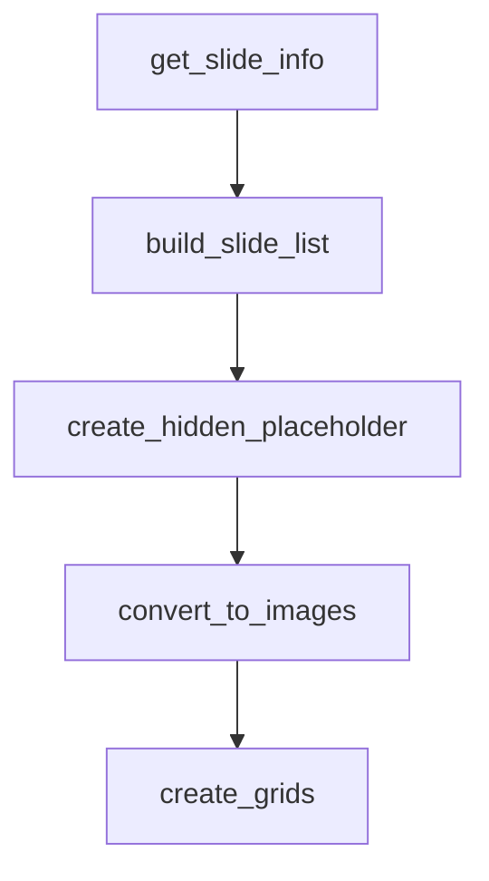

# Chapter 5: Production Skills

Welcome to **Chapter 5: Production Skills**. In this part of **Anthropic Skills Tutorial: Reusable AI Agent Capabilities**, you will build an intuitive mental model first, then move into concrete implementation details and practical production tradeoffs.


Production skill systems prioritize predictability over novelty.

## Define Output Contracts First

Every production skill should define:

- required sections
- required fields
- accepted enum values
- maximum lengths
- failure behavior

Example contract fragment:

```yaml
output:
  format: markdown
  required_sections:
    - executive_summary
    - risk_register
    - action_items
  action_item_fields:
    - owner
    - due_date
    - severity
```

## Deterministic Transformation Layer

Push high-risk transformations into scripts:

- numeric calculations
- date normalization
- schema mapping
- cross-system ID handling

Keep natural language synthesis for summarization and explanation, not critical arithmetic or routing logic.

## Document Generation Workflows

The official skills repo includes document-focused references. A stable pattern is:

1. Generate intermediate structured JSON.
2. Validate schema.
3. Render final artifacts (DOCX/PDF/PPTX/XLSX) via script.
4. Return validation report with artifact metadata.

## Reliability Checklist

- Idempotent run identifiers
- Retry-safe script steps
- Explicit timeout budgets
- Structured error taxonomy
- Artifact checksums for integrity

## Security Checklist

- Never embed secrets in skill instructions
- Restrict script execution environment
- Validate all external inputs
- Redact sensitive logs
- Track skill ownership and on-call routing

## Summary

You now have the backbone for operating skills in business-critical workflows.

Next: [Chapter 6: Best Practices](06-best-practices.md)

## What Problem Does This Solve?

Most teams struggle here because the hard part is not writing more code, but deciding clear boundaries for `output`, `format`, `markdown` so behavior stays predictable as complexity grows.

In practical terms, this chapter helps you avoid three common failures:

- coupling core logic too tightly to one implementation path
- missing the handoff boundaries between setup, execution, and validation
- shipping changes without clear rollback or observability strategy

After working through this chapter, you should be able to reason about `Chapter 5: Production Skills` as an operating subsystem inside **Anthropic Skills Tutorial: Reusable AI Agent Capabilities**, with explicit contracts for inputs, state transitions, and outputs.

Use the implementation notes around `required_sections`, `executive_summary`, `risk_register` as your checklist when adapting these patterns to your own repository.

## How it Works Under the Hood

Under the hood, `Chapter 5: Production Skills` usually follows a repeatable control path:

1. **Context bootstrap**: initialize runtime config and prerequisites for `output`.
2. **Input normalization**: shape incoming data so `format` receives stable contracts.
3. **Core execution**: run the main logic branch and propagate intermediate state through `markdown`.
4. **Policy and safety checks**: enforce limits, auth scopes, and failure boundaries.
5. **Output composition**: return canonical result payloads for downstream consumers.
6. **Operational telemetry**: emit logs/metrics needed for debugging and performance tuning.

When debugging, walk this sequence in order and confirm each stage has explicit success/failure conditions.

## Source Walkthrough

Use the following upstream sources to verify implementation details while reading this chapter:

- [anthropics/skills repository](https://github.com/anthropics/skills)
  Why it matters: authoritative reference on `anthropics/skills repository` (github.com).

Suggested trace strategy:
- search upstream code for `output` and `format` to map concrete implementation paths
- compare docs claims against actual runtime/config code before reusing patterns in production

## Chapter Connections

- [Tutorial Index](README.md)
- [Previous Chapter: Chapter 4: Integration Platforms](04-integration-platforms.md)
- [Next Chapter: Chapter 6: Best Practices](06-best-practices.md)
- [Main Catalog](../../README.md#-tutorial-catalog)
- [A-Z Tutorial Directory](../../discoverability/tutorial-directory.md)

## Depth Expansion Playbook

## Source Code Walkthrough

### `skills/pptx/scripts/thumbnail.py`

The `get_slide_info` function in [`skills/pptx/scripts/thumbnail.py`](https://github.com/anthropics/skills/blob/HEAD/skills/pptx/scripts/thumbnail.py) handles a key part of this chapter's functionality:

```py

    try:
        slide_info = get_slide_info(input_path)

        with tempfile.TemporaryDirectory() as temp_dir:
            temp_path = Path(temp_dir)
            visible_images = convert_to_images(input_path, temp_path)

            if not visible_images and not any(s["hidden"] for s in slide_info):
                print("Error: No slides found", file=sys.stderr)
                sys.exit(1)

            slides = build_slide_list(slide_info, visible_images, temp_path)

            grid_files = create_grids(slides, cols, THUMBNAIL_WIDTH, output_path)

            print(f"Created {len(grid_files)} grid(s):")
            for grid_file in grid_files:
                print(f"  {grid_file}")

    except Exception as e:
        print(f"Error: {e}", file=sys.stderr)
        sys.exit(1)


def get_slide_info(pptx_path: Path) -> list[dict]:
    with zipfile.ZipFile(pptx_path, "r") as zf:
        rels_content = zf.read("ppt/_rels/presentation.xml.rels").decode("utf-8")
        rels_dom = defusedxml.minidom.parseString(rels_content)

        rid_to_slide = {}
        for rel in rels_dom.getElementsByTagName("Relationship"):
```

This function is important because it defines how Anthropic Skills Tutorial: Reusable AI Agent Capabilities implements the patterns covered in this chapter.

### `skills/pptx/scripts/thumbnail.py`

The `build_slide_list` function in [`skills/pptx/scripts/thumbnail.py`](https://github.com/anthropics/skills/blob/HEAD/skills/pptx/scripts/thumbnail.py) handles a key part of this chapter's functionality:

```py
                sys.exit(1)

            slides = build_slide_list(slide_info, visible_images, temp_path)

            grid_files = create_grids(slides, cols, THUMBNAIL_WIDTH, output_path)

            print(f"Created {len(grid_files)} grid(s):")
            for grid_file in grid_files:
                print(f"  {grid_file}")

    except Exception as e:
        print(f"Error: {e}", file=sys.stderr)
        sys.exit(1)


def get_slide_info(pptx_path: Path) -> list[dict]:
    with zipfile.ZipFile(pptx_path, "r") as zf:
        rels_content = zf.read("ppt/_rels/presentation.xml.rels").decode("utf-8")
        rels_dom = defusedxml.minidom.parseString(rels_content)

        rid_to_slide = {}
        for rel in rels_dom.getElementsByTagName("Relationship"):
            rid = rel.getAttribute("Id")
            target = rel.getAttribute("Target")
            rel_type = rel.getAttribute("Type")
            if "slide" in rel_type and target.startswith("slides/"):
                rid_to_slide[rid] = target.replace("slides/", "")

        pres_content = zf.read("ppt/presentation.xml").decode("utf-8")
        pres_dom = defusedxml.minidom.parseString(pres_content)

        slides = []
```

This function is important because it defines how Anthropic Skills Tutorial: Reusable AI Agent Capabilities implements the patterns covered in this chapter.

### `skills/pptx/scripts/thumbnail.py`

The `create_hidden_placeholder` function in [`skills/pptx/scripts/thumbnail.py`](https://github.com/anthropics/skills/blob/HEAD/skills/pptx/scripts/thumbnail.py) handles a key part of this chapter's functionality:

```py
        if info["hidden"]:
            placeholder_path = temp_dir / f"hidden-{info['name']}.jpg"
            placeholder_img = create_hidden_placeholder(placeholder_size)
            placeholder_img.save(placeholder_path, "JPEG")
            slides.append((placeholder_path, f"{info['name']} (hidden)"))
        else:
            if visible_idx < len(visible_images):
                slides.append((visible_images[visible_idx], info["name"]))
                visible_idx += 1

    return slides


def create_hidden_placeholder(size: tuple[int, int]) -> Image.Image:
    img = Image.new("RGB", size, color="#F0F0F0")
    draw = ImageDraw.Draw(img)
    line_width = max(5, min(size) // 100)
    draw.line([(0, 0), size], fill="#CCCCCC", width=line_width)
    draw.line([(size[0], 0), (0, size[1])], fill="#CCCCCC", width=line_width)
    return img


def convert_to_images(pptx_path: Path, temp_dir: Path) -> list[Path]:
    pdf_path = temp_dir / f"{pptx_path.stem}.pdf"

    result = subprocess.run(
        [
            "soffice",
            "--headless",
            "--convert-to",
            "pdf",
            "--outdir",
```

This function is important because it defines how Anthropic Skills Tutorial: Reusable AI Agent Capabilities implements the patterns covered in this chapter.

### `skills/pptx/scripts/thumbnail.py`

The `convert_to_images` function in [`skills/pptx/scripts/thumbnail.py`](https://github.com/anthropics/skills/blob/HEAD/skills/pptx/scripts/thumbnail.py) handles a key part of this chapter's functionality:

```py
        with tempfile.TemporaryDirectory() as temp_dir:
            temp_path = Path(temp_dir)
            visible_images = convert_to_images(input_path, temp_path)

            if not visible_images and not any(s["hidden"] for s in slide_info):
                print("Error: No slides found", file=sys.stderr)
                sys.exit(1)

            slides = build_slide_list(slide_info, visible_images, temp_path)

            grid_files = create_grids(slides, cols, THUMBNAIL_WIDTH, output_path)

            print(f"Created {len(grid_files)} grid(s):")
            for grid_file in grid_files:
                print(f"  {grid_file}")

    except Exception as e:
        print(f"Error: {e}", file=sys.stderr)
        sys.exit(1)


def get_slide_info(pptx_path: Path) -> list[dict]:
    with zipfile.ZipFile(pptx_path, "r") as zf:
        rels_content = zf.read("ppt/_rels/presentation.xml.rels").decode("utf-8")
        rels_dom = defusedxml.minidom.parseString(rels_content)

        rid_to_slide = {}
        for rel in rels_dom.getElementsByTagName("Relationship"):
            rid = rel.getAttribute("Id")
            target = rel.getAttribute("Target")
            rel_type = rel.getAttribute("Type")
            if "slide" in rel_type and target.startswith("slides/"):
```

This function is important because it defines how Anthropic Skills Tutorial: Reusable AI Agent Capabilities implements the patterns covered in this chapter.


## How These Components Connect


