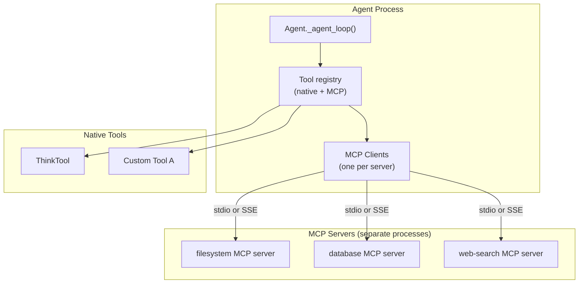

# Chapter 6: MCP Integration

## What Problem Does This Solve?

The `agents/` quickstart demonstrates a critical architectural decision point: should a tool be implemented as a native Python function in your agent codebase, or should it be exposed via the Model Context Protocol (MCP)? MCP tools can be shared across agents, deployed as standalone servers, updated without redeploying the agent, and consumed by any MCP-compatible client — not just your specific agent. This chapter explains MCP as implemented in the quickstart, how connections are established, how tools are discovered and called, and when to prefer MCP over native tools.

## What MCP Is

MCP (Model Context Protocol) is a standard for exposing tools, resources, and prompts to language models over a local or remote transport. An MCP server is a process that speaks the MCP protocol. An MCP client connects to that server and can list its tools, call them, and read its resources.

In the context of the agents quickstart:
- **Native tools** are Python callables defined directly in `tools/`
- **MCP tools** are functions exposed by external MCP servers that the agent connects to at startup

The agent treats both identically when calling Claude: both appear in the `tools` array sent to the API.

## Architecture



The agent connects to MCP servers at startup, discovers their tools, and adds them to the tool registry alongside native tools. When Claude calls an MCP tool, the agent routes the call through the appropriate MCP client.

## Setting Up MCP Connections

From `agents/utils/mcp.py` (simplified):

```python
from mcp import ClientSession, StdioServerParameters
from mcp.client.stdio import stdio_client
from contextlib import AsyncExitStack

async def setup_mcp_connections(
    server_configs: list[dict],
) -> tuple[list[dict], AsyncExitStack]:
    """
    Connect to MCP servers and return their combined tool list.

    server_configs format:
    [
        {"command": "uvx", "args": ["mcp-server-filesystem", "/tmp"]},
        {"command": "node", "args": ["path/to/mcp-server.js"]}
    ]
    """
    exit_stack = AsyncExitStack()
    all_tools = []

    for config in server_configs:
        server_params = StdioServerParameters(
            command=config["command"],
            args=config.get("args", []),
            env=config.get("env"),
        )
        stdio_transport = await exit_stack.enter_async_context(
            stdio_client(server_params)
        )
        session = await exit_stack.enter_async_context(
            ClientSession(*stdio_transport)
        )
        await session.initialize()

        # Discover available tools from this server
        tools_response = await session.list_tools()
        for tool in tools_response.tools:
            all_tools.append({
                "session": session,
                "name": tool.name,
                "description": tool.description,
                "input_schema": tool.inputSchema,
            })

    return all_tools, exit_stack
```

The `exit_stack` pattern ensures all server connections are cleaned up when the agent shuts down, even if an exception occurs.

## Tool Discovery and Registration

After connecting, the agent converts MCP tool definitions into the format Claude expects:

```python
def mcp_tool_to_claude_format(mcp_tool: dict) -> dict:
    """Convert MCP tool definition to Anthropic API tool format."""
    return {
        "name": mcp_tool["name"],
        "description": mcp_tool["description"],
        "input_schema": mcp_tool["input_schema"],
    }
```

The `input_schema` field from MCP is already JSON Schema format, so it maps directly to the `input_schema` field in Claude's tool definition. No conversion is needed.

## Calling MCP Tools

When Claude's response includes a `tool_use` block for an MCP-backed tool, the agent routes the call to the correct session:

```python
async def execute_tools(
    self,
    tool_calls: list[dict],
    mcp_sessions: dict[str, ClientSession],
) -> list[dict]:
    """Execute tool calls, routing MCP tools to the right session."""
    results = []
    for call in tool_calls:
        tool_name = call["name"]
        tool_input = call["input"]

        if tool_name in mcp_sessions:
            # MCP tool
            session = mcp_sessions[tool_name]
            result = await session.call_tool(tool_name, tool_input)
            output = result.content[0].text if result.content else ""
            results.append({
                "type": "tool_result",
                "tool_use_id": call["id"],
                "content": output,
            })
        else:
            # Native tool
            native_result = await self._native_tools[tool_name](**tool_input)
            results.append({
                "type": "tool_result",
                "tool_use_id": call["id"],
                "content": native_result.output or native_result.error or "",
                "is_error": bool(native_result.error),
            })

    return results
```

## The ThinkTool Pattern

The `agents/` quickstart includes a `ThinkTool` as the primary example of a native tool. It is deliberately trivial — it just echoes back the input — but it demonstrates an important pattern: giving Claude a "scratchpad" tool for explicit reasoning before taking an action.

```python
class ThinkTool:
    """A tool that lets Claude think through a problem explicitly."""

    def to_dict(self) -> dict:
        return {
            "name": "think",
            "description": (
                "Use this tool to think through a problem step by step "
                "before taking action. The output is not shown to the user."
            ),
            "input_schema": {
                "type": "object",
                "properties": {
                    "thought": {
                        "type": "string",
                        "description": "Your step-by-step reasoning"
                    }
                },
                "required": ["thought"]
            }
        }

    async def __call__(self, thought: str) -> str:
        # The tool does nothing — the value is the act of Claude
        # structuring its reasoning as a tool call
        return f"Acknowledged: {thought}"
```

This pattern forces Claude to make its reasoning observable (the `thought` parameter appears in the API response), which aids debugging. It also reduces "acting too fast" errors where Claude takes irreversible actions without adequate reasoning.

## When to Use MCP vs. Native Tools

| Situation | Recommendation |
|:----------|:---------------|
| Tool is specific to one agent | Native tool |
| Tool needs access to agent's in-process state | Native tool |
| Tool will be shared across multiple agents | MCP server |
| Tool can be maintained by a separate team | MCP server |
| Tool needs to be hot-reloadable | MCP server |
| Tool is available as a community MCP server | MCP server |
| Tool requires tight latency (in-process) | Native tool |
| Tool needs a persistent subprocess (like BashTool) | Native tool |

## Configuring MCP Servers

In the agents quickstart, MCP server configuration follows the same format as Claude Code's MCP configuration. An example `agent_config.json`:

```json
{
  "mcpServers": {
    "filesystem": {
      "command": "uvx",
      "args": ["mcp-server-filesystem", "/Users/me/projects"]
    },
    "github": {
      "command": "uvx",
      "args": ["mcp-server-github"],
      "env": {
        "GITHUB_PERSONAL_ACCESS_TOKEN": "${GITHUB_TOKEN}"
      }
    },
    "sqlite": {
      "command": "uvx",
      "args": ["mcp-server-sqlite", "--db-path", "/tmp/mydb.sqlite"]
    }
  }
}
```

The agent reads this file at startup, connects to each server, and merges their tools into the tool registry.

## Error Handling for MCP Tools

MCP connections can fail at startup or mid-session. The quickstart handles this gracefully:

```python
async def call_mcp_tool_safely(
    session: ClientSession,
    tool_name: str,
    tool_input: dict,
) -> str:
    """Call an MCP tool with error handling."""
    try:
        result = await session.call_tool(tool_name, tool_input)
        if result.isError:
            return f"Error from {tool_name}: {result.content}"
        return result.content[0].text if result.content else ""
    except Exception as e:
        # Return error as string so Claude can react and try alternatives
        return f"MCP tool {tool_name!r} failed: {str(e)}"
```

Always return errors as strings rather than raising exceptions — this keeps the sampling loop running so Claude can adapt its approach.

## Testing MCP Integrations

Because MCP servers are separate processes, you can test the integration layer independently:

```python
# test_mcp_integration.py
import pytest
import asyncio
from mcp import ClientSession, StdioServerParameters
from mcp.client.stdio import stdio_client

@pytest.mark.asyncio
async def test_filesystem_mcp_server():
    """Verify the filesystem MCP server lists tools correctly."""
    params = StdioServerParameters(
        command="uvx",
        args=["mcp-server-filesystem", "/tmp"],
    )
    async with stdio_client(params) as (read, write):
        async with ClientSession(read, write) as session:
            await session.initialize()
            tools = await session.list_tools()
            tool_names = {t.name for t in tools.tools}
            assert "read_file" in tool_names
            assert "list_directory" in tool_names
```

## Summary

The `agents/` quickstart demonstrates how to connect to MCP servers at startup, discover their tools, merge them with native tools, and route tool calls correctly through the sampling loop. The ThinkTool pattern provides Claude with a scratchpad for explicit reasoning. MCP is most valuable for shared, team-maintained tools; native tools are better for tight coupling to agent state or in-process performance.

Next: [Chapter 7: Production Hardening](07-publishing-sharing.md)

---

- [Tutorial Index](README.md)
- [Previous Chapter: Chapter 5: Multi-Turn Conversation Patterns](05-production-skills.md)
- [Next Chapter: Chapter 7: Production Hardening](07-publishing-sharing.md)
- [Main Catalog](../../README.md#-tutorial-catalog)
