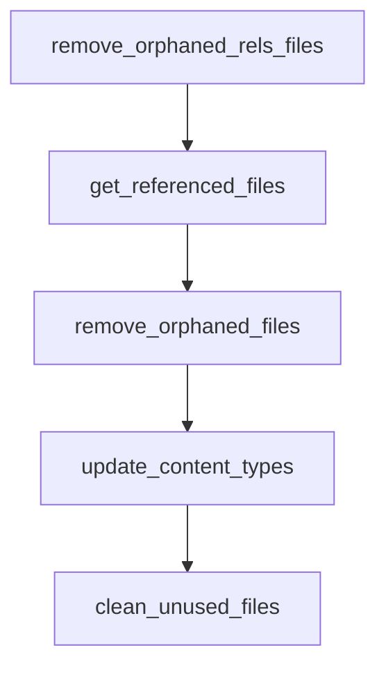

# Chapter 6: Best Practices

Welcome to **Chapter 6: Best Practices**. In this part of **Anthropic Skills Tutorial: Reusable AI Agent Capabilities**, you will build an intuitive mental model first, then move into concrete implementation details and practical production tradeoffs.


Strong skills are explicit, testable, and easy to review.

## Authoring Principles

- Prefer concrete verbs over broad goals.
- Define what to do when inputs are missing.
- State prohibited actions directly.
- Include examples for tricky edge cases.

## Testing Strategy

Use three test layers:

1. **Golden tests**: stable prompts with expected output shape
2. **Adversarial tests**: malformed or ambiguous inputs
3. **Regression tests**: replay historical failures

Keep test fixtures in version control with the skill.

## Versioning and Changelogs

Treat prompt changes as code changes.

- Use semantic versioning for skills distributed broadly.
- Keep a changelog with behavioral deltas.
- Call out breaking output changes explicitly.

## Review Checklist

| Check | Why |
|:------|:----|
| Output contract unchanged or migrated | Prevent downstream breakage |
| References updated and valid | Avoid stale policy behavior |
| Script interfaces still compatible | Prevent runtime failures |
| Security notes updated | Keep operators informed |

## Observability

Capture at least:

- skill name + version
- request category
- validation pass/fail
- major error class
- latency/cost envelope

This data is essential for continuous improvement.

## Summary

You now have a concrete quality system for maintaining skills over time.

Next: [Chapter 7: Publishing and Sharing](07-publishing-sharing.md)

## What Problem Does This Solve?

Most teams struggle here because the hard part is not writing more code, but deciding clear boundaries for core abstractions in this chapter so behavior stays predictable as complexity grows.

In practical terms, this chapter helps you avoid three common failures:

- coupling core logic too tightly to one implementation path
- missing the handoff boundaries between setup, execution, and validation
- shipping changes without clear rollback or observability strategy

After working through this chapter, you should be able to reason about `Chapter 6: Best Practices` as an operating subsystem inside **Anthropic Skills Tutorial: Reusable AI Agent Capabilities**, with explicit contracts for inputs, state transitions, and outputs.

Use the implementation notes around execution and reliability details as your checklist when adapting these patterns to your own repository.

## How it Works Under the Hood

Under the hood, `Chapter 6: Best Practices` usually follows a repeatable control path:

1. **Context bootstrap**: initialize runtime config and prerequisites for `core component`.
2. **Input normalization**: shape incoming data so `execution layer` receives stable contracts.
3. **Core execution**: run the main logic branch and propagate intermediate state through `state model`.
4. **Policy and safety checks**: enforce limits, auth scopes, and failure boundaries.
5. **Output composition**: return canonical result payloads for downstream consumers.
6. **Operational telemetry**: emit logs/metrics needed for debugging and performance tuning.

When debugging, walk this sequence in order and confirm each stage has explicit success/failure conditions.

## Source Walkthrough

Use the following upstream sources to verify implementation details while reading this chapter:

- [anthropics/skills repository](https://github.com/anthropics/skills)
  Why it matters: authoritative reference on `anthropics/skills repository` (github.com).

Suggested trace strategy:
- search upstream code for `Best` and `Practices` to map concrete implementation paths
- compare docs claims against actual runtime/config code before reusing patterns in production

## Chapter Connections

- [Tutorial Index](README.md)
- [Previous Chapter: Chapter 5: Production Skills](05-production-skills.md)
- [Next Chapter: Chapter 7: Publishing and Sharing](07-publishing-sharing.md)
- [Main Catalog](../../README.md#-tutorial-catalog)
- [A-Z Tutorial Directory](../../discoverability/tutorial-directory.md)

## Depth Expansion Playbook

## Source Code Walkthrough

### `skills/pptx/scripts/clean.py`

The `remove_orphaned_rels_files` function in [`skills/pptx/scripts/clean.py`](https://github.com/anthropics/skills/blob/HEAD/skills/pptx/scripts/clean.py) handles a key part of this chapter's functionality:

```py


def remove_orphaned_rels_files(unpacked_dir: Path) -> list[str]:
    resource_dirs = ["charts", "diagrams", "drawings"]
    removed = []
    slide_referenced = get_slide_referenced_files(unpacked_dir)

    for dir_name in resource_dirs:
        rels_dir = unpacked_dir / "ppt" / dir_name / "_rels"
        if not rels_dir.exists():
            continue

        for rels_file in rels_dir.glob("*.rels"):
            resource_file = rels_dir.parent / rels_file.name.replace(".rels", "")
            try:
                resource_rel_path = resource_file.resolve().relative_to(unpacked_dir.resolve())
            except ValueError:
                continue

            if not resource_file.exists() or resource_rel_path not in slide_referenced:
                rels_file.unlink()
                rel_path = rels_file.relative_to(unpacked_dir)
                removed.append(str(rel_path))

    return removed


def get_referenced_files(unpacked_dir: Path) -> set:
    referenced = set()

    for rels_file in unpacked_dir.rglob("*.rels"):
        dom = defusedxml.minidom.parse(str(rels_file))
```

This function is important because it defines how Anthropic Skills Tutorial: Reusable AI Agent Capabilities implements the patterns covered in this chapter.

### `skills/pptx/scripts/clean.py`

The `get_referenced_files` function in [`skills/pptx/scripts/clean.py`](https://github.com/anthropics/skills/blob/HEAD/skills/pptx/scripts/clean.py) handles a key part of this chapter's functionality:

```py


def get_referenced_files(unpacked_dir: Path) -> set:
    referenced = set()

    for rels_file in unpacked_dir.rglob("*.rels"):
        dom = defusedxml.minidom.parse(str(rels_file))
        for rel in dom.getElementsByTagName("Relationship"):
            target = rel.getAttribute("Target")
            if not target:
                continue
            target_path = (rels_file.parent.parent / target).resolve()
            try:
                referenced.add(target_path.relative_to(unpacked_dir.resolve()))
            except ValueError:
                pass

    return referenced


def remove_orphaned_files(unpacked_dir: Path, referenced: set) -> list[str]:
    resource_dirs = ["media", "embeddings", "charts", "diagrams", "tags", "drawings", "ink"]
    removed = []

    for dir_name in resource_dirs:
        dir_path = unpacked_dir / "ppt" / dir_name
        if not dir_path.exists():
            continue

        for file_path in dir_path.glob("*"):
            if not file_path.is_file():
                continue
```

This function is important because it defines how Anthropic Skills Tutorial: Reusable AI Agent Capabilities implements the patterns covered in this chapter.

### `skills/pptx/scripts/clean.py`

The `remove_orphaned_files` function in [`skills/pptx/scripts/clean.py`](https://github.com/anthropics/skills/blob/HEAD/skills/pptx/scripts/clean.py) handles a key part of this chapter's functionality:

```py


def remove_orphaned_files(unpacked_dir: Path, referenced: set) -> list[str]:
    resource_dirs = ["media", "embeddings", "charts", "diagrams", "tags", "drawings", "ink"]
    removed = []

    for dir_name in resource_dirs:
        dir_path = unpacked_dir / "ppt" / dir_name
        if not dir_path.exists():
            continue

        for file_path in dir_path.glob("*"):
            if not file_path.is_file():
                continue
            rel_path = file_path.relative_to(unpacked_dir)
            if rel_path not in referenced:
                file_path.unlink()
                removed.append(str(rel_path))

    theme_dir = unpacked_dir / "ppt" / "theme"
    if theme_dir.exists():
        for file_path in theme_dir.glob("theme*.xml"):
            rel_path = file_path.relative_to(unpacked_dir)
            if rel_path not in referenced:
                file_path.unlink()
                removed.append(str(rel_path))
                theme_rels = theme_dir / "_rels" / f"{file_path.name}.rels"
                if theme_rels.exists():
                    theme_rels.unlink()
                    removed.append(str(theme_rels.relative_to(unpacked_dir)))

    notes_dir = unpacked_dir / "ppt" / "notesSlides"
```

This function is important because it defines how Anthropic Skills Tutorial: Reusable AI Agent Capabilities implements the patterns covered in this chapter.

### `skills/pptx/scripts/clean.py`

The `update_content_types` function in [`skills/pptx/scripts/clean.py`](https://github.com/anthropics/skills/blob/HEAD/skills/pptx/scripts/clean.py) handles a key part of this chapter's functionality:

```py


def update_content_types(unpacked_dir: Path, removed_files: list[str]) -> None:
    ct_path = unpacked_dir / "[Content_Types].xml"
    if not ct_path.exists():
        return

    dom = defusedxml.minidom.parse(str(ct_path))
    changed = False

    for override in list(dom.getElementsByTagName("Override")):
        part_name = override.getAttribute("PartName").lstrip("/")
        if part_name in removed_files:
            if override.parentNode:
                override.parentNode.removeChild(override)
                changed = True

    if changed:
        with open(ct_path, "wb") as f:
            f.write(dom.toxml(encoding="utf-8"))


def clean_unused_files(unpacked_dir: Path) -> list[str]:
    all_removed = []

    slides_removed = remove_orphaned_slides(unpacked_dir)
    all_removed.extend(slides_removed)

    trash_removed = remove_trash_directory(unpacked_dir)
    all_removed.extend(trash_removed)

    while True:
```

This function is important because it defines how Anthropic Skills Tutorial: Reusable AI Agent Capabilities implements the patterns covered in this chapter.


## How These Components Connect


