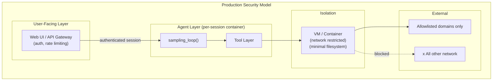

# Chapter 7: Production Hardening

## What Problem Does This Solve?

The quickstarts are reference implementations, not production systems. The README explicitly warns that the customer support agent "is provided in a pre-release, beta, or trial form" and should not be deployed in mission-critical environments without thorough testing. This chapter identifies every pattern in the quickstarts that needs strengthening before production deployment: security isolation, authentication, retry logic, observability, provider fallback, and responsible use of computer use in multi-user environments.

## Security Model: Computer Use

Computer use is the highest-risk quickstart. The Docker container already enforces the most important isolation boundaries, but production deployments need additional controls.



**Isolation requirements for production computer use:**

1. **One container per session**: never share a container between users. The Docker image is already designed for this — run a new instance per user session.

2. **Network allowlisting**: the container runs a full browser by default. Without network controls, Claude (or injected prompts) could make arbitrary web requests. Use Docker's `--network` options or a proxy to restrict outbound access to a domain allowlist.

3. **Credential isolation**: never mount credentials, AWS profiles, or SSH keys into the container. If Claude needs to call an API, inject a scoped, short-lived token via environment variable with narrow permissions.

4. **Prompt injection awareness**: web pages Claude visits can contain adversarial instructions. The system prompt in `loop.py` warns Claude about this, but that is not a technical control. For sensitive workflows, avoid general browsing and restrict the task scope.

5. **Human confirmation gates**: for irreversible actions (file deletion, form submission, API calls with side effects), implement a confirmation step in the Streamlit callback before executing the tool result.

## Authentication and API Key Management

None of the quickstarts include production authentication. They assume a single trusted user passing their own API key. For multi-user deployments:

```python
# Pattern: per-request API key validation with usage limits
from anthropic import Anthropic
import os

def get_client_for_request(request_api_key: str | None) -> Anthropic:
    """
    In production, you would validate the request_api_key against
    your own user database, check usage limits, and potentially use
    a server-side API key rather than the user's own key.
    """
    if request_api_key:
        # User-provided key — validate format
        if not request_api_key.startswith("sk-ant-"):
            raise ValueError("Invalid API key format")
        return Anthropic(api_key=request_api_key)
    else:
        # Server-side key — check that the request is authenticated
        server_key = os.environ.get("ANTHROPIC_API_KEY")
        if not server_key:
            raise RuntimeError("No API key configured")
        return Anthropic(api_key=server_key)
```

For the Next.js quickstarts, the API key should never be sent to the browser. Route all Claude calls through Next.js API routes (as both quickstarts already do) and store the key only in server-side environment variables.

## Retry Logic and Rate Limit Handling

The quickstart sampling loops do not implement retry logic. For production:

```python
import anthropic
import asyncio
import random

async def api_call_with_retry(
    client: anthropic.Anthropic,
    *,
    max_retries: int = 3,
    base_delay: float = 1.0,
    **kwargs,
):
    """Call the API with exponential backoff on rate limit errors."""
    for attempt in range(max_retries + 1):
        try:
            return await asyncio.to_thread(
                client.beta.messages.create, **kwargs
            )
        except anthropic.RateLimitError as e:
            if attempt == max_retries:
                raise
            # Exponential backoff with jitter
            delay = base_delay * (2 ** attempt) + random.uniform(0, 1)
            await asyncio.sleep(delay)
        except anthropic.APIConnectionError as e:
            if attempt == max_retries:
                raise
            await asyncio.sleep(base_delay)
        except anthropic.APIStatusError as e:
            # 529 = overloaded, retry; other 4xx = don't retry
            if e.status_code == 529 and attempt < max_retries:
                await asyncio.sleep(base_delay * (2 ** attempt))
            else:
                raise
```

## Provider Fallback

The computer-use and browser-use quickstarts already abstract the API provider. In production, you can use this abstraction for automatic fallback:

```python
from enum import Enum

class APIProvider(str, Enum):
    ANTHROPIC = "anthropic"
    BEDROCK = "bedrock"
    VERTEX = "vertex"

async def get_client_with_fallback(
    primary: APIProvider = APIProvider.ANTHROPIC,
    fallback: APIProvider = APIProvider.BEDROCK,
):
    """Try primary provider; fall back to secondary on failure."""
    try:
        client = create_client(primary)
        # Quick health check
        await asyncio.to_thread(client.models.list)
        return client, primary
    except Exception:
        client = create_client(fallback)
        return client, fallback
```

AWS Bedrock and Google Vertex provide enterprise SLAs that may exceed Anthropic's direct API availability. For mission-critical deployments, configure Bedrock as a fallback.

## Observability

The quickstarts include minimal observability. The computer-use Streamlit app has an "HTTP Exchange Logs" tab that shows raw API request/response JSON — useful for debugging but not for production monitoring.

For production, emit structured logs from the sampling loop:

```python
import structlog
import time

logger = structlog.get_logger()

async def sampling_loop_with_telemetry(
    *,
    session_id: str,
    user_id: str,
    **kwargs,
):
    start_time = time.monotonic()
    total_input_tokens = 0
    total_output_tokens = 0
    tool_call_counts: dict[str, int] = {}
    turn_count = 0

    async def instrumented_api_callback(response):
        nonlocal total_input_tokens, total_output_tokens, turn_count
        turn_count += 1
        total_input_tokens += response.usage.input_tokens
        total_output_tokens += response.usage.output_tokens
        logger.info(
            "sampling_loop.turn",
            session_id=session_id,
            turn=turn_count,
            input_tokens=response.usage.input_tokens,
            output_tokens=response.usage.output_tokens,
            stop_reason=response.stop_reason,
        )

    async def instrumented_tool_callback(result, tool_use_id):
        nonlocal tool_call_counts
        # Count tool calls by type
        ...

    try:
        messages = await sampling_loop(
            api_response_callback=instrumented_api_callback,
            tool_output_callback=instrumented_tool_callback,
            **kwargs,
        )
        duration = time.monotonic() - start_time
        logger.info(
            "sampling_loop.complete",
            session_id=session_id,
            user_id=user_id,
            duration_seconds=round(duration, 2),
            total_turns=turn_count,
            total_input_tokens=total_input_tokens,
            total_output_tokens=total_output_tokens,
            tool_calls=tool_call_counts,
        )
        return messages
    except Exception as e:
        logger.error(
            "sampling_loop.error",
            session_id=session_id,
            error=str(e),
            error_type=type(e).__name__,
        )
        raise
```

## Cost Controls

Computer use sessions can become expensive quickly. For production:

| Control | Implementation |
|:--------|:---------------|
| Maximum turns per session | Add a `max_turns` counter to the sampling loop |
| Maximum tokens per session | Track `usage.input_tokens + usage.output_tokens` and abort if exceeded |
| Image truncation | Set `only_n_most_recent_images=5` (already supported in the loop) |
| Prompt caching | Enable `inject_prompt_caching=True` (already supported) |
| Model downgrade for simple tasks | Use `claude-haiku-4-20250514` unless the task requires full reasoning |
| Session timeout | Kill containers after a wall-clock limit (e.g., 10 minutes) |

```python
# Adding max_turns to sampling_loop
MAX_TURNS = 50

turn_count = 0
while True:
    turn_count += 1
    if turn_count > MAX_TURNS:
        messages.append({
            "role": "user",
            "content": "Session turn limit reached. Please summarize your progress."
        })
        # One final call to get a summary, then exit
        final_response = client.beta.messages.create(...)
        return messages

    # ... normal loop body
```

## Code Quality Requirements

The repository's `pyproject.toml` enforces code quality for all contributions. For production forks:

```toml
[tool.ruff]
line-length = 100
select = ["E", "F", "W", "I", "UP", "S", "B", "A", "C4", "T20"]

[tool.pyright]
pythonVersion = "3.11"
strict = true
reportMissingImports = true

[tool.pytest.ini_options]
asyncio_mode = "auto"
```

Run the full quality gate before deploying any changes:

```bash
ruff check .
ruff format --check .
pyright
pytest --timeout=30
```

## Docker Security Hardening

The computer-use Dockerfile runs as root by default. For production:

```dockerfile
# Add to Dockerfile after existing content
# Create non-root user
RUN useradd -m -u 1000 -s /bin/bash agent
USER agent
WORKDIR /home/agent

# Read-only root filesystem where possible
# Mount only required volumes
# Drop unnecessary capabilities
```

And in your `docker run` command:

```bash
docker run \
    --security-opt=no-new-privileges \
    --cap-drop=ALL \
    --cap-add=SYS_PTRACE \
    --read-only \
    --tmpfs /tmp:rw,noexec,nosuid \
    --network=restricted \
    -e ANTHROPIC_API_KEY=$ANTHROPIC_API_KEY \
    computer-use-demo:production
```

## Summary

Hardening the quickstarts for production requires addressing five concerns: security isolation (one container per session, network allowlists, no credentials in containers), authentication (route API keys server-side), reliability (retry logic with exponential backoff, provider fallback), observability (structured logging with per-session token tracking), and cost controls (turn limits, image truncation, prompt caching). The code quality infrastructure in `pyproject.toml` already handles linting, type checking, and testing — use it.

Next: [Chapter 8: End-to-End Walkthroughs](08-real-world-examples.md)

---

- [Tutorial Index](README.md)
- [Previous Chapter: Chapter 6: MCP Integration](06-best-practices.md)
- [Next Chapter: Chapter 8: End-to-End Walkthroughs](08-real-world-examples.md)
- [Main Catalog](../../README.md#-tutorial-catalog)
