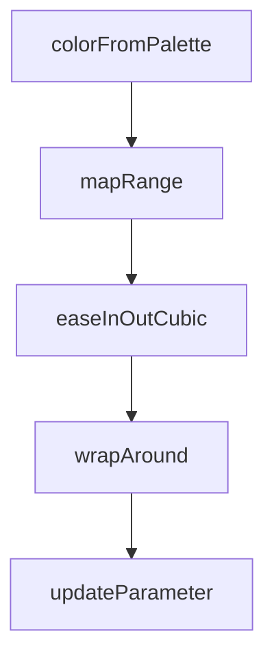

# Chapter 7: Publishing and Sharing

Welcome to **Chapter 7: Publishing and Sharing**. In this part of **Anthropic Skills Tutorial: Reusable AI Agent Capabilities**, you will build an intuitive mental model first, then move into concrete implementation details and practical production tradeoffs.


Publishing is where many teams lose quality. The fix is strong packaging and governance.

## Distribution Models

| Model | Best For | Tradeoff |
|:------|:---------|:---------|
| Public GitHub repo | Community adoption | Requires stronger support burden |
| Internal monorepo | Enterprise governance | Lower external discoverability |
| Curated plugin catalog | Controlled deployment | More release process overhead |

## Release Process

1. Update skill version and changelog.
2. Run regression suite.
3. Verify references/assets integrity.
4. Tag release and publish notes.
5. Announce migration steps for breaking changes.

## Ownership and Governance

Every published skill should have:

- a technical owner
- a backup owner
- an issue escalation path
- a deprecation policy

Without clear ownership, popular skills decay quickly.

## Security and Compliance Gates

Before publishing:

- scan for secrets in instructions/scripts
- verify license metadata for bundled assets
- validate third-party dependency policy
- confirm personally identifiable information handling

## Consumer-Facing Documentation

At minimum include:

- when to use the skill
- known limitations
- input expectations
- output contract
- examples for successful and failed cases

## Summary

You can now publish skills with predictable quality and clear operational ownership.

Next: [Chapter 8: Real-World Examples](08-real-world-examples.md)

## What Problem Does This Solve?

Most teams struggle here because the hard part is not writing more code, but deciding clear boundaries for core abstractions in this chapter so behavior stays predictable as complexity grows.

In practical terms, this chapter helps you avoid three common failures:

- coupling core logic too tightly to one implementation path
- missing the handoff boundaries between setup, execution, and validation
- shipping changes without clear rollback or observability strategy

After working through this chapter, you should be able to reason about `Chapter 7: Publishing and Sharing` as an operating subsystem inside **Anthropic Skills Tutorial: Reusable AI Agent Capabilities**, with explicit contracts for inputs, state transitions, and outputs.

Use the implementation notes around execution and reliability details as your checklist when adapting these patterns to your own repository.

## How it Works Under the Hood

Under the hood, `Chapter 7: Publishing and Sharing` usually follows a repeatable control path:

1. **Context bootstrap**: initialize runtime config and prerequisites for `core component`.
2. **Input normalization**: shape incoming data so `execution layer` receives stable contracts.
3. **Core execution**: run the main logic branch and propagate intermediate state through `state model`.
4. **Policy and safety checks**: enforce limits, auth scopes, and failure boundaries.
5. **Output composition**: return canonical result payloads for downstream consumers.
6. **Operational telemetry**: emit logs/metrics needed for debugging and performance tuning.

When debugging, walk this sequence in order and confirm each stage has explicit success/failure conditions.

## Source Walkthrough

Use the following upstream sources to verify implementation details while reading this chapter:

- [anthropics/skills repository](https://github.com/anthropics/skills)
  Why it matters: authoritative reference on `anthropics/skills repository` (github.com).

Suggested trace strategy:
- search upstream code for `Publishing` and `and` to map concrete implementation paths
- compare docs claims against actual runtime/config code before reusing patterns in production

## Chapter Connections

- [Tutorial Index](README.md)
- [Previous Chapter: Chapter 6: Best Practices](06-best-practices.md)
- [Next Chapter: Chapter 8: Real-World Examples](08-real-world-examples.md)
- [Main Catalog](../../README.md#-tutorial-catalog)
- [A-Z Tutorial Directory](../../discoverability/tutorial-directory.md)

## Depth Expansion Playbook

## Source Code Walkthrough

### `skills/algorithmic-art/templates/generator_template.js`

The `colorFromPalette` function in [`skills/algorithmic-art/templates/generator_template.js`](https://github.com/anthropics/skills/blob/HEAD/skills/algorithmic-art/templates/generator_template.js) handles a key part of this chapter's functionality:

```js
}

function colorFromPalette(index) {
    return params.colorPalette[index % params.colorPalette.length];
}

// Mapping and easing
function mapRange(value, inMin, inMax, outMin, outMax) {
    return outMin + (outMax - outMin) * ((value - inMin) / (inMax - inMin));
}

function easeInOutCubic(t) {
    return t < 0.5 ? 4 * t * t * t : 1 - Math.pow(-2 * t + 2, 3) / 2;
}

// Constrain to bounds
function wrapAround(value, max) {
    if (value < 0) return max;
    if (value > max) return 0;
    return value;
}

// ============================================================================
// 7. PARAMETER UPDATES (Connect to UI)
// ============================================================================

function updateParameter(paramName, value) {
    params[paramName] = value;
    // Decide if you need to regenerate or just update
    // Some params can update in real-time, others need full regeneration
}

```

This function is important because it defines how Anthropic Skills Tutorial: Reusable AI Agent Capabilities implements the patterns covered in this chapter.

### `skills/algorithmic-art/templates/generator_template.js`

The `mapRange` function in [`skills/algorithmic-art/templates/generator_template.js`](https://github.com/anthropics/skills/blob/HEAD/skills/algorithmic-art/templates/generator_template.js) handles a key part of this chapter's functionality:

```js

// Mapping and easing
function mapRange(value, inMin, inMax, outMin, outMax) {
    return outMin + (outMax - outMin) * ((value - inMin) / (inMax - inMin));
}

function easeInOutCubic(t) {
    return t < 0.5 ? 4 * t * t * t : 1 - Math.pow(-2 * t + 2, 3) / 2;
}

// Constrain to bounds
function wrapAround(value, max) {
    if (value < 0) return max;
    if (value > max) return 0;
    return value;
}

// ============================================================================
// 7. PARAMETER UPDATES (Connect to UI)
// ============================================================================

function updateParameter(paramName, value) {
    params[paramName] = value;
    // Decide if you need to regenerate or just update
    // Some params can update in real-time, others need full regeneration
}

function regenerate() {
    // Reinitialize your generative system
    // Useful when parameters change significantly
    initializeSeed(params.seed);
    // Then regenerate your system
```

This function is important because it defines how Anthropic Skills Tutorial: Reusable AI Agent Capabilities implements the patterns covered in this chapter.

### `skills/algorithmic-art/templates/generator_template.js`

The `easeInOutCubic` function in [`skills/algorithmic-art/templates/generator_template.js`](https://github.com/anthropics/skills/blob/HEAD/skills/algorithmic-art/templates/generator_template.js) handles a key part of this chapter's functionality:

```js
}

function easeInOutCubic(t) {
    return t < 0.5 ? 4 * t * t * t : 1 - Math.pow(-2 * t + 2, 3) / 2;
}

// Constrain to bounds
function wrapAround(value, max) {
    if (value < 0) return max;
    if (value > max) return 0;
    return value;
}

// ============================================================================
// 7. PARAMETER UPDATES (Connect to UI)
// ============================================================================

function updateParameter(paramName, value) {
    params[paramName] = value;
    // Decide if you need to regenerate or just update
    // Some params can update in real-time, others need full regeneration
}

function regenerate() {
    // Reinitialize your generative system
    // Useful when parameters change significantly
    initializeSeed(params.seed);
    // Then regenerate your system
}

// ============================================================================
// 8. COMMON P5.JS PATTERNS
```

This function is important because it defines how Anthropic Skills Tutorial: Reusable AI Agent Capabilities implements the patterns covered in this chapter.

### `skills/algorithmic-art/templates/generator_template.js`

The `wrapAround` function in [`skills/algorithmic-art/templates/generator_template.js`](https://github.com/anthropics/skills/blob/HEAD/skills/algorithmic-art/templates/generator_template.js) handles a key part of this chapter's functionality:

```js

// Constrain to bounds
function wrapAround(value, max) {
    if (value < 0) return max;
    if (value > max) return 0;
    return value;
}

// ============================================================================
// 7. PARAMETER UPDATES (Connect to UI)
// ============================================================================

function updateParameter(paramName, value) {
    params[paramName] = value;
    // Decide if you need to regenerate or just update
    // Some params can update in real-time, others need full regeneration
}

function regenerate() {
    // Reinitialize your generative system
    // Useful when parameters change significantly
    initializeSeed(params.seed);
    // Then regenerate your system
}

// ============================================================================
// 8. COMMON P5.JS PATTERNS
// ============================================================================

// Drawing with transparency for trails/fading
function fadeBackground(opacity) {
    fill(250, 249, 245, opacity); // Anthropic light with alpha
```

This function is important because it defines how Anthropic Skills Tutorial: Reusable AI Agent Capabilities implements the patterns covered in this chapter.


## How These Components Connect


