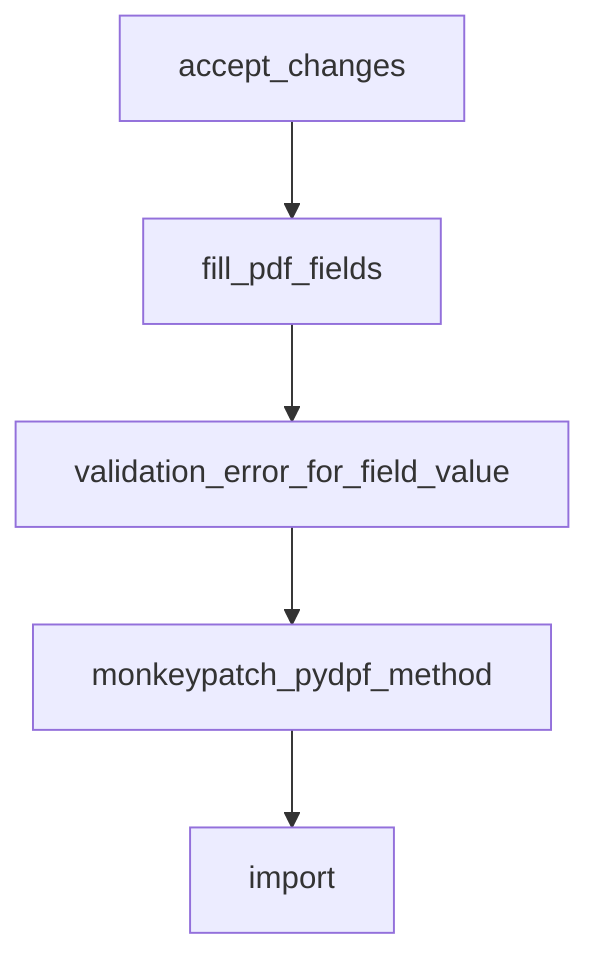

# Chapter 8: Real-World Examples

Welcome to **Chapter 8: Real-World Examples**. In this part of **Anthropic Skills Tutorial: Reusable AI Agent Capabilities**, you will build an intuitive mental model first, then move into concrete implementation details and practical production tradeoffs.


This chapter maps the design and operations patterns into deployable workflows.

## Example 1: Brand Governance Skill

**Goal:** enforce consistent messaging across marketing outputs.

**Inputs:** draft copy, audience, campaign goal

**References:** brand voice guide, prohibited claims list, legal disclaimer policy

**Outputs:** revised copy + policy gap report

Why it works:

- strict output schema
- explicit policy references
- deterministic violation labeling

## Example 2: Customer Support Triage Skill

**Goal:** route inbound issues with consistent severity scoring.

**Inputs:** ticket text, customer tier, product area

**Scripts:** classifier and routing map resolver

**Outputs:** severity, queue, response draft, escalation rationale

Why it works:

- deterministic routing logic in scripts
- natural language only for explanations
- audit-friendly structured fields

## Example 3: Engineering RFC Assistant Skill

**Goal:** convert rough architecture notes into review-ready RFC drafts.

**Inputs:** notes, constraints, system context

**Templates:** canonical RFC format with risk and rollout sections

**Outputs:** RFC draft + unresolved questions list

Why it works:

- fixed section order and quality gate checklist
- uncertainty explicitly captured, not hidden
- easy reviewer handoff

## Example 4: Compliance Evidence Skill

**Goal:** collect evidence artifacts for control attestations.

**Inputs:** control ID, system scope, evidence sources

**Outputs:** evidence matrix with source links and confidence labels

Why it works:

- strict data provenance requirements
- source citation field required for each row
- built-in incompleteness detection

## Final Implementation Playbook

1. Start with a narrow outcome.
2. Add schema contracts before scaling usage.
3. Move deterministic logic to scripts.
4. Introduce regression testing early.
5. Publish only with ownership and lifecycle policy.

## Final Summary

You now have a full lifecycle blueprint for skills: design, runtime integration, quality control, and governed distribution.

Related:
- [MCP Python SDK Tutorial](../mcp-python-sdk-tutorial/)
- [MCP Servers Tutorial](../mcp-servers-tutorial/)
- [Claude Code Tutorial](../claude-code-tutorial/)

## What Problem Does This Solve?

Most teams struggle here because the hard part is not writing more code, but deciding clear boundaries for core abstractions in this chapter so behavior stays predictable as complexity grows.

In practical terms, this chapter helps you avoid three common failures:

- coupling core logic too tightly to one implementation path
- missing the handoff boundaries between setup, execution, and validation
- shipping changes without clear rollback or observability strategy

After working through this chapter, you should be able to reason about `Chapter 8: Real-World Examples` as an operating subsystem inside **Anthropic Skills Tutorial: Reusable AI Agent Capabilities**, with explicit contracts for inputs, state transitions, and outputs.

Use the implementation notes around execution and reliability details as your checklist when adapting these patterns to your own repository.

## How it Works Under the Hood

Under the hood, `Chapter 8: Real-World Examples` usually follows a repeatable control path:

1. **Context bootstrap**: initialize runtime config and prerequisites for `core component`.
2. **Input normalization**: shape incoming data so `execution layer` receives stable contracts.
3. **Core execution**: run the main logic branch and propagate intermediate state through `state model`.
4. **Policy and safety checks**: enforce limits, auth scopes, and failure boundaries.
5. **Output composition**: return canonical result payloads for downstream consumers.
6. **Operational telemetry**: emit logs/metrics needed for debugging and performance tuning.

When debugging, walk this sequence in order and confirm each stage has explicit success/failure conditions.

## Source Walkthrough

Use the following upstream sources to verify implementation details while reading this chapter:

- [anthropics/skills repository](https://github.com/anthropics/skills)
  Why it matters: authoritative reference on `anthropics/skills repository` (github.com).

Suggested trace strategy:
- search upstream code for `Real-World` and `Examples` to map concrete implementation paths
- compare docs claims against actual runtime/config code before reusing patterns in production

## Chapter Connections

- [Tutorial Index](README.md)
- [Previous Chapter: Chapter 7: Publishing and Sharing](07-publishing-sharing.md)
- [Main Catalog](../../README.md#-tutorial-catalog)
- [A-Z Tutorial Directory](../../discoverability/tutorial-directory.md)

## Depth Expansion Playbook

## Source Code Walkthrough

### `skills/docx/scripts/accept_changes.py`

The `accept_changes` function in [`skills/docx/scripts/accept_changes.py`](https://github.com/anthropics/skills/blob/HEAD/skills/docx/scripts/accept_changes.py) handles a key part of this chapter's functionality:

```py


def accept_changes(
    input_file: str,
    output_file: str,
) -> tuple[None, str]:
    input_path = Path(input_file)
    output_path = Path(output_file)

    if not input_path.exists():
        return None, f"Error: Input file not found: {input_file}"

    if not input_path.suffix.lower() == ".docx":
        return None, f"Error: Input file is not a DOCX file: {input_file}"

    try:
        output_path.parent.mkdir(parents=True, exist_ok=True)
        shutil.copy2(input_path, output_path)
    except Exception as e:
        return None, f"Error: Failed to copy input file to output location: {e}"

    if not _setup_libreoffice_macro():
        return None, "Error: Failed to setup LibreOffice macro"

    cmd = [
        "soffice",
        "--headless",
        f"-env:UserInstallation=file://{LIBREOFFICE_PROFILE}",
        "--norestore",
        "vnd.sun.star.script:Standard.Module1.AcceptAllTrackedChanges?language=Basic&location=application",
        str(output_path.absolute()),
    ]
```

This function is important because it defines how Anthropic Skills Tutorial: Reusable AI Agent Capabilities implements the patterns covered in this chapter.

### `skills/pdf/scripts/fill_fillable_fields.py`

The `fill_pdf_fields` function in [`skills/pdf/scripts/fill_fillable_fields.py`](https://github.com/anthropics/skills/blob/HEAD/skills/pdf/scripts/fill_fillable_fields.py) handles a key part of this chapter's functionality:

```py


def fill_pdf_fields(input_pdf_path: str, fields_json_path: str, output_pdf_path: str):
    with open(fields_json_path) as f:
        fields = json.load(f)
    fields_by_page = {}
    for field in fields:
        if "value" in field:
            field_id = field["field_id"]
            page = field["page"]
            if page not in fields_by_page:
                fields_by_page[page] = {}
            fields_by_page[page][field_id] = field["value"]
    
    reader = PdfReader(input_pdf_path)

    has_error = False
    field_info = get_field_info(reader)
    fields_by_ids = {f["field_id"]: f for f in field_info}
    for field in fields:
        existing_field = fields_by_ids.get(field["field_id"])
        if not existing_field:
            has_error = True
            print(f"ERROR: `{field['field_id']}` is not a valid field ID")
        elif field["page"] != existing_field["page"]:
            has_error = True
            print(f"ERROR: Incorrect page number for `{field['field_id']}` (got {field['page']}, expected {existing_field['page']})")
        else:
            if "value" in field:
                err = validation_error_for_field_value(existing_field, field["value"])
                if err:
                    print(err)
```

This function is important because it defines how Anthropic Skills Tutorial: Reusable AI Agent Capabilities implements the patterns covered in this chapter.

### `skills/pdf/scripts/fill_fillable_fields.py`

The `validation_error_for_field_value` function in [`skills/pdf/scripts/fill_fillable_fields.py`](https://github.com/anthropics/skills/blob/HEAD/skills/pdf/scripts/fill_fillable_fields.py) handles a key part of this chapter's functionality:

```py
        else:
            if "value" in field:
                err = validation_error_for_field_value(existing_field, field["value"])
                if err:
                    print(err)
                    has_error = True
    if has_error:
        sys.exit(1)

    writer = PdfWriter(clone_from=reader)
    for page, field_values in fields_by_page.items():
        writer.update_page_form_field_values(writer.pages[page - 1], field_values, auto_regenerate=False)

    writer.set_need_appearances_writer(True)
    
    with open(output_pdf_path, "wb") as f:
        writer.write(f)


def validation_error_for_field_value(field_info, field_value):
    field_type = field_info["type"]
    field_id = field_info["field_id"]
    if field_type == "checkbox":
        checked_val = field_info["checked_value"]
        unchecked_val = field_info["unchecked_value"]
        if field_value != checked_val and field_value != unchecked_val:
            return f'ERROR: Invalid value "{field_value}" for checkbox field "{field_id}". The checked value is "{checked_val}" and the unchecked value is "{unchecked_val}"'
    elif field_type == "radio_group":
        option_values = [opt["value"] for opt in field_info["radio_options"]]
        if field_value not in option_values:
            return f'ERROR: Invalid value "{field_value}" for radio group field "{field_id}". Valid values are: {option_values}' 
    elif field_type == "choice":
```

This function is important because it defines how Anthropic Skills Tutorial: Reusable AI Agent Capabilities implements the patterns covered in this chapter.

### `skills/pdf/scripts/fill_fillable_fields.py`

The `monkeypatch_pydpf_method` function in [`skills/pdf/scripts/fill_fillable_fields.py`](https://github.com/anthropics/skills/blob/HEAD/skills/pdf/scripts/fill_fillable_fields.py) handles a key part of this chapter's functionality:

```py


def monkeypatch_pydpf_method():
    from pypdf.generic import DictionaryObject
    from pypdf.constants import FieldDictionaryAttributes

    original_get_inherited = DictionaryObject.get_inherited

    def patched_get_inherited(self, key: str, default = None):
        result = original_get_inherited(self, key, default)
        if key == FieldDictionaryAttributes.Opt:
            if isinstance(result, list) and all(isinstance(v, list) and len(v) == 2 for v in result):
                result = [r[0] for r in result]
        return result

    DictionaryObject.get_inherited = patched_get_inherited


if __name__ == "__main__":
    if len(sys.argv) != 4:
        print("Usage: fill_fillable_fields.py [input pdf] [field_values.json] [output pdf]")
        sys.exit(1)
    monkeypatch_pydpf_method()
    input_pdf = sys.argv[1]
    fields_json = sys.argv[2]
    output_pdf = sys.argv[3]
    fill_pdf_fields(input_pdf, fields_json, output_pdf)

```

This function is important because it defines how Anthropic Skills Tutorial: Reusable AI Agent Capabilities implements the patterns covered in this chapter.


## How These Components Connect


