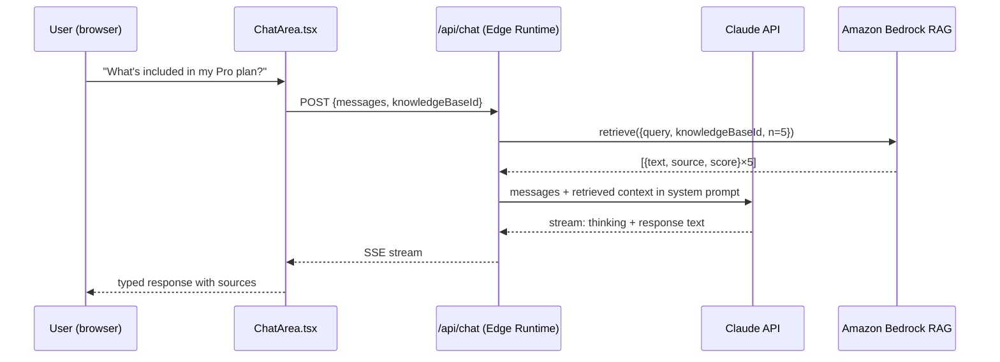
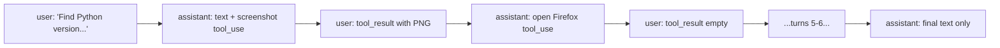

# Chapter 8: End-to-End Walkthroughs

## What Problem Does This Solve?

Reading architecture descriptions and code snippets in isolation does not tell you what it feels like to use these quickstarts, what their actual request/response flows look like, or where the real integration pain points are. This chapter walks through three complete scenarios — a customer support chat with knowledge retrieval, a financial data analysis session, and a computer use task — showing the exact API calls, message structures, and decision points at each step.

## Walkthrough 1: Customer Support Agent with RAG

### Scenario

A user asks about their subscription plan. The app must retrieve relevant policy documents from Amazon Bedrock and generate a helpful response while detecting if the user is frustrated and should be redirected to a human agent.

### System Architecture



### Step 1: Knowledge Base Retrieval

The Next.js API route calls Bedrock before sending anything to Claude:

```typescript
// From customer-support-agent/app/api/chat/route.ts (simplified)
import {
  BedrockAgentRuntimeClient,
  RetrieveCommand,
} from "@aws-sdk/client-bedrock-agent-runtime";

async function retrieveContext(
  query: string,
  knowledgeBaseId: string
): Promise<string> {
  const client = new BedrockAgentRuntimeClient({ region: "us-east-1" });
  const response = await client.send(
    new RetrieveCommand({
      knowledgeBaseId,
      retrievalQuery: { text: query },
      retrievalConfiguration: {
        vectorSearchConfiguration: { numberOfResults: 5 },
      },
    })
  );

  const passages = response.retrievalResults
    ?.filter((r) => (r.score ?? 0) > 0.5)
    .map((r) => r.content?.text ?? "")
    .join("\n\n---\n\n");

  return passages ?? "";
}
```

### Step 2: System Prompt Construction

The retrieved context is injected into the system prompt, not the user message. This is important: putting context in the system prompt enables prompt caching — if the user asks multiple questions about the same knowledge base, the cached system prompt means subsequent requests pay only 10% of the input token cost for the context.

```typescript
const systemPrompt = `You are a helpful customer support agent for Acme Corp.
Use only the information provided in the knowledge base context below.
If the answer is not in the context, say so clearly.

KNOWLEDGE BASE CONTEXT:
${retrievedContext}

MOOD DETECTION:
If the user appears frustrated, confused, or mentions they want to speak to a human,
respond with JSON: {"redirect_to_human": true, "reason": "..."}
Otherwise respond normally.`;
```

### Step 3: Streaming Response with Extended Thinking

```typescript
const stream = await client.messages.stream({
  model: "claude-opus-4-20250514",
  max_tokens: 8096,
  thinking: { type: "enabled", budget_tokens: 2048 },
  system: systemPrompt,
  messages: conversationHistory,
});

// Stream to browser as Server-Sent Events
for await (const event of stream) {
  if (event.type === "content_block_delta") {
    if (event.delta.type === "thinking_delta") {
      // Display in the "Agent Thinking" panel
      yield { type: "thinking", text: event.delta.thinking };
    } else if (event.delta.type === "text_delta") {
      yield { type: "text", text: event.delta.text };
    }
  }
}
```

### Step 4: Mood Detection and Human Redirect

The `ChatArea.tsx` component parses Claude's response for the JSON redirect signal:

```typescript
function parseResponse(text: string): {
  shouldRedirect: boolean;
  reason: string;
  cleanText: string;
} {
  try {
    const parsed = JSON.parse(text);
    if (parsed.redirect_to_human) {
      return {
        shouldRedirect: true,
        reason: parsed.reason,
        cleanText: "I'm connecting you with a human agent.",
      };
    }
  } catch {
    // Not JSON — normal response
  }
  return { shouldRedirect: false, reason: "", cleanText: text };
}
```

### What This Demonstrates

- Context injection via system prompt (enables caching on repeated queries)
- Extended thinking for transparent reasoning
- Streaming SSE for real-time UX
- Structured output (JSON) embedded in natural language response
- Human escalation signal without requiring function/tool calls

---

## Walkthrough 2: Financial Data Analysis

### Scenario

A user uploads a CSV of quarterly revenue data and asks "What caused the Q3 dip and what does it mean for Q4 projections?"

### Step 1: File Upload and Parsing

The frontend sends the file to `/api/analyze` as a multipart form upload. The API route handles multiple file types:

```typescript
// financial-data-analyst/app/api/analyze/route.ts (simplified)
async function parseFile(
  file: File
): Promise<{ text: string; mimeType: string }> {
  const buffer = await file.arrayBuffer();

  if (file.type === "text/csv" || file.name.endsWith(".csv")) {
    return {
      text: new TextDecoder().decode(buffer),
      mimeType: "text/plain",
    };
  } else if (file.type === "application/pdf") {
    // Use PDF.js to extract text
    const text = await extractPdfText(buffer);
    return { text, mimeType: "text/plain" };
  } else if (file.type.startsWith("image/")) {
    // Send as image block directly to Claude
    return {
      text: Buffer.from(buffer).toString("base64"),
      mimeType: file.type,
    };
  }
  throw new Error(`Unsupported file type: ${file.type}`);
}
```

### Step 2: Claude Analysis with Chart Request

The message to Claude includes the file content and instructs it to return structured visualization data alongside its analysis:

```typescript
const analysisPrompt = `Analyze this financial data and answer the user's question.

If your analysis would benefit from a visualization, include a JSON block in your response
with this format:
\`\`\`chart
{
  "type": "line" | "bar" | "area" | "pie" | "stacked_bar",
  "title": "Chart title",
  "data": [{"label": "Q1", "value": 1250000}, ...],
  "xKey": "label",
  "yKey": "value"
}
\`\`\`

Always explain your reasoning in natural language before or after the chart.

DATA:
${fileContent}

USER QUESTION: ${userQuestion}`;
```

### Step 3: Chart Extraction and Rendering

The frontend parses the response to extract chart JSON blocks:

```typescript
function extractChartsFromResponse(text: string): {
  charts: ChartData[];
  cleanText: string;
} {
  const chartRegex = /```chart\n([\s\S]*?)\n```/g;
  const charts: ChartData[] = [];
  let cleanText = text;

  let match;
  while ((match = chartRegex.exec(text)) !== null) {
    try {
      charts.push(JSON.parse(match[1]));
      cleanText = cleanText.replace(match[0], `[Chart: ${charts.length}]`);
    } catch {
      // Malformed chart JSON — skip
    }
  }

  return { charts, cleanText };
}
```

Charts are then rendered with Recharts:

```typescript
// Simplified ChartRenderer component
function ChartRenderer({ chart }: { chart: ChartData }) {
  switch (chart.type) {
    case "line":
      return (
        <LineChart data={chart.data}>
          <XAxis dataKey={chart.xKey} />
          <YAxis />
          <CartesianGrid strokeDasharray="3 3" />
          <Tooltip />
          <Line type="monotone" dataKey={chart.yKey} stroke="#8884d8" />
        </LineChart>
      );
    case "bar":
      return (
        <BarChart data={chart.data}>
          <XAxis dataKey={chart.xKey} />
          <YAxis />
          <Bar dataKey={chart.yKey} fill="#82ca9d" />
        </BarChart>
      );
    // ... other chart types
  }
}
```

### What This Demonstrates

- Multi-format file handling (CSV, PDF, image) before sending to Claude
- Structured output extraction from natural language responses (without tool use)
- Dynamic chart rendering tied to Claude's analysis
- Edge Runtime streaming for large file analysis responses

---

## Walkthrough 3: Computer Use Task

### Scenario

User asks: "Find the most recent Python release on python.org and create a text file on the desktop with the version number."

### Full Turn-by-Turn Trace

**Turn 1**: User sends message. Loop calls Claude with system prompt and empty message history.

Claude responds with:
```json
{
  "stop_reason": "tool_use",
  "content": [
    {
      "type": "text",
      "text": "I'll find the Python version on python.org. Let me start by taking a screenshot."
    },
    {
      "type": "tool_use",
      "id": "tu_01",
      "name": "computer",
      "input": {"action": "screenshot"}
    }
  ]
}
```

**Turn 2**: Loop executes screenshot, gets base64 PNG. Appends to messages:
```json
[
  {"role": "assistant", "content": [text_block, tool_use_tu_01]},
  {"role": "user",      "content": [{"type": "tool_result", "tool_use_id": "tu_01", "content": [{"type": "image", "source": {...}}]}]}
]
```

Claude sees the desktop screenshot and responds with tool_use to open Firefox.

**Turn 3–5**: Claude opens Firefox, navigates to python.org, and takes a screenshot to verify the page loaded.

**Turn 6**: Claude reads the version number from the screenshot:
```json
{
  "type": "tool_use",
  "name": "bash",
  "input": {"command": "echo '3.13.2' > ~/Desktop/python_version.txt"}
}
```

**Turn 7**: BashTool executes the command. Returns `ToolResult(output="")`. Claude sees the empty output (success) and responds:
```json
{
  "stop_reason": "end_turn",
  "content": [
    {
      "type": "text",
      "text": "Done. I found that the latest Python release is 3.13.2 and saved it to python_version.txt on the Desktop."
    }
  ]
}
```

No tool_use blocks → sampling loop terminates.

### Message History After 7 Turns



With `only_n_most_recent_images=3`, the loop would have removed the screenshots from turns 2–4 before sending turn 7's API call, keeping only the 3 most recent screenshots in the context.

---

## Adapting the Quickstarts: A Decision Guide

| You want to... | Start from | Key files to modify |
|:---------------|:-----------|:--------------------|
| Build a chat UI on top of Claude | `customer-support-agent` | `app/api/chat/route.ts`, `ChatArea.tsx` |
| Add custom knowledge retrieval | `customer-support-agent` | `app/api/chat/route.ts` (replace Bedrock with your retriever) |
| Build a data analysis app | `financial-data-analyst` | `app/api/analyze/route.ts`, add chart types |
| Build a desktop automation agent | `computer-use-demo` | `loop.py` (add tools), `tools/` |
| Build a minimal agent with custom tools | `agents/` | `agent.py`, `tools/` |
| Automate web tasks | `browser-use-demo` | `browser.py`, `loop.py` |
| Multi-session coding automation | `autonomous-coding` | `prompts/`, `autonomous_agent_demo.py` |

## Common Adaptation Pitfalls

**Removing the tool result messages**: If you call Claude and get a `tool_use` response, you must return a `tool_result` message before calling again. Skipping this causes an API validation error about the conversation not ending with a user message.

**Mismatched tool version and model**: Using `computer_20241022` with `claude-opus-4-20250514` causes a validation error. Always pick a tool version that matches your model version using the table in Chapter 2.

**Streaming in the sampling loop**: The computer-use loop uses non-streaming calls because tool results must be complete before execution. If you add streaming to this loop, you must buffer the full response before processing tool_use blocks.

**Sharing container state between users**: Never reuse a computer-use container across users or sessions. The `/tmp` directory, browser history, clipboard, and environment variables all persist within a container lifetime.

## Summary

These walkthroughs show the complete data flow through each quickstart: from user input through knowledge retrieval, Claude API calls, tool execution, and final response. The customer support agent demonstrates RAG + streaming + structured escalation signals. The financial analyst demonstrates multi-format file handling + chart extraction without tool use. The computer use walkthrough demonstrates the turn-by-turn conversation structure that makes the sampling loop terminate.

---

- [Tutorial Index](README.md)
- [Previous Chapter: Chapter 7: Production Hardening](07-publishing-sharing.md)
- [Main Catalog](../../README.md#-tutorial-catalog)
- [A-Z Tutorial Directory](../../discoverability/tutorial-directory.md)

## Related Tutorials

- [MCP Python SDK Tutorial](../mcp-python-sdk-tutorial/) — Build MCP servers to extend these quickstarts
- [MCP Servers Tutorial](../mcp-servers-tutorial/) — Reference server patterns
- [Claude Code Tutorial](../claude-code-tutorial/) — The CLI used by autonomous-coding
