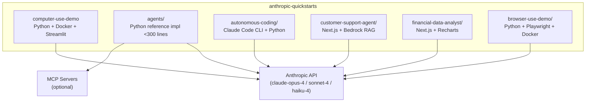

# Anthropic Quickstarts Tutorial

> A deep-dive into every project in the official `anthropics/anthropic-quickstarts` repository — computer use, autonomous coding, customer support, financial analysis, and the agents reference implementation.

## What This Tutorial Covers

The `anthropics/anthropic-quickstarts` repository is the canonical starting point for building production-quality Claude-powered applications. It is **not** a skills/plugin system — it is a collection of five standalone quickstart projects that demonstrate the full range of Claude's capabilities:

| Project | What It Demonstrates |
|:--------|:---------------------|
| `computer-use-demo/` | Claude controlling a real desktop via screenshot + xdotool actions |
| `agents/` | A minimal reference agent loop with tool use and MCP integration |
| `autonomous-coding/` | Two-agent pattern: initializer + coding agent across many sessions |
| `customer-support-agent/` | Next.js chat app with Claude + Amazon Bedrock RAG knowledge base |
| `financial-data-analyst/` | Next.js app with file upload, Claude analysis, and Recharts visualizations |
| `browser-use-demo/` | DOM-aware browser automation via Playwright instead of pixel coordinates |

## Current Snapshot (auto-updated)

- repository: [`anthropics/anthropic-quickstarts`](https://github.com/anthropics/anthropic-quickstarts)
- stars: about **16.1k**

## Why This Repository Matters

Before these quickstarts existed, the standard approach was to cobble together ad-hoc integrations from API documentation snippets. The quickstarts provide:

- **Working Docker environments** so you can run computer use in minutes, not days
- **Reference sampling loops** demonstrating multi-turn conversation management, prompt caching, and image window management
- **Concrete tool implementations** showing exactly how `bash`, `computer`, and `str_replace_based_edit_tool` are structured
- **Production patterns** like retry logic, provider abstraction (Anthropic / Bedrock / Vertex), and structured output validation

## Architecture Overview

## Chapter Guide

| Chapter | Topic | Core Question Answered |
|:--------|:------|:-----------------------|
| [1. Getting Started](01-getting-started.md) | Setup & mental model | What does each quickstart actually do and how do I run it? |
| [2. Quickstart Architecture](02-skill-categories.md) | Project anatomy | How are the five projects structured and what patterns do they share? |
| [3. Computer Use Deep-Dive](03-advanced-skill-design.md) | Computer use agent | How does Claude control a desktop: tools, loop, coordinate scaling? |
| [4. Tool Use Patterns](04-integration-platforms.md) | Tool design | How are BashTool, ComputerTool, EditTool, and custom tools built? |
| [5. Multi-Turn Conversation Patterns](05-production-skills.md) | Sampling loop | How does the agentic loop work, and how do you manage context? |
| [6. MCP Integration](06-best-practices.md) | MCP | How does the agents quickstart connect to MCP servers? |
| [7. Production Hardening](07-publishing-sharing.md) | Reliability | Prompt caching, image truncation, provider abstraction, security |
| [8. End-to-End Walkthroughs](08-real-world-examples.md) | Case studies | Full traces of the customer support and financial analyst quickstarts |

## Prerequisites

- Python 3.11+ and Node.js 18+ for local development
- Docker Desktop for computer-use and browser-use demos
- An `ANTHROPIC_API_KEY` from [console.anthropic.com](https://console.anthropic.com)
- Basic familiarity with async Python or TypeScript/React

## Related Tutorials

**Prerequisites:**
- [Anthropic API Tutorial](../anthropic-code-tutorial/) — Claude API fundamentals, message format, and streaming

**Complementary:**
- [MCP Python SDK Tutorial](../mcp-python-sdk-tutorial/) — Build custom MCP servers the agents quickstart can connect to
- [Claude Code Tutorial](../claude-code-tutorial/) — The CLI used by the autonomous-coding quickstart

**Next Steps:**
- [MCP Servers Tutorial](../mcp-servers-tutorial/) — Reference server patterns for extending any of these quickstarts

---

Ready to begin? Start with [Chapter 1: Getting Started](01-getting-started.md).

---

*Built from the official [anthropics/anthropic-quickstarts](https://github.com/anthropics/anthropic-quickstarts) repository. All code examples are taken directly from that source.*

## Navigation

- [Chapter 1: Getting Started](01-getting-started.md)
- [Back to Main Catalog](../../README.md#-tutorial-catalog)
- [Browse A-Z Tutorial Directory](../../discoverability/tutorial-directory.md)
- [Search by Intent](../../discoverability/query-hub.md)
