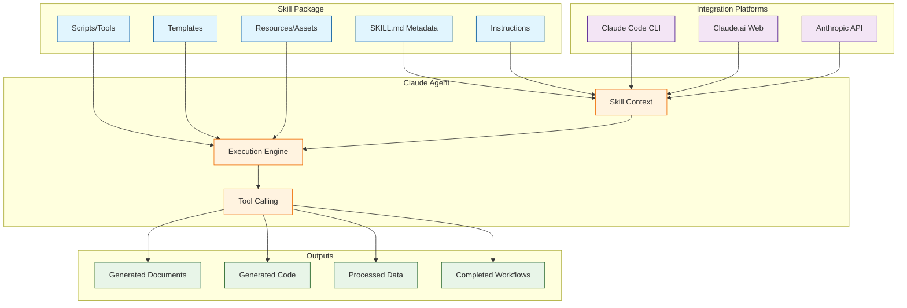

# Anthropic Skills Tutorial: Reusable AI Agent Capabilities

> Build, share, and deploy reusable skills that extend Claude's capabilities across Claude Code, Claude.ai, and the Anthropic API.

## 🎯 What are Anthropic Skills?

**Anthropic Skills** are packages of instructions, scripts, and resources that teach Claude how to complete specific tasks in a repeatable, consistent way. Skills can range from simple templates to complex multi-file applications that integrate with tools, APIs, and external systems.

### Key Features

| Feature | Description |
|:--------|:------------|
| **Simple Structure** | Just a folder with a `SKILL.md` file containing YAML frontmatter and instructions |
| **Multi-Platform** | Works with Claude Code, Claude.ai (paid plans), and Anthropic API |
| **Reusable** | Share skills via GitHub, Claude Code plugin marketplace, or private repos |
| **Composable** | Combine multiple skills or reference other skills in workflows |
| **Rich Content** | Support for Python scripts, TypeScript tools, templates, and resources |
| **Category Diversity** | Document generation, creative work, development tools, enterprise workflows |

## Architecture Overview

## Tutorial Structure

| Chapter | Topic | What You'll Learn |
|:--------|:------|:------------------|
| [1. Getting Started](01-getting-started.md) | Basics | Skill structure, SKILL.md format, first skill creation |
| [2. Skill Categories](02-skill-categories.md) | Taxonomy | Document, creative, technical, enterprise skill types |
| [3. Advanced Skill Design](03-advanced-skill-design.md) | Architecture | Multi-file skills, Python/TypeScript scripts, resources |
| [4. Integration Platforms](04-integration-platforms.md) | Deployment | Claude Code, Claude.ai, API integration patterns |
| [5. Production Skills](05-production-skills.md) | Real-World | Document generation (DOCX, PDF, PPTX, XLSX) |
| [6. Best Practices](06-best-practices.md) | Quality | Skill composition, testing, documentation, versioning |
| [7. Publishing & Sharing](07-publishing-sharing.md) | Distribution | Plugin marketplace, GitHub, private distribution |
| [8. Real-World Examples](08-real-world-examples.md) | Case Studies | Brand guidelines, data analysis, automation workflows |

## Tech Stack

| Component | Technology |
|:----------|:-----------|
| **Languages** | Python 83.9%, JavaScript 9.4%, HTML 4.3% |
| **Skill Format** | Markdown with YAML frontmatter |
| **Document Gen** | python-docx, openpyxl, python-pptx, ReportLab |
| **Integration** | MCP (Model Context Protocol) for advanced skills |
| **Platforms** | Claude Code (CLI), Claude.ai (web), Anthropic API |
| **Distribution** | GitHub, npm (Claude Code plugins) |

## What You'll Build

By the end of this tutorial, you'll be able to:

- **Create Skills** with SKILL.md files, instructions, and metadata
- **Build Multi-File Skills** with Python scripts, templates, and resources
- **Integrate with Claude Code** via the plugin system and MCP
- **Generate Documents** programmatically (Word, Excel, PowerPoint, PDF)
- **Publish Skills** to the Claude Code marketplace and GitHub
- **Compose Workflows** by combining multiple skills
- **Follow Best Practices** for testing, documentation, and versioning
- **Deploy Enterprise Skills** for brand guidelines, compliance, and automation

## Prerequisites

- **Basic programming** (Python or JavaScript preferred)
- **Markdown** syntax familiarity
- **Claude experience** (helpful but not required)
- **Git/GitHub** for skill distribution (optional)

## Related Tutorials

**Prerequisites:**
- [Anthropic API Tutorial](../anthropic-code-tutorial/) - Understanding Claude's API (recommended)

**Complementary:**
- [MCP Python SDK Tutorial](../mcp-python-sdk-tutorial/) - Building MCP tools for advanced skills
- [Claude Code Tutorial](../claude-code-tutorial/) - Using skills in Claude Code CLI
- [Claude Task Master Tutorial](../claude-task-master-tutorial/) - Task management with Claude

**Next Steps:**
- [MCP Servers Tutorial](../mcp-servers-tutorial/) - Advanced tool integration

## Skill Categories

### Document Skills
- **Word Documents** (DOCX): Reports, letters, proposals
- **Spreadsheets** (XLSX): Data analysis, financial models
- **Presentations** (PPTX): Slide decks, pitch materials
- **PDFs**: Contracts, invoices, formatted documents

### Creative & Design Skills
- **Art Generation**: Prompts for DALL-E, Midjourney
- **Music Composition**: Chord progressions, lyrics
- **Graphic Design**: Layout templates, color palettes

### Development & Technical Skills
- **Code Generation**: Boilerplate, testing, CI/CD
- **Testing**: Test case generation, web app testing
- **Documentation**: API docs, README files, tutorials
- **MCP Servers**: Dynamic tool generation

### Enterprise & Communication Skills
- **Brand Guidelines**: Consistent voice, style, formatting
- **Email Templates**: Sales, support, internal comms
- **Data Workflows**: ETL, analysis, reporting
- **Partner Integrations**: Notion, Slack, calendaring

---

Ready to begin? Start with [Chapter 1: Getting Started](01-getting-started.md).

---

*Built with insights from the [Anthropic Skills repository](https://github.com/anthropics/skills) and Claude developer documentation.*
