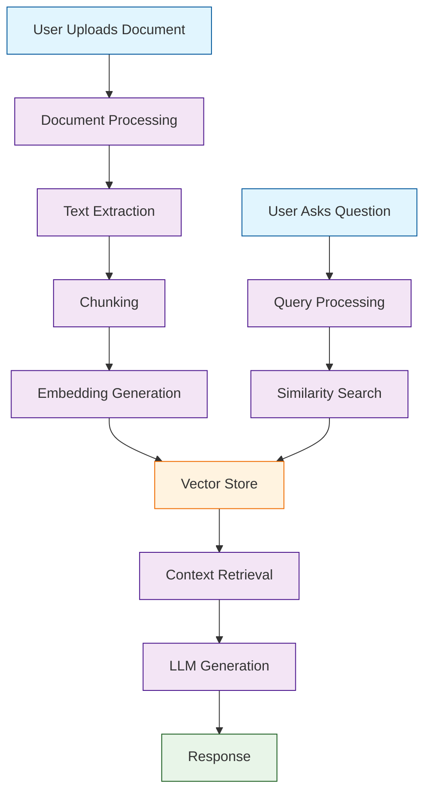

# Chapter 1: Getting Started with AnythingLLM

Welcome to **Chapter 1: Getting Started with AnythingLLM**. In this part of **AnythingLLM Tutorial: Self-Hosted RAG and Agents Platform**, you will build an intuitive mental model first, then move into concrete implementation details and practical production tradeoffs.


> Deploy AnythingLLM and create your first document chatbot with privacy control.

## Overview

This chapter guides you through installing AnythingLLM, configuring your environment, and creating your first AI-powered document chatbot. By the end, you'll have a working system that can answer questions about your documents.

## Installation Options

### Docker Installation (Recommended)

```bash
# Pull the official image
docker pull mintplexlabs/anythingllm

# Run with persistent storage
docker run -d \
  --name anythingllm \
  -p 3001:3001 \
  --cap-add SYS_ADMIN \
  -v anythingllm_storage:/app/server/storage \
  -e STORAGE_DIR=/app/server/storage \
  mintplexlabs/anythingllm

# Check if it's running
docker ps | grep anythingllm

# View logs
docker logs anythingllm
```

### Docker Compose (Production Ready)

```yaml
# docker-compose.yml
version: '3.8'
services:
  anythingllm:
    image: mintplexlabs/anythingllm:latest
    container_name: anythingllm
    restart: unless-stopped
    ports:
      - "3001:3001"
    volumes:
      - anythingllm_storage:/app/server/storage
      - ./local-docs:/app/server/documents  # Optional: mount local documents
    environment:
      - STORAGE_DIR=/app/server/storage
      - JWT_SECRET=your-secure-jwt-secret-here
      - UV_THREADPOOL_SIZE=20
    cap_add:
      - SYS_ADMIN
    healthcheck:
      test: ["CMD", "curl", "-f", "http://localhost:3001/health"]
      interval: 30s
      timeout: 10s
      retries: 3

volumes:
  anythingllm_storage:
    driver: local
```

```bash
# Start with docker-compose
docker-compose up -d

# Check status
docker-compose ps

# View logs
docker-compose logs -f anythingllm
```

### Local Development Installation

```bash
# Clone the repository
git clone https://github.com/Mintplex-Labs/anything-llm.git
cd anything-llm

# Install dependencies
yarn setup

# For development (with hot reload)
yarn dev

# For production build
yarn build
yarn start
```

### System Requirements

**Minimum Requirements:**
- Docker or Node.js 18+
- 4GB RAM
- 10GB storage
- Linux/Windows/MacOS

**Recommended for Production:**
- 8GB+ RAM
- 50GB+ storage
- SSD storage for vector databases
- Docker with persistent volumes

## Initial Setup

### First-Time Configuration

```bash
# Open your browser to http://localhost:3001
# You'll see the initial setup screen
```

**Setup Steps:**

1. **Create Admin Account**
   - Set admin email and password
   - This will be your system administrator account

2. **Choose Privacy Mode**
   - **Full Privacy**: Everything local (requires Ollama)
   - **Hybrid**: Local documents, cloud LLM
   - **Cloud**: Everything in cloud

3. **Configure LLM Provider**
   - OpenAI, Anthropic, or local Ollama

4. **Set Vector Store**
   - Built-in LanceDB (easiest)
   - Or external vector stores

### LLM Provider Setup

#### OpenAI Configuration

```bash
# Get your API key from https://platform.openai.com/api-keys

# In AnythingLLM:
# Settings > LLM Providers > OpenAI
# - API Key: sk-your-openai-key
# - Model: gpt-4o (recommended) or gpt-3.5-turbo
# - Max Tokens: 4096
```

#### Anthropic Configuration

```bash
# Get API key from https://console.anthropic.com/

# In AnythingLLM:
# Settings > LLM Providers > Anthropic
# - API Key: sk-ant-your-anthropic-key
# - Model: claude-3-5-sonnet-20241022
# - Max Tokens: 4096
```

#### Ollama Setup (Local)

```bash
# Install Ollama
curl -fsSL https://ollama.ai/install.sh | sh

# Pull models
ollama pull llama3.1:70b
ollama pull mistral:7b

# In AnythingLLM:
# Settings > LLM Providers > Ollama
# - Base URL: http://host.docker.internal:11434
# - Model: llama3.1:70b
# - Max Tokens: 4096
```

### Vector Store Configuration

#### Built-in LanceDB (Default)

```yaml
# No configuration needed - works out of the box
# Best for getting started and small deployments
# Stores vectors locally in Docker volume
```

#### External Vector Stores

```yaml
# Chroma (Self-hosted)
# docker run -p 8000:8000 chromadb/chroma

# In AnythingLLM:
# Settings > Vector Database > Chroma
# - Host: http://host.docker.internal:8000
```

```yaml
# Pinecone (Cloud)
# Sign up at https://www.pinecone.io/

# In AnythingLLM:
# Settings > Vector Database > Pinecone
# - API Key: your-pinecone-key
# - Index Name: anythingllm-index
# - Environment: us-east1-gcp
```

## Your First Workspace

### Creating a Workspace

```bash
# In the web interface:
# 1. Click "New Workspace"
# 2. Name: "My First Workspace"
# 3. Description: "Testing AnythingLLM with sample documents"
# 4. Click "Create Workspace"
```

### Adding Documents

```bash
# Sample documents to get started:
# 1. Create a simple text file
cat > sample-document.txt << 'EOF'
Welcome to AnythingLLM!

This is a sample document to demonstrate how AnythingLLM can turn any document into an intelligent chatbot.

Key features:
- Multi-LLM support (OpenAI, Anthropic, Ollama)
- Various document types (PDF, DOCX, TXT, web pages)
- Vector stores (LanceDB, Chroma, Pinecone)
- Workspace organization
- Agent capabilities

AnythingLLM processes your documents by:
1. Breaking them into chunks
2. Creating vector embeddings
3. Storing in a vector database
4. Using RAG (Retrieval-Augmented Generation) to provide context-aware responses

This allows you to have conversations with your documents and get accurate, contextual answers.
EOF

# 2. Upload via web interface:
# - Go to your workspace
# - Click "Upload Documents"
# - Drag and drop sample-document.txt
# - Or click "Browse" and select the file
```

### First Chat

```bash
# In the chat interface:
# Type: "What are the key features of AnythingLLM?"

# Expected response should mention:
# - Multi-LLM support
# - Document processing
# - Vector stores
# - Workspace organization
# - Agent capabilities

# Try more questions:
# - "How does document processing work?"
# - "What LLM providers are supported?"
# - "Explain RAG in simple terms"
```

## Understanding the Architecture

### How AnythingLLM Works



### Key Components

1. **Document Processing Pipeline**
   - Text extraction from various formats
   - Intelligent chunking (sentence/paragraph aware)
   - Vector embedding generation
   - Storage in vector database

2. **Retrieval-Augmented Generation (RAG)**
   - User query → semantic search
   - Retrieve relevant document chunks
   - Provide context to LLM
   - Generate accurate, sourced responses

3. **Workspace Organization**
   - Isolated document collections
   - Separate chat histories
   - Customizable settings per workspace

## Configuration Best Practices

### Environment Variables

```bash
# For production, use environment variables
cat > .env << EOF
JWT_SECRET=your-very-secure-jwt-secret-here
STORAGE_DIR=/app/server/storage
UV_THREADPOOL_SIZE=20
OLLAMA_BASE_URL=http://host.docker.internal:11434
OPENAI_API_KEY=sk-your-openai-key
ANTHROPIC_API_KEY=sk-ant-your-anthropic-key
EOF

# In docker-compose.yml
environment:
  - JWT_SECRET=${JWT_SECRET}
  - STORAGE_DIR=/app/server/storage
  - UV_THREADPOOL_SIZE=20
```

### Security Settings

```yaml
# In production:
# - Use strong JWT secrets
# - Enable HTTPS
# - Configure proper firewall rules
# - Regular backups of storage volume
# - Monitor resource usage
```

### Performance Tuning

```yaml
# Adjust based on your hardware
environment:
  - UV_THREADPOOL_SIZE=20  # For document processing
  - VECTOR_CACHE_SIZE=1000 # Vector cache size
  - MAX_CHUNK_SIZE=1000    # Document chunk size
```

## Troubleshooting Common Issues

### Container Won't Start

```bash
# Check Docker logs
docker logs anythingllm

# Common issues:
# - Port 3001 already in use
# - Insufficient disk space
# - Permission issues with volumes

# Fix port conflict
docker run -p 3002:3001 ... # Use different host port

# Check disk space
df -h

# Fix permissions
docker run --user $(id -u):$(id -g) ...
```

### LLM Connection Issues

```bash
# Test OpenAI connection
curl -X POST "https://api.openai.com/v1/chat/completions" \
  -H "Authorization: Bearer YOUR_API_KEY" \
  -H "Content-Type: application/json" \
  -d '{"model": "gpt-3.5-turbo", "messages": [{"role": "user", "content": "Hello"}]}'

# Test Ollama
curl http://localhost:11434/api/tags

# Check AnythingLLM logs for connection errors
docker logs anythingllm | grep -i error
```

### Document Processing Issues

```bash
# Check supported formats
# PDF, DOCX, TXT, MD, CSV, XLSX, HTML

# For PDFs, ensure text extraction works
# Some PDFs are image-based and need OCR

# Check file size limits
# Default: 100MB per file
# Adjust in settings if needed

# Monitor processing logs
docker logs anythingllm | grep -i process
```

### Database Issues

```bash
# Check vector database status
# For LanceDB (built-in), check Docker volume

# For external databases, verify connection
# Check network connectivity and credentials

# Reset vector database if corrupted
docker volume rm anythingllm_storage
docker-compose down -v  # Careful: deletes all data
```

## Backup and Recovery

### Basic Backup

```bash
# Backup the storage volume
docker run --rm -v anythingllm_storage:/data -v $(pwd):/backup alpine tar czf /backup/anythingllm-backup.tar.gz -C /data .

# Backup configuration
docker exec anythingllm cat /app/server/storage/.env > config-backup.env
```

### Recovery

```bash
# Restore from backup
docker run --rm -v anythingllm_storage:/data -v $(pwd):/backup alpine sh -c "cd /data && tar xzf /backup/anythingllm-backup.tar.gz"

# Restart container
docker-compose restart anythingllm
```

## Next Steps

Now that you have AnythingLLM running with your first document chatbot, let's explore:

- **Workspaces**: Organizing multiple document collections
- **Document Upload**: Processing different file types
- **LLM Configuration**: Optimizing model settings

---

**Ready for Chapter 2?** [Workspaces](02-workspaces.md)

*Generated for [Awesome Code Docs](https://github.com/johnxie/awesome-code-docs)*

## Depth Expansion Playbook

<!-- depth-expansion-v2 -->

This chapter is expanded to v1-style depth for production-grade learning and implementation quality.

### Strategic Context

- tutorial: **AnythingLLM Tutorial: Self-Hosted RAG and Agents Platform**
- tutorial slug: **anything-llm-tutorial**
- chapter focus: **Chapter 1: Getting Started with AnythingLLM**
- system context: **Anything Llm Tutorial**
- objective: move from surface-level usage to repeatable engineering operation

### Architecture Decomposition

1. Define the runtime boundary for `Chapter 1: Getting Started with AnythingLLM`.
2. Separate control-plane decisions from data-plane execution.
3. Capture input contracts, transformation points, and output contracts.
4. Trace state transitions across request lifecycle stages.
5. Identify extension hooks and policy interception points.
6. Map ownership boundaries for team and automation workflows.
7. Specify rollback and recovery paths for unsafe changes.
8. Track observability signals for correctness, latency, and cost.

### Operator Decision Matrix

| Decision Area | Low-Risk Path | High-Control Path | Tradeoff |
|:--------------|:--------------|:------------------|:---------|
| Runtime mode | managed defaults | explicit policy config | speed vs control |
| State handling | local ephemeral | durable persisted state | simplicity vs auditability |
| Tool integration | direct API use | mediated adapter layer | velocity vs governance |
| Rollout method | manual change | staged + canary rollout | effort vs safety |
| Incident response | best effort logs | runbooks + SLO alerts | cost vs reliability |

### Failure Modes and Countermeasures

| Failure Mode | Early Signal | Root Cause Pattern | Countermeasure |
|:-------------|:-------------|:-------------------|:---------------|
| stale context | inconsistent outputs | missing refresh window | enforce context TTL and refresh hooks |
| policy drift | unexpected execution | ad hoc overrides | centralize policy profiles |
| auth mismatch | 401/403 bursts | credential sprawl | rotation schedule + scope minimization |
| schema breakage | parser/validation errors | unmanaged upstream changes | contract tests per release |
| retry storms | queue congestion | no backoff controls | jittered backoff + circuit breakers |
| silent regressions | quality drop without alerts | weak baseline metrics | eval harness with thresholds |

### Implementation Runbook

1. Establish a reproducible baseline environment.
2. Capture chapter-specific success criteria before changes.
3. Implement minimal viable path with explicit interfaces.
4. Add observability before expanding feature scope.
5. Run deterministic tests for happy-path behavior.
6. Inject failure scenarios for negative-path validation.
7. Compare output quality against baseline snapshots.
8. Promote through staged environments with rollback gates.
9. Record operational lessons in release notes.

### Quality Gate Checklist

- [ ] chapter-level assumptions are explicit and testable
- [ ] API/tool boundaries are documented with input/output examples
- [ ] failure handling includes retry, timeout, and fallback policy
- [ ] security controls include auth scopes and secret rotation plans
- [ ] observability includes logs, metrics, traces, and alert thresholds
- [ ] deployment guidance includes canary and rollback paths
- [ ] docs include links to upstream sources and related tracks
- [ ] post-release verification confirms expected behavior under load

### Source Alignment

- [AnythingLLM Repository](https://github.com/Mintplex-Labs/anything-llm)
- [AnythingLLM Releases](https://github.com/Mintplex-Labs/anything-llm/releases)
- [AnythingLLM Docs](https://docs.anythingllm.com/)
- [AnythingLLM Website](https://anythingllm.com/)

### Cross-Tutorial Connection Map

- [Open WebUI Tutorial](../open-webui-tutorial/)
- [RAGFlow Tutorial](../ragflow-tutorial/)
- [Quivr Tutorial](../quivr-tutorial/)
- [Langfuse Tutorial](../langfuse-tutorial/)
- [Chapter 1: Getting Started](01-getting-started.md)

### Advanced Practice Exercises

1. Build a minimal end-to-end implementation for `Chapter 1: Getting Started with AnythingLLM`.
2. Add instrumentation and measure baseline latency and error rate.
3. Introduce one controlled failure and confirm graceful recovery.
4. Add policy constraints and verify they are enforced consistently.
5. Run a staged rollout and document rollback decision criteria.

### Review Questions

1. Which execution boundary matters most for this chapter and why?
2. What signal detects regressions earliest in your environment?
3. What tradeoff did you make between delivery speed and governance?
4. How would you recover from the highest-impact failure mode?
5. What must be automated before scaling to team-wide adoption?

### Scenario Playbook 1: Chapter 1: Getting Started with AnythingLLM

- tutorial context: **AnythingLLM Tutorial: Self-Hosted RAG and Agents Platform**
- trigger condition: incoming request volume spikes after release
- initial hypothesis: identify the smallest reproducible failure boundary
- immediate action: protect user-facing stability before optimization work
- engineering control: introduce adaptive concurrency limits and queue bounds
- verification target: latency p95 and p99 stay within defined SLO windows
- rollback trigger: pre-defined quality gate fails for two consecutive checks
- communication step: publish incident status with owner and ETA
- learning capture: add postmortem and convert findings into automated tests

## What Problem Does This Solve?

Most teams struggle here because the hard part is not writing more code, but deciding clear boundaries for `docker`, `anythingllm`, `your` so behavior stays predictable as complexity grows.

In practical terms, this chapter helps you avoid three common failures:

- coupling core logic too tightly to one implementation path
- missing the handoff boundaries between setup, execution, and validation
- shipping changes without clear rollback or observability strategy

After working through this chapter, you should be able to reason about `Chapter 1: Getting Started with AnythingLLM` as an operating subsystem inside **AnythingLLM Tutorial: Self-Hosted RAG and Agents Platform**, with explicit contracts for inputs, state transitions, and outputs.

Use the implementation notes around `storage`, `AnythingLLM`, `logs` as your checklist when adapting these patterns to your own repository.

## How it Works Under the Hood

Under the hood, `Chapter 1: Getting Started with AnythingLLM` usually follows a repeatable control path:

1. **Context bootstrap**: initialize runtime config and prerequisites for `docker`.
2. **Input normalization**: shape incoming data so `anythingllm` receives stable contracts.
3. **Core execution**: run the main logic branch and propagate intermediate state through `your`.
4. **Policy and safety checks**: enforce limits, auth scopes, and failure boundaries.
5. **Output composition**: return canonical result payloads for downstream consumers.
6. **Operational telemetry**: emit logs/metrics needed for debugging and performance tuning.

When debugging, walk this sequence in order and confirm each stage has explicit success/failure conditions.

## Source Walkthrough

Use the following upstream sources to verify implementation details while reading this chapter:

- [AnythingLLM Repository](https://github.com/Mintplex-Labs/anything-llm)
  Why it matters: authoritative reference on `AnythingLLM Repository` (github.com).
- [AnythingLLM Releases](https://github.com/Mintplex-Labs/anything-llm/releases)
  Why it matters: authoritative reference on `AnythingLLM Releases` (github.com).
- [AnythingLLM Docs](https://docs.anythingllm.com/)
  Why it matters: authoritative reference on `AnythingLLM Docs` (docs.anythingllm.com).
- [AnythingLLM Website](https://anythingllm.com/)
  Why it matters: authoritative reference on `AnythingLLM Website` (anythingllm.com).

Suggested trace strategy:
- search upstream code for `docker` and `anythingllm` to map concrete implementation paths
- compare docs claims against actual runtime/config code before reusing patterns in production

## Chapter Connections

- [Tutorial Index](index.md)
- [Next Chapter: Chapter 2: Workspaces - Organizing Your Knowledge](02-workspaces.md)
- [Main Catalog](../../README.md#-tutorial-catalog)
- [A-Z Tutorial Directory](../../discoverability/tutorial-directory.md)
