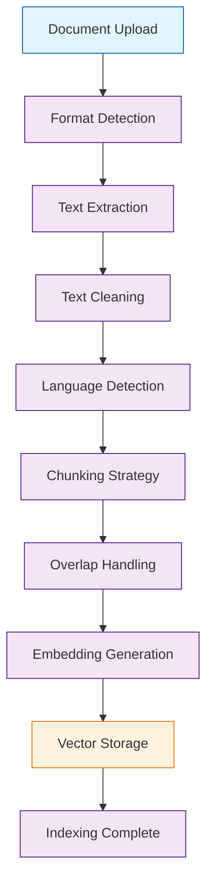

# Chapter 3: Document Upload and Processing

> Master uploading, processing, and managing various document types in AnythingLLM.

## Overview

AnythingLLM supports a wide variety of document formats and sources. This chapter covers uploading documents, understanding the processing pipeline, and optimizing document handling for better results.

## Supported Document Types

### File Formats

| Format | Extension | Best For | Processing Notes |
|:-------|:----------|:---------|:-----------------|
| **PDF** | .pdf | Research papers, reports, manuals | OCR for image-based PDFs |
| **Word** | .docx, .doc | Documentation, articles | Preserves formatting |
| **Text** | .txt, .md | Code, notes, simple docs | Direct processing |
| **Excel** | .xlsx, .xls | Data tables, spreadsheets | Converts to structured text |
| **PowerPoint** | .pptx, .ppt | Presentations, training | Extracts text and notes |
| **CSV** | .csv | Tabular data | Preserves structure |
| **HTML** | .html | Web pages, documentation | Removes markup |
| **Code** | .py, .js, .java, etc. | Source code, scripts | Syntax-aware processing |
| **JSON/YAML** | .json, .yaml, .yml | Configuration, data | Structured parsing |

### Online Sources

```yaml
# URL-based content
Supported:
  - Web pages (HTML)
  - GitHub repositories
  - Documentation sites
  - Blog posts
  - API documentation

# Video content
Supported:
  - YouTube videos (transcripts)
  - Vimeo videos (when transcripts available)
```

## Document Upload Methods

### Web Interface Upload

```bash
# Via web interface:
# 1. Go to workspace
# 2. Click "Upload Documents"
# 3. Drag and drop files or click "Browse"
# 4. Select multiple files if needed
# 5. Click "Upload"

# Supported:
# - Individual files
# - Multiple files (batch upload)
# - Folders (zipped)
```

### API Upload

```bash
# Upload single file
curl -X POST http://localhost:3001/api/v1/document/upload \
  -H "Authorization: Bearer YOUR_API_KEY" \
  -H "Content-Type: multipart/form-data" \
  -F "file=@document.pdf" \
  -F "workspaceId=ws-123"

# Upload multiple files
curl -X POST http://localhost:3001/api/v1/document/upload/batch \
  -H "Authorization: Bearer YOUR_API_KEY" \
  -F "files=@doc1.pdf" \
  -F "files=@doc2.docx" \
  -F "workspaceId=ws-123"

# Upload from URL
curl -X POST http://localhost:3001/api/v1/document/upload/url \
  -H "Authorization: Bearer YOUR_API_KEY" \
  -H "Content-Type: application/json" \
  -d '{
    "url": "https://docs.example.com/api-reference",
    "workspaceId": "ws-123",
    "title": "API Reference"
  }'
```

### Bulk Upload

```bash
# Upload entire directory
tar -czf documents.tar.gz /path/to/documents/
curl -X POST http://localhost:3001/api/v1/document/upload/archive \
  -H "Authorization: Bearer YOUR_API_KEY" \
  -F "archive=@documents.tar.gz" \
  -F "workspaceId=ws-123"

# Upload with metadata
curl -X POST http://localhost:3001/api/v1/document/upload \
  -H "Authorization: Bearer YOUR_API_KEY" \
  -F "file=@document.pdf" \
  -F "workspaceId=ws-123" \
  -F 'metadata={"author": "John Doe", "version": "1.0", "tags": ["api", "reference"]}'
```

## Document Processing Pipeline

### Processing Stages



### Text Extraction

```python
# How different formats are processed:

# PDF documents
def extract_pdf_text(file_path):
    """Extract text from PDF using PyPDF2 or pdfplumber"""
    with open(file_path, 'rb') as file:
        pdf_reader = PyPDF2.PdfReader(file)
        text = ""
        for page in pdf_reader.pages:
            text += page.extract_text()
    return text

# Word documents
def extract_docx_text(file_path):
    """Extract text from DOCX using python-docx"""
    doc = Document(file_path)
    text = ""
    for paragraph in doc.paragraphs:
        text += paragraph.text + "\n"
    return text

# Web pages
def extract_web_text(url):
    """Extract text from web pages using BeautifulSoup"""
    response = requests.get(url)
    soup = BeautifulSoup(response.content, 'html.parser')

    # Remove script and style elements
    for script in soup(["script", "style"]):
        script.extract()

    # Get text
    text = soup.get_text()

    # Clean up whitespace
    lines = (line.strip() for line in text.splitlines())
    chunks = (phrase.strip() for line in lines for phrase in line.split("  "))
    text = ' '.join(chunk for chunk in chunks if chunk)

    return text
```

### Text Cleaning and Normalization

```python
def clean_text(text):
    """Clean and normalize extracted text"""

    # Remove excessive whitespace
    text = re.sub(r'\s+', ' ', text)

    # Remove control characters
    text = re.sub(r'[\x00-\x1f\x7f-\x9f]', '', text)

    # Normalize quotes
    text = text.replace('"', '"').replace('"', '"')
    text = text.replace(''', "'").replace(''', "'")

    # Remove page headers/footers (common in PDFs)
    text = re.sub(r'Page \d+ of \d+', '', text)
    text = re.sub(r'\d{1,2}/\d{1,2}/\d{4}', '', text)  # dates

    return text.strip()

def detect_language(text):
    """Detect document language for processing"""
    try:
        from langdetect import detect
        return detect(text)
    except:
        return 'en'  # default to English
```

### Intelligent Chunking

```python
def chunk_document(text, strategy='semantic'):
    """Chunk document into meaningful segments"""

    if strategy == 'fixed':
        # Simple fixed-size chunks
        chunk_size = 1000
        overlap = 200
        chunks = []
        for i in range(0, len(text), chunk_size - overlap):
            chunk = text[i:i + chunk_size]
            if len(chunk) > 100:  # Minimum chunk size
                chunks.append(chunk)

    elif strategy == 'semantic':
        # Semantic chunking (sentence/paragraph aware)
        import nltk
        nltk.download('punkt')

        sentences = nltk.sent_tokenize(text)
        chunks = []
        current_chunk = ""
        max_chunk_size = 1000

        for sentence in sentences:
            if len(current_chunk) + len(sentence) > max_chunk_size:
                if current_chunk:
                    chunks.append(current_chunk.strip())
                current_chunk = sentence
            else:
                current_chunk += " " + sentence

        if current_chunk:
            chunks.append(current_chunk.strip())

    return chunks

# Advanced chunking strategies
def chunk_code_file(content, language):
    """Chunk code files by functions/classes"""
    if language == 'python':
        # Split by function/class definitions
        import ast
        tree = ast.parse(content)
        chunks = []

        for node in ast.walk(tree):
            if isinstance(node, (ast.FunctionDef, ast.ClassDef)):
                # Extract function/class code
                start_line = node.lineno - 1
                end_line = getattr(node, 'end_lineno', start_line + 10)
                chunk = '\n'.join(content.split('\n')[start_line:end_line])
                chunks.append(chunk)

        return chunks
```

## Embedding and Vectorization

### Embedding Models

```python
# Different embedding models supported:

# OpenAI embeddings
def generate_openai_embeddings(texts, api_key):
    """Generate embeddings using OpenAI"""
    from openai import OpenAI
    client = OpenAI(api_key=api_key)

    response = client.embeddings.create(
        input=texts,
        model="text-embedding-3-small"  # or text-embedding-ada-002
    )

    return [data.embedding for data in response.data]

# Local embeddings (via Ollama)
def generate_ollama_embeddings(texts, model="nomic-embed-text"):
    """Generate embeddings using local Ollama"""
    import requests

    embeddings = []
    for text in texts:
        response = requests.post('http://localhost:11434/api/embeddings',
            json={
                "model": model,
                "prompt": text
            }
        )
        embeddings.append(response.json()['embedding'])

    return embeddings

# Sentence transformers (alternative local option)
def generate_sentence_transformers_embeddings(texts, model_name="all-MiniLM-L6-v2"):
    """Generate embeddings using sentence-transformers"""
    from sentence_transformers import SentenceTransformer

    model = SentenceTransformer(model_name)
    return model.encode(texts, convert_to_numpy=True).tolist()
```

### Vector Storage

```python
# How vectors are stored and indexed:

# LanceDB (built-in)
def store_in_lancedb(chunks, embeddings, metadata):
    """Store in LanceDB for fast similarity search"""
    import lancedb

    db = lancedb.connect("./vectors.lancedb")
    table = db.create_table("documents",
        data=[{
            "id": i,
            "text": chunk,
            "embedding": embedding,
            "metadata": metadata.get(i, {})
        } for i, (chunk, embedding) in enumerate(zip(chunks, embeddings))]
    )

    # Create vector index
    table.create_index("embedding")

# Chroma
def store_in_chroma(chunks, embeddings, metadata):
    """Store in Chroma vector database"""
    import chromadb

    client = chromadb.PersistentClient(path="./chroma_db")
    collection = client.get_or_create_collection("documents")

    collection.add(
        embeddings=embeddings,
        documents=chunks,
        metadatas=[metadata.get(i, {}) for i in range(len(chunks))],
        ids=[f"doc_{i}" for i in range(len(chunks))]
    )

# Pinecone
def store_in_pinecone(chunks, embeddings, metadata, api_key, index_name):
    """Store in Pinecone cloud vector database"""
    from pinecone import Pinecone

    pc = Pinecone(api_key=api_key)
    index = pc.Index(index_name)

    vectors = [{
        "id": f"doc_{i}",
        "values": embedding,
        "metadata": {
            "text": chunk,
            **metadata.get(i, {})
        }
    } for i, (chunk, embedding) in enumerate(zip(chunks, embeddings))]

    index.upsert(vectors=vectors)
```

## Document Management

### Document Status Tracking

```bash
# Check document processing status
curl http://localhost:3001/api/v1/workspace/ws-123/documents \
  -H "Authorization: Bearer YOUR_API_KEY"

# Response shows processing status
{
  "documents": [
    {
      "id": "doc-123",
      "name": "user-guide.pdf",
      "status": "processed",  // "uploading", "processing", "processed", "failed"
      "chunks": 45,
      "tokens": 12500,
      "uploadedAt": "2024-01-01T10:00:00Z",
      "processedAt": "2024-01-01T10:05:00Z"
    }
  ]
}
```

### Document Updates

```bash
# Update existing document
curl -X PUT http://localhost:3001/api/v1/document/doc-123 \
  -H "Authorization: Bearer YOUR_API_KEY" \
  -F "file=@updated-document.pdf"

# This will reprocess the document and update vectors

# Update document metadata
curl -X PATCH http://localhost:3001/api/v1/document/doc-123 \
  -H "Authorization: Bearer YOUR_API_KEY" \
  -H "Content-Type: application/json" \
  -d '{
    "title": "Updated User Guide",
    "tags": ["user-manual", "v2.0"],
    "category": "documentation"
  }'
```

### Document Deletion

```bash
# Delete document and its vectors
curl -X DELETE http://localhost:3001/api/v1/document/doc-123 \
  -H "Authorization: Bearer YOUR_API_KEY"

# This removes both the document and associated vectors
```

## Optimization Strategies

### Chunk Size Optimization

```python
# Optimal chunk sizes by content type
CHUNK_SIZES = {
    'code': 500,        # Smaller for code (functions/methods)
    'documentation': 1000,  # Medium for docs
    'research': 1500,   # Larger for academic papers
    'web': 800,         # Medium for web content
    'legal': 1200       # Medium for legal documents
}

def optimize_chunk_size(content_type, content_length):
    """Determine optimal chunk size"""
    base_size = CHUNK_SIZES.get(content_type, 1000)

    # Adjust for content length
    if content_length > 100000:  # Very long documents
        base_size = int(base_size * 1.5)
    elif content_length < 10000:  # Short documents
        base_size = int(base_size * 0.8)

    return base_size
```

### Embedding Model Selection

```python
def select_embedding_model(content_type, use_local=True):
    """Select appropriate embedding model"""

    if use_local:
        # Local models (privacy, cost)
        if content_type == 'code':
            return 'code-search-embeddings'  # Better for code
        else:
            return 'all-MiniLM-L6-v2'  # General purpose

    else:
        # Cloud models (quality, speed)
        if content_type in ['code', 'technical']:
            return 'text-embedding-3-small'  # OpenAI
        else:
            return 'text-embedding-ada-002'  # Cost-effective
```

### Processing Performance

```python
# Parallel processing for large documents
import concurrent.futures
import threading

def process_large_document(file_path, max_workers=4):
    """Process large documents in parallel"""

    # Split document into sections
    sections = split_document_into_sections(file_path)

    # Process sections in parallel
    with concurrent.futures.ThreadPoolExecutor(max_workers=max_workers) as executor:
        futures = [executor.submit(process_section, section) for section in sections]
        results = []

        for future in concurrent.futures.as_completed(futures):
            try:
                result = future.result()
                results.append(result)
            except Exception as exc:
                print(f'Section processing failed: {exc}')

    # Combine results
    return combine_processed_sections(results)
```

## Troubleshooting Document Issues

### Processing Failures

```bash
# Check processing logs
docker logs anythingllm | grep -i "error\|failed"

# Common issues:
# 1. Unsupported file format
# 2. Corrupted PDF
# 3. Large file size
# 4. Encoding issues
# 5. Missing dependencies

# Reprocess failed documents
curl -X POST http://localhost:3001/api/v1/document/doc-123/reprocess \
  -H "Authorization: Bearer YOUR_API_KEY"
```

### Quality Issues

```bash
# Poor search results may indicate:
# 1. Wrong chunk size
# 2. Wrong embedding model
# 3. Poor text extraction
# 4. Wrong language settings

# Adjust processing settings
curl -X PUT http://localhost:3001/api/v1/workspace/ws-123/settings \
  -H "Authorization: Bearer YOUR_API_KEY" \
  -H "Content-Type: application/json" \
  -d '{
    "chunkSize": 800,
    "overlapSize": 100,
    "embeddingModel": "text-embedding-3-small"
  }'
```

### Performance Issues

```bash
# Slow processing may be due to:
# 1. Large documents
# 2. Inefficient chunking
# 3. Slow embedding model
# 4. Resource constraints

# Monitor processing performance
curl http://localhost:3001/api/v1/system/performance \
  -H "Authorization: Bearer YOUR_API_KEY"

# Scale resources if needed
docker-compose up -d --scale anythingllm=2
```

## Advanced Document Features

### Document Versioning

```bash
# Track document versions
curl -X POST http://localhost:3001/api/v1/document/doc-123/version \
  -H "Authorization: Bearer YOUR_API_KEY" \
  -F "file=@document-v2.pdf" \
  -F "changelog=Updated API endpoints"

# List document versions
curl http://localhost:3001/api/v1/document/doc-123/versions \
  -H "Authorization: Bearer YOUR_API_KEY"

# Revert to previous version
curl -X PUT http://localhost:3001/api/v1/document/doc-123/version/ver-123 \
  -H "Authorization: Bearer YOUR_API_KEY"
```

### Document Annotations

```bash
# Add annotations to documents
curl -X POST http://localhost:3001/api/v1/document/doc-123/annotations \
  -H "Authorization: Bearer YOUR_API_KEY" \
  -H "Content-Type: application/json" \
  -d '{
    "text": "This section is outdated",
    "position": {"page": 5, "x": 100, "y": 200},
    "type": "comment",
    "author": "reviewer@example.com"
  }'
```

### Document Relationships

```bash
# Link related documents
curl -X POST http://localhost:3001/api/v1/document/doc-123/relationships \
  -H "Authorization: Bearer YOUR_API_KEY" \
  -H "Content-Type: application/json" \
  -d '{
    "relatedDocumentId": "doc-456",
    "relationshipType": "references",
    "description": "This document references the API specification"
  }'
```

## Summary

In this chapter, we've covered:

- **Document Types**: Supported formats and sources
- **Upload Methods**: Web interface, API, and bulk operations
- **Processing Pipeline**: Text extraction, cleaning, chunking, embedding
- **Vector Storage**: Different database options and configurations
- **Document Management**: Status tracking, updates, and deletion
- **Optimization**: Chunk sizing, model selection, and performance tuning
- **Troubleshooting**: Common issues and solutions
- **Advanced Features**: Versioning, annotations, and relationships

## Key Takeaways

1. **Format Support**: AnythingLLM handles diverse document types and sources
2. **Processing Pipeline**: Understanding the steps from upload to vector storage
3. **Optimization**: Choosing appropriate chunk sizes and embedding models
4. **Quality Control**: Monitoring processing status and handling failures
5. **Performance**: Scaling and optimizing for large document collections
6. **Management**: Effective document lifecycle management

## Next Steps

Now that you understand document processing, let's explore **LLM configuration** and connecting different language models.

---

**Ready for Chapter 4?** [LLM Configuration](04-llm-config.md)

*Generated for [Awesome Code Docs](https://github.com/johnxie/awesome-code-docs)*