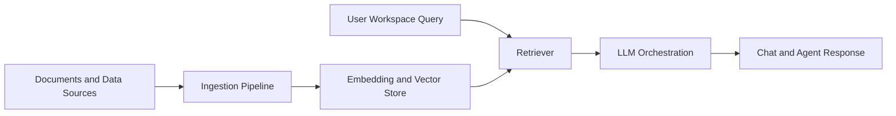

# AnythingLLM Tutorial: Self-Hosted RAG and Agents Platform

> Learn how to deploy and operate `Mintplex-Labs/anything-llm` for document-grounded chat, workspace management, agent workflows, and production use.

## Why This Track Matters

AnythingLLM is one of the most widely adopted self-hosted applications for enterprise-style document chat and configurable agent workflows.

This track focuses on:

- setting up document-to-chat pipelines with strong privacy controls
- configuring model providers and vector backends for different workloads
- operating workspace-based RAG systems for teams
- deploying and maintaining the platform in production environments

## Current Snapshot (Verified February 11, 2026)

- repository: [`Mintplex-Labs/anything-llm`](https://github.com/Mintplex-Labs/anything-llm)
- stars: about **54.5k**
- latest release: [`v1.10.0`](https://github.com/Mintplex-Labs/anything-llm/releases/tag/v1.10.0)
- development activity: active with recent updates
- project positioning in repo: full-stack desktop and Docker app for RAG, agents, and MCP-compatible workflows

## Mental Model

## Chapter Guide

| Chapter | Key Question | Outcome |
|:--------|:-------------|:--------|
| [01 - Getting Started](01-getting-started.md) | How do I install and configure AnythingLLM? | Working platform baseline |
| [02 - Workspaces](02-workspaces.md) | How should I organize projects and knowledge boundaries? | Repeatable workspace strategy |
| [03 - Document Upload](03-documents.md) | How do I ingest and prepare heterogeneous sources? | Reliable ingestion workflows |
| [04 - LLM Configuration](04-llm-config.md) | How do I choose and tune model providers? | Provider configuration playbook |
| [05 - Vector Stores](05-vector-stores.md) | How do I pick vector storage for my scale and latency needs? | Better storage architecture decisions |
| [06 - Agents](06-agents.md) | How do I run built-in agent capabilities effectively? | Practical agent execution patterns |
| [07 - API and Integration](07-api.md) | How do I integrate AnythingLLM into existing systems? | Programmatic integration baseline |
| [08 - Production Deployment](08-production.md) | How do I deploy and operate at production quality? | Operations and security baseline |

## What You Will Learn

- how to design secure, self-hosted RAG systems with AnythingLLM
- how to connect multiple LLM providers and vector backends
- how to operationalize workspace and agent workflows for teams
- how to deploy and monitor the platform in production

## Source References

- [AnythingLLM Repository](https://github.com/Mintplex-Labs/anything-llm)
- [AnythingLLM Releases](https://github.com/Mintplex-Labs/anything-llm/releases)
- [AnythingLLM Docs](https://docs.anythingllm.com/)
- [AnythingLLM Website](https://anythingllm.com/)

## Related Tutorials

- [Open WebUI Tutorial](../open-webui-tutorial/)
- [RAGFlow Tutorial](../ragflow-tutorial/)
- [Quivr Tutorial](../quivr-tutorial/)
- [Langfuse Tutorial](../langfuse-tutorial/)

---

Start with [Chapter 1: Getting Started](01-getting-started.md).
