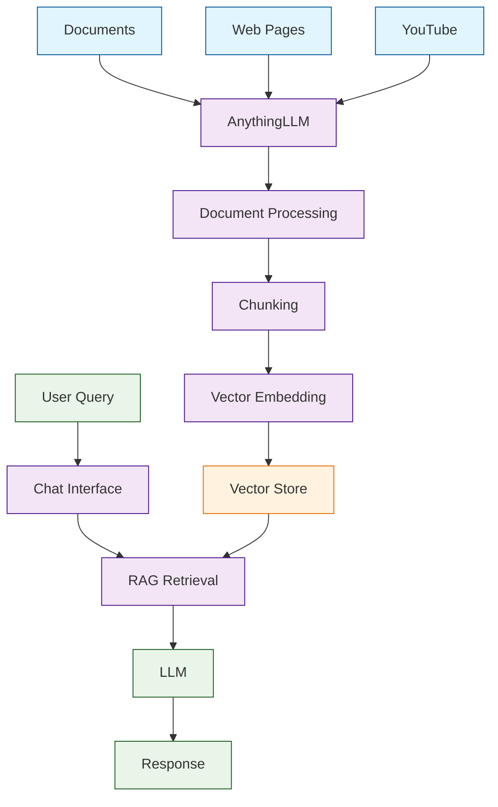

# AnythingLLM Tutorial: All-in-One AI Document Chat

> Turn any document into an intelligent chatbot with full privacy control.

<div align="center">

**📚 The All-in-One AI Application**

[](https://github.com/Mintplex-Labs/anything-llm)

</div>

---

## 🎯 What is AnythingLLM?

**AnythingLLM**<sup>[View Repo](https://github.com/Mintplex-Labs/anything-llm)</sup> is a full-stack application that allows you to turn any document, resource, or piece of content into context that any LLM can use as references during chatting. 100% private and self-hostable.

### Key Features

| Feature | Description |
|:--------|:------------|
| **Multi-LLM** | OpenAI, Anthropic, Ollama, LMStudio, and more |
| **Document Processing** | PDF, DOCX, TXT, web pages, YouTube |
| **Vector Stores** | Chroma, Pinecone, Weaviate, Qdrant |
| **Workspaces** | Organize documents and conversations |
| **Agents** | Built-in agent capabilities |
| **Privacy First** | 100% local option available |



## Tutorial Chapters

1. **[Chapter 1: Getting Started](01-getting-started.md)** - Installation and initial setup
2. **[Chapter 2: Workspaces](02-workspaces.md)** - Organizing documents and chats
3. **[Chapter 3: Document Upload](03-documents.md)** - Processing various file types
4. **[Chapter 4: LLM Configuration](04-llm-config.md)** - Connecting different providers
5. **[Chapter 5: Vector Stores](05-vector-stores.md)** - Choosing and configuring storage
6. **[Chapter 6: Agents](06-agents.md)** - Using built-in agent capabilities
7. **[Chapter 7: API & Integration](07-api.md)** - Programmatic access
8. **[Chapter 8: Production Deployment](08-production.md)** - Docker, security, scaling

## What You'll Learn

- **Deploy AnythingLLM** with Docker or locally
- **Process Documents** of various formats
- **Configure LLM Providers** for your needs
- **Set Up Vector Stores** for semantic search
- **Create Workspaces** for different projects
- **Use AI Agents** for enhanced capabilities
- **Integrate via API** with your applications

## Prerequisites

- Docker (recommended) or Node.js 18+
- API keys for your LLM provider (or Ollama for local)
- Basic command line knowledge

## Quick Start

### Docker (Recommended)

```bash
# Run with Docker
docker pull mintplexlabs/anythingllm
docker run -d -p 3001:3001 \
  --cap-add SYS_ADMIN \
  -v anythingllm_storage:/app/server/storage \
  mintplexlabs/anythingllm

# Open http://localhost:3001
```

### Docker Compose

```yaml
version: '3.8'
services:
  anythingllm:
    image: mintplexlabs/anythingllm
    container_name: anythingllm
    ports:
      - "3001:3001"
    volumes:
      - anythingllm_storage:/app/server/storage
    cap_add:
      - SYS_ADMIN
    environment:
      - STORAGE_DIR=/app/server/storage
      
volumes:
  anythingllm_storage:
```

### Local Installation

```bash
# Clone repository
git clone https://github.com/Mintplex-Labs/anything-llm.git
cd anything-llm

# Setup
yarn setup

# Start development
yarn dev
```

## First-Time Setup

1. **Open** http://localhost:3001
2. **Create Admin Account**
3. **Configure LLM** (OpenAI, Ollama, etc.)
4. **Set Vector Store** (Built-in LanceDB or external)
5. **Create First Workspace**
6. **Upload Documents**
7. **Start Chatting!**

## Supported LLM Providers

| Provider | Type | Models |
|:---------|:-----|:-------|
| **OpenAI** | Cloud | GPT-4, GPT-3.5 |
| **Anthropic** | Cloud | Claude 3.5, Claude 3 |
| **Azure OpenAI** | Cloud | Azure-hosted models |
| **Ollama** | Local | Llama, Mistral, etc. |
| **LMStudio** | Local | Any GGUF model |
| **LocalAI** | Local | Various formats |

## Supported Vector Stores

| Vector Store | Type | Best For |
|:-------------|:-----|:---------|
| **LanceDB** | Built-in | Quick start, single instance |
| **Chroma** | Self-hosted | Development, small teams |
| **Pinecone** | Cloud | Production, scale |
| **Weaviate** | Self-hosted | Advanced features |
| **Qdrant** | Self-hosted | High performance |

## Document Types

- 📄 **PDF** - Research papers, reports
- 📝 **DOCX/DOC** - Word documents
- 📊 **XLSX** - Spreadsheets
- 💻 **Code** - Source files
- 🌐 **Web Pages** - URLs
- 🎥 **YouTube** - Video transcripts
- 📁 **Plain Text** - TXT, MD, etc.

## Workspaces

Organize your knowledge by project:

```
Workspace: "Product Documentation"
├── User Guide.pdf
├── API Reference.md
├── FAQ.docx
└── Support Articles/

Workspace: "Research"
├── Paper1.pdf
├── Paper2.pdf
└── Notes.txt
```

## API Access

```python
import requests

# Chat with a workspace
response = requests.post(
    "http://localhost:3001/api/v1/workspace/my-workspace/chat",
    headers={"Authorization": "Bearer YOUR_API_KEY"},
    json={"message": "What does the documentation say about authentication?"}
)

print(response.json()["textResponse"])
```

## Privacy Options

| Mode | Data Location | Best For |
|:-----|:--------------|:---------|
| **Full Local** | Your machine only | Maximum privacy |
| **Hybrid** | Local + cloud LLM | Balance |
| **Cloud** | Cloud services | Convenience |

## Learning Path

### 🟢 Beginner Track
1. Chapters 1-3: Setup and document upload
2. Build your first document chatbot

### 🟡 Intermediate Track
1. Chapters 4-6: Advanced config and agents
2. Create sophisticated RAG systems

### 🔴 Advanced Track
1. Chapters 7-8: API and production
2. Deploy enterprise document AI

---

**Ready to chat with your documents? Let's begin with [Chapter 1: Getting Started](01-getting-started.md)!**

*Generated for [Awesome Code Docs](https://github.com/johnxie/awesome-code-docs)*
