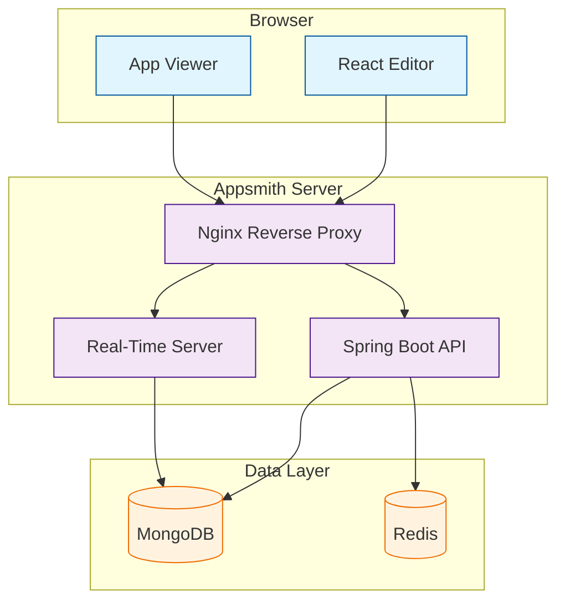
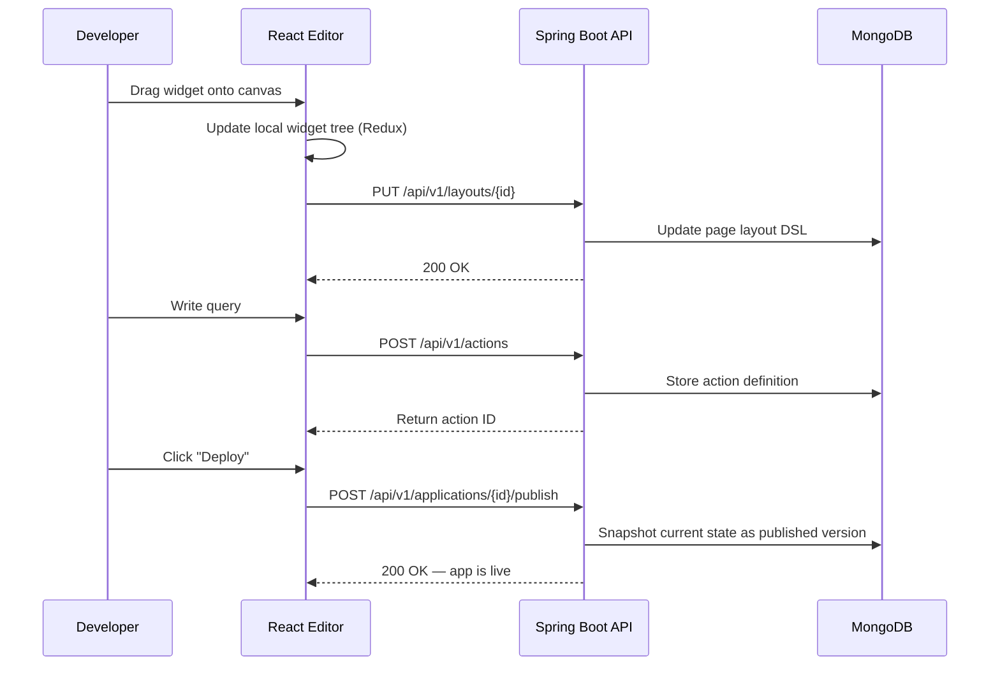

# Chapter 1: Getting Started

Welcome to **Chapter 1** of the **Appsmith Tutorial**. This chapter walks you through installing Appsmith, creating your first application, and building a working CRUD interface. By the end, you will have a running Appsmith instance with a functional internal tool.

> Install Appsmith, create your first app, and build a CRUD interface in under 30 minutes.

## What Problem Does This Solve?

Every engineering team builds internal tools — admin panels, dashboards, approval workflows, data viewers. These tools are critical but rarely justify weeks of custom frontend development. Appsmith lets you assemble these interfaces visually while retaining full JavaScript control for complex logic.

The result: production-quality internal tools built in hours instead of weeks, with the flexibility to handle edge cases that no-code tools cannot.

## Installation Options

### Docker (Recommended)

The fastest way to run Appsmith locally or on a server:

```bash
# Pull and start Appsmith with Docker
docker run -d --name appsmith \
  -p 80:80 \
  -v "$PWD/stacks:/appsmith-stacks" \
  appsmith/appsmith-ce

# Appsmith is now available at http://localhost
```

The single container bundles all services:

| Component | Technology | Purpose |
|:----------|:-----------|:--------|
| **Frontend** | React + Redux | Drag-and-drop editor and app viewer |
| **API Server** | Spring Boot (Java) | Application logic, query execution, auth |
| **Database** | MongoDB (embedded) | Stores app definitions, user data, configs |
| **RTS** | Node.js | Real-time editing and collaboration |
| **Nginx** | Reverse proxy | Routes traffic to appropriate services |

### Docker Compose (Production)

For production deployments with external databases:

```yaml
# docker-compose.yml
version: "3"
services:
  appsmith:
    image: appsmith/appsmith-ce
    container_name: appsmith
    ports:
      - "80:80"
      - "443:443"
    volumes:
      - ./stacks:/appsmith-stacks
    environment:
      APPSMITH_MAIL_ENABLED: "true"
      APPSMITH_MAIL_HOST: smtp.example.com
      APPSMITH_MAIL_PORT: 587
      APPSMITH_MAIL_USERNAME: noreply@example.com
      APPSMITH_MAIL_PASSWORD: your-smtp-password
    restart: unless-stopped

  mongo:
    image: mongo:6
    volumes:
      - ./data/mongo:/data/db
    restart: unless-stopped
```

### Kubernetes (Helm Chart)

For orchestrated environments:

```bash
# Add the Appsmith Helm repository
helm repo add appsmith https://helm.appsmith.com

# Install with default values
helm install appsmith appsmith/appsmith \
  --namespace appsmith \
  --create-namespace

# Install with custom values
helm install appsmith appsmith/appsmith \
  --namespace appsmith \
  --set persistence.size=50Gi \
  --set autoscaling.enabled=true
```

## Architecture Overview



## Creating Your First Application

### Step 1: Sign Up

Navigate to `http://localhost` and create your admin account. The first user automatically becomes the workspace administrator.

### Step 2: Create an Application

Click **New** in the workspace and choose **New Application**. Appsmith creates a blank canvas with a default page.

### Step 3: Add a Data Source

Connect to a sample PostgreSQL database to follow along:

```
Host: mockdb.internal.appsmith.com
Port: 5432
Database: employees
Username: readonly
Password: readonly_password
```

### Step 4: Write Your First Query

Create a query named `getEmployees`:

```sql
-- Fetch all employees with pagination
SELECT id, name, email, department, salary
FROM employees
ORDER BY id
LIMIT {{ Table1.pageSize }}
OFFSET {{ (Table1.pageNo - 1) * Table1.pageSize }};
```

Notice the `{{ }}` mustache syntax — this is how widgets bind to queries and vice versa. The query dynamically reads pagination values from a Table widget.

### Step 5: Display Data in a Table

1. Drag a **Table** widget onto the canvas.
2. Set the Table Data property to `{{ getEmployees.data }}`.
3. The table auto-populates with columns matching the query result schema.

### Step 6: Add Create/Update/Delete

Build a complete CRUD interface by adding:

```sql
-- insertEmployee query
INSERT INTO employees (name, email, department, salary)
VALUES (
  {{ NameInput.text }},
  {{ EmailInput.text }},
  {{ DepartmentSelect.selectedOptionValue }},
  {{ SalaryInput.text }}
);

-- updateEmployee query
UPDATE employees
SET name = {{ NameInput.text }},
    email = {{ EmailInput.text }},
    department = {{ DepartmentSelect.selectedOptionValue }},
    salary = {{ SalaryInput.text }}
WHERE id = {{ Table1.selectedRow.id }};

-- deleteEmployee query
DELETE FROM employees
WHERE id = {{ Table1.selectedRow.id }};
```

Wire button widgets to trigger these queries:

```javascript
// On the Save button's onClick handler
{{
  insertEmployee.run()
    .then(() => {
      getEmployees.run();
      showAlert("Employee created!", "success");
      closeModal("CreateModal");
    })
    .catch((error) => {
      showAlert("Failed: " + error.message, "error");
    })
}}
```

## How It Works Under the Hood

When you build an app in Appsmith, the platform serializes your entire application — widgets, queries, JS logic — into a JSON document stored in MongoDB.



### The Application DSL

Every Appsmith page is represented as a nested JSON tree called the **DSL** (Domain-Specific Language):

```json
{
  "widgetName": "MainContainer",
  "type": "CANVAS_WIDGET",
  "children": [
    {
      "widgetName": "Table1",
      "type": "TABLE_WIDGET_V2",
      "tableData": "{{ getEmployees.data }}",
      "columns": [...],
      "position": { "left": 1, "top": 2, "width": 12, "height": 40 }
    },
    {
      "widgetName": "NameInput",
      "type": "INPUT_WIDGET_V2",
      "defaultText": "{{ Table1.selectedRow.name }}",
      "position": { "left": 1, "top": 44, "width": 6, "height": 7 }
    }
  ]
}
```

The Spring Boot server stores this DSL in MongoDB and evaluates all `{{ }}` bindings at runtime using a JavaScript evaluation engine.

## Environment Configuration

Key environment variables for self-hosted Appsmith:

```bash
# appsmith-stacks/configuration/docker.env

# MongoDB connection
APPSMITH_MONGODB_URI=mongodb://mongo:27017/appsmith

# Redis for session management
APPSMITH_REDIS_URL=redis://redis:6379

# Encryption key (generate once, never change)
APPSMITH_ENCRYPTION_PASSWORD=your-encryption-password
APPSMITH_ENCRYPTION_SALT=your-encryption-salt

# Email configuration
APPSMITH_MAIL_ENABLED=true
APPSMITH_MAIL_FROM=noreply@example.com
APPSMITH_MAIL_HOST=smtp.example.com
APPSMITH_MAIL_PORT=587

# OAuth (optional)
APPSMITH_OAUTH2_GOOGLE_CLIENT_ID=your-client-id
APPSMITH_OAUTH2_GOOGLE_CLIENT_SECRET=your-client-secret
```

## Key Takeaways

- Appsmith runs as a single Docker container bundling React frontend, Spring Boot API, MongoDB, and Nginx.
- Applications are stored as JSON DSL documents that describe widget trees, queries, and bindings.
- Mustache `{{ }}` bindings create reactive connections between widgets, queries, and JS logic.
- The platform supports full CRUD operations with visual query builders and raw SQL.
- Deploy with `docker run` for development or Helm charts for production Kubernetes.

## Cross-References

- **Next chapter:** [Chapter 2: Widget System](02-widget-system.md) explores the full widget catalog and layout system.
- **Data sources:** [Chapter 3: Data Sources & Queries](03-data-sources-and-queries.md) covers all 25+ connectors.
- **JavaScript:** [Chapter 4: JS Logic & Bindings](04-js-logic-and-bindings.md) goes deeper into the binding evaluation engine.

---

*Generated by [AI Codebase Knowledge Builder](https://github.com/The-Pocket/Tutorial-Codebase-Knowledge)*
