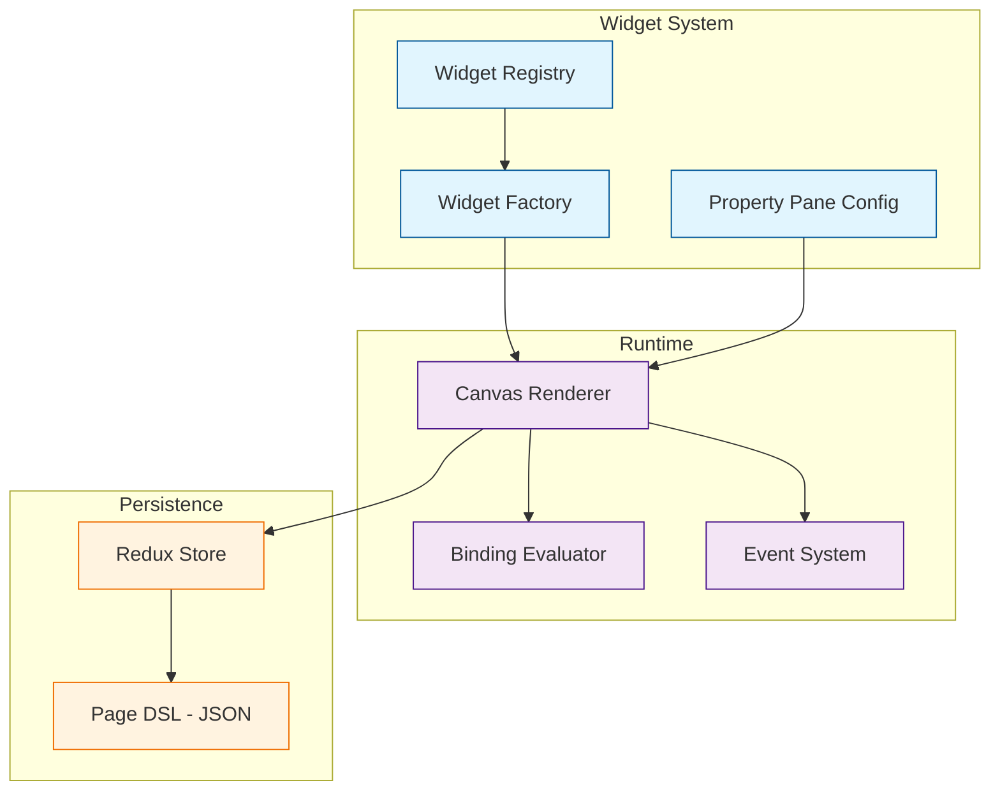
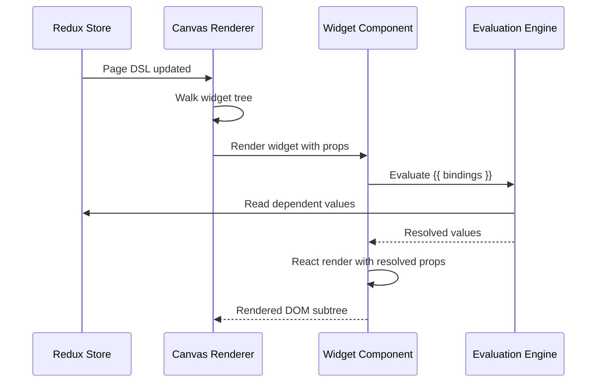

# Chapter 2: Widget System

This chapter explores Appsmith's widget system — the drag-and-drop building blocks that form every application. You will learn how widgets are structured, how the layout engine works, and how to compose complex UIs from simple components.

> Master the widget catalog, layout containers, property pane, and event-driven interactions.

## What Problem Does This Solve?

Building UIs from scratch requires HTML, CSS, and a frontend framework. For internal tools, this is wasteful — most interfaces follow predictable patterns: tables, forms, charts, modals. Appsmith's widget system provides 45+ pre-built, configurable components that handle rendering, validation, and state management out of the box.

The challenge: how do you make a visual builder flexible enough for real-world applications without forcing developers into a rigid grid?

## Widget Architecture



## Widget Catalog

Appsmith organizes widgets into functional categories:

### Display Widgets

| Widget | Purpose | Key Properties |
|:-------|:--------|:---------------|
| **Text** | Static or dynamic text | `text`, `fontSize`, `textAlign` |
| **Image** | Display images from URLs or base64 | `image`, `objectFit`, `maxZoomLevel` |
| **Stat Box** | KPI display with label and value | `value`, `label`, `valueChange` |
| **Divider** | Visual separator | `orientation`, `thickness` |
| **Icon Button** | Compact action trigger | `icon`, `onClick`, `tooltip` |

### Input Widgets

| Widget | Purpose | Key Properties |
|:-------|:--------|:---------------|
| **Input** | Text, number, email, password | `inputType`, `defaultValue`, `regex` |
| **Select** | Dropdown selection | `options`, `defaultValue`, `serverSideFiltering` |
| **MultiSelect** | Multiple selection | `options`, `defaultValues` |
| **DatePicker** | Date/time selection | `dateFormat`, `minDate`, `maxDate` |
| **Checkbox** | Boolean toggle | `defaultCheckedState`, `isRequired` |
| **Rich Text Editor** | WYSIWYG content editing | `defaultValue`, `isToolbarHidden` |
| **File Picker** | File upload | `allowedFileTypes`, `maxFileSize` |

### Data Widgets

| Widget | Purpose | Key Properties |
|:-------|:--------|:---------------|
| **Table** | Tabular data with sorting, filtering, pagination | `tableData`, `columns`, `serverSidePagination` |
| **List** | Repeatable card layouts | `listData`, `template` |
| **Chart** | Bar, line, pie, area charts | `chartType`, `chartData`, `xAxisName` |
| **JSON Form** | Auto-generated forms from JSON schema | `sourceData`, `autoGenerateForm` |

### Layout Widgets

| Widget | Purpose | Key Properties |
|:-------|:--------|:---------------|
| **Container** | Group widgets with background/border | `backgroundColor`, `borderRadius` |
| **Tabs** | Tabbed content panels | `tabs`, `defaultTab` |
| **Modal** | Overlay dialog | `canOutsideClickClose`, `size` |
| **Form** | Form wrapper with submit/reset | `onSubmit`, `resetOnSuccess` |

## The Property Pane

Every widget exposes properties through the Property Pane — a right-side panel in the editor. Properties fall into three categories:

### Content Properties

Control what the widget displays:

```javascript
// Table widget — Content properties
{
  tableData: "{{ getEmployees.data }}",
  columns: [
    { name: "id", type: "number", isVisible: true, isEditable: false },
    { name: "name", type: "string", isVisible: true, isEditable: true },
    { name: "email", type: "string", isVisible: true, isEditable: true },
    { name: "department", type: "string", isVisible: true, isEditable: true },
    { name: "salary", type: "number", isVisible: true, isEditable: true }
  ],
  primaryColumnId: "id"
}
```

### Style Properties

Control visual appearance:

```javascript
// Table widget — Style properties
{
  textSize: "0.875rem",
  horizontalAlignment: "LEFT",
  verticalAlignment: "CENTER",
  cellBackground: "{{ currentRow.salary > 100000 ? '#e8f5e9' : 'white' }}",
  borderRadius: "0.375rem",
  boxShadow: "0 1px 3px rgba(0,0,0,0.12)"
}
```

### Event Properties

Define widget interactions:

```javascript
// Table widget — Event handlers
{
  onRowSelected: "{{ getEmployeeDetails.run() }}",
  onPageChange: "{{ getEmployees.run() }}",
  onSearchTextChanged: "{{ getEmployees.run({ searchTerm: Table1.searchText }) }}",
  onSort: "{{ getEmployees.run({ sortColumn: Table1.sortOrder.column, sortOrder: Table1.sortOrder.order }) }}"
}
```

## Layout System

Appsmith uses a grid-based layout system. The canvas is divided into a 64-column grid, and widgets snap to grid positions.

### Fixed Layout (Classic)

Widgets have absolute positions defined by `left`, `top`, `width`, and `height` in grid units:

```json
{
  "widgetName": "NameInput",
  "type": "INPUT_WIDGET_V2",
  "leftColumn": 0,
  "rightColumn": 32,
  "topRow": 10,
  "bottomRow": 17,
  "parentId": "MainContainer"
}
```

### Auto Layout (Flexbox-Based)

Newer Appsmith versions support Auto Layout, which uses flexbox principles:

```json
{
  "widgetName": "FormContainer",
  "type": "CONTAINER_WIDGET",
  "positioning": "vertical",
  "spacing": "spaceBetween",
  "children": [
    {
      "widgetName": "NameInput",
      "type": "INPUT_WIDGET_V2",
      "alignment": "start",
      "responsiveBehavior": "fill"
    },
    {
      "widgetName": "EmailInput",
      "type": "INPUT_WIDGET_V2",
      "alignment": "start",
      "responsiveBehavior": "fill"
    }
  ]
}
```

## How It Works Under the Hood

### Widget Registration

Each widget type is registered in the widget factory with its configuration, properties, and rendering logic:

```typescript
// app/client/src/widgets/TableWidgetV2/index.ts

class TableWidget extends BaseWidget<TableWidgetProps, WidgetState> {
  static getPropertyPaneContentConfig() {
    return [
      {
        sectionName: "Data",
        children: [
          {
            propertyName: "tableData",
            label: "Table data",
            controlType: "INPUT_TEXT",
            isBindProperty: true,
            isTriggerProperty: false,
            validation: {
              type: ValidationTypes.OBJECT_ARRAY,
            },
          },
        ],
      },
      {
        sectionName: "Pagination",
        children: [
          {
            propertyName: "serverSidePaginationEnabled",
            label: "Server side pagination",
            controlType: "SWITCH",
            isBindProperty: false,
            isTriggerProperty: false,
          },
        ],
      },
    ];
  }

  static getDerivedPropertiesMap() {
    return {
      selectedRow: `{{ this.selectedRowIndex !== -1 ? this.tableData[this.selectedRowIndex] : {} }}`,
      selectedRows: `{{ this.selectedRowIndices.map(i => this.tableData[i]) }}`,
      pageSize: `{{ Math.floor(this.bottomRow - this.topRow - 1) / this.rowHeight }}`,
    };
  }
}
```

### Rendering Pipeline



### Derived Properties

Widgets expose **derived properties** — computed values other widgets can reference. The Table widget, for example, derives `selectedRow`, `selectedRows`, `pageNo`, and `searchText` from its internal state:

```javascript
// Access derived properties from other widgets
{{ Table1.selectedRow }}           // The currently highlighted row object
{{ Table1.selectedRow.name }}      // A specific field from the selected row
{{ Table1.pageNo }}                // Current page number
{{ Table1.searchText }}            // Text in the search bar
{{ Table1.filteredTableData }}     // Data after client-side filters
{{ Table1.selectedRows }}          // Array of selected rows (multi-select mode)
```

## Building a Complex UI: Employee Dashboard

Here is a complete example combining multiple widget types:

```javascript
// Page layout structure:
//
// +----------------------------------+
// | Header (Text: "Employee Portal") |
// +----------------------------------+
// | [Stats Row]                      |
// | Total | Active | Departments     |
// +----------------------------------+
// | [Main Content]                   |
// | Table (left) | Details (right)   |
// +----------------------------------+

// Stat Box 1: Total Employees
{{ getEmployeeCount.data[0].total }}

// Stat Box 2: Active Employees
{{ getEmployeeCount.data[0].active }}

// Stat Box 3: Department Count
{{ getEmployeeCount.data[0].departments }}

// Table data binding
{{ getEmployees.data }}

// Detail panel — shows when a row is selected
// Name Input default value:
{{ Table1.selectedRow.name || "" }}

// Email Input default value:
{{ Table1.selectedRow.email || "" }}

// Department Select options:
{{
  getDepartments.data.map(d => ({
    label: d.name,
    value: d.id
  }))
}}

// Save button onClick:
{{
  updateEmployee.run({
    id: Table1.selectedRow.id,
    name: NameInput.text,
    email: EmailInput.text,
    department: DepartmentSelect.selectedOptionValue
  })
  .then(() => {
    getEmployees.run();
    showAlert("Employee updated", "success");
  })
}}
```

## Conditional Visibility and Validation

Control when widgets appear and how they validate input:

```javascript
// Show the edit form only when a row is selected
// Set the Container's "Visible" property:
{{ Table1.selectedRowIndex !== -1 }}

// Show a delete button only for admins
{{ appsmith.user.roles.includes("admin") }}

// Input validation with regex
// NameInput configuration:
{
  regex: "^[A-Za-z\\s]{2,50}$",
  errorMessage: "Name must be 2-50 letters",
  isRequired: true
}

// Custom validation with JS
// SalaryInput configuration:
{
  validation: "{{ Number(SalaryInput.text) >= 30000 && Number(SalaryInput.text) <= 500000 }}",
  errorMessage: "Salary must be between 30,000 and 500,000"
}
```

## Key Takeaways

- Appsmith provides 45+ widgets organized into display, input, data, and layout categories.
- Every widget exposes content, style, and event properties through the Property Pane.
- The layout system supports both fixed (grid-based) and auto (flexbox-based) positioning.
- Widgets expose derived properties (like `Table1.selectedRow`) that other widgets can reference.
- Conditional visibility and validation use the same `{{ }}` binding syntax as data.

## Cross-References

- **Previous chapter:** [Chapter 1: Getting Started](01-getting-started.md) covers installation and your first app.
- **Next chapter:** [Chapter 3: Data Sources & Queries](03-data-sources-and-queries.md) shows how to feed data into widgets.
- **JS logic:** [Chapter 4: JS Logic & Bindings](04-js-logic-and-bindings.md) dives into the evaluation engine that powers bindings.

---

*Generated by [AI Codebase Knowledge Builder](https://github.com/The-Pocket/Tutorial-Codebase-Knowledge)*
