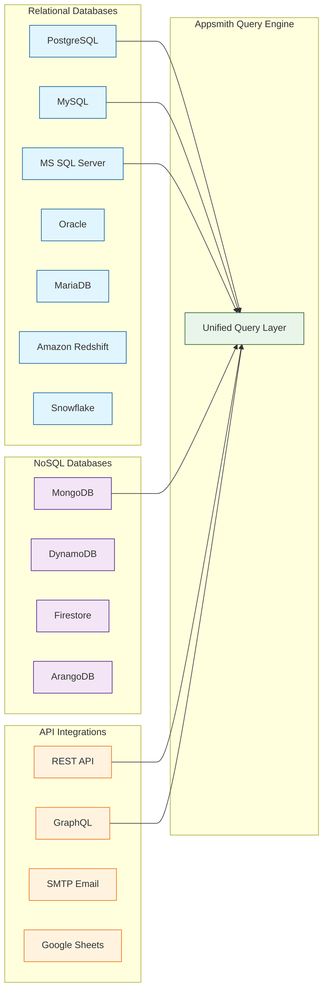
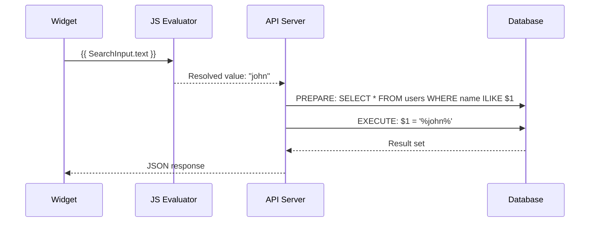
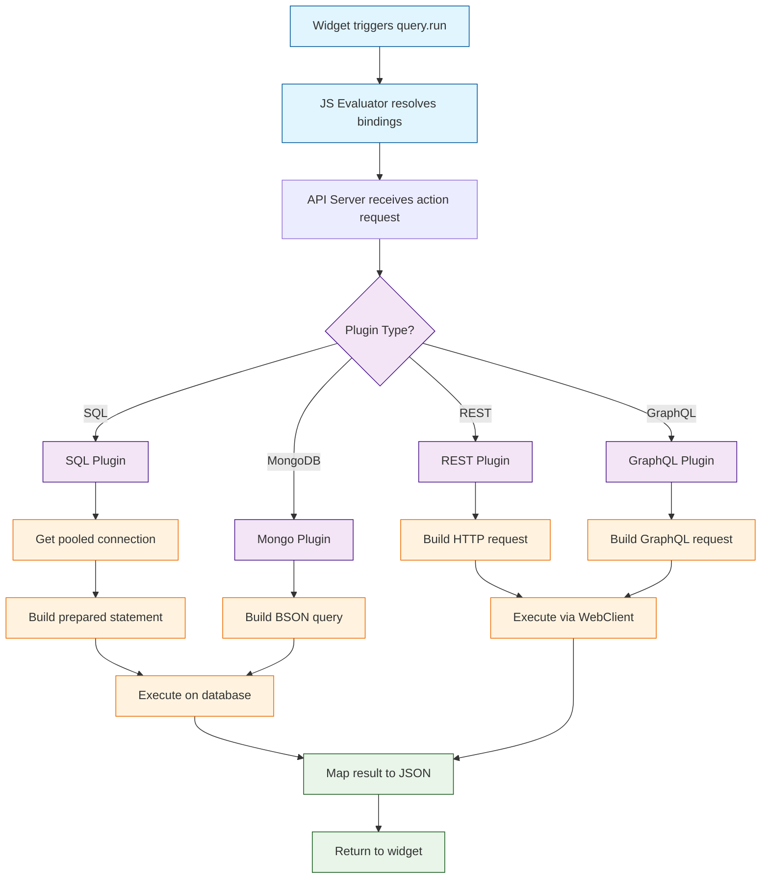

# Chapter 3: Data Sources & Queries

This chapter covers Appsmith's data layer — how to connect databases, write queries, consume REST and GraphQL APIs, and use the unified query engine that abstracts 25+ integrations behind a consistent interface.

> Connect any database or API, write parameterized queries, and pipe results directly into widgets.

## What Problem Does This Solve?

Internal tools almost always need to talk to multiple data sources: a PostgreSQL production database, a REST API for a third-party service, a MongoDB analytics store. Without a unified layer, developers spend most of their time writing boilerplate API clients and data transformation code. Appsmith's data source system provides a single abstraction for all integrations, with built-in connection pooling, credential management, and parameterized queries.

## Supported Data Sources



## Connecting a Data Source

### PostgreSQL Example

```javascript
// Data source configuration (stored encrypted in MongoDB)
{
  name: "Production PostgreSQL",
  pluginId: "postgres-plugin",
  datasourceConfiguration: {
    connection: {
      mode: "READ_WRITE",
      ssl: {
        authType: "DEFAULT"  // or CA_CERTIFICATE, SELF_SIGNED_CERTIFICATE
      }
    },
    endpoints: [
      { host: "db.example.com", port: 5432 }
    ],
    authentication: {
      databaseName: "myapp",
      username: "appsmith_user",
      password: "encrypted_password"
    },
    connectionPool: {
      maxPoolSize: 5,
      connectionTimeoutMs: 30000
    }
  }
}
```

### MongoDB Example

```javascript
// MongoDB connection using a URI
{
  name: "Analytics MongoDB",
  pluginId: "mongo-plugin",
  datasourceConfiguration: {
    endpoints: [
      { host: "mongo.example.com", port: 27017 }
    ],
    authentication: {
      databaseName: "analytics",
      username: "reader",
      password: "encrypted_password",
      authType: "SCRAM_SHA_256"
    },
    properties: [
      { key: "Use Mongo URI", value: "No" },
      { key: "srv", value: "false" }
    ]
  }
}
```

### REST API Example

```javascript
// REST API data source
{
  name: "Stripe API",
  pluginId: "restapi-plugin",
  datasourceConfiguration: {
    url: "https://api.stripe.com/v1",
    headers: [
      { key: "Authorization", value: "Bearer {{secrets.STRIPE_SECRET_KEY}}" },
      { key: "Content-Type", value: "application/x-www-form-urlencoded" }
    ],
    isSendSessionEnabled: false,
    properties: [
      { key: "selfSignedCert", value: "false" }
    ]
  }
}
```

## Writing Queries

### SQL Queries

Appsmith supports raw SQL with mustache bindings for parameterization:

```sql
-- Parameterized query: getOrders
-- Mustache bindings are safely parameterized (no SQL injection)
SELECT
  o.id,
  o.created_at,
  o.total_amount,
  c.name AS customer_name,
  c.email AS customer_email
FROM orders o
JOIN customers c ON o.customer_id = c.id
WHERE o.status = {{ StatusSelect.selectedOptionValue }}
  AND o.created_at >= {{ DateRangeStart.selectedDate }}
  AND o.created_at <= {{ DateRangeEnd.selectedDate }}
  AND (
    {{ !SearchInput.text }}
    OR c.name ILIKE {{ '%' + SearchInput.text + '%' }}
    OR c.email ILIKE {{ '%' + SearchInput.text + '%' }}
  )
ORDER BY o.created_at DESC
LIMIT {{ Table1.pageSize }}
OFFSET {{ (Table1.pageNo - 1) * Table1.pageSize }};
```

### Prepared Statements

Appsmith uses prepared statements by default for SQL queries to prevent injection:



### MongoDB Queries

MongoDB queries use a JSON-based syntax:

```javascript
// Find documents
{
  "find": "orders",
  "filter": {
    "status": "{{ StatusSelect.selectedOptionValue }}",
    "createdAt": {
      "$gte": "{{ DateRangeStart.selectedDate }}",
      "$lte": "{{ DateRangeEnd.selectedDate }}"
    }
  },
  "sort": { "createdAt": -1 },
  "limit": {{ Table1.pageSize }},
  "skip": {{ (Table1.pageNo - 1) * Table1.pageSize }}
}

// Aggregation pipeline
{
  "aggregate": "orders",
  "pipeline": [
    { "$match": { "status": "completed" } },
    {
      "$group": {
        "_id": "$customer_id",
        "totalSpent": { "$sum": "$total_amount" },
        "orderCount": { "$sum": 1 }
      }
    },
    { "$sort": { "totalSpent": -1 } },
    { "$limit": 10 }
  ]
}
```

### REST API Queries

Configure individual API calls as queries:

```javascript
// GET request with dynamic parameters
{
  httpMethod: "GET",
  url: "/customers",
  queryParameters: [
    { key: "page", value: "{{ Table1.pageNo }}" },
    { key: "limit", value: "{{ Table1.pageSize }}" },
    { key: "search", value: "{{ SearchInput.text }}" }
  ],
  headers: [
    { key: "X-Request-ID", value: "{{ crypto.randomUUID() }}" }
  ]
}

// POST request with JSON body
{
  httpMethod: "POST",
  url: "/customers",
  headers: [
    { key: "Content-Type", value: "application/json" }
  ],
  body: JSON.stringify({
    name: NameInput.text,
    email: EmailInput.text,
    company: CompanyInput.text,
    tags: MultiSelect1.selectedValues
  })
}
```

### GraphQL Queries

```javascript
// GraphQL query
{
  url: "/graphql",
  body: JSON.stringify({
    query: `
      query GetCustomers($search: String, $limit: Int, $offset: Int) {
        customers(
          where: { name: { _ilike: $search } }
          limit: $limit
          offset: $offset
        ) {
          id
          name
          email
          orders_aggregate {
            aggregate { count }
          }
        }
      }
    `,
    variables: {
      search: `%${SearchInput.text}%`,
      limit: Table1.pageSize,
      offset: (Table1.pageNo - 1) * Table1.pageSize
    }
  })
}
```

## How It Works Under the Hood

### The Plugin Architecture

Appsmith implements each data source as a **plugin** — a Java class that extends a base interface:

```java
// server/appsmith-interfaces/src/main/java/com/appsmith/external/plugins/PluginExecutor.java

public interface PluginExecutor<C> {

    // Test connectivity to the data source
    Mono<DatasourceTestResult> testDatasource(DatasourceConfiguration config);

    // Execute a query/action
    Mono<ActionExecutionResult> execute(
        C connection,
        DatasourceConfiguration dsConfig,
        ActionConfiguration actionConfig
    );

    // Create a connection (for connection pooling)
    Mono<C> datasourceCreate(DatasourceConfiguration config);

    // Destroy a connection
    void datasourceDestroy(C connection);

    // Get database structure for auto-complete
    Mono<DatasourceStructure> getStructure(
        C connection,
        DatasourceConfiguration config
    );
}
```

### Query Execution Flow



### Connection Pooling

Appsmith maintains connection pools per data source to avoid the overhead of establishing new connections for each query:

```java
// Connection pool configuration
{
  maxPoolSize: 5,           // Max concurrent connections
  connectionTimeoutMs: 30000, // Wait time for a connection from pool
  idleTimeoutMs: 600000,    // Close idle connections after 10 minutes
  maxLifetimeMs: 1800000    // Recycle connections after 30 minutes
}
```

## Query Settings and Run Configuration

### Run on Page Load

Queries can be configured to run automatically when a page loads:

```javascript
// Query settings
{
  name: "getEmployees",
  executeOnLoad: true,        // Run when page loads
  confirmBeforeExecute: false, // No confirmation dialog
  timeout: 10000,             // 10-second timeout
  cachingEnabled: true        // Cache results for repeated reads
}
```

### Running Queries from JS

```javascript
// Simple run
{{ getEmployees.run() }}

// Run with parameters (override bindings)
{{ getEmployees.run({ searchTerm: "john", page: 1 }) }}

// Chain queries with promises
{{
  createOrder.run()
    .then(() => getOrders.run())
    .then(() => getOrderStats.run())
    .then(() => showAlert("Order created and data refreshed", "success"))
    .catch(err => showAlert(err.message, "error"))
}}

// Run multiple queries in parallel
{{
  Promise.all([
    getOrders.run(),
    getCustomers.run(),
    getStats.run()
  ]).then(([orders, customers, stats]) => {
    storeValue("dashboardLoaded", true);
  })
}}
```

### Transforming Query Results

Use the **JS Transform** section to reshape data before it reaches widgets:

```javascript
// Transform query results
// In the query's "JS Transform" section:

// Flatten nested API response
return getOrders.data.results.map(order => ({
  id: order.id,
  customer: order.customer.name,
  email: order.customer.email,
  total: `$${order.total_amount.toFixed(2)}`,
  status: order.status.charAt(0).toUpperCase() + order.status.slice(1),
  date: new Date(order.created_at).toLocaleDateString()
}));
```

## Key Takeaways

- Appsmith supports 25+ data sources through a plugin-based architecture with a unified query interface.
- SQL queries use prepared statements by default to prevent injection attacks.
- Mustache `{{ }}` bindings inside queries create reactive, parameterized connections to widget state.
- Connection pooling is managed automatically per data source with configurable limits.
- Queries can run on page load, on widget events, or programmatically from JavaScript.

## Cross-References

- **Previous chapter:** [Chapter 2: Widget System](02-widget-system.md) covers the widgets that display query results.
- **Next chapter:** [Chapter 4: JS Logic & Bindings](04-js-logic-and-bindings.md) explores the JavaScript engine that powers bindings and transformations.
- **Custom widgets:** [Chapter 5: Custom Widgets](05-custom-widgets.md) shows how to build widgets that consume query data.

---

*Generated by [AI Codebase Knowledge Builder](https://github.com/The-Pocket/Tutorial-Codebase-Knowledge)*
