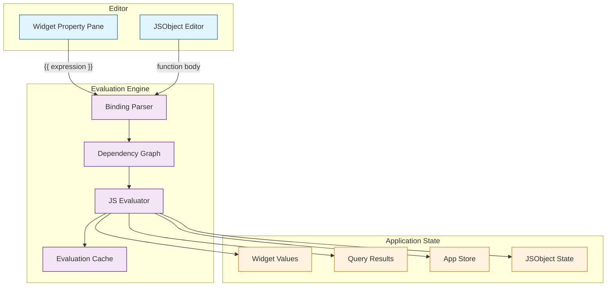
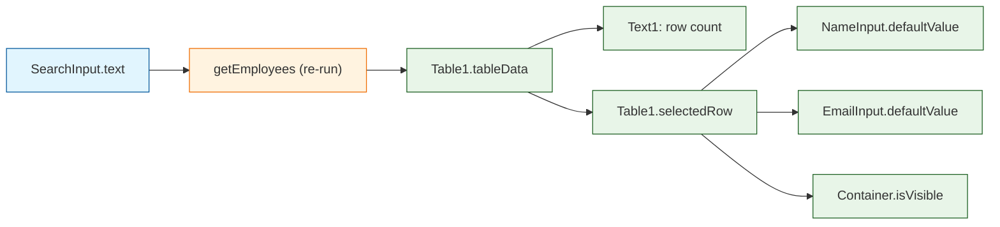
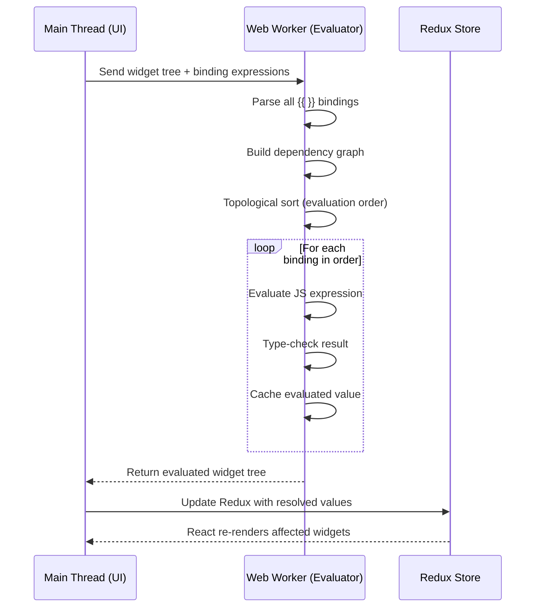

# Chapter 4: JS Logic & Bindings

This chapter dives into Appsmith's JavaScript engine — the binding evaluation system, JSObjects, async workflows, and the global functions that give developers full programmatic control over their applications.

> Write JavaScript logic with mustache bindings, JSObjects, and async workflows to handle any business requirement.

## What Problem Does This Solve?

Visual builders hit a wall when business logic gets complex: conditional field visibility is easy, but multi-step approval workflows with API calls, data transformations, and error handling need real code. Appsmith solves this with a JavaScript-first approach — every widget property accepts JS expressions, and JSObjects provide a dedicated space for reusable functions.

The design principle: start visual, escape to code when you need to.

## Binding System Architecture



## Mustache Bindings

Every widget property that accepts dynamic values uses mustache `{{ }}` syntax. Inside the braces, you write any valid JavaScript expression.

### Basic Expressions

```javascript
// String concatenation
{{ "Hello, " + NameInput.text + "!" }}

// Ternary conditions
{{ Table1.selectedRow ? Table1.selectedRow.name : "No selection" }}

// Array methods
{{ getEmployees.data.filter(e => e.department === "Engineering").length }}

// Template literals
{{ `Order #${Table1.selectedRow.id} - ${Table1.selectedRow.status}` }}

// Math operations
{{ (getStats.data[0].revenue / getStats.data[0].target * 100).toFixed(1) + "%" }}
```

### Widget-to-Widget Bindings

Widgets reference each other by name, creating reactive data flows:

```javascript
// Input widget reads from Table selection
// NameInput defaultValue:
{{ Table1.selectedRow.name }}

// Select widget options from query data
// DepartmentSelect options:
{{ getDepartments.data.map(d => ({ label: d.name, value: d.id })) }}

// Text widget shows computed summary
{{ `Showing ${Table1.filteredTableData.length} of ${getEmployees.data.length} employees` }}

// Chart data derived from query results
{{
  getRevenue.data.map(r => ({
    x: r.month,
    y: r.total
  }))
}}
```

### The Dependency Graph

Appsmith builds a directed acyclic graph (DAG) of all bindings to determine evaluation order:



When `SearchInput.text` changes, the engine knows to:
1. Re-run `getEmployees` (which references `SearchInput.text`)
2. Update `Table1.tableData` (which references `getEmployees.data`)
3. Update all widgets that depend on `Table1`

## JSObjects

JSObjects are reusable JavaScript modules you define per page. They can hold variables, synchronous functions, and async functions.

### Defining a JSObject

```javascript
// JSObject: EmployeeUtils
export default {
  // Variables (reactive state)
  selectedDepartment: "All",
  isEditing: false,

  // Synchronous function
  formatSalary(amount) {
    return new Intl.NumberFormat("en-US", {
      style: "currency",
      currency: "USD",
    }).format(amount);
  },

  // Filter employees by department
  getFilteredEmployees() {
    const data = getEmployees.data || [];
    if (this.selectedDepartment === "All") return data;
    return data.filter(e => e.department === this.selectedDepartment);
  },

  // Compute department statistics
  getDepartmentStats() {
    const data = getEmployees.data || [];
    const departments = [...new Set(data.map(e => e.department))];
    return departments.map(dept => {
      const employees = data.filter(e => e.department === dept);
      return {
        department: dept,
        count: employees.length,
        avgSalary: employees.reduce((s, e) => s + e.salary, 0) / employees.length,
        totalSalary: employees.reduce((s, e) => s + e.salary, 0),
      };
    });
  },

  // Async function — runs queries and handles results
  async saveEmployee() {
    try {
      const payload = {
        name: NameInput.text,
        email: EmailInput.text,
        department: DepartmentSelect.selectedOptionValue,
        salary: Number(SalaryInput.text),
      };

      // Validate before saving
      if (!payload.name || !payload.email) {
        showAlert("Name and email are required", "warning");
        return;
      }

      if (this.isEditing) {
        await updateEmployee.run({ ...payload, id: Table1.selectedRow.id });
        showAlert("Employee updated", "success");
      } else {
        await createEmployee.run(payload);
        showAlert("Employee created", "success");
      }

      // Refresh data
      await getEmployees.run();
      this.isEditing = false;
      closeModal("EmployeeModal");
    } catch (error) {
      showAlert(`Save failed: ${error.message}`, "error");
    }
  },

  // Async function with multi-step workflow
  async processPayroll() {
    try {
      showAlert("Processing payroll...", "info");

      // Step 1: Validate all employee records
      const employees = getEmployees.data;
      const invalid = employees.filter(e => !e.salary || e.salary <= 0);
      if (invalid.length > 0) {
        showAlert(`${invalid.length} employees have invalid salary data`, "error");
        return;
      }

      // Step 2: Generate payroll records
      await generatePayroll.run({ month: MonthPicker.selectedDate });

      // Step 3: Send notifications
      await sendPayrollNotifications.run();

      // Step 4: Refresh dashboard
      await Promise.all([
        getPayrollSummary.run(),
        getEmployees.run(),
      ]);

      showAlert("Payroll processed successfully", "success");
    } catch (error) {
      showAlert(`Payroll failed: ${error.message}`, "error");
      // Log error for debugging
      console.error("Payroll error:", error);
    }
  },
};
```

### Using JSObjects in Widgets

Reference JSObject functions and variables just like widget properties:

```javascript
// Table data from JSObject
{{ EmployeeUtils.getFilteredEmployees() }}

// Salary column using formatter
{{ EmployeeUtils.formatSalary(currentRow.salary) }}

// Button onClick
{{ EmployeeUtils.saveEmployee() }}

// Chart data from JSObject
{{ EmployeeUtils.getDepartmentStats() }}

// Conditional visibility
{{ EmployeeUtils.isEditing }}
```

## Global Functions

Appsmith provides built-in global functions available everywhere:

### Navigation

```javascript
// Navigate to another page
{{ navigateTo("EmployeeDetail", { employeeId: Table1.selectedRow.id }) }}

// Navigate to external URL
{{ navigateTo("https://docs.example.com", {}, "NEW_WINDOW") }}

// Access URL parameters on the target page
{{ appsmith.URL.queryParams.employeeId }}
```

### Alerts and Modals

```javascript
// Show toast notifications
{{ showAlert("Record saved!", "success") }}   // success, info, warning, error

// Open/close modals
{{ showModal("CreateEmployeeModal") }}
{{ closeModal("CreateEmployeeModal") }}
```

### Store (Persistent State)

```javascript
// Store a value (persists across page navigation)
{{ storeValue("theme", "dark") }}
{{ storeValue("recentSearches", [...(appsmith.store.recentSearches || []), SearchInput.text]) }}

// Read stored values
{{ appsmith.store.theme }}
{{ appsmith.store.recentSearches }}

// Remove a stored value
{{ removeValue("theme") }}

// Clear all stored values
{{ clearStore() }}
```

### Clipboard, Download, and Utilities

```javascript
// Copy to clipboard
{{ copyToClipboard(Table1.selectedRow.email) }}

// Download data as file
{{ download(JSON.stringify(getEmployees.data), "employees.json", "application/json") }}
{{ download(Table1.tableData, "report.csv", "text/csv") }}

// Reset widget to default state
{{ resetWidget("NameInput") }}
{{ resetWidget("Form1", true) }}  // true = reset children too

// Set interval for polling
{{
  setInterval(() => {
    getAlerts.run();
  }, 30000, "alertPolling")
}}

// Clear interval
{{ clearInterval("alertPolling") }}
```

## How It Works Under the Hood

### The Evaluation Engine

Appsmith evaluates bindings in a dedicated Web Worker to avoid blocking the main UI thread:



### Evaluation Context

Every binding expression has access to the following in its scope:

```typescript
// The evaluation context available inside {{ }}
interface EvaluationContext {
  // All widgets by name
  [widgetName: string]: WidgetProperties;

  // All queries by name
  [queryName: string]: {
    data: any;
    run: (params?: object) => Promise<any>;
    clear: () => void;
    isLoading: boolean;
    responseMeta: { statusCode: number; headers: object };
  };

  // All JSObjects by name
  [jsObjectName: string]: {
    [functionName: string]: Function;
    [variableName: string]: any;
  };

  // Global objects
  appsmith: {
    store: Record<string, any>;
    URL: { queryParams: Record<string, string>; pathname: string };
    user: { name: string; email: string; roles: string[] };
    theme: { colors: object; borderRadius: object; boxShadow: object };
    mode: "EDIT" | "VIEW";
  };

  // Global functions
  showAlert: (message: string, type?: string) => void;
  showModal: (name: string) => void;
  closeModal: (name: string) => void;
  navigateTo: (target: string, params?: object, mode?: string) => void;
  storeValue: (key: string, value: any) => void;
  removeValue: (key: string) => void;
  download: (data: any, filename: string, type?: string) => void;
  copyToClipboard: (text: string) => void;
  resetWidget: (name: string, resetChildren?: boolean) => void;
  setInterval: (fn: Function, ms: number, id: string) => void;
  clearInterval: (id: string) => void;
}
```

## Error Handling Patterns

### Try-Catch in JSObjects

```javascript
// Robust error handling pattern
export default {
  async submitForm() {
    try {
      // Validate
      const errors = this.validateForm();
      if (errors.length > 0) {
        showAlert(errors.join("\n"), "warning");
        return { success: false, errors };
      }

      // Execute
      const result = await createRecord.run();

      // Refresh
      await getRecords.run();
      closeModal("FormModal");
      showAlert("Record created", "success");
      return { success: true, data: result };

    } catch (error) {
      // Categorize errors
      if (error.statusCode === 409) {
        showAlert("Duplicate record — this entry already exists", "warning");
      } else if (error.statusCode >= 500) {
        showAlert("Server error — please try again later", "error");
      } else {
        showAlert(`Error: ${error.message}`, "error");
      }
      return { success: false, error: error.message };
    }
  },

  validateForm() {
    const errors = [];
    if (!NameInput.text) errors.push("Name is required");
    if (!EmailInput.text?.includes("@")) errors.push("Valid email is required");
    if (Number(SalaryInput.text) <= 0) errors.push("Salary must be positive");
    return errors;
  },
};
```

## Key Takeaways

- Mustache `{{ }}` bindings accept any JavaScript expression and create reactive data flows.
- Appsmith builds a dependency graph to evaluate bindings in the correct order.
- JSObjects provide a dedicated space for reusable functions, variables, and async workflows.
- The evaluation engine runs in a Web Worker to keep the UI responsive.
- Global functions (`showAlert`, `navigateTo`, `storeValue`) handle common application patterns.

## Cross-References

- **Previous chapter:** [Chapter 3: Data Sources & Queries](03-data-sources-and-queries.md) covers the queries that JSObjects orchestrate.
- **Next chapter:** [Chapter 5: Custom Widgets](05-custom-widgets.md) shows how to build widgets when built-in ones are not enough.
- **Widget properties:** [Chapter 2: Widget System](02-widget-system.md) explains the properties that bindings target.

---

*Generated by [AI Codebase Knowledge Builder](https://github.com/The-Pocket/Tutorial-Codebase-Knowledge)*
