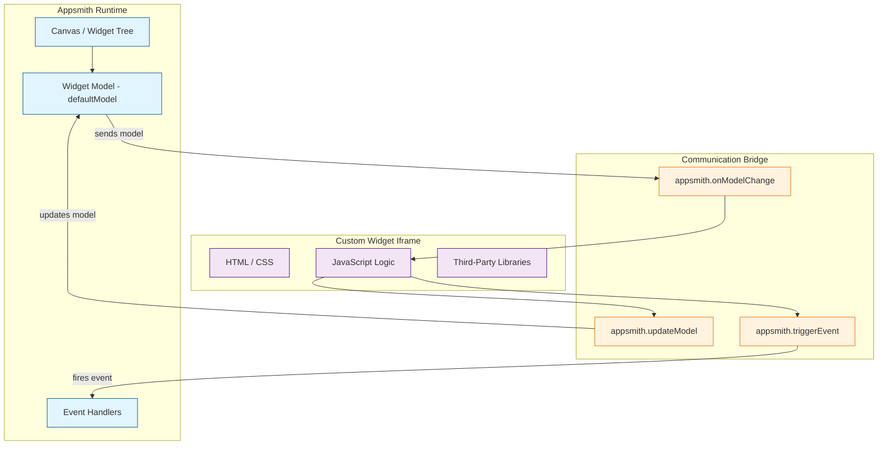
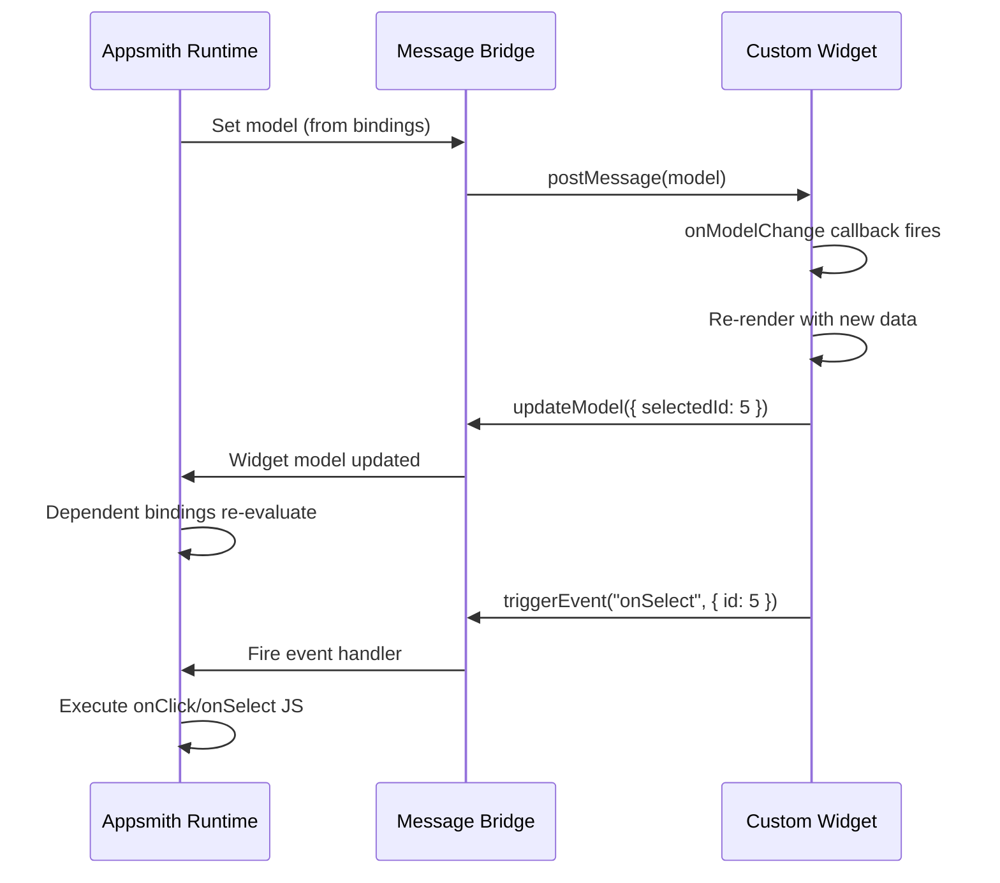

# Chapter 5: Custom Widgets

This chapter covers building custom widgets in Appsmith — how to extend the platform beyond its 45+ built-in components by writing your own HTML, CSS, and JavaScript widgets that communicate with the Appsmith runtime.

> Build custom React widgets, integrate third-party libraries, and extend Appsmith when built-in components are not enough.

## What Problem Does This Solve?

Built-in widgets cover the most common patterns — tables, forms, charts, modals. But internal tools often need specialized components: org charts, Gantt timelines, signature pads, code editors, or domain-specific visualizations. Appsmith's Custom Widget framework lets you embed arbitrary HTML/CSS/JavaScript into your applications while maintaining two-way communication with the Appsmith runtime.

## Custom Widget Architecture



## Creating a Custom Widget

### Step 1: Add the Widget

Drag the **Custom** widget from the widget panel onto your canvas. It creates an iframe sandbox with three editable sections: HTML, CSS, and JavaScript.

### Step 2: Define the Default Model

The default model defines the initial data passed into the custom widget:

```javascript
// Default Model (set in the widget property pane)
{
  "items": [],
  "selectedId": null,
  "theme": "light",
  "title": "Custom Component"
}
```

### Step 3: Write the HTML

```html
<!-- Custom Widget HTML -->
<!DOCTYPE html>
<html>
<head>
  <style>
    body {
      font-family: -apple-system, BlinkMacSystemFont, 'Segoe UI', sans-serif;
      margin: 0;
      padding: 16px;
    }
    .card-grid {
      display: grid;
      grid-template-columns: repeat(auto-fill, minmax(200px, 1fr));
      gap: 12px;
    }
    .card {
      border: 1px solid #e0e0e0;
      border-radius: 8px;
      padding: 16px;
      cursor: pointer;
      transition: box-shadow 0.2s, border-color 0.2s;
    }
    .card:hover {
      box-shadow: 0 2px 8px rgba(0,0,0,0.1);
    }
    .card.selected {
      border-color: #5c6bc0;
      background-color: #e8eaf6;
    }
    .card-title {
      font-weight: 600;
      margin-bottom: 4px;
    }
    .card-subtitle {
      color: #666;
      font-size: 0.875rem;
    }
  </style>
</head>
<body>
  <h3 id="title"></h3>
  <div id="card-grid" class="card-grid"></div>
</body>
</html>
```

### Step 4: Write the JavaScript

```javascript
// Custom Widget JavaScript

// Initialize: called when the widget first loads
appsmith.onReady(() => {
  const model = appsmith.model;
  renderTitle(model.title);
  renderCards(model.items, model.selectedId);
});

// React to model changes from Appsmith
appsmith.onModelChange((newModel) => {
  renderTitle(newModel.title);
  renderCards(newModel.items, newModel.selectedId);
});

function renderTitle(title) {
  document.getElementById("title").textContent = title;
}

function renderCards(items, selectedId) {
  const grid = document.getElementById("card-grid");
  grid.innerHTML = "";

  items.forEach((item) => {
    const card = document.createElement("div");
    card.className = `card ${item.id === selectedId ? "selected" : ""}`;
    card.innerHTML = `
      <div class="card-title">${escapeHtml(item.name)}</div>
      <div class="card-subtitle">${escapeHtml(item.description || "")}</div>
    `;

    card.addEventListener("click", () => {
      // Update the model (reflects back to Appsmith)
      appsmith.updateModel({ selectedId: item.id });

      // Trigger a custom event (Appsmith can handle this)
      appsmith.triggerEvent("onCardSelect", { item });
    });

    grid.appendChild(card);
  });
}

function escapeHtml(text) {
  const div = document.createElement("div");
  div.textContent = text;
  return div.innerHTML;
}
```

### Step 5: Wire It Up in Appsmith

```javascript
// Set the Custom Widget's Default Model from query data:
{{
  {
    items: getProjects.data.map(p => ({
      id: p.id,
      name: p.name,
      description: p.description
    })),
    selectedId: null,
    title: "Project Catalog"
  }
}}

// Handle the onCardSelect event:
{{
  // The event data is available as the first argument
  (event) => {
    storeValue("selectedProject", event.item);
    getProjectDetails.run({ projectId: event.item.id });
  }
}}

// Read state back from the custom widget:
{{ CustomWidget1.model.selectedId }}
```

## The Communication API

### appsmith Object Reference

The `appsmith` object is injected into the iframe and provides the bridge between your code and the Appsmith runtime:

```typescript
interface AppsmithCustomWidgetAPI {
  // The current model (read-only snapshot)
  model: Record<string, any>;

  // The current Appsmith UI mode
  mode: "EDIT" | "VIEW";

  // The current Appsmith theme
  theme: {
    colors: {
      primaryColor: string;
      backgroundColor: string;
    };
    borderRadius: Record<string, string>;
    boxShadow: Record<string, string>;
  };

  // Called when the widget is ready
  onReady(callback: () => void): void;

  // Called whenever the model changes from the Appsmith side
  onModelChange(callback: (model: Record<string, any>) => void): void;

  // Update the model (merges with existing model)
  updateModel(updates: Record<string, any>): void;

  // Trigger a named event (handled by Appsmith event properties)
  triggerEvent(eventName: string, data?: any): void;

  // Called when the Appsmith UI mode changes
  onUiChange(callback: (data: { mode: "EDIT" | "VIEW" }) => void): void;

  // Called when the Appsmith theme changes
  onThemeChange(callback: (theme: object) => void): void;
}
```

### Data Flow



## Advanced: Using Third-Party Libraries

Load external libraries via CDN in your custom widget:

### Chart.js Example

```html
<!-- Custom Widget HTML for Chart.js -->
<!DOCTYPE html>
<html>
<head>
  <script src="https://cdn.jsdelivr.net/npm/chart.js@4.4.0/dist/chart.umd.min.js"></script>
  <style>
    body { margin: 0; padding: 8px; }
    canvas { width: 100% !important; }
  </style>
</head>
<body>
  <canvas id="chart"></canvas>
</body>
</html>
```

```javascript
// Chart.js Custom Widget JavaScript
let chartInstance = null;

appsmith.onReady(() => {
  createChart(appsmith.model);
});

appsmith.onModelChange((model) => {
  if (chartInstance) chartInstance.destroy();
  createChart(model);
});

function createChart(model) {
  const ctx = document.getElementById("chart").getContext("2d");

  chartInstance = new Chart(ctx, {
    type: model.chartType || "bar",
    data: {
      labels: model.labels || [],
      datasets: (model.datasets || []).map((ds, i) => ({
        label: ds.label,
        data: ds.data,
        backgroundColor: ds.color || getDefaultColor(i),
        borderColor: ds.borderColor || ds.color || getDefaultColor(i),
        borderWidth: 1,
      })),
    },
    options: {
      responsive: true,
      maintainAspectRatio: false,
      onClick: (event, elements) => {
        if (elements.length > 0) {
          const idx = elements[0].index;
          appsmith.triggerEvent("onBarClick", {
            label: model.labels[idx],
            value: model.datasets[0].data[idx],
            index: idx,
          });
        }
      },
      plugins: {
        title: {
          display: !!model.title,
          text: model.title,
        },
      },
    },
  });
}

function getDefaultColor(index) {
  const colors = ["#5c6bc0", "#66bb6a", "#ffa726", "#ef5350", "#ab47bc"];
  return colors[index % colors.length];
}
```

```javascript
// Appsmith binding for Chart.js widget model:
{{
  {
    chartType: "bar",
    title: "Revenue by Quarter",
    labels: getRevenue.data.map(r => r.quarter),
    datasets: [
      {
        label: "Revenue",
        data: getRevenue.data.map(r => r.amount),
        color: "#5c6bc0"
      },
      {
        label: "Target",
        data: getRevenue.data.map(r => r.target),
        color: "#e0e0e0"
      }
    ]
  }
}}
```

### D3.js Org Chart Example

```javascript
// Custom Widget JS for D3-based Org Chart
// Load D3 via CDN in the HTML <head>:
// <script src="https://d3js.org/d3.v7.min.js"></script>

appsmith.onReady(() => {
  renderOrgChart(appsmith.model.orgData);
});

appsmith.onModelChange((model) => {
  renderOrgChart(model.orgData);
});

function renderOrgChart(data) {
  if (!data) return;

  const svg = d3.select("#org-chart");
  svg.selectAll("*").remove();

  const width = document.body.clientWidth;
  const height = document.body.clientHeight;
  const margin = { top: 40, right: 20, bottom: 40, left: 20 };

  const root = d3.hierarchy(data);
  const treeLayout = d3.tree().size([
    width - margin.left - margin.right,
    height - margin.top - margin.bottom,
  ]);

  treeLayout(root);

  const g = svg
    .attr("width", width)
    .attr("height", height)
    .append("g")
    .attr("transform", `translate(${margin.left},${margin.top})`);

  // Draw links
  g.selectAll(".link")
    .data(root.links())
    .join("path")
    .attr("class", "link")
    .attr("d", d3.linkVertical().x(d => d.x).y(d => d.y))
    .attr("fill", "none")
    .attr("stroke", "#ccc")
    .attr("stroke-width", 1.5);

  // Draw nodes
  const nodes = g.selectAll(".node")
    .data(root.descendants())
    .join("g")
    .attr("class", "node")
    .attr("transform", d => `translate(${d.x},${d.y})`)
    .style("cursor", "pointer")
    .on("click", (event, d) => {
      appsmith.triggerEvent("onNodeClick", { employee: d.data });
      appsmith.updateModel({ selectedEmployeeId: d.data.id });
    });

  nodes.append("circle").attr("r", 20).attr("fill", "#5c6bc0");
  nodes.append("text")
    .attr("dy", 35)
    .attr("text-anchor", "middle")
    .attr("font-size", "12px")
    .text(d => d.data.name);
}
```

## How It Works Under the Hood

### Iframe Sandboxing

Custom widgets run inside a sandboxed iframe for security:

```html
<!-- How Appsmith renders the custom widget -->
<iframe
  sandbox="allow-scripts allow-same-origin"
  srcdoc="<!-- your HTML/CSS/JS -->"
  style="width: 100%; height: 100%; border: none;"
></iframe>
```

The `sandbox` attribute restricts the iframe from:
- Navigating the parent page
- Accessing parent cookies or storage
- Submitting forms to external URLs

Communication happens exclusively through `postMessage`, which the `appsmith` bridge object abstracts.

### Message Protocol

```javascript
// Under the hood, appsmith.updateModel sends:
window.parent.postMessage({
  type: "UPDATE_MODEL",
  widgetId: "custom_widget_abc123",
  payload: { selectedId: 5 }
}, "*");

// And appsmith.triggerEvent sends:
window.parent.postMessage({
  type: "TRIGGER_EVENT",
  widgetId: "custom_widget_abc123",
  eventName: "onCardSelect",
  payload: { item: { id: 5, name: "Project Alpha" } }
}, "*");

// Appsmith sends model updates to the iframe:
iframe.contentWindow.postMessage({
  type: "MODEL_UPDATE",
  model: { items: [...], selectedId: null }
}, "*");
```

## Best Practices

### Performance

```javascript
// Debounce rapid model updates
let updateTimer;
function debouncedUpdate(updates) {
  clearTimeout(updateTimer);
  updateTimer = setTimeout(() => {
    appsmith.updateModel(updates);
  }, 150);
}

// Use document fragments for bulk DOM updates
function renderList(items) {
  const fragment = document.createDocumentFragment();
  items.forEach(item => {
    const el = createItemElement(item);
    fragment.appendChild(el);
  });
  container.innerHTML = "";
  container.appendChild(fragment);
}
```

### Theme Integration

```javascript
// Respect the Appsmith theme
appsmith.onReady(() => {
  applyTheme(appsmith.theme);
});

appsmith.onThemeChange((theme) => {
  applyTheme(theme);
});

function applyTheme(theme) {
  document.documentElement.style.setProperty(
    "--primary-color", theme.colors.primaryColor
  );
  document.documentElement.style.setProperty(
    "--bg-color", theme.colors.backgroundColor
  );
  document.documentElement.style.setProperty(
    "--border-radius", theme.borderRadius.appBorderRadius
  );
}
```

## Key Takeaways

- Custom widgets run in sandboxed iframes and communicate via `postMessage` through the `appsmith` bridge API.
- The `updateModel` / `triggerEvent` / `onModelChange` pattern provides two-way data flow.
- You can load any third-party JavaScript library (Chart.js, D3.js, etc.) via CDN.
- Custom widgets respect Appsmith themes and can adapt to mode changes (edit vs. view).
- Security is enforced through iframe sandboxing — custom code cannot access the parent page directly.

## Cross-References

- **Previous chapter:** [Chapter 4: JS Logic & Bindings](04-js-logic-and-bindings.md) covers the JS engine that powers widget bindings.
- **Next chapter:** [Chapter 6: Git Sync & Deployment](06-git-sync-and-deployment.md) shows how custom widgets are versioned with Git.
- **Widget system:** [Chapter 2: Widget System](02-widget-system.md) covers the built-in widgets you should use before building custom ones.

---

*Generated by [AI Codebase Knowledge Builder](https://github.com/The-Pocket/Tutorial-Codebase-Knowledge)*
