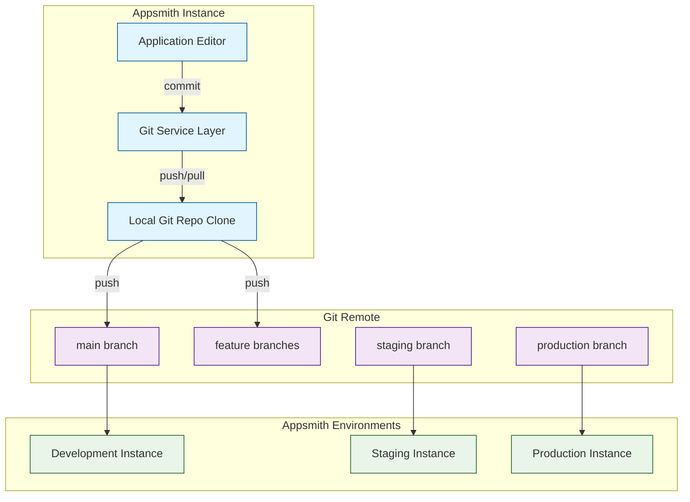
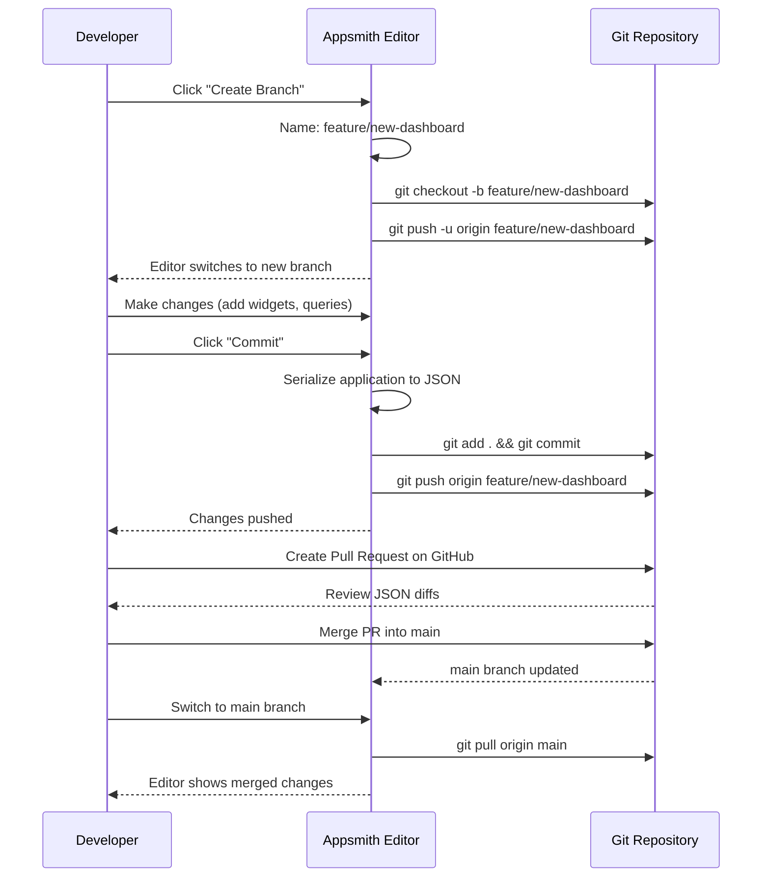
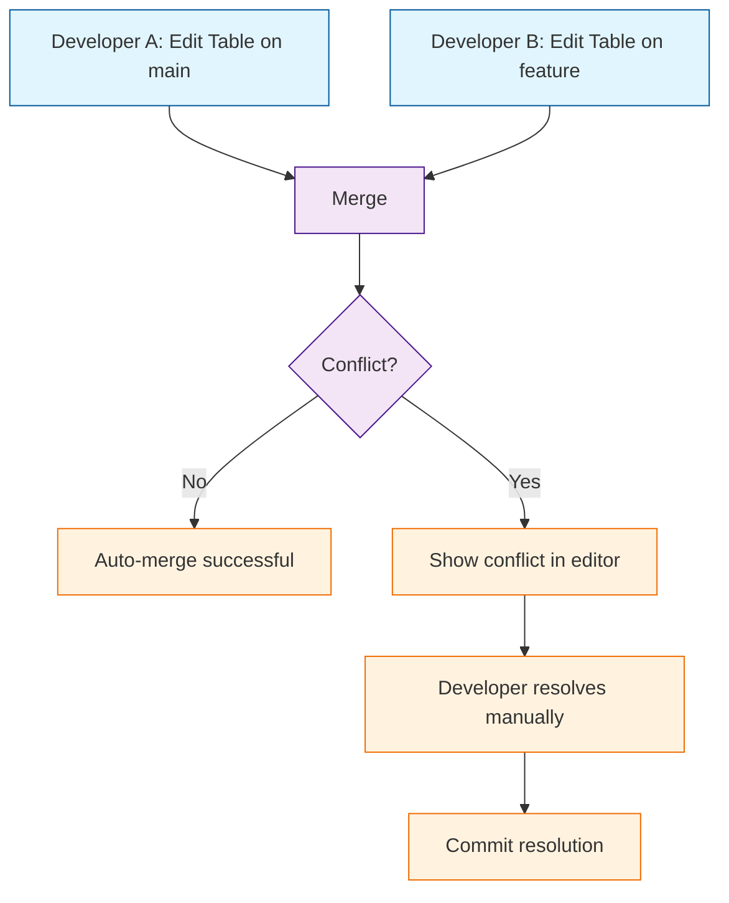

# Chapter 6: Git Sync & Deployment

This chapter covers Appsmith's Git-based version control system — how to connect applications to Git repositories, manage branches, review changes, and promote applications across environments.

> Version control your Appsmith apps with Git, manage branches, and deploy across environments with CI/CD.

## What Problem Does This Solve?

Low-code platforms traditionally treat applications as opaque blobs — you cannot diff changes, review pull requests, or roll back to a previous version. Appsmith solves this by serializing applications into JSON files that live in a Git repository. This gives teams:

- **Version history** — Every change is a commit you can inspect and revert.
- **Branching** — Developers work on features independently without breaking production.
- **Code review** — Pull requests let teams review application changes before merging.
- **Multi-environment promotion** — Move applications from dev to staging to production through Git branches.

## Git Sync Architecture



## Connecting an App to Git

### Step 1: Generate an SSH Key or Use HTTPS

Appsmith supports both SSH and HTTPS authentication with Git providers:

```bash
# Generate a deploy key for Appsmith
ssh-keygen -t ed25519 -C "appsmith-deploy-key" -f appsmith_deploy_key

# Add the public key to your Git provider as a deploy key
cat appsmith_deploy_key.pub
# Copy this to GitHub > Repository > Settings > Deploy Keys
```

### Step 2: Connect from the Appsmith Editor

1. Open your application in the editor.
2. Click the **Git** icon in the bottom-left corner.
3. Select **Connect to Git Repository**.
4. Enter the repository SSH URL: `git@github.com:your-org/appsmith-apps.git`
5. Paste the SSH private key.
6. Choose the default branch (typically `main`).

### Step 3: Initial Commit

Appsmith serializes the application and commits it to the repository:

```
appsmith-apps/
├── pages/
│   ├── Page1/
│   │   ├── Page1.json          # Page DSL (widget tree)
│   │   └── jsobjects/
│   │       └── EmployeeUtils/
│   │           └── EmployeeUtils.js   # JSObject source
│   ├── Page2/
│   │   ├── Page2.json
│   │   └── jsobjects/
│   └── ...
├── queries/
│   ├── getEmployees.json       # Query definitions
│   ├── updateEmployee.json
│   └── ...
├── datasources/
│   └── PostgreSQL_Production.json  # Connection config (no secrets)
├── theme.json                  # Application theme
├── application.json            # Application metadata
└── metadata.json               # Git sync metadata
```

## Working with Branches

### Creating a Feature Branch



### Branch Strategies

| Strategy | Branches | Use Case |
|:---------|:---------|:---------|
| **Feature branching** | `main`, `feature/*` | Small teams, simple workflows |
| **GitFlow** | `main`, `develop`, `feature/*`, `release/*` | Larger teams with release cycles |
| **Environment branching** | `main`, `staging`, `production` | Multi-environment promotion |

### Recommended: Environment Branching

```
main          ─── Development (latest changes)
  │
  └──► staging    ─── QA and testing
        │
        └──► production ─── Live application
```

Promote changes by merging:

```bash
# Promote from dev to staging
git checkout staging
git merge main
git push origin staging

# Promote from staging to production
git checkout production
git merge staging
git push origin production
```

## The Git File Format

### Page DSL (Page1.json)

Each page is serialized as a JSON document containing the widget tree:

```json
{
  "unpublishedPage": {
    "name": "EmployeeDashboard",
    "slug": "employee-dashboard",
    "layouts": [
      {
        "dsl": {
          "widgetName": "MainContainer",
          "type": "CANVAS_WIDGET",
          "children": [
            {
              "widgetName": "EmployeeTable",
              "type": "TABLE_WIDGET_V2",
              "tableData": "{{ getEmployees.data }}",
              "serverSidePaginationEnabled": true,
              "onPageChange": "{{ getEmployees.run() }}"
            }
          ]
        }
      }
    ]
  },
  "publishedPage": {
    "...same structure for published version..."
  }
}
```

### JSObject Files

JSObjects are stored as plain JavaScript files, making them easy to diff:

```javascript
// pages/Page1/jsobjects/EmployeeUtils/EmployeeUtils.js
export default {
  selectedDepartment: "All",

  getFilteredEmployees() {
    const data = getEmployees.data || [];
    if (this.selectedDepartment === "All") return data;
    return data.filter(e => e.department === this.selectedDepartment);
  },

  async saveEmployee() {
    try {
      await updateEmployee.run();
      await getEmployees.run();
      showAlert("Saved!", "success");
    } catch (e) {
      showAlert(e.message, "error");
    }
  },
};
```

### Query Definitions

```json
{
  "name": "getEmployees",
  "pluginId": "postgres-plugin",
  "datasource": { "name": "Production PostgreSQL" },
  "actionConfiguration": {
    "body": "SELECT * FROM employees ORDER BY id LIMIT {{Table1.pageSize}} OFFSET {{(Table1.pageNo - 1) * Table1.pageSize}}",
    "pluginSpecifiedTemplates": [
      { "key": "preparedStatement", "value": true }
    ]
  },
  "executeOnLoad": true,
  "timeout": 10000
}
```

## Multi-Environment Deployment

### Environment Variables

Appsmith supports environment-specific configuration so the same app can target different databases per environment:

```javascript
// In Appsmith, use environment-aware datasource configuration:
// Development datasource
{
  name: "PostgreSQL",
  datasourceConfiguration: {
    endpoints: [{ host: "dev-db.internal", port: 5432 }],
    authentication: { databaseName: "myapp_dev" }
  }
}

// Production datasource (different instance, same name)
{
  name: "PostgreSQL",
  datasourceConfiguration: {
    endpoints: [{ host: "prod-db.internal", port: 5432 }],
    authentication: { databaseName: "myapp_prod" }
  }
}
```

### CI/CD Integration

Automate deployments with GitHub Actions:

```yaml
# .github/workflows/deploy-appsmith.yml
name: Deploy Appsmith App

on:
  push:
    branches: [production]

jobs:
  deploy:
    runs-on: ubuntu-latest
    steps:
      - uses: actions/checkout@v4

      - name: Validate JSON structure
        run: |
          for file in $(find . -name "*.json" -path "*/pages/*"); do
            python -m json.tool "$file" > /dev/null || exit 1
          done

      - name: Notify Appsmith to pull latest
        run: |
          curl -X POST \
            "${{ secrets.APPSMITH_API_URL }}/api/v1/git/pull" \
            -H "Authorization: Bearer ${{ secrets.APPSMITH_API_TOKEN }}" \
            -H "Content-Type: application/json" \
            -d '{"branchName": "production"}'

      - name: Publish application
        run: |
          curl -X POST \
            "${{ secrets.APPSMITH_API_URL }}/api/v1/applications/${{ secrets.APPSMITH_APP_ID }}/publish" \
            -H "Authorization: Bearer ${{ secrets.APPSMITH_API_TOKEN }}"
```

## How It Works Under the Hood

### Git Service Layer

Appsmith uses JGit (a Java Git implementation) to manage repositories on the server:

```java
// Simplified representation of the Git service
// server/appsmith-server/src/main/java/com/appsmith/server/git/

public class GitServiceCE {

    public Mono<String> commitApplication(
        String applicationId,
        GitCommitDTO commitDTO,
        String branchName
    ) {
        return applicationService.findById(applicationId)
            .flatMap(app -> serializeApplicationToFiles(app))
            .flatMap(files -> {
                // Write serialized JSON to local repo
                writeFilesToRepo(files, repoPath);
                // Stage all changes
                git.add().addFilepattern(".").call();
                // Commit
                git.commit()
                    .setMessage(commitDTO.getMessage())
                    .setAuthor(commitDTO.getAuthor(), commitDTO.getEmail())
                    .call();
                // Push to remote
                return pushToRemote(git, branchName);
            });
    }

    public Mono<Application> pullApplication(
        String applicationId,
        String branchName
    ) {
        return getGitRepo(applicationId)
            .flatMap(git -> {
                // Pull latest from remote
                git.pull().setRemoteBranchName(branchName).call();
                // Read JSON files from repo
                return deserializeFilesToApplication(repoPath);
            })
            .flatMap(app -> applicationService.save(app));
    }
}
```

### Conflict Resolution

When two developers modify the same page on different branches, Appsmith detects conflicts during merge:



Appsmith provides a visual diff tool in the editor that highlights widget-level changes, making it easier to resolve conflicts than working with raw JSON.

## Key Takeaways

- Appsmith serializes applications into JSON files that live in standard Git repositories.
- Branching enables parallel development and multi-environment promotion.
- JSObjects are stored as plain JavaScript files, making code review straightforward.
- CI/CD pipelines can automate validation, pulling, and publishing of applications.
- JGit on the server handles all Git operations without requiring a system Git installation.

## Cross-References

- **Previous chapter:** [Chapter 5: Custom Widgets](05-custom-widgets.md) covers custom components that are versioned alongside pages.
- **Next chapter:** [Chapter 7: Access Control & Governance](07-access-control-and-governance.md) covers RBAC and audit logging.
- **Getting started:** [Chapter 1: Getting Started](01-getting-started.md) covers initial setup before connecting Git.

---

*Generated by [AI Codebase Knowledge Builder](https://github.com/The-Pocket/Tutorial-Codebase-Knowledge)*
