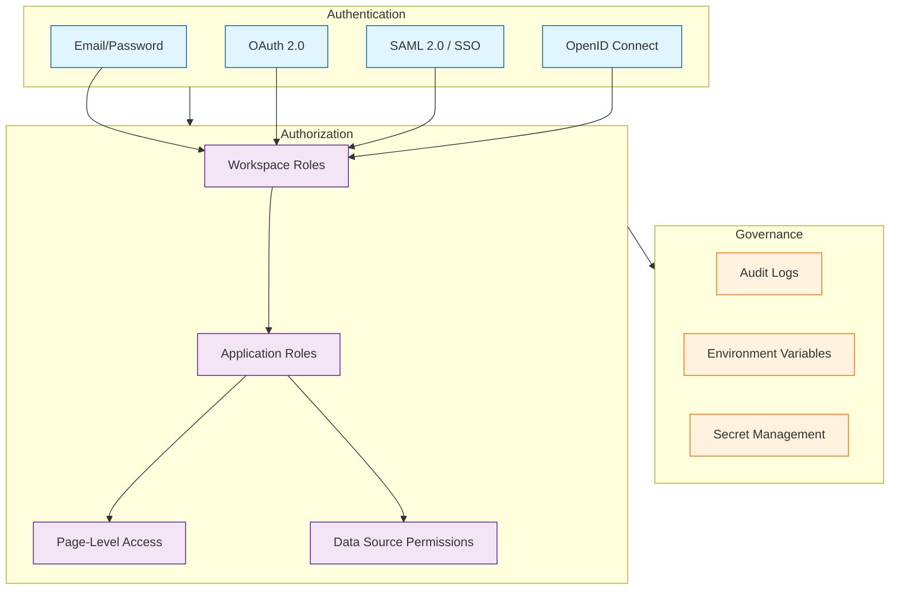
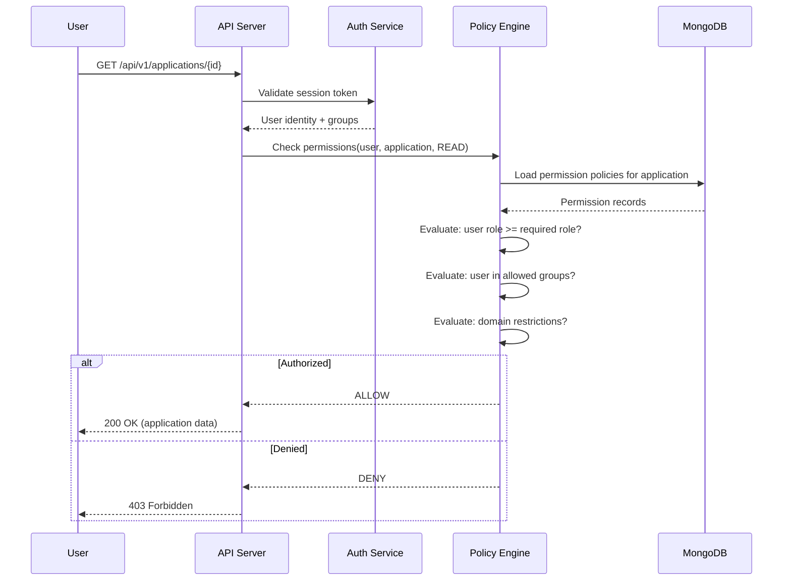

# Chapter 7: Access Control & Governance

This chapter covers Appsmith's security and governance features — role-based access control (RBAC), SSO/SAML integration, audit logging, and workspace permissions that make Appsmith viable for enterprise and regulated environments.

> Secure your Appsmith deployment with RBAC, SSO, audit logs, and granular workspace permissions.

## What Problem Does This Solve?

Internal tools handle sensitive data — employee records, financial transactions, customer PII, production database access. Without proper access controls, any user with a link can view or modify data they should not have access to. Appsmith provides a layered security model: workspace roles control who can build apps, application-level permissions control who can view or use them, and audit logs create an immutable record of who did what.

## Security Architecture



## Authentication

### Email/Password

The default authentication method. Configure password policies via environment variables:

```bash
# Password policy configuration
APPSMITH_PASSWORD_MIN_LENGTH=8
APPSMITH_PASSWORD_REQUIRE_UPPERCASE=true
APPSMITH_PASSWORD_REQUIRE_NUMBER=true
APPSMITH_PASSWORD_REQUIRE_SPECIAL=true
```

### OAuth 2.0

Appsmith supports Google and GitHub OAuth out of the box:

```bash
# Google OAuth configuration
APPSMITH_OAUTH2_GOOGLE_CLIENT_ID=your-google-client-id.apps.googleusercontent.com
APPSMITH_OAUTH2_GOOGLE_CLIENT_SECRET=your-google-client-secret

# GitHub OAuth configuration
APPSMITH_OAUTH2_GITHUB_CLIENT_ID=your-github-client-id
APPSMITH_OAUTH2_GITHUB_CLIENT_SECRET=your-github-client-secret

# Restrict signup to specific email domains
APPSMITH_ALLOWED_DOMAINS=example.com,company.org
```

### SAML 2.0 (Enterprise)

Integrate with enterprise identity providers like Okta, Azure AD, or OneLogin:

```bash
# SAML configuration
APPSMITH_SAML_ENABLED=true
APPSMITH_SAML_METADATA_URL=https://idp.example.com/metadata.xml
APPSMITH_SAML_ENTITY_ID=https://appsmith.example.com
APPSMITH_SAML_REDIRECT_URL=https://appsmith.example.com/api/v1/saml/callback
```

SAML attribute mapping for user provisioning:

```json
{
  "samlAttributeMapping": {
    "email": "http://schemas.xmlsoap.org/ws/2005/05/identity/claims/emailaddress",
    "firstName": "http://schemas.xmlsoap.org/ws/2005/05/identity/claims/givenname",
    "lastName": "http://schemas.xmlsoap.org/ws/2005/05/identity/claims/surname",
    "groups": "http://schemas.xmlsoap.org/claims/Group"
  }
}
```

### OpenID Connect

Connect to any OIDC-compliant provider:

```bash
# OIDC configuration
APPSMITH_OIDC_CLIENT_ID=your-oidc-client-id
APPSMITH_OIDC_CLIENT_SECRET=your-oidc-client-secret
APPSMITH_OIDC_AUTHORIZATION_URL=https://idp.example.com/authorize
APPSMITH_OIDC_TOKEN_URL=https://idp.example.com/token
APPSMITH_OIDC_USERINFO_URL=https://idp.example.com/userinfo
APPSMITH_OIDC_JWKS_URL=https://idp.example.com/.well-known/jwks.json
```

## Role-Based Access Control

### Workspace Roles

Workspace roles control who can build and manage applications:

| Role | Build Apps | Manage Members | Manage Settings | View Apps |
|:-----|:----------|:---------------|:----------------|:----------|
| **Owner** | Yes | Yes | Yes | Yes |
| **Admin** | Yes | Yes | Yes | Yes |
| **Developer** | Yes | No | No | Yes |
| **Viewer** | No | No | No | Yes |

### Application-Level Permissions

Fine-grained permissions per application:

```javascript
// Application permission model
{
  applicationId: "app_abc123",
  permissions: [
    {
      // Public access — anyone with the link
      type: "PUBLIC",
      enabled: false
    },
    {
      // Specific users
      type: "USER",
      userId: "user_xyz",
      role: "VIEWER"  // VIEWER or DEVELOPER
    },
    {
      // User groups
      type: "GROUP",
      groupId: "group_engineering",
      role: "DEVELOPER"
    }
  ]
}
```

### Page-Level Access

Restrict specific pages within an application:

```javascript
// In JSObject — conditionally show/hide pages based on user role
export default {
  canAccessAdminPage() {
    const userRoles = appsmith.user.groups || [];
    return userRoles.includes("admin") || userRoles.includes("hr-team");
  },

  canAccessFinancePage() {
    const userEmail = appsmith.user.email;
    const allowedDomains = ["finance.example.com"];
    return allowedDomains.some(d => userEmail.endsWith(`@${d}`));
  },

  // Use in page navigation guards
  async onPageLoad() {
    if (!this.canAccessAdminPage()) {
      navigateTo("AccessDenied");
      showAlert("You do not have access to this page", "error");
    }
  },
};
```

### Data Source Permissions

Control which environments and data sources developers can access:

```javascript
// Data source access model
{
  datasourceId: "ds_production_pg",
  permissions: {
    // Only admins can configure the datasource
    configure: ["ADMIN", "OWNER"],

    // Developers can use it in queries
    execute: ["ADMIN", "OWNER", "DEVELOPER"],

    // Viewers cannot see connection details
    view: ["ADMIN", "OWNER", "DEVELOPER"]
  }
}
```

## How It Works Under the Hood

### Permission Evaluation Flow



### The Permission Model in Code

Appsmith uses a policy-based permission system where each resource has a set of policies defining who can perform what actions:

```java
// Simplified permission model
// server/appsmith-server/src/main/java/com/appsmith/server/acl/

public enum AclPermission {
    // Application permissions
    READ_APPLICATIONS,
    MANAGE_APPLICATIONS,
    PUBLISH_APPLICATIONS,

    // Page permissions
    READ_PAGES,
    MANAGE_PAGES,

    // Action (query) permissions
    READ_ACTIONS,
    MANAGE_ACTIONS,
    EXECUTE_ACTIONS,

    // Datasource permissions
    READ_DATASOURCES,
    MANAGE_DATASOURCES,
    EXECUTE_DATASOURCES,

    // Workspace permissions
    READ_WORKSPACES,
    MANAGE_WORKSPACES,

    // User management
    MANAGE_USERS,
    READ_USERS,
}

// Policy attached to a resource
public class Policy {
    private String permission;          // e.g., "READ_APPLICATIONS"
    private Set<String> users;          // User IDs with this permission
    private Set<String> groups;         // Group IDs with this permission
}
```

## Audit Logging

Appsmith records all significant actions in an audit log for compliance and troubleshooting.

### What Gets Logged

| Category | Events |
|:---------|:-------|
| **Authentication** | Login, logout, failed login, password reset |
| **Application** | Create, update, delete, publish, import, export |
| **Data Source** | Create, update, delete, test connection |
| **Query Execution** | Run query (with parameters), query errors |
| **User Management** | Invite, remove, role change |
| **Git Operations** | Commit, push, pull, branch create/delete |

### Audit Log Structure

```json
{
  "timestamp": "2026-03-21T14:30:00.000Z",
  "event": "QUERY_EXECUTED",
  "user": {
    "id": "user_abc123",
    "email": "john@example.com",
    "name": "John Doe"
  },
  "resource": {
    "type": "ACTION",
    "id": "action_xyz789",
    "name": "deleteEmployee"
  },
  "metadata": {
    "applicationId": "app_def456",
    "applicationName": "HR Dashboard",
    "workspaceId": "ws_ghi012",
    "datasourceName": "Production PostgreSQL",
    "queryBody": "DELETE FROM employees WHERE id = $1",
    "queryParams": ["42"],
    "executionTimeMs": 45,
    "statusCode": 200
  },
  "ipAddress": "10.0.1.50",
  "userAgent": "Mozilla/5.0..."
}
```

### Querying Audit Logs

```bash
# API endpoint for audit log retrieval (Enterprise)
curl -X GET \
  "https://appsmith.example.com/api/v1/audit-logs?from=2026-03-01&to=2026-03-21&event=QUERY_EXECUTED&user=john@example.com" \
  -H "Authorization: Bearer $API_TOKEN"
```

## Securing Data Sources

### Environment Variables for Secrets

Never hardcode credentials in data source configurations. Use environment variables:

```bash
# docker.env — secrets management
APPSMITH_DB_HOST=prod-db.internal.example.com
APPSMITH_DB_PASSWORD=encrypted_production_password
APPSMITH_STRIPE_API_KEY=sk_live_your_stripe_key
APPSMITH_SLACK_WEBHOOK=https://hooks.slack.com/services/xxx
```

Reference them in data source configurations:

```javascript
// In data source configuration
{
  endpoints: [{ host: "{{APPSMITH_DB_HOST}}", port: 5432 }],
  authentication: {
    password: "{{APPSMITH_DB_PASSWORD}}"
  }
}
```

### Query-Level Safeguards

```javascript
// Prevent destructive queries with confirmation dialogs
// Set "Request confirmation before running" = true for:
// - DELETE queries
// - UPDATE queries without WHERE clauses
// - TRUNCATE / DROP operations

// In the query settings:
{
  confirmBeforeExecute: true,
  confirmMessage: "This will permanently delete the selected record. Continue?"
}
```

## Embedding Appsmith Apps Securely

Embed Appsmith applications in other web applications with SSO pass-through:

```html
<!-- Embed with SSO token -->
<iframe
  src="https://appsmith.example.com/app/hr-dashboard?embed=true"
  style="width: 100%; height: 800px; border: none;"
  allow="clipboard-write"
></iframe>

<!-- With SSO token passed via URL -->
<iframe
  src="https://appsmith.example.com/app/hr-dashboard?embed=true&ssoToken=eyJhbG..."
  style="width: 100%; height: 800px; border: none;"
></iframe>
```

```javascript
// In the parent application, pass user context:
const iframe = document.getElementById("appsmith-embed");
iframe.contentWindow.postMessage({
  type: "SET_USER_CONTEXT",
  user: {
    email: currentUser.email,
    role: currentUser.role,
    department: currentUser.department,
  }
}, "https://appsmith.example.com");
```

## Key Takeaways

- Appsmith supports email/password, OAuth 2.0, SAML 2.0, and OpenID Connect for authentication.
- Workspace roles (Owner, Admin, Developer, Viewer) control who can build and manage applications.
- Application-level and page-level permissions provide fine-grained access control.
- Audit logs record all significant actions for compliance and troubleshooting.
- Data source credentials should use environment variables, never hardcoded values.

## Cross-References

- **Previous chapter:** [Chapter 6: Git Sync & Deployment](06-git-sync-and-deployment.md) covers version control and promotion workflows.
- **Next chapter:** [Chapter 8: Production Operations](08-production-operations.md) covers scaling, monitoring, and backup.
- **Data sources:** [Chapter 3: Data Sources & Queries](03-data-sources-and-queries.md) covers connecting databases with proper credentials.

---

*Generated by [AI Codebase Knowledge Builder](https://github.com/The-Pocket/Tutorial-Codebase-Knowledge)*
