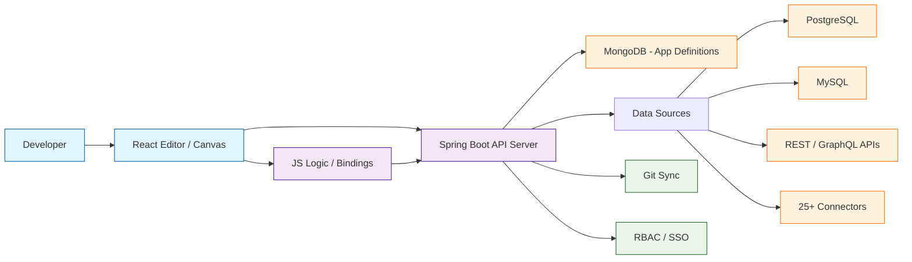

# Appsmith Tutorial: Low-Code Internal Tools

> Open-source low-code platform for building internal tools with drag-and-drop UI, 25+ database integrations, JavaScript logic, and Git sync.

**Open-Source Low-Code Platform**

---

## Why This Track Matters

Appsmith is the leading open-source low-code platform for building internal tools. Instead of spending weeks hand-coding admin panels, dashboards, and CRUD interfaces, teams use Appsmith to assemble production-grade applications in hours. Its architecture — a React-based drag-and-drop editor backed by a Spring Boot server — demonstrates how to build a platform that bridges the gap between no-code simplicity and full-code flexibility.

This track focuses on:

- **Low-Code Architecture** — How a drag-and-drop builder serializes UI into a deployable application
- **Data Integration Patterns** — How 25+ database connectors are abstracted behind a unified query layer
- **JavaScript-First Logic** — How JS bindings and transformations give developers escape hatches from visual builders
- **Enterprise Readiness** — Git sync, RBAC, audit logs, and self-hosted deployment for regulated environments

## Current Snapshot (auto-updated)

- repository: [`appsmithorg/appsmith`](https://github.com/appsmithorg/appsmith)
- stars: about **39.6k**
- latest release: [`v1.98`](https://github.com/appsmithorg/appsmith/releases/tag/v1.98) (published 2026-03-23)

## Mental Model

## Chapter Guide

| # | Chapter | What You Will Learn |
|:--|:--------|:--------------------|
| 1 | [Getting Started](01-getting-started.md) | Install Appsmith, create your first app, deploy a CRUD interface |
| 2 | [Widget System](02-widget-system.md) | Drag-and-drop widgets, layout containers, property pane, event handling |
| 3 | [Data Sources & Queries](03-data-sources-and-queries.md) | Connect databases, write queries, use REST/GraphQL APIs |
| 4 | [JS Logic & Bindings](04-js-logic-and-bindings.md) | Mustache bindings, JSObjects, async workflows, transformations |
| 5 | [Custom Widgets](05-custom-widgets.md) | Build custom React widgets, iframe communication, the widget SDK |
| 6 | [Git Sync & Deployment](06-git-sync-and-deployment.md) | Version control, branching, CI/CD, multi-environment promotion |
| 7 | [Access Control & Governance](07-access-control-and-governance.md) | RBAC, SSO/SAML, audit logs, workspace permissions |
| 8 | [Production Operations](08-production-operations.md) | Self-hosting, scaling, backups, monitoring, upgrades |

## What You Will Learn

- **Build Internal Tools Fast** with drag-and-drop widgets and pre-built templates
- **Connect Any Data Source** from PostgreSQL to REST APIs using the unified query layer
- **Write JavaScript Logic** with mustache bindings, JSObjects, and async workflows
- **Create Custom Widgets** when built-in components are not enough
- **Version Control Apps** with Git sync, branching, and multi-environment deployment
- **Secure Your Platform** with RBAC, SSO, and audit logging
- **Self-Host at Scale** with Docker, Kubernetes, and production-grade monitoring

## Prerequisites

- Docker and Docker Compose (for self-hosting)
- Basic JavaScript/TypeScript knowledge
- Familiarity with SQL and REST APIs
- A database instance (PostgreSQL, MySQL, or MongoDB) for testing

## Source References

- [Appsmith Repository](https://github.com/appsmithorg/appsmith)
- [Appsmith Documentation](https://docs.appsmith.com)
- [Appsmith Community](https://community.appsmith.com)
- [Awesome Code Docs](https://github.com/johnxie/awesome-code-docs)

## Related Tutorials

- [Plane Tutorial](../plane-tutorial/) — Open-source project management with AI-native workflows
- [NocoDB Tutorial](../nocodb-tutorial/) — Open-source Airtable alternative with database-backed spreadsheets
- [AFFiNE Tutorial](../affine-tutorial/) — Open-source knowledge management with block-based editing

## Navigation & Backlinks

- [Start Here: Chapter 1: Getting Started](01-getting-started.md)
- [Back to Main Catalog](../../README.md#-tutorial-catalog)
- [Browse A-Z Tutorial Directory](../../discoverability/tutorial-directory.md)
- [Search by Intent](../../discoverability/query-hub.md)
- [Explore Category Hubs](../../README.md#category-hubs)

## Full Chapter Map

1. [Chapter 1: Getting Started](01-getting-started.md)
2. [Chapter 2: Widget System](02-widget-system.md)
3. [Chapter 3: Data Sources & Queries](03-data-sources-and-queries.md)
4. [Chapter 4: JS Logic & Bindings](04-js-logic-and-bindings.md)
5. [Chapter 5: Custom Widgets](05-custom-widgets.md)
6. [Chapter 6: Git Sync & Deployment](06-git-sync-and-deployment.md)
7. [Chapter 7: Access Control & Governance](07-access-control-and-governance.md)
8. [Chapter 8: Production Operations](08-production-operations.md)

---

*Generated by [AI Codebase Knowledge Builder](https://github.com/The-Pocket/Tutorial-Codebase-Knowledge)*
