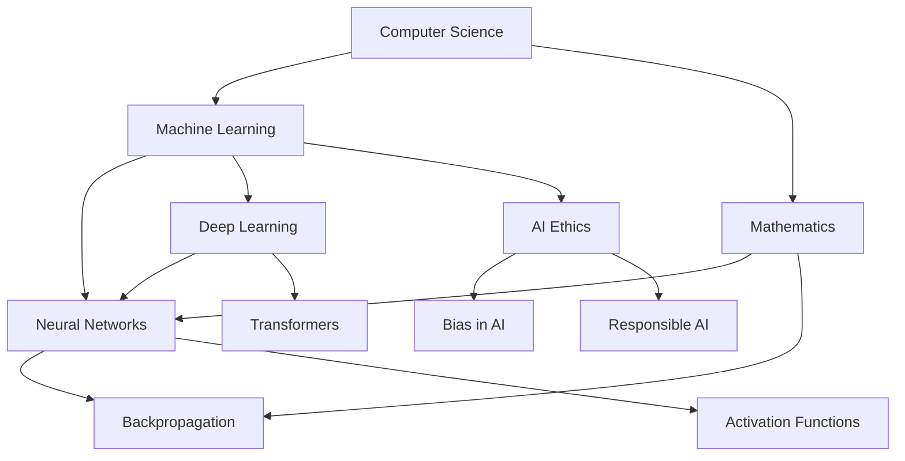
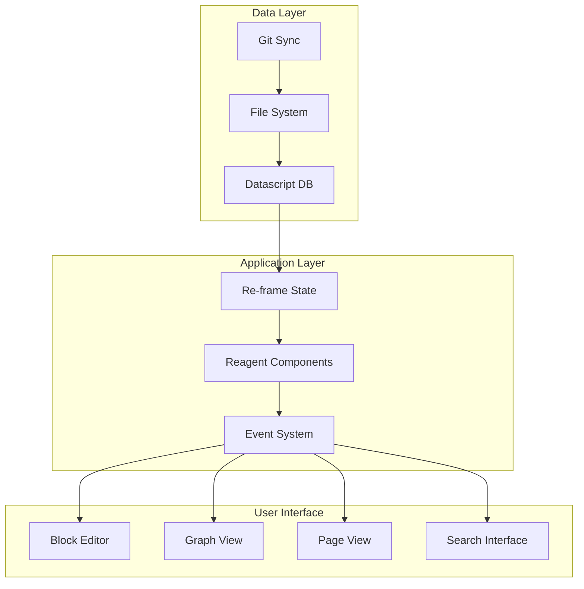

# Chapter 1: System Overview

Welcome to **Chapter 1: System Overview**. In this part of **Athens Research: Deep Dive Tutorial**, you will build an intuitive mental model first, then move into concrete implementation details and practical production tradeoffs.


> Understanding Athens Research's approach to knowledge management and graph-based note-taking

## 🎯 Learning Objectives

By the end of this chapter, you'll understand:
- Athens Research's unique approach to knowledge management
- The fundamental concepts of graph-based note-taking
- How Athens differs from traditional note-taking applications
- The core architectural principles behind the system

## 🧠 The Knowledge Management Challenge

### **Traditional Note-Taking Limitations**

Most note-taking applications organize information hierarchically:

```
📁 Work
├── 📄 Project A
│   ├── 📄 Meeting notes
│   └── 📄 Task list
└── 📄 Project B
    └── 📄 Research

📁 Personal
├── 📄 Journal
└── 📄 Ideas
```

**Problems with hierarchical organization:**
- **Rigid structure**: Difficult to reorganize or find connections
- **Siloed information**: Related concepts scattered across different folders
- **Limited relationships**: Hard to represent complex interdependencies
- **Search limitations**: Finding related information requires knowing exact location

### **The Graph-Based Alternative**

Athens Research implements a graph-based knowledge system where:



**Advantages of graph-based organization:**
- **Flexible connections**: Ideas can connect in multiple ways
- **Emergent relationships**: Discover unexpected connections
- **Non-hierarchical**: No need to choose a single organizational structure
- **Scalable knowledge**: Easy to add new concepts and relationships

## 🏗️ Athens Research Architecture

### **Core Components**



### **Three-Layer Architecture**

1. **Data Layer**: Handles persistence and synchronization
2. **Application Layer**: Manages state and business logic
3. **User Interface**: Provides interaction and visualization

## 📊 Fundamental Concepts

### **Blocks: The Atomic Unit of Knowledge**

In Athens, all content is composed of **blocks** - individual units of thought:

```clojure
;; Example block structure
{:block/uuid #uuid "12345678-1234-1234-1234-123456789012"
 :block/string "Machine learning is a subset of artificial intelligence"
 :block/order 0
 :block/children [{:block/uuid #uuid "87654321-4321-4321-4321-210987654321"
                   :block/string "It uses algorithms to learn patterns from data"
                   :block/order 0}]}
```

**Block properties:**
- **UUID**: Unique identifier for each block
- **String**: The actual content text
- **Order**: Position among siblings
- **Children**: Nested blocks (hierarchical structure)
- **References**: Links to other blocks/pages

### **Pages: Block Collections**

Pages group related blocks together:

```clojure
;; Page structure
{:page/uuid #uuid "abcd1234-5678-9012-3456-789012345678"
 :page/title "Machine Learning Fundamentals"
 :page/blocks [{:block/uuid #uuid "12345678-1234-1234-1234-123456789012"
                :block/string "Machine learning is..."
                :block/order 0}
               {:block/uuid #uuid "87654321-4321-4321-4321-210987654321"
                :block/string "Types of machine learning..."
                :block/order 1}]}
```

### **References: Connecting Knowledge**

Athens uses `[[page-name]]` syntax to create references:

```
[[Machine Learning]] is a method of data analysis that automates analytical model building. It is a branch of [[artificial intelligence]] based on the idea that systems can learn from data, identify patterns and make decisions with minimal human intervention.

Types of machine learning:
- [[Supervised Learning]]
- [[Unsupervised Learning]]
- [[Reinforcement Learning]]
```

**Reference benefits:**
- **Automatic backlinks**: Referenced pages show incoming links
- **Transclusion**: Pull content from one page to another
- **Graph visualization**: See relationships between concepts
- **Knowledge discovery**: Find related information through connections

## 🔗 Bi-Directional Linking

### **How References Work**

When you create `[[Machine Learning]]` in Athens:

1. **Link Creation**: Creates a reference from current block to "Machine Learning" page
2. **Backlink Generation**: Adds the current page to "Machine Learning"'s backlinks
3. **Graph Edge**: Creates a directed edge in the knowledge graph

```clojure
;; Reference relationship in Datascript
{:reference/from-block #uuid "current-block-uuid"
 :reference/to-page "Machine Learning"
 :reference/context "Machine learning is a method..."
 :reference/created-at #inst "2024-01-01T10:00:00.000-00:00"}
```

### **Unlinked References**

Athens also tracks "unlinked references" - pages that don't exist yet:

```clojure
;; Unlinked reference
{:unlinked/page "Quantum Computing"
 :unlinked/context "Future applications include [[quantum computing]]"
 :unlinked/block #uuid "block-uuid"
 :unlinked/created-at #inst "2024-01-01T10:00:00.000-00:00"}
```

**Benefits:**
- **Future-proofing**: Plan content structure before writing
- **Gap identification**: See what's missing from your knowledge base
- **Content planning**: Build outlines of future topics

## 📱 Local-First Architecture

### **File-Based Storage**

Unlike cloud-first applications, Athens stores data locally:

```clojure
;; File structure
athens-db/
├── pages/
│   ├── machine-learning.md
│   ├── artificial-intelligence.md
│   └── data-science.md
├── images/
│   └── diagram.png
├── backups/
│   └── daily-backup.edn
└── athens.db
```

**File format example:**
```markdown
# Machine Learning

Machine learning is a subset of [[artificial intelligence]].

## Types

- [[Supervised Learning]]
  - Uses labeled training data
  - Examples: regression, classification

- [[Unsupervised Learning]]
  - Finds patterns in unlabeled data
  - Examples: clustering, dimensionality reduction

- [[Reinforcement Learning]]
  - Learns through interaction
  - Examples: game playing, robotics
```

### **Git-Based Synchronization**

Athens uses Git for multi-device synchronization:

```bash
# Athens sync flow
cd /path/to/athens-db

# Pull latest changes
git pull origin main

# Make changes...

# Commit and push
git add .
git commit -m "Updated machine learning notes"
git push origin main
```

**Conflict resolution:**
- **Manual merging**: Git handles text conflicts
- **Block-level resolution**: Athens provides UI for resolving conflicts
- **Timestamp-based**: Last-write-wins for automatic resolution

## 🔄 Real-Time Collaboration

### **Operational Transforms**

Athens enables real-time collaboration using operational transforms:

```typescript
// Operation types
interface Operation {
  type: 'insert' | 'delete' | 'update';
  blockId: string;
  path: number[]; // Position in block tree
  data: any;
  timestamp: number;
  userId: string;
}

// Example operations
const insertOp: Operation = {
  type: 'insert',
  blockId: 'block-123',
  path: [0, 2], // Insert as 3rd child of root's 1st child
  data: {
    string: 'New insight about machine learning',
    children: []
  },
  timestamp: Date.now(),
  userId: 'user-456'
};
```

### **Conflict-Free Replicated Data Types (CRDTs)**

For collaborative editing, Athens uses CRDTs:

```clojure
;; CRDT for block content
{:block/uuid #uuid "12345678-1234-1234-1234-123456789012"
 :block/content {:text "Machine learning"
                 :version 5
                 :edits [{:user "alice"
                          :timestamp #inst "2024-01-01T10:00:00"
                          :operation {:type "append" :text " fundamentals"}}
                         {:user "bob"
                          :timestamp #inst "2024-01-01T10:05:00"
                          :operation {:type "insert" :position 0 :text "Advanced "}}]}}
```

## 🎨 User Interface Philosophy

### **Minimalist Design**

Athens follows a "less is more" approach:

- **Distraction-free writing**: Clean interface focused on content
- **Keyboard-driven**: Extensive keyboard shortcuts for power users
- **Progressive disclosure**: Advanced features revealed as needed
- **Consistent patterns**: Predictable interactions across the application

### **Three Primary Views**

1. **Daily Notes**: Journal-style writing with date-based organization
2. **All Pages**: Flat list of all pages for quick access
3. **Graph View**: Visual representation of knowledge connections

### **Block-Level Editing**

Unlike page-based editors, Athens allows editing at the block level:

```clojure
;; Block editing capabilities
{:editing/modes [:insert :edit :delete :move :indent :outdent]
 :editing/shortcuts {"Enter" :insert-below
                     "Shift+Enter" :insert-child
                     "Tab" :indent
                     "Shift+Tab" :outdent
                     "Ctrl+Enter" :edit-mode}}
```

## 🚀 Getting Started with Athens

### **Installation Options**

#### **Desktop Application**
```bash
# Download from GitHub releases
curl -L https://github.com/athensresearch/athens/releases/latest/download/Athens.dmg -o Athens.dmg
# Install and run
```

#### **Web Version**
```bash
# Clone repository
git clone https://github.com/athensresearch/athens.git
cd athens

# Install dependencies
npm install

# Start development server
npm run dev
```

#### **Docker**
```bash
# Run with Docker
docker run -p 3000:3000 -v $(pwd)/data:/app/data athensresearch/athens
```

### **First Steps**

1. **Create your first page**: Click "New Page" and enter a title
2. **Write your first block**: Start typing in the empty block
3. **Create a reference**: Use `[[page-name]]` syntax to link to another page
4. **Explore the graph**: Switch to Graph View to see your knowledge connections
5. **Set up sync**: Connect to a Git repository for multi-device access

## 📊 Athens vs. Other Knowledge Systems

### **Comparison Matrix**

| Feature | Athens | Roam Research | Obsidian | Notion |
|:--------|:-------|:-------------|:---------|:-------|
| **Local-First** | ✅ | ❌ | ✅ | ❌ |
| **Graph-Based** | ✅ | ✅ | ✅ | ❌ |
| **Open Source** | ✅ | ❌ | ✅ | ❌ |
| **Block-Level Editing** | ✅ | ✅ | ❌ | ❌ |
| **Git Sync** | ✅ | ❌ | ✅ | ❌ |
| **Real-time Collaboration** | ✅ | ✅ | ❌ | ✅ |
| **Pricing** | Free | $15/mo | Free core | $8/mo |

### **Athens' Unique Advantages**

1. **Local-First Architecture**: Your data stays on your device
2. **Git Integration**: Version control for knowledge bases
3. **ClojureScript Ecosystem**: Rich functional programming community
4. **Block-Level Granularity**: Finest level of content organization
5. **Open Source Transparency**: Community-driven development

## 🎯 Learning Path Forward

This chapter provided the foundation for understanding Athens Research's knowledge management approach. In the following chapters, we'll dive deeper into:

- **[Chapter 2: Datascript Deep Dive](02-datascript-database.md)** - The in-memory graph database powering Athens
- **[Chapter 3: Schema Design](03-schema-design.md)** - Modeling blocks, pages, and relationships
- **Chapter 4: Application Architecture (Planned)** - Re-frame patterns and state management

## 💡 Key Takeaways

1. **Graph-based knowledge**: Athens represents knowledge as an interconnected graph rather than a hierarchy
2. **Block-level editing**: All content is composed of atomic, referenceable blocks
3. **Bi-directional linking**: Automatic backlinks create emergent knowledge relationships
4. **Local-first architecture**: Data ownership and Git-based synchronization
5. **ClojureScript foundation**: Functional programming principles for complex state management

## 🧪 Hands-On Exercise

**Estimated Time: 45 minutes**

1. **Install Athens**: Set up Athens using one of the installation methods above
2. **Create your first page**: Write about a topic you're familiar with, creating multiple blocks
3. **Experiment with references**: Create `[[links]]` between different concepts
4. **Explore the graph view**: See how your notes connect visually
5. **Try block operations**: Indent/outdent blocks, move them around, and create nested structures

---

**Ready to explore the database layer?** Continue to [Chapter 2: Datascript Deep Dive](02-datascript-database.md)

## What Problem Does This Solve?

Most teams struggle here because the hard part is not writing more code, but deciding clear boundaries for `block`, `uuid`, `Learning` so behavior stays predictable as complexity grows.

In practical terms, this chapter helps you avoid three common failures:

- coupling core logic too tightly to one implementation path
- missing the handoff boundaries between setup, execution, and validation
- shipping changes without clear rollback or observability strategy

After working through this chapter, you should be able to reason about `Chapter 1: System Overview` as an operating subsystem inside **Athens Research: Deep Dive Tutorial**, with explicit contracts for inputs, state transitions, and outputs.

Use the implementation notes around `Machine`, `learning`, `athens` as your checklist when adapting these patterns to your own repository.

## How it Works Under the Hood

Under the hood, `Chapter 1: System Overview` usually follows a repeatable control path:

1. **Context bootstrap**: initialize runtime config and prerequisites for `block`.
2. **Input normalization**: shape incoming data so `uuid` receives stable contracts.
3. **Core execution**: run the main logic branch and propagate intermediate state through `Learning`.
4. **Policy and safety checks**: enforce limits, auth scopes, and failure boundaries.
5. **Output composition**: return canonical result payloads for downstream consumers.
6. **Operational telemetry**: emit logs/metrics needed for debugging and performance tuning.

When debugging, walk this sequence in order and confirm each stage has explicit success/failure conditions.

## Source Walkthrough

Use the following upstream sources to verify implementation details while reading this chapter:

- [Athens Research](https://github.com/athensresearch/athens)
  Why it matters: authoritative reference on `Athens Research` (github.com).

Suggested trace strategy:
- search upstream code for `block` and `uuid` to map concrete implementation paths
- compare docs claims against actual runtime/config code before reusing patterns in production

## Chapter Connections

- [Tutorial Index](index.md)
- [Next Chapter: Chapter 2: Datascript Deep Dive](02-datascript-database.md)
- [Main Catalog](../../README.md#-tutorial-catalog)
- [A-Z Tutorial Directory](../../discoverability/tutorial-directory.md)
