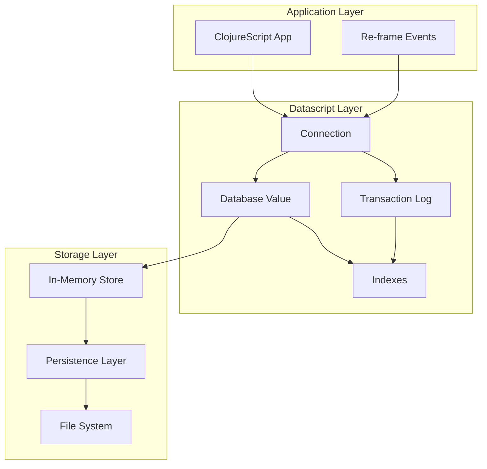

# Chapter 2: Datascript Deep Dive

Welcome to **Chapter 2: Datascript Deep Dive**. In this part of **Athens Research: Deep Dive Tutorial**, you will build an intuitive mental model first, then move into concrete implementation details and practical production tradeoffs.


> Understanding the in-memory graph database that powers Athens Research

## 🎯 Learning Objectives

By the end of this chapter, you'll understand:
- Datascript's core concepts and architecture
- Datalog query patterns for graph traversal
- Transaction semantics and data consistency
- Performance characteristics and optimization strategies
- Integration patterns with ClojureScript applications

## 🗄️ What is Datascript?

### **Datomic for the Client**

Datascript is an implementation of Datomic's principles for the client-side:

```clojure
;; Datascript connection
(require '[datascript.core :as d])

;; Create database
(def conn (d/create-conn {}))

;; Add data
(d/transact! conn [{:db/id -1
                    :block/uuid #uuid "12345678-1234-1234-1234-123456789012"
                    :block/string "Machine learning fundamentals"
                    :block/order 0}])

;; Query data
(d/q '[:find ?e ?content
       :where [?e :block/string ?content]]
     @conn)
```

**Key characteristics:**
- **Immutable database**: Every transaction creates a new database value
- **Datalog queries**: Declarative query language for pattern matching
- **ACID transactions**: Atomic, consistent, isolated, durable operations
- **Entity-Attribute-Value model**: Flexible schema-less data model

### **Architecture Overview**



## 📊 Entity-Attribute-Value Model

### **Core Data Structure**

Datascript uses the EAV model where all data is represented as triples:

```clojure
;; EAV Triple: [Entity, Attribute, Value]

;; Block entity
[:block/uuid      :block/string  "Machine learning fundamentals"]
[:block/uuid      :block/order   0]
[:block/uuid      :block/children [:block/uuid-child1 :block/uuid-child2]]

;; Page entity
[:page/uuid       :page/title    "Machine Learning"]
[:page/uuid       :page/blocks   [:block/uuid1 :block/uuid2]]

;; Reference entity
[:reference/id    :reference/from :block/uuid1]
[:reference/id    :reference/to   "Machine Learning"]
```

### **Entity IDs**

Entities are identified by unique IDs:

```clojure
;; Auto-generated IDs
(d/transact! conn [{:block/string "New block"}])
;; Creates entity with auto-generated ID like 12345

;; Explicit IDs
(d/transact! conn [{:db/id 1001
                    :block/string "Block with explicit ID"}])

;; Temporary IDs for references
(d/transact! conn [{:db/id -1
                    :block/string "Parent block"
                    :block/children -2}
                   {:db/id -2
                    :block/string "Child block"}])
```

### **Attribute Definitions**

Attributes define the schema and behavior:

```clojure
;; Attribute definitions
(def block-schema
  {:block/uuid {:db/unique :db.unique/identity
                :db/type :db.type/uuid}
   :block/string {:db/type :db.type/string}
   :block/order {:db/type :db.type/long}
   :block/children {:db/type :db.type/ref
                    :db/cardinality :db.cardinality/many}
   :block/refs {:db/type :db.type/ref
                :db/cardinality :db.cardinality/many}})

;; Create connection with schema
(def conn (d/create-conn block-schema))
```

## 🔍 Datalog Query Language

### **Basic Query Patterns**

Datalog queries find patterns in the data:

```clojure
;; Find all blocks
(d/q '[:find ?e ?content
       :where [?e :block/string ?content]]
     @conn)

;; Find blocks with specific content
(d/q '[:find ?e
       :where [?e :block/string "Machine learning fundamentals"]]
     @conn)

;; Find blocks by UUID
(d/q '[:find ?content
       :in $ ?uuid
       :where [?e :block/uuid ?uuid]
              [?e :block/string ?content]]
     @conn
     #uuid "12345678-1234-1234-1234-123456789012")
```

### **Join Operations**

Queries can join across relationships:

```clojure
;; Find child blocks of a parent
(d/q '[:find ?child-content
       :in $ ?parent-uuid
       :where [?parent :block/uuid ?parent-uuid]
              [?parent :block/children ?child]
              [?child :block/string ?child-content]]
     @conn
     #uuid "parent-uuid")

;; Find all references in a block
(d/q '[:find ?ref-text
       :in $ ?block-uuid
       :where [?block :block/uuid ?block-uuid]
              [?block :block/refs ?ref]
              [?ref :reference/text ?ref-text]]
     @conn
     #uuid "block-uuid")
```

### **Advanced Query Patterns**

```clojure
;; Find blocks with their children (recursive)
(d/q '[:find ?parent-content (pull ?parent [:block/children])
       :where [?parent :block/string ?parent-content]
              [_ :block/children ?parent]]
     @conn)

;; Find pages with block counts
(d/q '[:find ?page-title (count ?blocks)
       :where [?page :page/title ?page-title]
              [?page :page/blocks ?blocks]]
     @conn)

;; Complex graph traversal - find connected concepts
(d/q '[:find ?connected-title
       :in $ ?start-concept
       :where [?start :page/title ?start-concept]
              (or [?start :page/refs ?connected]
                  [?connected :page/refs ?start])
              [?connected :page/title ?connected-title]]
     @conn
     "Machine Learning")
```

## 🔄 Transaction System

### **Transaction Basics**

All data changes happen through transactions:

```clojure
;; Simple transaction
(d/transact! conn [{:db/id -1
                    :block/string "New block content"
                    :block/uuid (d/squuid)}])

;; Transaction with relationships
(d/transact! conn [{:db/id -1
                    :block/uuid (d/squuid)
                    :block/string "Parent block"
                    :block/children -2}
                   {:db/id -2
                    :block/uuid (d/squuid)
                    :block/string "Child block"}])

;; Update existing entity
(d/transact! conn [{:block/uuid #uuid "existing-uuid"
                    :block/string "Updated content"}])
```

### **Transaction Functions**

Use transaction functions for complex updates:

```clojure
;; Define transaction function
(d/defn add-child-block [db parent-uuid child-content]
  (let [parent-eid (d/q '[:find ?e .
                          :in $ ?uuid
                          :where [?e :block/uuid ?uuid]]
                        db parent-uuid)
        child-uuid (d/squuid)
        child-order (count (:block/children (d/entity db parent-eid)))]
    [{:db/id -1
      :block/uuid child-uuid
      :block/string child-content
      :block/order child-order}
     [:db/add parent-eid :block/children -1]]))

;; Use transaction function
(d/transact! conn [(add-child-block #uuid "parent-uuid" "New child content")])
```

### **Transaction Reports**

Every transaction returns a detailed report:

```clojure
;; Transaction result
(def tx-result (d/transact! conn [tx-data]))

;; Access transaction report
(:tx-data tx-result)     ;; Applied datoms
(:tempids tx-result)     ;; Temporary ID mappings
(:db-before tx-result)   ;; Database before transaction
(:db-after tx-result)    ;; Database after transaction
```

## 📈 Indexing and Performance

### **Built-in Indexes**

Datascript automatically maintains indexes for efficient queries:

```clojure
;; EAV Index - fast lookup by entity
(d/q '[:find ?a ?v
       :where [42 ?a ?v]]
     @conn)

;; AVE Index - fast lookup by attribute-value
(d/q '[:find ?e
       :where [?e :block/uuid #uuid "specific-uuid"]]
     @conn)

;; VEA Index - fast lookup by value-entity
;; Used for reverse lookups and cardinality checks
```

### **Query Optimization**

```clojure
;; Efficient queries use indexes effectively

;; ✅ Good: Uses EAV index
(d/q '[:find ?content
       :where [?e :block/uuid ?uuid]
              [?e :block/string ?content]]
     @conn)

;; ✅ Good: Uses AVE index
(d/q '[:find ?e
       :where [?e :block/uuid #uuid "specific-uuid"]]
     @conn)

;; ❌ Bad: Full scan (no index usage)
(d/q '[:find ?e ?content
       :where [?e :block/string ?content]
              [(clojure.string/includes? ?content "machine")]]
     @conn)

;; ✅ Better: Filter in application code
(let [all-blocks (d/q '[:find ?e ?content
                        :where [?e :block/string ?content]]
                      @conn)
      filtered (filter #(clojure.string/includes? (second %) "machine") all-blocks)]
  filtered)
```

### **Performance Monitoring**

```clojure
;; Query performance analysis
(defn analyze-query-performance [query db]
  (let [start-time (system-time)
        result (d/q query db)
        end-time (system-time)
        duration (- end-time start-time)]
    {:result-count (count result)
     :duration-ms duration
     :query query}))

;; Database size metrics
(defn db-metrics [conn]
  (let [db @conn]
    {:datoms-count (d/datoms-count db)
     :entity-count (count (d/q '[:find ?e :where [?e _ _]] db))
     :attribute-count (count (d/q '[:find ?a :where [_ ?a _]] db))}))
```

## 🔗 Integration with ClojureScript

### **Re-frame Integration**

Datascript works seamlessly with re-frame:

```clojure
;; Define app database schema
(def schema
  {:block/uuid {:db/unique :db.unique/identity}
   :block/string {}
   :block/order {}
   :block/children {:db/cardinality :db.cardinality/many}})

;; Create Datascript connection
(def ds-conn (d/create-conn schema))

;; Re-frame event handlers
(re-frame/reg-event-db
  :add-block
  (fn [db [_ parent-uuid content]]
    (let [block-uuid (d/squuid)
          tx-result (d/transact! ds-conn [{:db/id -1
                                           :block/uuid block-uuid
                                           :block/string content
                                           :block/order 0}])]
      ;; Update re-frame db with transaction result
      (assoc db :last-tx tx-result))))

;; Subscription to Datascript data
(re-frame/reg-sub
  :blocks
  (fn [_ _]
    (d/q '[:find ?uuid ?content
           :where [?e :block/uuid ?uuid]
                  [?e :block/string ?content]]
         @ds-conn)))
```

### **Reactive Queries**

Datascript enables reactive programming patterns:

```clojure
;; Reactive query component
(defn block-list []
  (let [blocks @(re-frame/subscribe [:blocks])]
    [:div.block-list
     (for [[uuid content] blocks]
       ^{:key uuid}
       [:div.block {:data-uuid uuid} content])]))

;; Reactive query with filtering
(re-frame/reg-sub
  :filtered-blocks
  (fn [_ [_ search-term]]
    (let [all-blocks (d/q '[:find ?e ?content
                            :where [?e :block/string ?content]]
                          @ds-conn)]
      (if (empty? search-term)
        all-blocks
        (filter #(clojure.string/includes?
                  (clojure.string/lower-case (second %))
                  (clojure.string/lower-case search-term))
                all-blocks)))))
```

## 💾 Persistence and Synchronization

### **Database Serialization**

```clojure
;; Serialize database to EDN
(defn serialize-db [conn]
  (let [db @conn]
    {:schema (d/schema db)
     :datoms (vec (d/datoms db :eavt))}))

;; Deserialize from EDN
(defn deserialize-db [data]
  (let [conn (d/conn-from-datoms (:datoms data) (:schema data))]
    conn))

;; Save to file
(defn save-db [conn filename]
  (spit filename (pr-str (serialize-db conn))))

;; Load from file
(defn load-db [filename]
  (let [data (read-string (slurp filename))]
    (deserialize-db data)))
```

### **Git-Based Synchronization**

```clojure
;; Git sync utilities
(defn commit-db-changes [conn message]
  (let [db-content (serialize-db conn)
        filename "athens.db.edn"]
    ;; Write database
    (spit filename (pr-str db-content))

    ;; Git operations
    (clojure.java.shell/sh "git" "add" filename)
    (clojure.java.shell/sh "git" "commit" "-m" message)))

(defn pull-remote-changes []
  (let [result (clojure.java.shell/sh "git" "pull" "--rebase")]
    (if (= 0 (:exit result))
      ;; Load updated database
      (load-db "athens.db.edn")
      ;; Handle merge conflicts
      (handle-merge-conflicts))))

(defn handle-merge-conflicts []
  ;; Custom merge logic for Datascript databases
  ;; This is complex and would require conflict resolution UI
  (println "Merge conflicts detected. Manual resolution required."))
```

## 🎯 Advanced Patterns

### **Temporal Queries**

Access database history for time-travel queries:

```clojure
;; Query historical state
(defn query-at-time [conn timestamp]
  (let [historical-db (d/as-of @conn timestamp)]
    (d/q '[:find ?content
           :where [?e :block/string ?content]]
         historical-db)))

;; Compare database states
(defn compare-db-states [conn before-time after-time]
  (let [before-db (d/as-of @conn before-time)
        after-db (d/as-of @conn after-time)
        before-blocks (set (d/q '[:find ?e :where [?e :block/uuid _]] before-db))
        after-blocks (set (d/q '[:find ?e :where [?e :block/uuid _]] after-db))]
    {:added (clojure.set/difference after-blocks before-blocks)
     :removed (clojure.set/difference before-blocks after-blocks)}))
```

### **Schema Evolution**

Handle database schema changes:

```clojure
;; Schema migration
(defn migrate-schema [conn new-schema]
  (let [current-schema (d/schema @conn)
        migrations (calculate-migrations current-schema new-schema)]
    (doseq [migration migrations]
      (apply-migration conn migration))))

(defn calculate-migrations [old-schema new-schema]
  ;; Compare schemas and generate migration steps
  (let [added-attrs (clojure.set/difference
                     (set (keys new-schema))
                     (set (keys old-schema)))
        removed-attrs (clojure.set/difference
                       (set (keys old-schema))
                       (set (keys new-schema)))]
    (concat
     (map #(vector :add-attribute %) added-attrs)
     (map #(vector :remove-attribute %) removed-attrs))))

(defn apply-migration [conn [action attribute]]
  (case action
    :add-attribute
    (d/transact! conn [{:db/id (d/tempid :db.part/db)
                        :db/ident attribute
                        :db/valueType (:db/type (new-schema attribute))
                        :db/cardinality (:db/cardinality (new-schema attribute) :db.cardinality/one)
                        :db.install/_attribute :db.part/db}])

    :remove-attribute
    ;; Handle attribute removal (complex operation)
    (handle-attribute-removal conn attribute)))
```

## 🧪 Hands-On Exercise

**Estimated Time: 60 minutes**

1. **Set up Datascript Environment**: Create a new ClojureScript project with Datascript
2. **Basic Operations**: Create entities, add data, and perform simple queries
3. **Relationship Modeling**: Implement block hierarchies and references
4. **Query Optimization**: Write efficient queries and analyze performance
5. **Transaction Patterns**: Implement complex multi-entity transactions
6. **Persistence**: Save and load database state to/from files

---

**Ready to design the schema?** Continue to [Chapter 3: Schema Design](03-schema-design.md)

## What Problem Does This Solve?

Most teams struggle here because the hard part is not writing more code, but deciding clear boundaries for `block`, `uuid`, `conn` so behavior stays predictable as complexity grows.

In practical terms, this chapter helps you avoid three common failures:

- coupling core logic too tightly to one implementation path
- missing the handoff boundaries between setup, execution, and validation
- shipping changes without clear rollback or observability strategy

After working through this chapter, you should be able to reason about `Chapter 2: Datascript Deep Dive` as an operating subsystem inside **Athens Research: Deep Dive Tutorial**, with explicit contracts for inputs, state transitions, and outputs.

Use the implementation notes around `content`, `blocks`, `find` as your checklist when adapting these patterns to your own repository.

## How it Works Under the Hood

Under the hood, `Chapter 2: Datascript Deep Dive` usually follows a repeatable control path:

1. **Context bootstrap**: initialize runtime config and prerequisites for `block`.
2. **Input normalization**: shape incoming data so `uuid` receives stable contracts.
3. **Core execution**: run the main logic branch and propagate intermediate state through `conn`.
4. **Policy and safety checks**: enforce limits, auth scopes, and failure boundaries.
5. **Output composition**: return canonical result payloads for downstream consumers.
6. **Operational telemetry**: emit logs/metrics needed for debugging and performance tuning.

When debugging, walk this sequence in order and confirm each stage has explicit success/failure conditions.

## Source Walkthrough

Use the following upstream sources to verify implementation details while reading this chapter:

- [Athens Research](https://github.com/athensresearch/athens)
  Why it matters: authoritative reference on `Athens Research` (github.com).

Suggested trace strategy:
- search upstream code for `block` and `uuid` to map concrete implementation paths
- compare docs claims against actual runtime/config code before reusing patterns in production

## Chapter Connections

- [Tutorial Index](index.md)
- [Previous Chapter: Chapter 1: System Overview](01-system-overview.md)
- [Next Chapter: Chapter 3: Schema Design](03-schema-design.md)
- [Main Catalog](../../README.md#-tutorial-catalog)
- [A-Z Tutorial Directory](../../discoverability/tutorial-directory.md)
