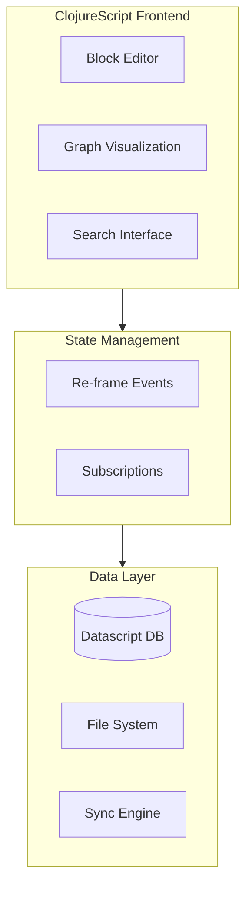

# Athens Research: Deep Dive Tutorial

> **Project**: [Athens Research](https://github.com/athensresearch/athens) — An open-source, Roam-like knowledge management system built with ClojureScript and graph databases.

## What Is Athens Research?

Athens is an open-source knowledge management system inspired by Roam Research. It uses Datascript (an in-memory graph database) with ClojureScript to provide block-based editing, bi-directional linking, and knowledge graph visualization — all running locally for full data ownership.

| Feature | Description |
|---------|-------------|
| **Block-Based Editor** | Flexible, composable content editing with outliner UX |
| **Bi-Directional Links** | Automatic backlinks between pages and blocks |
| **Graph Database** | Datascript in-memory graph for knowledge relationships |
| **Knowledge Graph** | Interactive visualization of connections between notes |
| **Local-First** | All data stored locally, no cloud dependency |
| **Real-Time Collab** | Multi-user editing with conflict resolution |

## Architecture Overview

## Tutorial Structure

| Chapter | Topic | What You'll Learn |
|---------|-------|-------------------|
| [1. System Overview](01-system-overview.md) | Architecture | Athens's approach to knowledge management |
| [2. Datascript Database](02-datascript-database.md) | Data Layer | In-memory graph database, queries, transactions |
| [3. Schema Design](03-schema-design.md) | Data Model | Blocks, pages, and relationship modeling |
| [4. Application Architecture](04-app-architecture.md) | App Flow | Re-frame event flow and state boundaries |
| [5. Component System](05-component-system.md) | UI Layer | Reagent composition and recursive block rendering |
| [6. Event Handling](06-event-handling.md) | State Changes | Editing, navigation, and sync event orchestration |
| [7. Block Editor](07-block-editor.md) | Editor Core | Outliner commands, hierarchy edits, and UX behavior |
| [8. Rich Text](08-rich-text.md) | Rendering | Rich-text tokenization, AST rendering, and safeguards |

## Tech Stack

| Component | Technology |
|-----------|-----------|
| **Language** | ClojureScript |
| **UI Framework** | Reagent (React wrapper) |
| **State** | Re-frame |
| **Database** | Datascript (in-memory graph) |
| **Desktop** | Electron |

---

Ready to begin? Start with [Chapter 1: System Overview](01-system-overview.md).

---

*Built with insights from the [Athens Research repository](https://github.com/athensresearch/athens) and community documentation.*

## Navigation & Backlinks

- [Start Here: Chapter 1: System Overview](01-system-overview.md)
- [Back to Main Catalog](../../README.md#-tutorial-catalog)
- [Browse A-Z Tutorial Directory](../../discoverability/tutorial-directory.md)
- [Search by Intent](../../discoverability/query-hub.md)
- [Explore Category Hubs](../../README.md#category-hubs)

## Full Chapter Map

1. [Chapter 1: System Overview](01-system-overview.md)
2. [Chapter 2: Datascript Deep Dive](02-datascript-database.md)
3. [Chapter 3: Schema Design](03-schema-design.md)
4. [Chapter 4: Application Architecture](04-app-architecture.md)
5. [Chapter 5: Component System](05-component-system.md)
6. [Chapter 6: Event Handling](06-event-handling.md)
7. [Chapter 7: Block Editor](07-block-editor.md)
8. [Chapter 8: Rich Text](08-rich-text.md)

## Source References

- [Athens Research](https://github.com/athensresearch/athens)

*Generated by [AI Codebase Knowledge Builder](https://github.com/The-Pocket/Tutorial-Codebase-Knowledge)*
