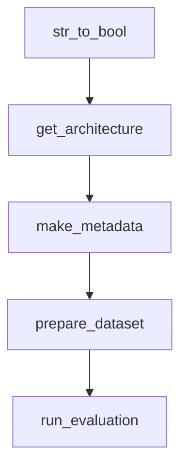

# Chapter 1: Getting Started

Welcome to **Chapter 1: Getting Started**. In this part of **AutoAgent Tutorial: Zero-Code Agent Creation and Automated Workflow Orchestration**, you will build an intuitive mental model first, then move into concrete implementation details and practical production tradeoffs.


This chapter gets AutoAgent installed and running in its core CLI flow.

## Learning Goals

- install AutoAgent from source
- configure basic `.env` API credentials
- run first `auto main` flow
- verify baseline interactive functionality

## Source References

- [AutoAgent README Quick Start](https://github.com/HKUDS/AutoAgent/blob/main/README.md)
- [Installation Docs](https://autoagent-ai.github.io/docs/get-started-installation)
- [Quickstart Docs](https://autoagent-ai.github.io/docs/get-started-quickstart)

## Summary

You now have a working AutoAgent baseline.

Next: [Chapter 2: Architecture and Interaction Modes](02-architecture-and-interaction-modes.md)

## Depth Expansion Playbook

## Source Code Walkthrough

### `constant.py`

The `str_to_bool` function in [`constant.py`](https://github.com/HKUDS/AutoAgent/blob/HEAD/constant.py) handles a key part of this chapter's functionality:

```py
# utils: 
load_dotenv()  # 加载.env文件
def str_to_bool(value):
    """convert string to bool"""
    true_values = {'true', 'yes', '1', 'on', 't', 'y'}
    false_values = {'false', 'no', '0', 'off', 'f', 'n'}
    
    if isinstance(value, bool):
        return value
        
    if value == None:
        return None
        
    value = str(value).lower().strip()
    if value in true_values:
        return True
    if value in false_values:
        return False
    return True  # default return True


DOCKER_WORKPLACE_NAME = os.getenv('DOCKER_WORKPLACE_NAME', 'workplace')
GITHUB_AI_TOKEN = os.getenv('GITHUB_AI_TOKEN', None)
AI_USER = os.getenv('AI_USER', "tjb-tech")
LOCAL_ROOT = os.getenv('LOCAL_ROOT', os.getcwd())

DEBUG = str_to_bool(os.getenv('DEBUG', False))

DEFAULT_LOG = str_to_bool(os.getenv('DEFAULT_LOG', False))
LOG_PATH = os.getenv('LOG_PATH', None)
EVAL_MODE = str_to_bool(os.getenv('EVAL_MODE', False))
BASE_IMAGES = os.getenv('BASE_IMAGES', None)
```

This function is important because it defines how AutoAgent Tutorial: Zero-Code Agent Creation and Automated Workflow Orchestration implements the patterns covered in this chapter.

### `constant.py`

The `get_architecture` function in [`constant.py`](https://github.com/HKUDS/AutoAgent/blob/HEAD/constant.py) handles a key part of this chapter's functionality:

```py
BASE_IMAGES = os.getenv('BASE_IMAGES', None)

def get_architecture():
    machine = platform.machine().lower()
    if 'x86' in machine or 'amd64' in machine or 'i386' in machine:
        return "tjbtech1/metachain:amd64_latest"
    elif 'arm' in machine:
        return "tjbtech1/metachain:latest"
    else: 
        return "tjbtech1/metachain:latest"
if BASE_IMAGES is None:
    BASE_IMAGES = get_architecture()

COMPLETION_MODEL = os.getenv('COMPLETION_MODEL', "claude-3-5-sonnet-20241022")
EMBEDDING_MODEL = os.getenv('EMBEDDING_MODEL', "text-embedding-3-small")

MC_MODE = str_to_bool(os.getenv('MC_MODE', True))

# add Env for function call and non-function call

FN_CALL = str_to_bool(os.getenv('FN_CALL', None))
API_BASE_URL = os.getenv('API_BASE_URL', None)
ADD_USER = str_to_bool(os.getenv('ADD_USER', None))


NOT_SUPPORT_SENDER = ["mistral", "groq"]
MUST_ADD_USER = ["deepseek-reasoner", "o1-mini", "deepseek-r1"]

NOT_SUPPORT_FN_CALL = ["o1-mini", "deepseek-reasoner", "deepseek-r1", "llama", "grok-2"]
NOT_USE_FN_CALL = [ "deepseek-chat"] + NOT_SUPPORT_FN_CALL

```

This function is important because it defines how AutoAgent Tutorial: Zero-Code Agent Creation and Automated Workflow Orchestration implements the patterns covered in this chapter.

### `evaluation/utils.py`

The `make_metadata` function in [`evaluation/utils.py`](https://github.com/HKUDS/AutoAgent/blob/HEAD/evaluation/utils.py) handles a key part of this chapter's functionality:

```py
import queue  # 添加这行导入

def make_metadata(
    model: str,
    dataset_name: str,
    agent_func: str,
    eval_note: str | None,
    eval_output_dir: str,
    data_split: str | None = None,
    details: dict[str, Any] | None = None,
    port: int | None = None,
    container_name: str | None = None,
    git_clone: bool = False,
    test_pull_name: str | None = None,
) -> EvalMetadata:
    eval_note = f'_N_{eval_note}' if eval_note else ''

    eval_output_path = os.path.join(
        eval_output_dir,
        dataset_name,
        agent_func.replace('get_', ''),
        f'{model}_maxiter{eval_note}',
    )

    pathlib.Path(eval_output_path).mkdir(parents=True, exist_ok=True)
    pathlib.Path(os.path.join(eval_output_path, 'logs')).mkdir(
        parents=True, exist_ok=True
    )

    metadata = EvalMetadata(
        agent_func=agent_func,
        model=model,
```

This function is important because it defines how AutoAgent Tutorial: Zero-Code Agent Creation and Automated Workflow Orchestration implements the patterns covered in this chapter.

### `evaluation/utils.py`

The `prepare_dataset` function in [`evaluation/utils.py`](https://github.com/HKUDS/AutoAgent/blob/HEAD/evaluation/utils.py) handles a key part of this chapter's functionality:

```py
    return metadata

def prepare_dataset(
    dataset: pd.DataFrame,
    output_file: str,
    eval_n_limit: int,
    eval_ids: list[str] | None = None,
    skip_num: int | None = None,
):
    assert (
        'instance_id' in dataset.columns
    ), "Expected 'instance_id' column in the dataset. You should define your own unique identifier for each instance and use it as the 'instance_id' column."
    logger = LoggerManager.get_logger()
    id_column = 'instance_id'
    logger.info(f'Writing evaluation output to {output_file}')
    finished_ids: set[str] = set()
    if os.path.exists(output_file):
        with open(output_file, 'r') as f:
            for line in f:
                data = json.loads(line)
                finished_ids.add(str(data[id_column]))
        logger.info(
            f'\nOutput file {output_file} already exists. Loaded {len(finished_ids)} finished instances.', title='Warning', color='red'
        )

    if eval_ids:
        eval_ids_converted = [dataset[id_column].dtype.type(id) for id in eval_ids]
        dataset = dataset[dataset[id_column].isin(eval_ids_converted)]
        logger.info(f'Limiting evaluation to {len(eval_ids)} specific instances.')
    elif skip_num and skip_num >= 0:
        skip_num = min(skip_num, len(dataset))
        dataset = dataset.iloc[skip_num:]
```

This function is important because it defines how AutoAgent Tutorial: Zero-Code Agent Creation and Automated Workflow Orchestration implements the patterns covered in this chapter.


## How These Components Connect


